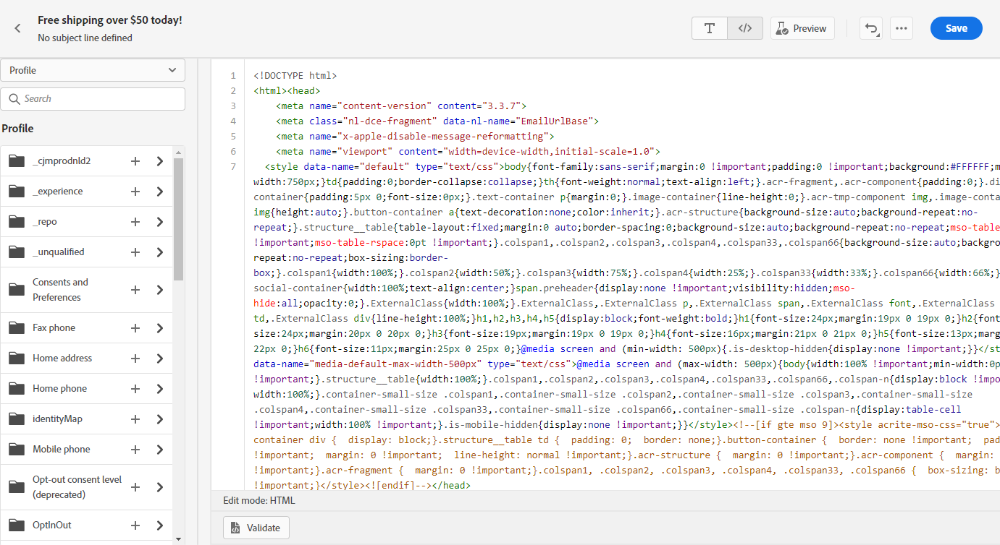
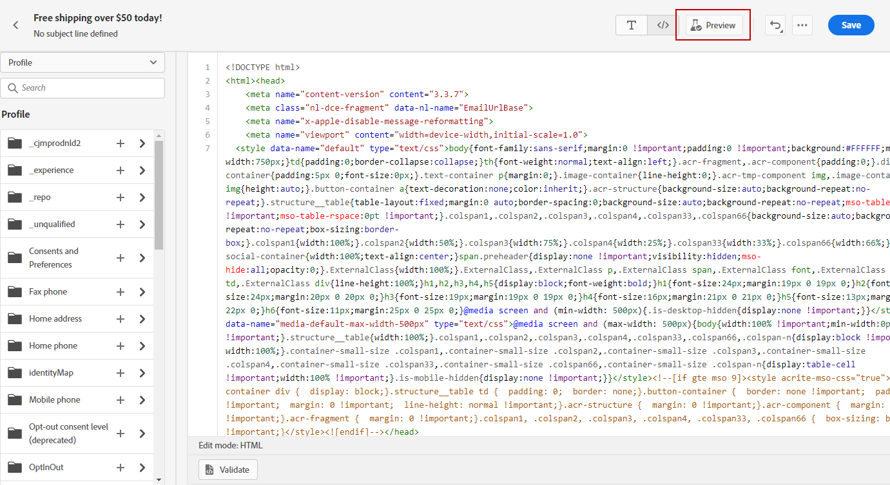

# 나만의 콘텐츠 코딩 {#code-content}

**[!UICONTROL 직접 코딩]** 모드를 사용하면 원시 HTML을 가져오거나 이메일 콘텐츠를 코딩할 수 있습니다. 이 방법에는 HTML 기술이 필요합니다.

➡️ [비디오에서 이 기능 살펴보기](#video)

>[!CAUTION]
>
> 이 메서드를 사용할 때는 [Adobe Experience Manager Assets](../integrations/assets.md)의 이미지를 참조할 수 없습니다. HTML 코드에서 참조하는 이미지는 공개 위치에 저장해야 합니다.

1. 이메일 Designer 홈 페이지에서 **[!UICONTROL 직접 코드 작성]**&#x200B;을 선택합니다.

   

1. 원시 HTML 코드를 입력하거나 붙여넣습니다.

1. 왼쪽 창에서 [!DNL Journey Optimizer] 개인화 기능을 활용하십시오. [자세히 알아보기](../personalization/personalize.md)

   

   >[!NOTE]
   >
   >이메일 Designer의 개인화 편집기에는 여정 표현식에 비해 몇 가지 기능 제한이 있습니다. [날짜/시간 함수 제한에 대해 자세히 알아보기](#date-time-limitations)

1. 이메일 콘텐츠를 지우고 새로운 디자인으로 이메일을 시작하려면 옵션 메뉴에서 **[!UICONTROL 디자인 변경]**&#x200B;을 선택합니다.

   

   >[!NOTE]
   >
   >이 작업을 수행하면 이메일 디자이너에서 선택한 템플릿이 열립니다. 여기에서 이메일 디자인을 완료하거나 **[!UICONTROL 코드 편집기로 전환]** 옵션을 사용하여 코드 편집기로 돌아갈 수 있습니다.

1. 테스트 프로필을 사용한 메시지 디자인 및 개인화를 확인하려면 **[!UICONTROL 미리 보기]** 단추를 클릭하세요. [자세히 알아보기](../content-management/preview-test.md)

   

1. 코드가 준비되면 **[!UICONTROL 저장]**&#x200B;을 클릭한 다음 메시지 생성 화면으로 돌아가서 메시지 생성을 완료합니다.

   

## 날짜 및 시간 함수 제한 사항 {#date-time-limitations}

이메일 Designer 코드 편집기에서 개인화를 사용하는 경우 동적 날짜 계산에 `now()` 함수를 사용할 수 없습니다.

>[!IMPORTANT]
>
>`now()` 함수는 Email Builder의 표현식 언어로 **지원되지 않음**&#x200B;입니다. `now()`은(는) 여정 조건에서 사용할 수 있지만 전자 메일 콘텐츠 또는 코드 편집기 내에서는 사용할 수 없습니다.

**사용 가능한 대체 요소:**

이메일 개인화의 현재 날짜 및 시간으로 작업하려면 다음 함수를 사용하십시오.

* **`getCurrentZonedDateTime()`** - 표준 시간대 정보와 함께 현재 날짜 및 시간을 반환합니다. `now()`에 대한 권장 대안입니다.

  예: ``이(가) `2024-12-06T17:22:02.281067+05:30[Asia/Kolkata]`을(를) 반환합니다.

* **`currentTimeInMillis()`** - 에포크 밀리초로 현재 시간을 반환합니다.

  예: ``

**권장 해결 방법:**

이메일 콘텐츠에서 날짜 계산을 수행해야 하는 경우:

* **날짜 필드 미리 계산** - 전자 메일을 보내기 전에 데이터 파이프라인 또는 프로필 특성에서 필요한 날짜 값을 계산한 다음 개인화에서 이러한 미리 계산된 값을 참조합니다.

  예: ``

* **날짜 조작 함수 사용** - 프로필 특성의 날짜 값과 함께 [ 또는 ](../personalization/functions/dates.md)과(와) 같은 `dayOfYear()`날짜/시간 함수 사용`diffInDays()`을(를) 사용합니다.

  예: ``

* **계산된 특성 사용** - 복잡한 날짜 계산을 수행하는 [계산된 특성 만들기](../audience/computed-attributes.md)를 통해 결과를 프로필 특성으로 사용할 수 있습니다.

개인화의 [날짜 시간 함수](../personalization/functions/dates.md)에 대해 자세히 알아보세요.
