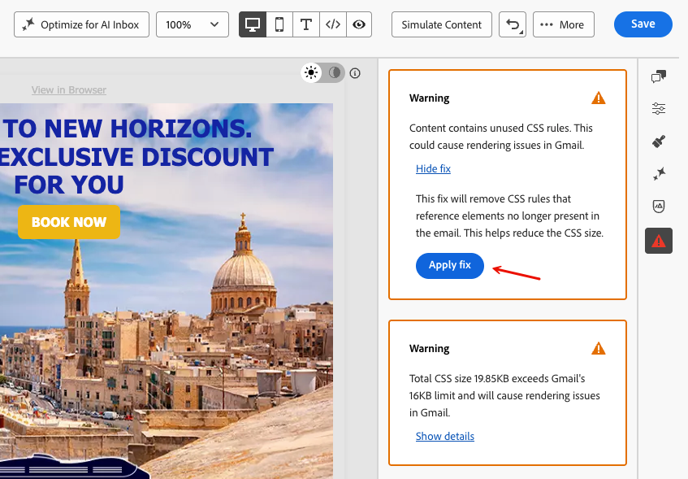

# 이메일 Designer의 콘텐츠 확인 {#content-check}

>[!CONTEXTUALHELP]
>id="ajo_email_content_check"
>title="이메일 콘텐츠 유효성 검사"
>abstract="콘텐츠를 보내기 전에 이메일 내 HTML 및 CSS 문제를 자동으로 감지하는 콘텐츠 확인입니다. 지원되지 않는 태그, 빈 div 및 Gmail 또는 Microsoft Outlook에서 렌더링을 중단할 수 있는 크기 제한에 플래그를 지정합니다. 문제는 상황별 세부 정보와 원클릭 수정 사항이 있는 경우 오류, 경고 또는 정보 알림으로 표시됩니다."

[!DNL Journey Optimizer]에는 전자 메일 Designer에서 직접 자동화된 기술 유효성 검사가 포함되어 있어 보내기 전에 HTML 및 CSS 문제를 확인할 수 있습니다.

결과는 작성 패널에 오류, 경고 또는 정보 알림으로 표시되며 상황별 세부 정보와 사용 가능한 경우 한 번의 클릭으로 해결할 수 있으므로 이메일 Designer을 종료하지 않고도 문제를 해결할 수 있습니다.

## 콘텐츠 확인 액세스 {#access-content-checks}

콘텐츠 검사는 항상 이메일 Designer에서 사용할 수 있습니다. 이를 보려면 오른쪽 레일의 문제 아이콘을 클릭하여 **[!UICONTROL 콘텐츠 확인]** 창을 엽니다. 검색된 모든 문제가 여기에 나열됩니다.

>[!NOTE]
>
>검사는 이메일의 현재 상태에 대해, 그리고 편집할 때마다 자동으로 실행됩니다. [자세히 알아보기](#recalculation)

검사는 다음 세 가지 심각도 수준으로 표시됩니다.

| 심각도 | 색상 | 설명 |
|---|---|---|
| **오류** | 빨강 | 게재 또는 렌더링 실패를 유발할 중요한 문제입니다. 보내기 전에 확인합니다. |
| **Warning** | 주황 | 특정 이메일 클라이언트의 렌더링에 영향을 줄 수 있는 잠재적 문제입니다. 검토 및 해결하는 것이 좋습니다. |
| **정보** | 파랑 | 전송을 차단하지 않지만 콘텐츠의 장기적인 유지 관리에 영향을 줄 수 있는 조건에 대한 정보 알림. |

문제가 발견되지 않으면 창에 **감지된 문제 없음**&#x200B;이 표시되고 해당 아이콘은 녹색입니다.

문제에 따라 더 많은 컨텍스트를 보거나, 원클릭 수정 사항을 적용하거나, 이메일을 저장하여 확인 결과를 새로 고칠 수 있습니다.

* 발견된 문제 중 일부는 **[!UICONTROL 세부 정보 표시]** 단추를 클릭하여 더 많은 컨텍스트를 볼 수 있습니다. 축소하려면 **[!UICONTROL 세부 정보 숨기기]**&#x200B;를 클릭하십시오.
  자세한 정보가 포함된 전자 메일 Designer의 {width="80%"}
* 마찬가지로 **[!UICONTROL 수정 사항 표시]** 단추를 클릭하고 가능한 경우 원클릭 수정 사항을 적용할 수 있습니다. 이 수정 사항을 자동으로 적용할 수 없는 경우 메시지가 표시되고 문제를 수동으로 해결해야 합니다.
  수정 적용 단추가 있는 전자 메일 Designer의 {width="80%"}

### 확인 다시 계산 {#recalculation}

지원되지 않는 HTML 요소, 빈 div 및 HTML 크기와 같은 대부분의 검사는 이메일을 편집할 때마다 다시 계산되므로 항상 현재 콘텐츠를 반영합니다.

CSS 크기와 같은 다른 검사는 이메일 Designer의 라이브 편집 상태가 아니라 직렬화된 콘텐츠(로드되거나 저장되는 이메일의 버전)에서 계산됩니다. 이 경우 저장된 콘텐츠는 편집하는 동안 표시되는 것과 약간 다를 수 있습니다. 저장하지 않고 편집하는 경우 결과가 더 이상 정확하지 않을 수 있음을 나타내는 **[!UICONTROL 부실 확인]** 레이블이 나타납니다. 계산을 새로 고치려면 이메일을 저장하십시오.

부실 확인 레이블이 있는 전자 메일 Designer의 {width="100%"}

## 감지된 문제 해결 {#fix-issues}

아래 표에는 가능한 모든 메시지와 각 메시지에 대한 권장 작업이 나열되어 있습니다. **[!UICONTROL 콘텐츠 확인]** 창에 표시되는 메시지와 일치하는 범주를 확장합니다.

+++ 지원되지 않는 HTML 요소

| 메시지 | 심각도 | 할 일 |
|---|---|---|
| 콘텐츠에 포함된 `<script>` 태그는 전자 메일 시스템에서 지원되지 않습니다. 게재 및 렌더링 문제를 방지하려면 제거합니다. | 오류 | HTML 콘텐츠에서 모든 `<script>` 태그를 찾아 제거합니다. |
| 콘텐츠에 `<base>` 태그가 포함되어 있어 전자 메일 Designer에서 링크 및 리소스 해결 문제가 발생할 수 있습니다. 수정하려면 제거해야 합니다. | 오류 | HTML에서 `<base>` 태그를 제거합니다. |
| 콘텐츠에 새로 고침이 포함된 HTML 메타 태그가 포함되어 있으며 이는 이메일 Designer에서 지원되지 않습니다. 예기치 않은 비헤이비어를 방지하기 위해 제거합니다. | 경고 | HTML에서 메타 새로 고침 태그를 제거합니다. |
| 콘텐츠에 빈 div가 포함되어 있어 MSO(Microsoft Outlook)에서 레이아웃 문제가 발생할 수 있습니다. 이 문제를 해결하려면 빈 div를 제거하고 대신 형제 요소의 간격을 사용합니다. | 경고 | 빈 `
` 요소를 삭제하고 주변 요소의 패딩 또는 여백을 조정하여 간격을 유지합니다. |

+++

+++ CSS 문제

| 메시지 | 심각도 | 할 일 |
|---|---|---|
| 총 CSS 크기가 Gmail의 16KB 제한을 초과하므로 Gmail에서 렌더링 문제가 발생합니다. | 오류 | 사용하지 않는 CSS 규칙을 자동으로 제거하거나 스타일을 수동으로 단순화하려면 **[!UICONTROL 수정 적용]**&#x200B;을 사용하십시오. |
| 총 CSS 크기가 Gmail의 16KB 제한에 근접했으며 더 많은 CSS를 추가하면 렌더링 문제가 발생할 수 있습니다. | 경고 | **[!UICONTROL 수정 적용]**&#x200B;을 사용하여 사용하지 않는 CSS 규칙을 제거하거나, 콘텐츠를 추가하기 전에 스타일을 줄이십시오. |
| 이 조각의 총 CSS 크기가 3KB를 초과합니다. 이를 다른 조각과 결합하면 총 이메일 CSS가 Gmail의 16KB 제한을 초과하여 렌더링 문제가 발생할 수 있습니다. | 경고 | 이 조각의 CSS를 단순화하여 결합된 이메일 CSS를 16KB 미만으로 유지합니다. |
| 콘텐츠에 사용하지 않은 CSS 규칙이 포함되어 있습니다. 이로 인해 Gmail에서 렌더링 문제가 발생할 수 있습니다. | 경고 | 이메일에 더 이상 존재하지 않는 요소를 참조하는 CSS 규칙을 자동으로 제거하려면 **[!UICONTROL 수정 적용]**&#x200B;을 사용하십시오. |

<!--
| Message | Severity | What to do |
|---|---|---|
| Your content has modifications to the system-generated default CSS. These changes may be overridden by future Email Designer updates. To preserve your styles, add them using the Custom CSS feature instead. | Info | Move your custom styles to [Custom CSS](custom-css.md) to ensure they are preserved across Email Designer updates. |
-->

+++

+++ HTML 크기

| 메시지 | 심각도 | 할 일 |
|---|---|---|
| 예상 HTML 크기가 Gmail의 100KB 제한을 초과하여 Gmail에서 렌더링 문제가 발생합니다. 실제 HTML 크기는 전송 시간에 따라 다를 수 있습니다. | 오류 | 이메일 콘텐츠 감소 — 불필요한 요소를 제거하거나, 구조를 단순화하거나, 여러 전송 간에 콘텐츠를 분할할 수 있습니다. |
| 예상 HTML 크기는 Gmail의 100KB 제한에 근접하며 HTML이 더 추가될 경우 렌더링 문제가 발생할 수 있습니다. 실제 HTML 크기는 전송 시간에 따라 다를 수 있습니다. | 경고 | 컨텐츠를 단순화한 후 더 추가합니다. Gmail 제한을 초과하는 전자 메일은 수신자에 대해 잘립니다. |
| 이 조각의 예상 HTML 크기가 20KB를 초과합니다. 이를 다른 조각과 결합하면 총 이메일 HTML이 Gmail의 100KB 제한을 초과하여 렌더링 문제가 발생할 수 있습니다. 실제 HTML 크기는 전송 시간에 따라 다를 수 있습니다. | 경고 | 결합된 이메일 크기를 Gmail의 100KB 제한 아래로 유지하려면 이 조각의 HTML을 줄입니다. |

+++

## HTML 및 CSS 크기 {#size-estimation}

HTML 및 CSS 크기 값은 **작성 시간에 계산된 예상 값**&#x200B;이며, 이메일이 조건부 블록(수신자당 하나의 분기 렌더링만)을 사용하거나 전송 시간에 HTML 축소가 활성화된 경우 수신자에게 전달되는 실제 크기와 다를 수 있습니다.

크기 경고는 하드 블록이 아닌 콘텐츠를 전송하기 전에 최적화하는 데 도움이 되는 사전 신호입니다.
