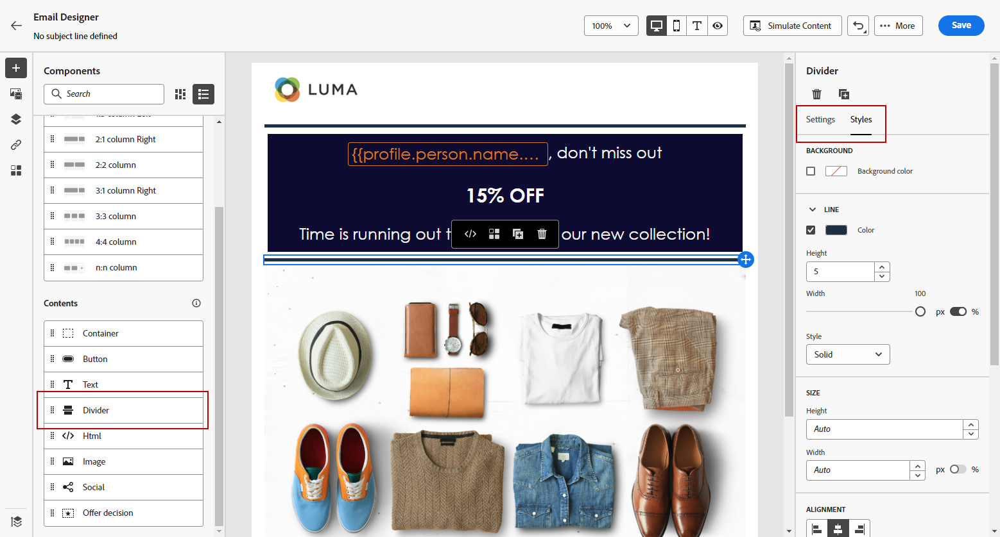
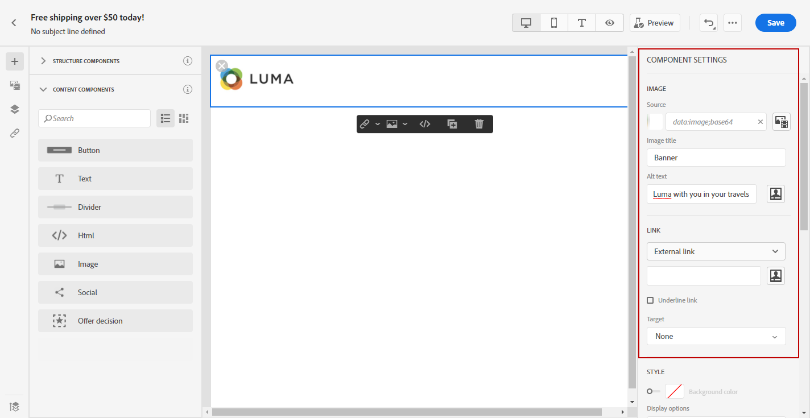
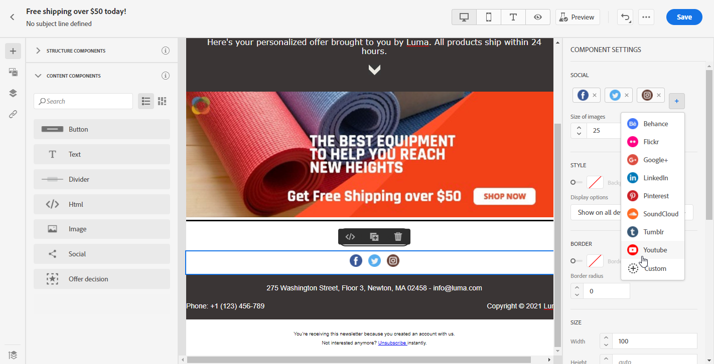
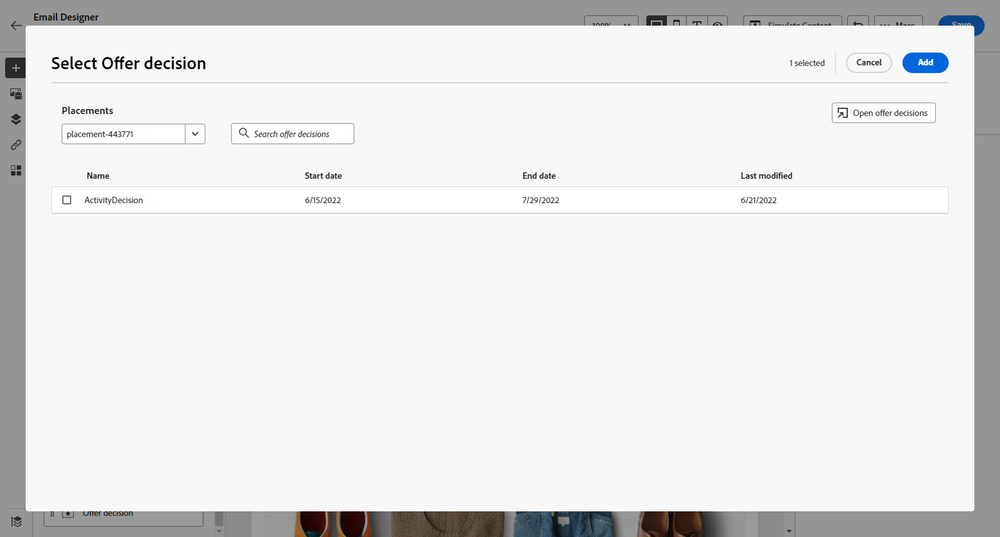

# 이메일 디자이너 콘텐츠 구성 요소 사용 {#content-components}

>[!CONTEXTUALHELP]
>id="ac_content_components_email"
>title="콘텐츠 구성 요소 정보"
>abstract="콘텐츠 구성 요소는 이메일 레이아웃 제작에 사용할 수 있는 빈 콘텐츠 플레이스홀더입니다."

>[!CONTEXTUALHELP]
>id="ac_content_components_landing_page"
>title="콘텐츠 구성 요소 정보"
>abstract="콘텐츠 구성 요소는 랜딩 페이지 레이아웃 제작에 사용할 수 있는 빈 콘텐츠 플레이스홀더입니다."

>[!CONTEXTUALHELP]
>id="ac_content_components_fragment"
>title="콘텐츠 구성 요소 정보"
>abstract="콘텐츠 구성 요소는 조각 레이아웃 제작에 사용할 수 있는 빈 콘텐츠 플레이스홀더입니다."

>[!CONTEXTUALHELP]
>id="ac_content_components_template"
>title="콘텐츠 구성 요소 정보"
>abstract="콘텐츠 구성 요소는 템플릿 레이아웃 제작에 사용할 수 있는 빈 콘텐츠 플레이스홀더입니다."

전자 메일 콘텐츠를 만들 때 **[!UICONTROL 콘텐츠 구성 요소]**&#x200B;를 사용하면 전자 메일에 배치되면 편집할 수 있는 원시 구성 요소를 사용하여 전자 메일을 추가로 개인화할 수 있습니다.

하나 이상의 구조 구성 요소 내에 필요한 만큼 콘텐츠 구성 요소를 추가하여 이메일의 레이아웃을 정의할 수 있습니다.

## 콘텐츠 구성 요소 추가 {#add-content-components}

이메일에 콘텐츠 구성 요소를 추가하고 필요에 맞게 조정하려면 아래 단계를 따르십시오.

1. 이메일 디자이너에서 기존 콘텐츠를 사용하거나 **[!UICONTROL 구조 구성 요소]**&#x200B;를 드래그하여 빈 콘텐츠에 놓아 이메일의 레이아웃을 정의합니다. [방법 알아보기](content-from-scratch.md)

1. **[!UICONTROL 콘텐츠 구성 요소]** 섹션에 액세스하려면 이메일 디자이너의 왼쪽 창에서 해당 버튼을 선택합니다.

   

1. 관련 구조 구성 요소 내에서 선택한 콘텐츠 구성 요소를 드래그 앤 드롭합니다.

   

   >[!NOTE]
   >
   >단일 구조 구성 요소와 구조 구성 요소의 각 열에 여러 구성 요소를 추가할 수 있습니다.

1. 오른쪽의 **[!UICONTROL 설정]** 및 **[!UICONTROL 스타일]** 탭을 사용하여 각 구성 요소의 특성과 스타일을 조정합니다. 예를 들어 각 구성 요소의 텍스트 스타일, 패딩 또는 여백을 변경할 수 있습니다. [정렬 및 패딩에 대해 자세히 알아보기](alignment-and-padding.md)

   

1. **[!UICONTROL 콘텐츠 구성 요소]**&#x200B;의 고급 메뉴에서 필요에 따라 콘텐츠 구성 요소를 쉽게 삭제하거나 복제할 수 있습니다.

   

## 컨테이너 {#container}

콘텐츠 구성 요소 그룹에 특정 스타일을 적용하려면 **[!UICONTROL Container]** 구성 요소를 추가한 다음 원하는 콘텐츠 구성 요소를 추가할 수 있습니다. 이렇게 하면 컨테이너에 고유한 스타일을 적용할 수 있습니다. 이는 내부의 콘텐츠 구성 요소에 적용된 스타일과 다릅니다.

예를 들어 **[!UICONTROL 컨테이너]** 구성 요소를 추가한 다음 해당 컨테이너 내부에 [버튼](#button) 구성 요소를 추가하면 컨테이너에 특정 배경을 사용하고 버튼에 다른 배경을 사용할 수 있습니다.

## 버튼 {#button}

**[!UICONTROL 버튼]** 구성 요소를 사용하여 이메일에 하나 이상의 버튼을 삽입하고 이메일 대상자를 다른 페이지로 리디렉션할 수 있습니다.

1. **[!UICONTROL 콘텐츠 구성 요소]**&#x200B;에서 **[!UICONTROL 버튼]** 구성 요소를 드래그하여 **[!UICONTROL 구조 구성 요소]**&#x200B;에 놓습니다.

1. 새로 추가한 단추를 클릭하여 텍스트를 개인화하고 이메일 Designer 오른쪽 창의 **[!UICONTROL 설정]** 및 **[!UICONTROL 스타일]** 탭에 액세스할 수 있습니다.

   

1. **[!UICONTROL 링크]** 메뉴에서 단추를 클릭할 때 리디렉션할 URL을 추가합니다.

1. 대상자를 **[!UICONTROL Target]** 드롭다운 목록으로 리디렉션하는 방법을 선택하십시오.

   * **[!UICONTROL None]**: 링크를 클릭한 프레임과 동일한 프레임에서 링크를 엽니다(기본값).
   * **[!UICONTROL Blank]**: 새 창이나 탭에서 링크를 엽니다.
   * **[!UICONTROL Self]**: 링크를 클릭한 프레임과 동일한 프레임에서 링크를 엽니다.
   * **[!UICONTROL Parent]**: 상위 프레임에서 링크를 엽니다.
   * **[!UICONTROL Top]**: 최상위 창에서 링크를 엽니다.

   

1. [구성 요소 설정] 창에서 **[!UICONTROL 테두리]**, **[!UICONTROL 크기]**, **[!UICONTROL 여백]**&#x200B;과 같은 스타일 속성을 변경하여 다른 스타일 속성을 조정할 수 있습니다.****

## 텍스트 {#text}

**[!UICONTROL 텍스트]** 구성 요소를 사용하여 전자 메일에 텍스트를 삽입하고 **[!UICONTROL 스타일]** 탭을 사용하여 스타일(테두리, 크기, 패딩 등)을 조정합니다.

1. **[!UICONTROL 콘텐츠 구성 요소]**&#x200B;에서 **[!UICONTROL Text]** 구성 요소를 **[!UICONTROL 구조 구성 요소]**(으)로 끌어다 놓습니다.

1. 텍스트를 개인화하고 이메일 Designer 오른쪽 창의 **[!UICONTROL 설정]** 및 **[!UICONTROL 스타일]** 탭에 액세스하려면 새로 추가한 구성 요소를 클릭하십시오.

1. 도구 모음에서는 다음과 같은 옵션을 사용하여 텍스트를 변경할 수 있습니다.

   

   * **[!UICONTROL 텍스트 스타일 변경]**: 텍스트에 볼드체, 이탤릭체, 밑줄 또는 취소선을 적용합니다.
   * **정렬 변경**: 왼쪽, 오른쪽, 가운데 또는 양쪽 정렬 중에서 텍스트 정렬 방식을 선택합니다.
   * **[!UICONTROL 목록 만들기]**: 텍스트에 글머리 기호 또는 번호 목록을 추가합니다.
   * **[!UICONTROL 제목 설정]**: 텍스트에 최대 6개의 제목 수준을 추가합니다.
   * **글꼴 크기**: 텍스트의 글꼴 크기를 픽셀 단위로 선택합니다.
   * **[!UICONTROL 글꼴 색 변경]**: 글꼴 색을 선택합니다.
   * **[!UICONTROL 링크 삽입]**: 콘텐츠에 모든 유형의 링크를 추가합니다.
   * **[!UICONTROL 이미지 편집]**: 텍스트 구성 요소에 이미지 또는 자산을 추가합니다. [자산 관리에 대해 자세히 알아보기](../integrations/assets.md)
   * **[!UICONTROL 글꼴 색 변경]**: 글꼴 색을 선택합니다.
   * **[!UICONTROL 개인화 추가]**: 프로필 데이터에서 콘텐츠를 사용자 지정할 개인화 필드를 추가합니다. [콘텐츠 개인화에 대해 자세히 알아보기](../personalization/personalize.md)
   * **[!UICONTROL 소스 코드 표시]**: 텍스트의 소스 코드를 표시합니다. 소스 코드는 수정할 수 없습니다.
   * **[!UICONTROL 조건부 콘텐츠 사용]**: 조건부 콘텐츠를 추가하여 구성 요소의 콘텐츠를 타겟팅된 프로필로 조정하십시오. [다이내믹 콘텐츠에 대해 자세히 알아보기](../personalization/get-started-dynamic-content.md)
   * **[!UICONTROL 복제]**: 텍스트 구성 요소의 복사본을 추가합니다.
   * **[!UICONTROL 삭제]**: 이메일에서 선택한 텍스트 구성 요소를 삭제합니다.

1. 다음에서 텍스트 색상, 글꼴 패밀리, 테두리, 패딩, 여백 등 다른 스타일 속성을 조정합니다. **[!UICONTROL 스타일]** 탭에서

   

## 구분선 {#divider}

**[!UICONTROL 구분선]** 구성 요소를 사용하여 이메일의 레이아웃과 콘텐츠를 구성하기 위한 구분선을 삽입할 수 있습니다.

**[!UICONTROL 설정]** 및 **[!UICONTROL 스타일]** 탭에서 선 색상, 스타일 및 높이 등 스타일 속성을 조정할 수 있습니다.

## HTML {#HTML}

**[!UICONTROL HTML]** 구성 요소를 사용하여 기존 HTML의 다른 부분을 복사하고 붙여넣을 수 있습니다. 이렇게 하면 무료 모듈식 HTML 구성 요소를 만들어 일부 외부 콘텐츠를 재사용할 수 있습니다.

1. **[!UICONTROL 콘텐츠 구성 요소]**&#x200B;에서 **[!UICONTROL HTML]** 구성 요소를 드래그하여 **[!UICONTROL 구조 구성 요소]**&#x200B;에 놓습니다.

1. 새로 추가된 구성 요소를 클릭한 다음 상황별 도구 모음에서 **[!UICONTROL 소스 코드 표시]**&#x200B;를 선택하여 HTML을 추가합니다.

   

1. 전자 메일에 추가할 HTML 코드를 복사하여 붙여 넣은 다음 **[!UICONTROL 저장]**&#x200B;을 클릭합니다.

   

>[!NOTE]
>
>이메일 디자이너와 호환되는 외부 콘텐츠를 만들기 위해서는 메시지를 처음부터 만들고 기존 이메일의 콘텐츠를 구성 요소로 복사하는 것이 좋습니다.

## 이미지 {#image}

**[!UICONTROL 이미지]** 구성 요소를 사용하여 컴퓨터의 이미지 파일을 전자 메일 콘텐츠에 삽입합니다.

1. **[!UICONTROL 콘텐츠 구성 요소]**&#x200B;에서 **[!UICONTROL 이미지]** 구성 요소를 **[!UICONTROL 구조 구성 요소]**(으)로 끌어서 놓습니다.

   

1. **[!UICONTROL 설정]** 탭에서 **[!UICONTROL 찾아보기]**&#x200B;를 클릭하여 에셋에서 이미지 파일을 선택하거나 **[!UICONTROL 미디어 가져오기]**&#x200B;를 클릭하여 에셋을 Adobe Experience Manager Assets에 업로드합니다.

   [!DNL Adobe Experience Manager Assets]에 대한 자세한 내용은 [Adobe Experience Manager Assets 설명서](https://experienceleague.adobe.com/docs/experience-manager-assets-essentials/help/introduction.html){target="_blank"}를 참조하세요.

   >[!NOTE]
   >
   > 링크가 활성 상태를 유지하고 만료 문제를 방지하려면 이미지에 대한 소스 URL에 의존하는 대신 Adobe Assets을 사용하는 것이 좋습니다.

1. **[!UICONTROL Adobe Stock 사진 찾기]** 옵션을 사용하여 Adobe Stock에서 직접 검색할 수도 있습니다.

1. 새로 추가한 구성 요소를 클릭하고 이미지 속성을 설정합니다.

   * **[!UICONTROL 이미지 제목]** 속성을 사용하면 이미지의 제목을 정의할 수 있습니다.
   * **[!UICONTROL 대체 텍스트]** 속성을 사용하면 이미지에 연결된 캡션을 정의할 수 있습니다. 이는 대체 HTML 속성에 해당합니다.

   

1. **[!UICONTROL 유사한 스톡 사진 찾기]**&#x200B;를 선택할 수도 있습니다. [자세히 알아보기](../integrations/stock.md)

1. **[!UICONTROL 스타일]** 탭에서 여백, 테두리 등의 다른 스타일 특성을 조정합니다. 대상자를 다른 콘텐츠로 리디렉션하도록 링크를 추가할 수 있습니다.****

## Social {#social}

**[!UICONTROL 소셜]** 구성 요소를 사용하면 이메일 콘텐츠에 소셜 미디어 페이지에 대한 링크를 삽입할 수 있습니다.

1. **[!UICONTROL 콘텐츠 구성 요소]**&#x200B;에서 **[!UICONTROL 소셜]** 구성 요소를 드래그하여 **[!UICONTROL 구조 구성 요소]**&#x200B;에 놓습니다.

1. 새로 추가한 구성 요소를 선택합니다.

1. **[!UICONTROL 설정]** 탭의 **[!UICONTROL 소셜]** 필드에서 추가 또는 제거할 소셜 미디어를 선택합니다.

   

1. 전용 필드를 통해 아이콘 크기를 선택합니다.

1. 각 소셜 미디어 아이콘을 클릭하여 대상자를 리디렉션할 **[!UICONTROL URL]**&#x200B;을(를) 구성하십시오.

   

1. 필요한 경우 Assets에서 각 소셜 미디어의 아이콘을 변경할 수도 있습니다.

1. 다음에서 스타일, 여백, 테두리 등 다른 스타일 속성을 조정합니다. **[!UICONTROL 스타일]** 탭에서

## 오퍼 결정 {#offer-decision}

**[!UICONTROL 오퍼 결정]** 구성 요소를 사용하여 메시지에 오퍼를 삽입합니다. [의사 결정 관리](../offers/get-started/starting-offer-decisioning.md) 엔진은 고객에게 제공할 최상의 오퍼를 선택합니다.

1. **[!UICONTROL 콘텐츠 구성 요소]**&#x200B;에서 **[!UICONTROL 오퍼 결정]** 구성 요소를 **[!UICONTROL 구조 구성 요소]**(으)로 끌어다 놓습니다.

1. **[!UICONTROL 추가]**&#x200B;를 클릭하여 **[!UICONTROL 오퍼 결정]**&#x200B;을 선택합니다.

   

1. 드롭다운에서 **[!UICONTROL 배치]**&#x200B;를 선택합니다.  그런 다음 콘텐츠에 추가할 **[!UICONTROL 오퍼 결정]**&#x200B;을 선택하고 **[!UICONTROL 추가]**&#x200B;를 클릭합니다.

   

1. **[!UICONTROL 오퍼 결정]** 탭에서 삽입된 오퍼를 미리 보거나 변경할 수 있습니다.

[이 섹션](add-offers-email.md)에서 전자 메일에 개인화된 오퍼를 추가하는 방법을 알아봅니다.

>[!IMPORTANT]
>
>여정의 메시지에 사용 중인 오퍼 의사 결정이 변경되는 경우 여정 게시를 취소하고 다시 게시해야 합니다.  이렇게 하면 변경 사항이 여정 메시지에 통합되고 메시지가 최신 업데이트와 일관되게 표시됩니다.
