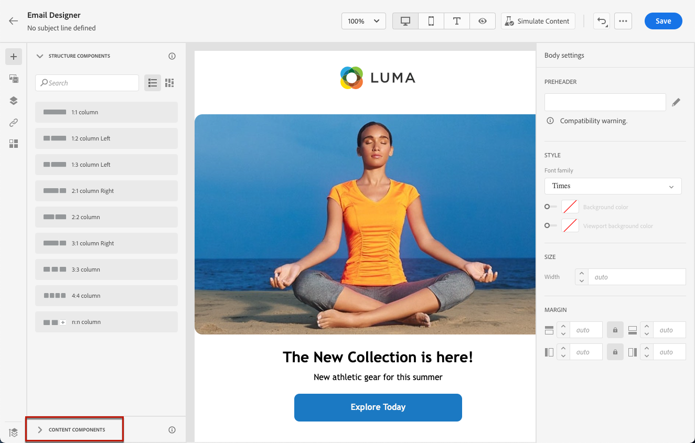

# 이메일 디자이너 콘텐츠 구성 요소 사용 {#content-components}

>[!CONTEXTUALHELP]
>id="ac_content_components_email"
>title="컨텐츠 구성 요소 정보"
>abstract="콘텐츠 구성 요소는 전자 메일 레이아웃을 만드는 데 사용할 수 있는 빈 콘텐츠 자리 표시자입니다."

>[!CONTEXTUALHELP]
>id="ac_content_components_landing_page"
>title="컨텐츠 구성 요소 정보"
>abstract="콘텐츠 구성 요소는 랜딩 페이지의 레이아웃을 만드는 데 사용할 수 있는 빈 콘텐츠 자리 표시자입니다."

>[!CONTEXTUALHELP]
>id="ac_content_components_fragment"
>title="컨텐츠 구성 요소 정보"
>abstract="컨텐츠 구성 요소는 조각 레이아웃을 만드는 데 사용할 수 있는 빈 컨텐츠 자리 표시자입니다."

>[!CONTEXTUALHELP]
>id="ac_content_components_template"
>title="컨텐츠 구성 요소 정보"
>abstract="콘텐츠 구성 요소는 템플릿 레이아웃을 만드는 데 사용할 수 있는 빈 콘텐츠 자리 표시자입니다."

이메일 콘텐츠를 만들 때 **[!UICONTROL 컨텐츠 구성 요소]** 이메일에 배치되면 편집할 수 있는 원시 구성 요소를 사용하여 이메일을 추가로 개인화할 수 있습니다.

전자 메일의 레이아웃을 정의하는 하나 이상의 구조 구성 요소 내에 필요한 만큼 많은 콘텐츠 구성 요소를 추가할 수 있습니다.

## 컨텐츠 구성 요소 추가 {#add-content-components}

전자 메일에 컨텐츠 구성 요소를 추가하고 필요에 따라 조정하려면 아래 단계를 따르십시오.

1. 이메일 디자이너에서 기존 콘텐츠를 사용하거나 끌어서 놓습니다 **[!UICONTROL 구조 구성 요소]** 빈 컨텐츠에 추가하여 전자 메일 레이아웃을 정의합니다. [방법 알아보기](content-from-scratch.md)

1. 에 액세스하려면 **[!UICONTROL 컨텐츠 구성 요소]** 섹션의 왼쪽 창에서 해당 버튼을 선택합니다.

   

1. 관련 구조 구성 요소 내에서 원하는 컨텐츠 구성 요소를 드래그하여 놓습니다.

   

   >[!NOTE]
   >
   >여러 구성 요소를 단일 구조 구성 요소와 구조 구성 요소의 각 열에 추가할 수 있습니다.

1. 다음 아이콘을 사용하여 각 구성 요소의 스타일링 속성을 조정합니다 **[!UICONTROL 구성 요소 설정]** 오른쪽 창입니다. 예를 들어 각 구성 요소의 텍스트 스타일, 패딩 또는 여백을 변경할 수 있습니다. [정렬 및 패딩에 대해 자세히 알아보기](alignment-and-padding.md)

   

## 컨테이너 {#container}

내에 간단한 컨테이너를 추가하여 다른 컨텐츠 구성 요소를 추가할 수 있습니다. 컨테이너에 특정 스타일을 적용할 수 있도록 해줍니다. 이 스타일은 내부에 사용된 구성 요소와 다릅니다.

예를 들어 **[!UICONTROL 컨테이너]** 구성 요소를 추가한 다음 [단추](#button) 구성 요소를 생성하지 않습니다. 특정 컨테이너 배경을 사용할 수도 있고 단추에 다른 배경을 사용할 수도 있습니다.

## 버튼 {#button}

를 사용하십시오 **[!UICONTROL 단추]** 이메일에 하나 이상의 단추를 삽입하고 이메일 대상자를 다른 페이지로 리디렉션하는 구성 요소입니다.

1. From **[!UICONTROL 컨텐츠 구성 요소]**&#x200B;을(를) 끌어다 놓습니다. **[!UICONTROL 단추]** 구성 요소를 **[!UICONTROL 구조 구성 요소]**.

1. 새로 추가한 버튼을 클릭하여 텍스트를 개인화하고 **[!UICONTROL 구성 요소 설정]** 전자 메일 디자이너 오른쪽 창에서 클릭합니다.

   

1. 에서 **[!UICONTROL 링크]** 필드에서 버튼을 클릭할 때 리디렉션할 URL을 추가합니다.

1. 대상을 . **[!UICONTROL Target]** 드롭다운 목록:

   * **[!UICONTROL 없음]**: 클릭한 것과 동일한 프레임에서 링크를 엽니다(기본값).
   * **[!UICONTROL 비어 있음]**: 새 창이나 탭에서 링크를 엽니다.
   * **[!UICONTROL 자체]**: 클릭한 것과 동일한 프레임에서 링크를 엽니다.
   * **[!UICONTROL 상위]**: 상위 프레임에서 링크를 엽니다.
   * **[!UICONTROL 상단]**: 창의 전체 본문에 링크를 엽니다.

   

1. 다음과 같은 스타일 속성을 변경하여 단추를 추가로 개인화할 수 있습니다 **[!UICONTROL 테두리]**, **[!UICONTROL 크기]**, **[!UICONTROL 여백]**&#x200B;등 에서 **[!UICONTROL 구성 요소 설정]** 창

## 텍스트 {#text}

를 사용하십시오 **[!UICONTROL 텍스트]** 텍스트를 전자 메일에 삽입하고 스타일(테두리, 크기, 패딩 등)을 조정할 수 있는 구성 요소입니다 사용 **[!UICONTROL 구성 요소 설정]** 창

1. From **[!UICONTROL 컨텐츠 구성 요소]**&#x200B;을(를) 끌어다 놓습니다. **[!UICONTROL 텍스트]** 구성 요소를 **[!UICONTROL 구조 구성 요소]**.

1. 새로 추가된 구성 요소를 클릭하여 텍스트를 개인화하고 **[!UICONTROL 구성 요소 설정]** 전자 메일 디자이너의 오른쪽 창에서 클릭합니다.

1. 도구 모음에서 사용할 수 있는 다음 옵션을 사용하여 텍스트를 변경합니다.

   

   * **[!UICONTROL 텍스트 스타일 변경]**: 텍스트에 굵게, 기울임체, 밑줄 또는 취소선을 적용합니다.
   * **정렬 변경**: 텍스트의 왼쪽, 오른쪽, 가운데 또는 좌우 정렬 중에서 선택합니다.
   * **[!UICONTROL 목록 만들기]**: 텍스트에 글머리 기호 또는 번호 목록을 추가합니다.
   * **[!UICONTROL 제목 설정]**: 텍스트에 최대 6개의 제목 수준을 추가합니다.
   * **글꼴 크기**: 텍스트의 글꼴 크기를 픽셀 단위로 선택합니다.
   * **[!UICONTROL 이미지 편집]**: 텍스트 구성 요소에 이미지나 자산을 추가합니다. [자산 관리에 대해 자세히 알아보기](assets-essentials.md)
   * **[!UICONTROL 소스 코드 표시]**: 텍스트의 소스 코드를 표시합니다. 수정할 수 없습니다.
   * **[!UICONTROL 복제]**: 텍스트 구성 요소의 사본을 추가합니다.
   * **[!UICONTROL 삭제]**: 이메일에서 선택한 텍스트 구성 요소를 삭제합니다.
   * **[!UICONTROL 개인화 추가]**: 프로필 데이터의 콘텐츠를 사용자 지정하려면 개인화 필드를 추가합니다. [콘텐츠 개인화에 대해 자세히 알아보기](../personalization/personalize.md)
   * **[!UICONTROL 조건부 콘텐츠 활성화]**: 조건부 컨텐츠를 추가하여 구성 요소의 컨텐츠를 타깃팅된 프로필에 적용합니다. [다이내믹 컨텐츠에 대해 자세히 알아보기](../personalization/get-started-dynamic-content.md)

1. 텍스트 색상, 글꼴 패밀리, 테두리, 패딩, 여백 등과 같은 기타 스타일 속성을 조정합니다. 에서 **[!UICONTROL 구성 요소 설정]** 창

## 구분선 {#divider}

를 사용하십시오 **[!UICONTROL 구분선]** 전자 메일의 레이아웃과 콘텐츠를 구성하는 분할 라인을 삽입하는 구성 요소입니다.

선 색상, 스타일 및 높이와 같은 스타일 속성을 **[!UICONTROL 구성 요소 설정]** 창

## HTML {#HTML}

를 사용하십시오 **[!UICONTROL HTML]** 구성 요소를 복사하여 기존 HTML의 다른 부분을 붙여넣습니다. 이를 통해 일부 외부 컨텐츠를 재사용할 수 있도록 무료 모듈식 HTML 구성 요소를 만들 수 있습니다.

1. From **[!UICONTROL 컨텐츠 구성 요소]**&#x200B;을(를) 끌어다 놓습니다. **[!UICONTROL HTML]** 구성 요소를 **[!UICONTROL 구조 구성 요소]**.

1. 새로 추가된 구성 요소를 클릭한 다음, 을 선택합니다 **[!UICONTROL 소스 코드 표시]** 상황별 도구 모음에서 HTML을 추가합니다.

   

1. 전자 메일에 추가할 HTML 코드를 복사하여 붙여넣은 다음 **[!UICONTROL 저장]**.

   

>[!NOTE]
>
>이메일 디자이너와 호환되는 외부 콘텐츠를 만들고자 하는 경우, Adobe은 메시지를 처음부터 만들고 기존 이메일의 콘텐츠를 구성 요소로 복사하는 것을 권장합니다.

## 이미지 {#image}

를 사용하십시오 **[!UICONTROL 이미지]** 컴퓨터의 이미지 파일을 전자 메일 콘텐츠에 삽입하는 구성 요소입니다.

1. From **[!UICONTROL 컨텐츠 구성 요소]**&#x200B;을(를) 끌어다 놓습니다. **[!UICONTROL 이미지]** 구성 요소를 **[!UICONTROL 구조 구성 요소]**.

1. 클릭 **[!UICONTROL 찾아보기]** 자산에서 이미지 파일을 선택하려면 다음을 수행하십시오.

   추가 정보 [!DNL Assets Essentials]를 참조하려면 [Adobe Experience Manager Assets Essentials 설명서](https://experienceleague.adobe.com/docs/experience-manager-assets-essentials/help/introduction.html){target="_blank"}.

1. 새로 추가한 구성 요소를 클릭하고 **[!UICONTROL 구성 요소 설정]** 창:

   * **[!UICONTROL 이미지 제목]** 이미지에 제목을 정의할 수 있습니다.
   * **[!UICONTROL 대체 텍스트]** 이미지에 연결된 캡션을 정의할 수 있습니다. 이것은 대체 HTML 속성에 해당합니다.

   

1. 여백, 테두리 등과 같은 다른 스타일 속성을 조정합니다. 또는 링크를 추가하여 대상자를 **[!UICONTROL 구성 요소 설정]** 창

## 비디오 {#Video}

>[!CONTEXTUALHELP]
>id="ac_edition_video_email"
>title="비디오 설정"
>abstract="이 구성 요소를 사용하여 이메일에 비디오를 삽입합니다. 모든 이메일 클라이언트는 비디오가 작동하지 않습니다. 대체 이미지를 설정하는 것이 좋습니다."

>[!CONTEXTUALHELP]
>id="ac_edition_video_landing_page"
>title="비디오 설정"
>abstract="이 구성 요소를 사용하여 랜딩 페이지에 비디오를 삽입합니다. 일부 메시지 클라이언트에서는 비디오가 작동하지 않습니다. 대체 이미지를 설정하는 것이 좋습니다."

>[!CONTEXTUALHELP]
>id="ac_edition_video_fragment"
>title="비디오 설정"
>abstract="이 구성 요소를 사용하여 조각에 비디오를 삽입합니다. 일부 메시지 클라이언트에서는 비디오가 작동하지 않습니다. 대체 이미지를 설정하는 것이 좋습니다."

>[!CONTEXTUALHELP]
>id="ac_edition_video_template"
>title="비디오 설정"
>abstract="이 구성 요소를 사용하여 템플릿에 비디오를 삽입합니다. 일부 메시지 클라이언트에서는 비디오가 작동하지 않습니다. 대체 이미지를 설정하는 것이 좋습니다."

를 사용하십시오 **[!UICONTROL 비디오]** URL 링크를 통해 이메일 콘텐츠에 비디오를 삽입하는 구성 요소입니다.

1. From **[!UICONTROL 컨텐츠 구성 요소]**&#x200B;을(를) 끌어다 놓습니다. **[!UICONTROL 비디오]** 화합물 **[!UICONTROL 구조 구성 요소]**.

   

1. 새로 추가한 구성 요소를 클릭합니다.

1. 에서 **[!UICONTROL 비디오 링크]** 필드 **[!UICONTROL 구성 요소 설정]** 창에서 비디오 URL을 추가합니다.

   

1. 을(를) 추가할 수 있습니다 **[!UICONTROL 포스터 이미지]** 를 추가하여 대상자가 재생 버튼을 클릭할 때까지 표시할 이미지를 지정합니다.

1. 스타일, 여백, 테두리 등과 같은 다른 스타일 속성을 조정합니다. 에서 **[!UICONTROL 구성 요소 설정]** 창

## Social {#social}

를 사용하십시오 **[!UICONTROL Social]** 소셜 미디어 페이지에 대한 링크를 이메일 콘텐츠에 삽입하는 구성 요소입니다.

1. From **[!UICONTROL 컨텐츠 구성 요소]**&#x200B;을(를) 끌어다 놓습니다. **[!UICONTROL Social]** 구성 요소를 **[!UICONTROL 구조 구성 요소]**.

1. 새로 추가한 구성 요소를 클릭합니다.

1. 에서 **[!UICONTROL Social]** 필드 **[!UICONTROL 구성 요소 설정]** 창에서 추가하거나 제거할 소셜 미디어를 선택합니다.

   

1. 전용 필드를 통해 아이콘 크기를 선택합니다.

1. 각 소셜 미디어 아이콘을 클릭하여 를 구성합니다 **[!UICONTROL URL]** 대상 을 리디렉션할 대상.

   

1. 필요한 경우, 각 소셜 미디어의 아이콘을 변경할 수도 있습니다 **[!UICONTROL 이미지]** 필드.

1. 스타일, 여백, 테두리 등과 같은 다른 스타일 속성을 조정합니다. 에서 **[!UICONTROL 구성 요소 설정]** 창

## 오퍼 결정 {#offer-decision}

를 사용하십시오 **[!UICONTROL 오퍼 결정]** 오퍼를 메시지에 삽입하는 구성 요소입니다. 다음 [의사 결정 관리](../offers/get-started/starting-offer-decisioning.md) 엔진은 고객에게 제공할 최상의 오퍼를 선택합니다.

에서 이메일에 개인화된 오퍼를 추가하는 방법을 알아봅니다. [이 섹션](add-offers-email.md).

