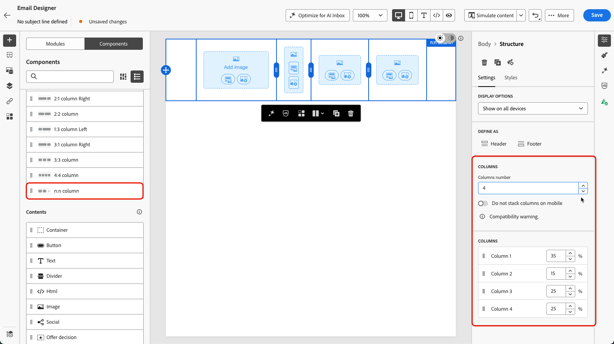

# 이메일 디자이너를 사용하여 처음부터 콘텐츠 디자인 {#content-from-scratch}

>[!BEGINSHADEBOX]

**이 페이지에서:** 구조 및 콘텐츠 구성 요소를 추가한 다음 이메일을 개인화하고 미리 봄으로써 Adobe Journey Optimizer 이메일 Designer에서 이메일 콘텐츠를 처음부터 디자인하는 방법을 알아봅니다.

>[!ENDSHADEBOX]

>[!CONTEXTUALHELP]
>id="ac_structure_components_email"
>title="구조 구성 요소 추가"
>abstract="구조 구성 요소는 이메일 레이아웃을 정의합니다. **구조** 구성 요소를 캔버스로 드래그 앤 드롭하여 이메일 콘텐츠 디자인을 시작할 수 있습니다."

>[!CONTEXTUALHELP]
>id="ac_structure_components_landing_page"
>title="구조 구성 요소 추가"
>abstract="구조 구성 요소는 랜딩 페이지 레이아웃을 정의합니다. **구조** 구성 요소를 캔버스로 드래그 앤 드롭하여 랜딩 페이지의 콘텐츠 디자인을 시작할 수 있습니다."

>[!CONTEXTUALHELP]
>id="ac_structure_components_fragment"
>title="구조 구성 요소 추가"
>abstract="구조 구성 요소는 조각 레이아웃을 정의합니다. **구조** 구성 요소를 캔버스로 드래그 앤 드롭하여 조각의 콘텐츠 디자인을 시작할 수 있습니다."

>[!CONTEXTUALHELP]
>id="ac_structure_components_template"
>title="구조 구성 요소 추가"
>abstract="구조 구성 요소는 템플릿 레이아웃을 정의합니다. **구조** 구성 요소를 캔버스로 드래그 앤 드롭하여 템플릿의 콘텐츠 디자인을 시작할 수 있습니다."

>[!CONTEXTUALHELP]
>id="ac_edition_columns_email"
>title="이메일 열 정의"
>abstract="이메일 디자이너를 통해 열 구조를 선택하여 이메일 레이아웃을 쉽게 정의할 수 있습니다."

>[!CONTEXTUALHELP]
>id="ac_edition_columns_landing_page"
>title="랜딩 페이지 열 정의"
>abstract="디자이너를 통해 열 구조를 선택하여 랜딩 페이지 레이아웃을 쉽게 정의할 수 있습니다."

>[!CONTEXTUALHELP]
>id="ac_edition_columns_fragment"
>title="조각 열 정의"
>abstract="디자이너를 통해 열 구조를 선택하여 조각 레이아웃을 쉽게 정의할 수 있습니다."

>[!CONTEXTUALHELP]
>id="ac_edition_columns_template"
>title="템플릿 열 정의"
>abstract="디자이너를 통해 열 구조를 선택하여 템플릿 레이아웃을 쉽게 정의할 수 있습니다."

[!DNL Adobe Journey Optimizer] 전자 메일 Designer을 사용하여 콘텐츠의 구조를 쉽게 정의할 수 있습니다. 간단한 드래그 앤 드롭 작업으로 구조 요소를 추가 및 이동하여 콘텐츠의 형태를 몇 초 이내에 디자인할 수 있습니다.

>[!NOTE]
>
>[유럽 접근성법](https://eur-lex.europa.eu/legal-content/EN/TXT/?uri=CELEX%3A32019L0882){target="_blank"}에는 모든 디지털 통신의 접근성을 보장해야 한다고 명시되어 있습니다. [!DNL Journey Optimizer]에서 콘텐츠를 디자인할 때는 [이 페이지](accessible-content.md)에 나열된 특정 지침을 따라야 합니다.

콘텐츠 작성을 시작하려면 아래 단계를 따르십시오.

1. Designer 홈페이지에서 **[!UICONTROL 처음부터 디자인]** 옵션을 선택합니다.

   

1. 빠르게 시작하려면 **[!UICONTROL 모듈]**(머리글, 영웅 섹션, 바닥글과 같이 미리 디자인된 미리 사용 가능한 콘텐츠 블록)을 사용하여 전자 메일 만들기 속도를 높이고 캠페인을 시각적으로 일관되게 유지하세요. [모듈에 대해 자세히 알아보기](email-modules.md)

   ![왼쪽 패널에서 [모듈] 탭을 선택한 상태로 Designer에 전자 메일을 보내 머리글, 영웅, 추천, 카드, 팀 및 바닥글과 같은 모듈 범주를 나열합니다](assets/email_designer_modules_tab.png)

1. 그렇지 않으면 **[!UICONTROL 구조]**&#x200B;를 캔버스로 드래그 앤 드롭하여 전자 메일의 레이아웃을 정의하여 콘텐츠를 디자인할 수 있습니다.

   >[!TIP]
   >
   >또는 [콘텐츠 생성]을 사용하여 전자 메일 만들기 속도를 높여 [AI로 전체 콘텐츠 생성](../content-management/generative-full-content.md)을 사용하여 텍스트 및 이미지를 포함한 전체 전자 메일 콘텐츠를 생성합니다. 그런 다음 콘텐츠 미리보기 및 유효성 검사로 건너뛸 수 있습니다.

1. 필요에 따라 **[!UICONTROL 구조]**&#x200B;를 추가하고 오른쪽의 전용 창에서 해당 설정을 편집합니다.

   

   >[!NOTE]
   >
   >좁은 화면(예: 모바일)에서는 가독성을 위해 기본적으로 열이 세로로 스택됩니다. 일부 이메일 클라이언트는 이 동작을 지원하지 않으며, 이 경우 열은 나란히 유지됩니다. **[!UICONTROL 설정]** 탭에서 **[!UICONTROL 모바일에서 열을 스택하지 않음]** 토글을 사용하여 이 기능을 끌 수도 있습니다.

1. 대부분의 구조(**[!UICONTROL 1:1 열]**, **[!UICONTROL 2:2 열]**, **[!UICONTROL 1:2 열 왼쪽]** 등)는 고정된 사전 설정입니다. 대신 **[!UICONTROL n:n 열]** 구성 요소를 선택하여 원하는 열 수(3개에서 10개 사이)를 정의합니다.

   

   **[!UICONTROL 설정]** 탭에서 언제든지 기존 구조의 **[!UICONTROL 열 개수]**&#x200B;를 늘릴 수 있습니다. 콘텐츠를 추가한 후에도 기존 콘텐츠가 손실되지 않고 유지됩니다.

   캔버스에서 직접 각 열의 너비를 조정하거나 **[!UICONTROL 설정]** 탭에서 백분율을 편집할 수도 있습니다.

   >[!NOTE]
   >
   >각 열 크기는 구조 구성 요소 전체 폭의 10% 이상이어야 합니다. 비어 있는 열만 제거할 수 있습니다.

1. **[!UICONTROL 내용]** 섹션에서 하나 이상의 구조 구성 요소에 필요한 만큼 요소를 추가합니다. [콘텐츠 구성 요소에 대해 자세히 알아보기](content-components.md)

1. 오른쪽 메뉴의 **[!UICONTROL 설정]** 또는 **[!UICONTROL 스타일]** 탭을 사용하여 각 구성 요소를 추가로 사용자 지정할 수 있습니다. 예를 들어 각 구성 요소의 텍스트 스타일, 패딩 또는 여백을 변경할 수 있습니다. [정렬 및 패딩에 대해 자세히 알아보기](alignment-and-padding.md)

   ![왼쪽에는 [컨텐츠] 패널이 강조 표시되고 오른쪽에는 선택한 이미지 구성 요소에 대한 [설정] 탭이 강조 표시되어 이미지 소스, 대체 텍스트 및 링크 필드를 표시하는 Designer 전자 메일을 보냅니다](assets/email_designer_structure_component.png)

1. **[!UICONTROL 자산 선택기]**&#x200B;에서 **[!UICONTROL Assets 라이브러리]**&#x200B;에 저장된 자산을 직접 선택할 수 있습니다. [자산 관리에 대해 자세히 알아보기](../integrations/assets.md)

   에셋이 포함된 폴더를 두 번 클릭합니다. 구조 구성 요소로 끌어다 놓습니다.

   

1. 개인화 필드를 삽입하여 프로필 속성, 대상자 멤버십, 컨텍스트 속성 등에서 콘텐츠를 사용자 지정합니다. [콘텐츠 개인화에 대해 자세히 알아보기](../personalization/personalize.md)

   

1. 조건부 규칙에 따라 다이내믹 콘텐츠를 추가하고 타겟팅된 프로필에 콘텐츠를 적용하려면 **[!UICONTROL 조건 콘텐츠 사용]**&#x200B;을 클릭하십시오. [다이내믹 콘텐츠 시작](../personalization/get-started-dynamic-content.md)

   

1. 추적할 콘텐츠의 모든 URL을 표시하려면 왼쪽 창에서 **[!UICONTROL 링크]** 탭을 클릭하십시오. **[!UICONTROL 추적 유형]** 또는 **[!UICONTROL 레이블]**&#x200B;을 수정하고 필요한 경우 **[!UICONTROL 태그]**&#x200B;를 추가할 수 있습니다. [링크 및 추적에 대해 자세히 알아보기](message-tracking.md)

   

1. 필요한 경우 고급 메뉴에서 **[!UICONTROL 코드 편집기로 전환]**&#x200B;을 클릭하여 이메일을 추가로 개인화할 수 있습니다. 이를 통해 이메일 소스 코드를 편집할 수 있습니다(예: 추적 또는 사용자 정의 HTML 태그 추가). [코드 편집기에 대해 자세히 알아보기](code-content.md)

   >[!CAUTION]
   >
   >코드 편집기로 전환한 후에는 이 이메일의 비주얼 디자이너로 되돌릴 수 없습니다.

1. 콘텐츠가 준비되면 두 방법 중 하나를 사용하여 렌더링을 확인합니다. 데스크탑 또는 모바일 보기 중 선택할 수 있습니다. 자세한 정보는 [콘텐츠 관리](../content-management/preview-test.md) 섹션에서 확인할 수 있습니다.

   ![맨 위 도구 모음에 [콘텐츠 시뮬레이션] 단추가 강조 표시된 전자 메일 Designer 캔버스](assets/email_designer_simulate_content.png)

1. 컨텐츠 품질을 확인하여 가독성, 효율성 및 컨텐츠 응집성을 평가할 수도 있습니다. [콘텐츠 품질 확인에 대해 자세히 알아보기](../content-management/brands-score.md#validate-quality)

1. 콘텐츠가 준비되면 **[!UICONTROL 저장]**&#x200B;을 클릭합니다.

{{$include /help/_includes/do-not-localize/email/ai-augmented-content-from-scratch.md}}
