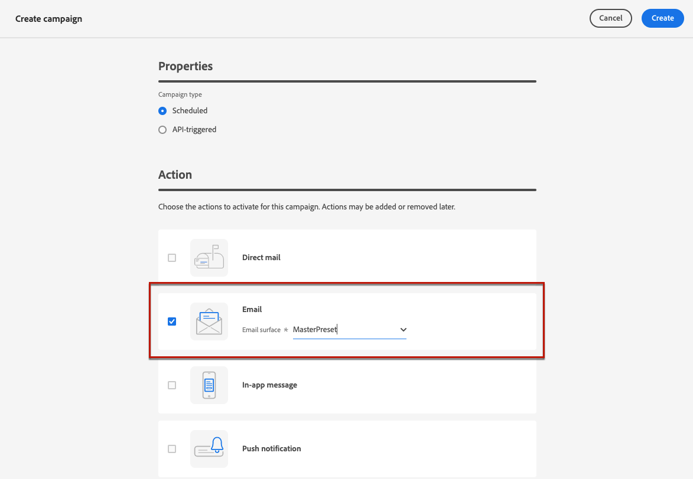
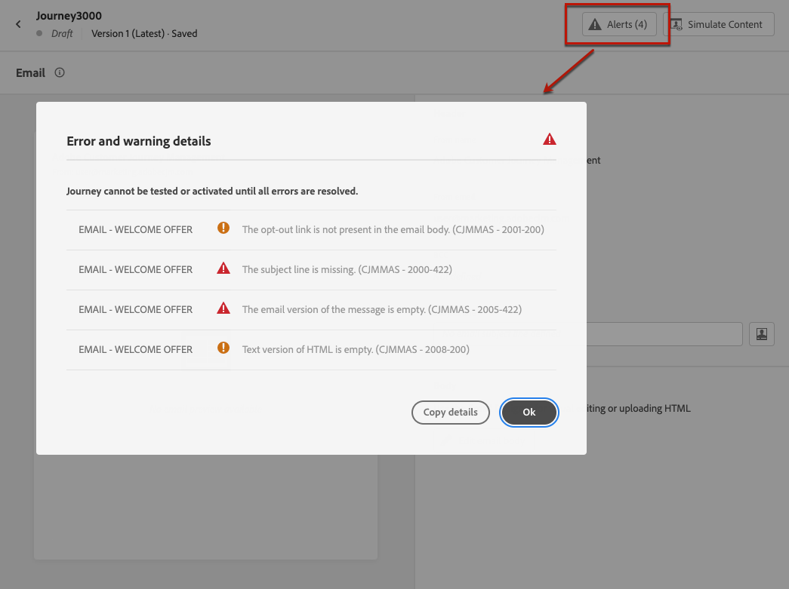

# 이메일 만들기 {#create-email}

>[!CONTEXTUALHELP]
>id="ajo_message_email"
>title="이메일 작성"
>abstract="이메일 제목 줄을 정의하고 이메일 디자이너를 열어 이메일 콘텐츠를 만듭니다."

## 이메일 작업 추가 {#email-action}

에서 이메일을 만들려면 [!DNL Journey Optimizer], 추가 **[!UICONTROL 이메일]** 여정 또는 캠페인에 대한 작업입니다. 그런 다음 사용 사례에 따라 아래 단계를 수행합니다.

>[!BEGINTABS]

>[!TAB 여정에 이메일 추가]

1. 여정을 연 다음 **[!UICONTROL 이메일]** 의 활동 **[!UICONTROL 작업]** 팔레트의 섹션입니다.

1. 메시지에 대한 기본 정보(레이블, 설명, 카테고리)를 제공합니다.

1. 다음을 선택합니다. [이메일 표면](email-settings.md) 사용할 수 있습니다.

   

   필드는 기본적으로 미리 채워져 있으며 사용자가 해당 채널에 대해 마지막으로 사용한 서페이스가 있습니다.

>[!NOTE]
>
>여정에서 이메일을 보내는 경우 Adobe Journey Optimizer의 전송 시간 최적화 기능을 활용하여 과거의 열기 및 클릭률을 기반으로 참여를 극대화하기 위해 메시지를 보내는 최상의 시간을 예측할 수 있습니다. [전송 시간 최적화를 사용하여 작업하는 방법에 대해 알아봅니다](../building-journeys/journeys-message.md#send-time-optimization)

여정 구성 방법에 대한 자세한 내용은 [이 페이지](../building-journeys/journey-gs.md).

>[!TAB 캠페인에 이메일 추가]

1. 새 예약된 캠페인 또는 API 트리거된 캠페인을 만들고 다음을 선택합니다. **[!UICONTROL 이메일]** 를 작업 항목으로 사용하십시오.

1. 다음을 선택합니다. [이메일 표면](email-settings.md) 사용할 수 있습니다.

   

1. **[!UICONTROL 만들기]**&#x200B;를 클릭합니다.

1. 캠페인 속성과 같은 이메일 캠페인을 만드는 단계를 완료합니다. [대상자](../audience/about-audiences.md), 및 [예약](../campaigns/create-campaign.md#schedule).

   

<!--
From the **[!UICONTROL Action]** section, specify if you want to track how your recipients react to your delivery: you can track email opens, and/or clicks on links and buttons in your email.

-->

캠페인 구성 방법에 대한 자세한 내용은 다음을 참조하십시오. [이 페이지](../campaigns/get-started-with-campaigns.md).

>[!ENDTABS]

## 이메일 콘텐츠 정의 {#define-email-content}

<!-- update the quarry component with right ID value-->

>[!CONTEXTUALHELP]
>id="test_id"
>title="이메일 콘텐츠 구성"
>abstract="이메일 콘텐츠를 만듭니다. 제목을 정의한 다음 이메일 디자이너를 활용하여 이메일 본문을 작성하고 개인화합니다."

1. 여정 또는 캠페인 구성 화면에서 **[!UICONTROL 콘텐츠 편집]** 단추를 클릭하여 전자 메일 콘텐츠를 구성합니다. [자세히 알아보기](get-started-email-design.md)

   

   다음에서 **[!UICONTROL 머리글]** 의 섹션 **[!UICONTROL 콘텐츠 편집]** screen, **[!UICONTROL 보낸 사람 이름]**, **[!UICONTROL 보낸 사람 이메일]** 및 **[!UICONTROL 숨은 참조]** 필드는 선택한 이메일 표면에 구성됩니다. [자세히 알아보기](email-settings.md) <!--check if same for journey-->

   

1. 메시지의 제목 줄을 추가합니다. 표현식 편집기로 제목 줄을 구성하고 개인화하려면 **[!UICONTROL 개인화 대화 상자 열기]** 아이콘. [자세히 알아보기](../personalization/personalization-build-expressions.md)

1. 다음을 클릭합니다. **[!UICONTROL 이메일 본문 편집]** 단추를 클릭하여 이메일 디자이너에 액세스하고 콘텐츠 작성을 시작합니다. [자세히 알아보기](get-started-email-design.md)

   

1. 캠페인을 진행 중인 경우 다음을 클릭할 수도 있습니다. **[!UICONTROL 코드 편집기]** 단추를 클릭하여 표시되는 팝업 창을 사용하여 일반 HTML으로 콘텐츠를 코딩하십시오.

   

   >[!NOTE]
   >
   >이미 이메일 디자이너를 통해 콘텐츠를 만들거나 가져온 경우 이 콘텐츠는 HTML에 표시됩니다.

## 경고 확인 {#check-email-alerts}

메시지를 디자인할 때 주요 설정이 누락된 경우 경고가 인터페이스(화면 오른쪽 상단)에 표시됩니다.

>[!NOTE]
>
>이 단추가 표시되지 않으면 경고가 발견되지 않은 것입니다.

시스템에서 확인한 설정 및 요소는 다음과 같습니다. 구성을 조정하여 해당 문제를 해결하는 방법에 대한 정보도 확인할 수 있습니다.

두 가지 유형의 경고가 발생할 수 있습니다.

* **경고** 다음과 같은 권장 사항 및 모범 사례를 참조하십시오.

   * **[!UICONTROL 옵트아웃 링크가 이메일 본문에 없습니다.]**: 이메일 본문에 구독 취소 링크를 추가하는 것이 좋습니다. 에서 구성하는 방법 알아보기 [이 섹션](../privacy/opt-out.md#opt-out-management).

     >[!NOTE]
     >
     >마케팅 유형 이메일 메시지에는 옵트아웃 링크가 포함되어야 합니다. 옵트아웃 링크는 트랜잭션 메시지에는 필요 없습니다. 메시지 카테고리(**[!UICONTROL 마케팅]** 또는 **[!UICONTROL 트랜잭션]**)는에서 정의됩니다. [채널 표면](email-settings.md#email-type) 레벨 및 시기 [메시지 만들기](#create-email-journey-campaign) 여정 또는 캠페인에서.

   * **[!UICONTROL HTML의 텍스트 버전이 비어 있음]**: HTML 콘텐츠를 표시할 수 없을 때 사용되므로 이메일 본문의 텍스트 버전을 정의하는 것을 잊지 마십시오. 에서 텍스트 버전을 만드는 방법을 알아봅니다. [이 섹션](text-version-email.md).

   * **[!UICONTROL 이메일 본문에 빈 링크가 있습니다.]**: 이메일의 모든 링크가 올바른지 확인합니다. 에서 컨텐츠 및 링크를 관리하는 방법 알아보기 [이 섹션](content-from-scratch.md).

   * **[!UICONTROL 이메일 크기가 100KB의 제한을 초과했습니다.]**: 최적의 전달을 위해 이메일 크기가 100KB를 초과하지 않도록 하십시오. 에서 이메일 콘텐츠를 편집하는 방법 알아보기 [이 섹션](content-from-scratch.md).

* **오류** 여정/캠페인이 해결되지 않는 한 다음 코드를 사용하여 테스트하거나 활성화할 수 없습니다.

   * **[!UICONTROL 제목 줄이 누락되었습니다.]**: 이메일 제목 줄은 필수입니다. 에서 이를 정의하고 개인화하는 방법에 대해 알아봅니다. [이 섹션](create-email.md).

  <!--HTML is empty when Amp HTML is present-->

   * **[!UICONTROL 메시지의 이메일 버전이 비어 있습니다.]**: 이 오류는 이메일 콘텐츠가 구성되지 않았을 때 표시됩니다. 에서 이메일 콘텐츠를 디자인하는 방법 알아보기 [이 섹션](get-started-email-design.md).

   * **[!UICONTROL 표면이 존재하지 않음]**: 메시지를 만든 후 선택한 표면이 삭제되면 메시지를 사용할 수 없습니다. 이 오류가 발생하면 메시지에서 다른 서피스를 선택합니다 **[!UICONTROL 속성]**. 의 채널 표면에 대해 자세히 알아보기 [이 섹션](../configuration/channel-surfaces.md).

>[!CAUTION]
>
>이메일을 사용하여 여정/캠페인을 테스트하거나 활성화하려면 다음을 모두 해결해야 합니다 **오류** 경고.

## 이메일 확인 및 보내기

메시지 콘텐츠가 정의되면 테스트 프로필을 사용하여 콘텐츠를 미리 보고, 증명을 보내고, 인기 있는 데스크탑, 모바일 및 웹 기반 클라이언트에서 렌더링을 제어할 수 있습니다. 개인화된 콘텐츠를 삽입한 경우 테스트 프로필 데이터를 활용하여 이 콘텐츠가 메시지에 어떻게 표시되는지 확인할 수 있습니다.

이렇게 하려면 다음을 클릭하십시오. **[!UICONTROL 콘텐츠 시뮬레이션]** 그런 다음 테스트 프로필을 추가하여 테스트 프로필 데이터를 사용하여 메시지를 확인합니다.

테스트 프로필을 선택하고 콘텐츠를 미리 보는 방법에 대한 자세한 내용은 [콘텐츠 관리](../content-management/preview-test.md) 섹션.

이메일이 준비되면 의 구성을 완료합니다. [여정](../building-journeys/journey-gs.md) 또는 [campaign](../campaigns/create-campaign.md)를 누르고 활성화하여 메시지를 보냅니다.

>[!NOTE]
>
>이메일 열기 및/또는 상호 작용을 통해 수신자의 행동을 추적하려면 **[!UICONTROL 추적]** 섹션은 여정의 [이메일 활동](../building-journeys/journeys-message.md) 또는 이메일에서 [campaign](../campaigns/create-campaign.md).<!--to move?-->

<!--

## Define your email content {#email-content}

Use [!DNL Journey Optimizer] Email Designer to [design your email from scratch](../email/content-from-scratch.md). If you have an existing content, you can [import it in the Email Designer](../email/existing-content.md), or [code your own content](../email/code-content.md) in [!DNL Journey Optimizer]. 

[!DNL Journey Optimizer] comes with a set of [built-in templates](email-templates.md) to help you start. Any email can also be saved as a template.

Use [!DNL Journey Optimizer] Expression editor to personalize your messages with profiles' data. For more on personalization, refer to [this section](../personalization/personalize.md).

Adapt the content of your messages to the targeted profiles by using [!DNL Journey Optimizer] dynamic content capabilities. [Get started with dynamic content](../personalization/get-started-dynamic-content.md)

## Email tracking {#email-tracking}

If you want to track the behavior of your recipients through openings and/or clicks on links, enable the following options: **[!UICONTROL Email opens]** and **[!UICONTROL Click on email]**. 

Learn more about tracking in [this section](message-tracking.md).

## Validate your email content {#email-content-validate}

Control the rendering of your email, and check personalization settings with test profiles, using the preview section on the left-hand side. For more on this, refer to [this section](preview.md).

You must also check alerts in the upper section of the editor.  Some of them are simple warnings, but others can prevent you from using the message. 

-->

