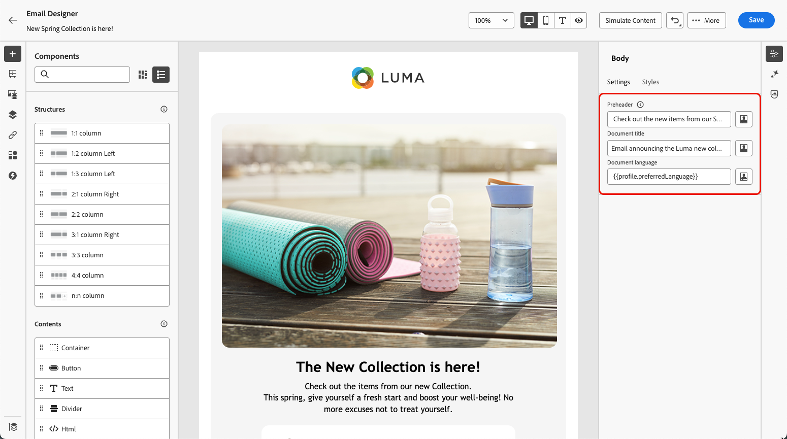

# 이메일 콘텐츠에 메타데이터 추가 {#email-metadata}

>[!CONTEXTUALHELP]
>id="ac_edition_preheader"
>title="프리 헤더 정의"
>abstract="프리헤더는 이메일 클라이언트에서 이메일을 표시할 때 제목 줄 뒤에 나오는 짧은 요약 텍스트입니다. 대부분의 경우 프리헤더는 이메일에 대한 간략한 요약을 제공하고 일반적으로 한 문장으로 구성됩니다."

이메일을 디자인할 때 가독성을 높이고 접근성을 개선하기 위해 콘텐츠에 대한 추가 메타 속성을 정의할 수 있습니다. [!DNL Journey Optimizer] [전자 메일 Designer](get-started-email-design.md)을(를) 사용하면 다음 요소를 지정할 수 있습니다.

* **[!UICONTROL 사전 머리글]**: 사전 머리글은 전자 메일 클라이언트에서 전자 메일을 볼 때 제목 줄 다음에 오는 짧은 요약 텍스트입니다. 대부분의 경우 프리헤더는 이메일에 대한 간략한 요약을 제공하고 일반적으로 한 문장으로 구성됩니다.

  >[!NOTE]
  >
  >일부 이메일 클라이언트에서는 프리 헤더가 지원되지 않습니다. 지원되지 않는 경우에는 프리 헤더가 표시되지 않습니다.

* **[!UICONTROL 문서 제목]**: `<title>` 요소에 해당하는 이 필드에서는 전자 메일 콘텐츠에 대한 설명 정보를 제공하며 일반적으로 마우스 가리키기에 도구 설명으로 표시됩니다. 추가 컨텍스트를 제공하여 장애가 있는 사용자에게 도움이 될 수 있으며, 검색 엔진을 통해 콘텐츠를 더 잘 이해하는 데 기여할 수 있습니다.

* **[!UICONTROL 문서 언어]**: 접근성을 보장하기 위해 화면 판독기에서 텍스트 및 이미지를 음성 또는 점자로 변환하는 데 사용할 언어를 지정할 수 있습니다. 이는 시각 장애 또는 학습 장애가 있는 사용자에게 적합합니다. 이 설정은 `<html>` 요소의 `lang` 특성에 해당합니다.

이러한 설정을 구성하려면 아래 단계를 수행합니다.

1. [이메일 Designer](content-from-scratch.md)에서 **[!UICONTROL 구조 구성 요소]** 이상을 추가하여 이메일 디자인을 시작합니다.

1. 왼쪽 **[!UICONTROL 탐색 트리]** 또는 오른쪽 창 상단에서 **[!UICONTROL 본문]**&#x200B;을 클릭합니다.

   

1. **[!UICONTROL 설정]** 탭에서 **[!UICONTROL 사전 머리글]**, **[!UICONTROL 문서 제목]** 및/또는 **[!UICONTROL 문서 언어]** 필드에 일부 텍스트를 입력합니다.

1. 각 필드 옆에 있는 개인화 아이콘을 클릭하여 프로필 속성, 대상자, 컨텍스트 속성 등에서 콘텐츠를 사용자 지정할 수도 있습니다. [개인화에 대해 자세히 알아보기](../personalization/personalization-build-expressions.md)

   

1. 변경 내용을 확인하려면 **[!UICONTROL 저장]**&#x200B;을 클릭하세요.