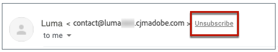

# 이메일 옵트아웃 관리 {#email-opt-out}

수신자가 이메일 커뮤니케이션 수신을 취소할 수 있는 기능을 제공하려면 항상 을 포함해야 합니다 **구독 취소 링크** 수신자에게 보내는 모든 이메일에서 [개인 정보 및 옵트아웃 관리에 대해 자세히 알아보십시오](../privacy/opt-out.md)

이렇게 하려면 다음을 수행할 수 있습니다.

* 삽입 **외부 랜딩 페이지에 연결** 이메일 을 통해 사용자가 브랜드로부터 커뮤니케이션 수신을 취소할 수 있도록 합니다. [외부 옵트아웃 링크를 추가하는 방법 알아보기](#opt-out-external-lp)

* 추가 **옵트아웃 링크 1회 클릭** 이메일 콘텐츠로 변경 이 링크를 사용하면 수신자가 선택을 확인해야 하는 랜딩 페이지로 리디렉션되지 않고 구독 취소 프로세스를 가속화하는 데 도움이 됩니다. [원클릭 옵트아웃 링크를 추가하는 방법을 알아봅니다](#one-click-opt-out)

또한 **[!UICONTROL List-Unsubscribe]** 선택 사항이 채널 표면 수준에서 활성화되면 Journey Optimizer와 함께 전송된 해당 이메일에 이메일 헤더에 구독 취소 링크가 포함됩니다. [이메일 헤더의 옵트아웃에 대해 자세히 알아보기](#unsubscribe-header)

>[!NOTE]
>
>마케팅 유형 이메일 메시지에는 옵트아웃 링크가 포함되어야 하며, 이것은 트랜잭션 메시지에 필요하지 않습니다. 메시지 카테고리(**[!UICONTROL Marketing]** 또는 **[!UICONTROL Transactional]**)가에 정의되어 있습니다. [채널 표면](../configuration/channel-surfaces.md#email-type) (즉, 메시지 사전 설정) 수준 및 메시지를 만들 때 사용할 수 있습니다.

## 외부 옵트아웃 {#opt-out-external-lp}

### 구독 취소 링크 추가 {#add-unsubscribe-link}

먼저 메시지에 구독 취소 링크를 추가해야 합니다. 이렇게 하려면 아래 단계를 수행합니다.

1. 자체 구독 취소 랜딩 페이지를 구축합니다.

1. 원하는 서드파티 시스템에 호스팅하십시오.

1. 여정에서 메시지 만들기.

1. 콘텐츠에서 텍스트를 선택하고 [링크 삽입](../email/message-tracking.md#insert-links) 상황별 도구 모음 사용.

   

1. 선택 **[!UICONTROL External Opt-out/Unsubscription]** 에서 **[!UICONTROL Link type]** 드롭다운 목록.

   

1. 에서 **[!UICONTROL Link]** 필드에서 링크를 타사 랜딩 페이지에 붙여넣습니다.

   

1. 클릭 **[!UICONTROL Save]**.

### 옵트아웃에 대한 API 호출 구현 {#opt-out-api}

수신자가 랜딩 페이지에서 선택한 항목을 제출할 때 옵트아웃하도록 하려면 **구독 API 호출** through [Adobe Developer](https://developer.adobe.com){target=&quot;_blank&quot;} 를 사용하여 해당 프로필의 환경 설정을 업데이트합니다.

이 POST 호출은 다음과 같습니다.

끝점: platform.adobe.io/journey/imp/consent/preferences

쿼리 매개 변수:

* **params**: 암호화된 페이로드를 포함합니다.
* **sig**: 서명
* **pid**: 암호화된 프로필 ID

이 세 매개 변수는 수신자에게 전송된 타사 랜딩 페이지 URL에 포함됩니다.


헤더 요구 사항:

* x-api-key
* x-gw-ims-org-id
* x-sandbox-name
* 인증(기술 계정의 사용자 토큰)

요청 본문:

```
{
   "marketing": [
       {
            "type": "email",           
            "choice": "no",          
            "scope": "channel"       
        }
    ],
 
}
```

[!DNL Journey Optimizer] 에서는 다음 매개 변수를 사용하여 [Adobe Developer](https://developer.adobe.com){target=&quot;_blank&quot;} API 호출.

### 구독 취소 링크가 있는 메시지 보내기 {#send-message-unsubscribe-link}

랜딩 페이지에 대한 구독 취소 링크를 구성하고 API 호출을 구현하면 메시지를 전송할 준비가 되었습니다.

1. 링크를 포함하는 메시지를 [여정](../building-journeys/journey.md).

1. 메시지가 수신되면 수신자가 가입 해지 링크를 클릭하면 랜딩 페이지가 표시됩니다.

   

1. 수신자가 양식을 제출하는 경우(여기서는 **구독 취소** 랜딩 페이지의 경우), 프로필 데이터는 [API 호출](#opt-out-api).

1. 그런 다음 옵트아웃 수신자는 옵트아웃이 성공했음을 나타내는 확인 메시지 화면으로 리디렉션됩니다.

   

   따라서 이 사용자는 다시 구독하지 않으면 브랜드로부터 커뮤니케이션을 받지 않습니다.

1. 해당 프로필의 선택 사항이 업데이트되었는지 확인하려면 Experience Platform으로 이동하여 ID 네임스페이스 및 해당 ID 값을 선택하여 프로필에 액세스합니다. 자세한 내용은 [Experience Platform 설명서](https://experienceleague.adobe.com/docs/experience-platform/profile/ui/user-guide.html#getting-started){target=&quot;_blank&quot;}.

   

   에서 **[!UICONTROL Attributes]** 탭에서 **[!UICONTROL choice]** 이(가) **[!UICONTROL no]**.

## 옵트아웃 한 번 클릭 {#one-click-opt-out}

이메일에 옵트아웃 링크를 추가하려면 아래 단계를 따르십시오.

1. [링크 삽입](../email/message-tracking.md#insert-links) 을(를) 선택합니다. **[!UICONTROL One click Opt-out]** 를 링크 유형으로 사용할 수 있습니다.

   

1. 옵트아웃을 적용할 방법을 선택합니다. 채널, id 또는 구독 수준에서

   

   * **[!UICONTROL Channel]**: 옵트아웃은 현재 채널의 프로필 대상(즉, 이메일 주소)에 전송된 향후 메시지에 적용됩니다. 여러 대상이 프로필과 연결되어 있는 경우 옵트아웃은 해당 채널에 대한 프로필의 모든 타겟(즉, 이메일 주소)에 적용됩니다.
   * **[!UICONTROL Identity]**: 옵트아웃은 현재 메시지에 사용하는 특정 대상(즉, 이메일 주소)에 전송된 향후 메시지에 적용됩니다.
   * **[!UICONTROL Subscription]**: 옵트아웃은 특정 구독 목록과 연결된 향후 메시지에 적용됩니다. 이 옵션은 현재 메시지가 구독 목록과 연결된 경우에만 선택할 수 있습니다.

1. 사용자가 가입 해지되면 리디렉션될 랜딩 페이지의 URL을 입력합니다. 이 페이지는 옵트아웃이 성공했는지 확인하기 위한 것입니다.

   >[!NOTE]
   >
   >를 활성화한 경우 **목록 가입 해지** 채널 표면 수준에서 옵션을 선택하면, 이 URL은 사용자가 이메일 헤더에서 가입 해지 링크를 클릭할 때도 사용됩니다. [추가 정보](#unsubscribe-header)

   

   링크를 개인화할 수 있습니다. 의 개인화된 URL에 대해 자세히 알아보십시오 [이 섹션](../personalization/personalization-syntax.md).

1. 변경 사항을 저장합니다.

메시지를 [여정](../building-journeys/journey.md)수신자가 옵트아웃 링크를 클릭하면 수신자의 프로필이 즉시 옵트아웃됩니다.

## 이메일 헤더에서 링크 가입 해제 {#unsubscribe-header}

>[!CONTEXTUALHELP]
>id="ajo_admin_preset_unsubscribe"
>title="이메일 헤더에 구독 취소 링크 추가"
>abstract="목록 가입 해지 를 활성화하여 이메일 헤더에 가입 해지 링크를 추가합니다. 구독 취소 URL을 설정하려면 전자 메일 콘텐츠에 원클릭 옵트아웃 링크를 삽입합니다."
>additional-url="https://experienceleague.adobe.com/docs/journey-optimizer/using/privacy/consent/opt-out.html#one-click-opt-out" text="옵트아웃 한 번 클릭"

만약 [목록 가입 해지 옵션](../configuration/channel-surfaces.md#list-unsubscribe) 은 채널 표면 수준에서 활성화되며 과 함께 전송되는 해당 이메일입니다. [!DNL Journey Optimizer] 이메일 헤더에 구독 취소 링크가 포함됩니다.

예를 들어 가입 해지 링크는 Gmail에 다음과 같이 표시됩니다.



>[!NOTE]
>
>이메일 헤더에 가입 해지 링크를 표시하려면 수신자의 이메일 클라이언트가 이 기능을 지원해야 합니다.

가입 해지 주소가 기본값입니다 **[!UICONTROL Mailto (unsubscribe)]** 해당 채널 표면에 표시되는 주소입니다. [추가 정보](../configuration/channel-surfaces.md#list-unsubscribe).

개인화된 구독 취소 URL을 설정하려면 전자 메일 메시지 콘텐츠에 원클릭 옵트아웃 링크를 삽입하고 원하는 URL을 입력합니다. [추가 정보](#one-click-opt-out)

이메일 클라이언트에 따라 헤더에서 가입 해지 링크를 클릭하면 다음과 같은 영향을 받을 수 있습니다.

* 가입 해지 요청이 기본 가입 해지 주소로 전송됩니다.

* 수신자는 메시지에 옵트아웃 링크를 추가할 때 지정한 랜딩 페이지 URL로 이동됩니다.

   >[!NOTE]
   >
   >메시지 콘텐츠에 원클릭 옵트아웃 링크를 추가하지 않으면 랜딩 페이지가 표시되지 않습니다.

* 해당 프로필이 즉시 옵트아웃되고, 이 선택 사항이 Experience Platform에서 업데이트됩니다. 자세한 내용은 [Experience Platform 설명서](https://experienceleague.adobe.com/docs/experience-platform/profile/ui/user-guide.html#getting-started){target=&quot;_blank&quot;}.
