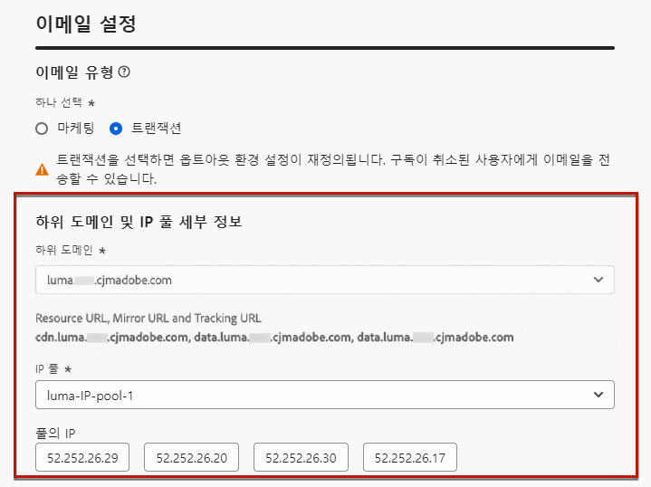
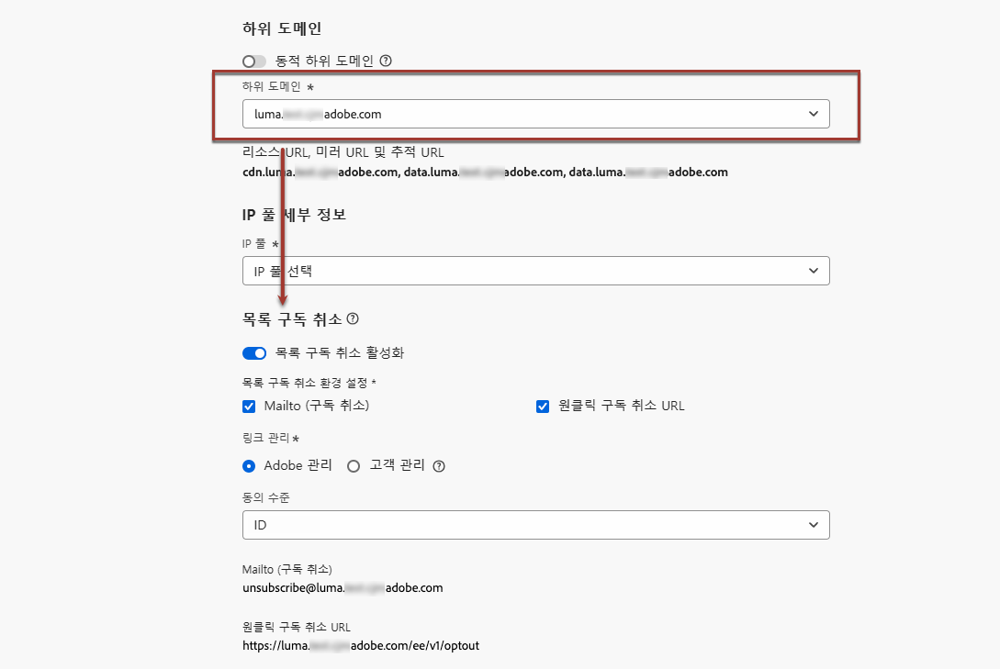
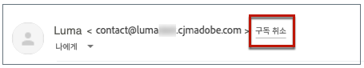
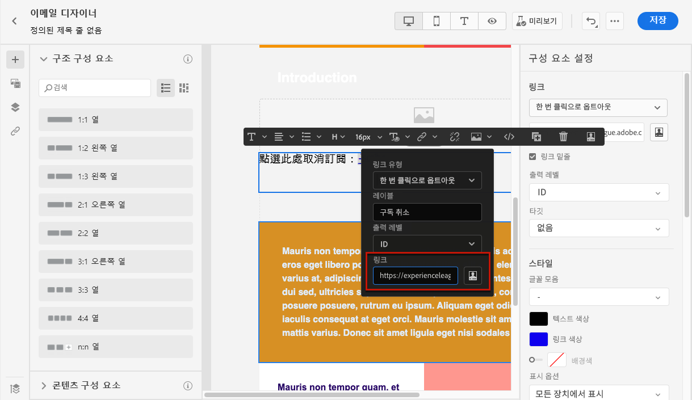
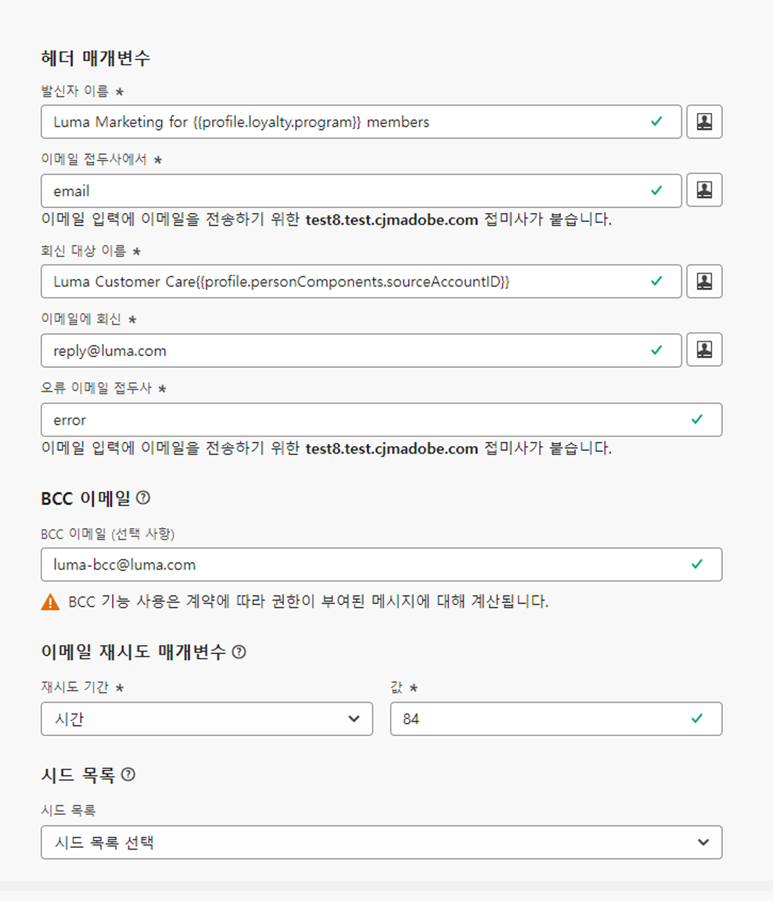
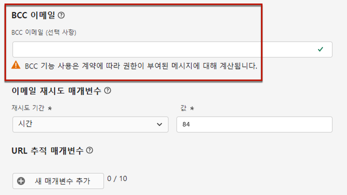
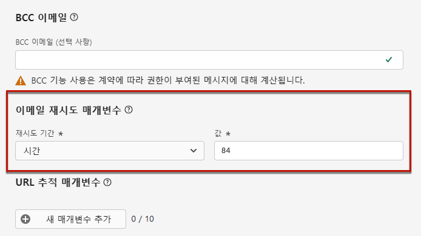
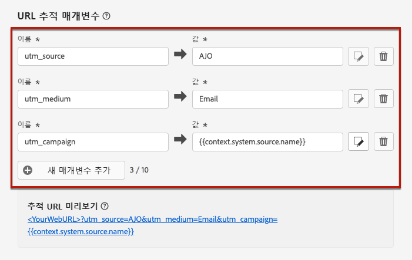
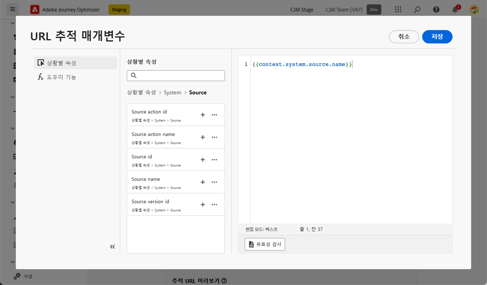
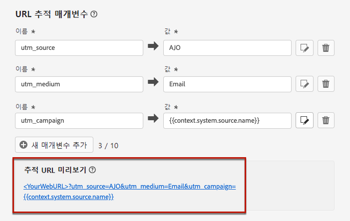

# 이메일 설정 구성 {#email-settings}

이메일 만들기를 시작하려면 메시지에 필요한 모든 기술 매개 변수를 정의하는 이메일 채널 서피스를 설정해야 합니다. [서피스를 만드는 방법을 알아봅니다](../configuration/channel-surfaces.md)

채널 서피스 구성의 전용 섹션에서 전자 메일 설정을 정의합니다.

아래 논리에 따라 통신을 전송하기 위해 이메일 서피스 구성을 선택합니다.

* 배치 및 버스트 여정의 경우 이메일 서피스 구성이 수행되기 전에 이미 시작된 배치 또는 버스트 실행에는 적용되지 않습니다. 변경 사항은 다음 되풀이 또는 새 실행 시 선택됩니다.

* 트랜잭션 메시지의 경우 다음 커뮤니케이션에 대해 변경 사항이 즉시 선택됩니다(최대 5분 지연).

>[!NOTE]
>
>업데이트된 이메일 서피스 설정은 서피스가 사용되는 여정 또는 캠페인에서 자동으로 선택됩니다.

## 이메일 유형 {#email-type}

>[!CONTEXTUALHELP]
>id="ajo_admin_presets_emailtype"
>title="이메일 카테고리 정의"
>abstract="이 서피스를 사용할 때 전송할 이메일 유형을 선택합니다. 사용자 동의가 필요한 프로모션 이메일에 대한 마케팅 또는 비상업적 이메일에 대한 트랜잭션은 특정 컨텍스트에서 가입 해지된 프로필에도 전송될 수 있습니다."

에서 **이메일 유형** 섹션에서 서피스와 함께 전송할 메시지 유형을 선택합니다. **마케팅** 또는 **트랜잭션**.

* 선택 **마케팅** 프로모션 이메일의 경우: 이러한 메시지에는 사용자의 동의가 필요합니다.

* 선택 **트랜잭션** 주문 확인, 암호 재설정 알림 또는 배달 정보와 같은 비상업적인 이메일의 경우,

>[!CAUTION]
>
>**트랜잭션** 마케팅 커뮤니케이션의 구독을 취소한 프로필에게 이메일을 보낼 수 있습니다. 이러한 메시지는 특정 컨텍스트에서만 보낼 수 있습니다.

메시지를 만들 때 이메일에 대해 선택한 카테고리와 일치하는 유효한 채널 서피스를 선택해야 합니다.

## 하위 도메인 및 IP 풀 {#subdomains-and-ip-pools}

에서 **하위 도메인 및 IP 풀** 섹션:

1. 이메일을 보내는 데 사용할 하위 도메인을 선택합니다. [자세히 알아보기](../configuration/about-subdomain-delegation.md)

1. 서피스와 연결할 IP 풀을 선택합니다. [자세히 알아보기](../configuration/ip-pools.md)

선택한 IP 풀이 아래에 있는 동안에는 서피스 생성을 계속할 수 없습니다 [에디션](../configuration/ip-pools.md#edit-ip-pool) (**[!UICONTROL 처리 중]** 상태) 및 을 선택한 하위 도메인과 연결한 적이 없습니다. 그렇지 않으면 가장 오래된 버전의 IP 풀/하위 도메인 연결이 계속 사용됩니다. 이 경우 서피스를 초안으로 저장하고 IP 풀에 가 있으면 다시 시도하십시오 **[!UICONTROL 성공]** 상태.

>[!NOTE]
>
>비프로덕션 환경의 경우 Adobe은 기본 테스트 하위 도메인을 만들거나 공유 전송 IP 풀에 대한 액세스 권한을 부여하지 않습니다. 다음을 수행해야 합니다. [고유한 하위 도메인 위임](../configuration/delegate-subdomain.md) 및 조직에 할당된 풀의 IP를 사용합니다.

IP 풀을 선택한 후 IP 풀 드롭다운 목록 아래에 표시된 IP 주소를 마우스로 가리키면 PTR 정보가 표시됩니다. [PTR 레코드에 대한 자세한 정보](../configuration/ptr-records.md)

>[!NOTE]
>
>PTR 레코드가 구성되지 않은 경우 Adobe 담당자에게 문의하십시오.

## 목록 가입 해지 {#list-unsubscribe}

On [하위 도메인 선택](#subdomains-and-ip-pools) 목록에서 **[!UICONTROL 목록 가입 해지 활성화]** 옵션이 표시됩니다.

이 옵션은 기본적으로 활성화되어 있습니다.

이 기능을 활성화한 상태로 두면 가입 해지 링크가 다음과 같이 이메일 헤더에 자동으로 포함됩니다.

이 옵션을 비활성화하면 이메일 헤더에 가입 해지 링크가 표시되지 않습니다.

가입 해지 링크는 다음 두 가지 요소로 구성됩니다.

* An **이메일 주소 가입**: 모든 구독 취소 요청을 전송하는 입니다.

   in [!DNL Journey Optimizer], 가입 해지 이메일 주소가 기본값입니다 **[!UICONTROL Mailto(구독 취소)]** 채널 서피스에 표시되는 주소, 즉 [선택한 하위 도메인](#subdomains-and-ip-pools).

   

* 다음 **구독 취소 URL**: 사용자가 가입 해지되면 리디렉션되는 랜딩 페이지의 URL입니다.

   를 추가할 경우 [옵트아웃 링크 1회 클릭](../privacy/opt-out.md#one-click-opt-out) 이 서피스를 사용하여 생성된 메시지의 경우 가입 해지 URL은 한 번의 클릭으로 옵트아웃 링크에 대해 정의된 URL입니다.

   

   >[!NOTE]
   >
   >메시지 콘텐츠에 원클릭 옵트아웃 링크를 추가하지 않으면 랜딩 페이지가 사용자에게 표시되지 않습니다.

에서 메시지에 헤더 가입 해지 링크를 추가하는 방법에 대해 자세히 알아보십시오 [이 섹션](../privacy/opt-out.md#unsubscribe-header).

<!--Select the **[!UICONTROL Custom List-Unsubscribe]** option to enter your own Unsubscribe URL and/or your own Unsubscribe email address.(to add later)-->

## 헤더 매개 변수 {#email-header}

에서 **[!UICONTROL 헤더 매개 변수]** 섹션에서 해당 표면을 사용하여 보낸 이메일 유형과 연관된 발신자 이름과 이메일 주소를 입력합니다.

* **[!UICONTROL 발신자 이름]**: 브랜드 이름과 같은 발신자의 이름입니다.

* **[!UICONTROL 보낸 사람 이메일]**: 통신에 사용할 이메일 주소입니다.

* **[!UICONTROL 회신 대상(이름)]**: 수신자가 **회신** 버튼을 클릭합니다.

* **[!UICONTROL 회신 대상(이메일)]**: 수신자가 **회신** 버튼을 클릭합니다. [자세히 알아보기](#reply-to-email)

* **[!UICONTROL 오류 이메일]**: 이 주소에는 배달되는 며칠 후 ISP에서 생성한 모든 오류(비동기 바운스)가 수신됩니다.

>[!CAUTION]
>
>다음 **[!UICONTROL 보낸 사람 이메일]** 및 **[!UICONTROL 오류 이메일]** 주소는 현재 선택한 주소를 사용해야 합니다 [위임된 하위 도메인](../configuration/about-subdomain-delegation.md). 예를 들어 위임된 하위 도메인이 *marketing.luma.com*, 다음 사용 가능 *contact@marketing.luma.com* 및 *error@marketing.luma.com*.

>[!NOTE]
>
>주소는 문자(A-Z)로 시작해야 하며 영숫자만 사용할 수 있습니다. 밑줄을 사용할 수도 있습니다 `_`, 점`.` 및 하이픈 `-` 자.

### 전자 메일에 회신 {#reply-to-email}

를 정의할 때 **[!UICONTROL 회신 대상(이메일)]** 주소, 유효한 주소이고 올바른 형식의 이메일 주소를 지정하지 않은 경우 모든 이메일 주소를 지정할 수 있습니다.

적절한 회신 관리를 수행하려면 아래 명령을 따르십시오.

* 답글에 사용된 받은 편지함은 부재 중 알림 및 챌린지 응답을 포함하여 모든 회신 이메일을 수신하므로, 이 받은 편지함으로 전자 메일 랜딩을 처리하는 수동 또는 자동화된 프로세스가 있는지 확인합니다.

* 전용 받은 편지함에 이메일 표면을 사용하여 전송되는 모든 회신 이메일을 수신하기에 충분한 수신 용량이 있는지 확인합니다. 받은 편지함이 바운스를 반환하면 고객으로부터 일부 답글이 수신되지 않을 수 있습니다.

* 회신은 개인 식별 정보(PII)를 포함할 수 있으므로 개인 정보 및 규정 준수 의무를 염두에 두고 처리되어야 합니다.

* 이 주소로 전송된 다른 모든 답글에 영향을 주므로 메시지를 회신 받은 편지함에 스팸으로 표시하지 마십시오.

### 이메일 전달 {#forward-email}

특정 이메일 주소로 전달하려는 경우 [!DNL Journey Optimizer] 위임된 하위 도메인은 Adobe 고객 지원 센터에 문의하십시오. 다음을 제공해야 합니다.

* 원하는 이메일 주소입니다. 전자 메일 주소 전달 도메인은 Adobe에 위임된 하위 도메인과 일치하지 않습니다.
* 샌드박스 이름입니다.
* 앞으로 전자 메일 주소가 사용될 표면 이름입니다.
* 현재 **[!UICONTROL 회신 대상(이메일)]** 채널 서피스 레벨에서 설정된 주소.

>[!NOTE]
>
>하위 도메인당 한 개의 순방향 이메일 주소만 있을 수 있습니다. 따라서 여러 서피스에서 동일한 하위 도메인을 사용하는 경우 모든 서피스에 동일한 순방향 이메일 주소를 사용해야 합니다.

전자 메일 전송 주소는 Adobe이 설정합니다. 3~4일 걸릴 수 있습니다.

## 숨은 참조 이메일 {#bcc-email}

에서 보낸 이메일의 동일한 사본(또는 빈 사본)을 보낼 수 있습니다 [!DNL Journey Optimizer] 를 BCC 받은 편지함으로 배달되며 이 받은 편지함은 규정 준수 또는 보관 목적으로 저장됩니다.

이렇게 하려면 **[!UICONTROL 숨은 참조 이메일]** 채널 서피스 레벨의 선택적 피쳐 [자세히 알아보기](../configuration/archiving-support.md#bcc-email)

## 전자 메일 다시 시도 매개 변수 {#email-retry}

>[!CONTEXTUALHELP]
>id="ajo_admin_presets_retryperiod"
>title="다시 시도 기간 조정"
>abstract="임시 소프트 바운스 오류로 인해 이메일 게재가 실패할 경우 3.5일(84시간) 동안 다시 시도가 수행됩니다. 이 기본 다시 시도 기간을 조정하여 사용자의 요구 사항에 맞게 조정할 수 있습니다."
>additional-url="https://experienceleague.adobe.com/docs/journey-optimizer/using/configuration/monitor-reputation/retries.html" text="다시 시도 기본 정보"

을 구성할 수 있습니다 **전자 메일 다시 시도 매개 변수**.

기본적으로 [재시도 기간](../configuration/retries.md#retry-duration) 은 84시간으로 설정되어 있지만 이 설정을 필요에 더 잘 맞게 조정할 수 있습니다.

다음 범위 내에 정수 값(시간 또는 분 단위)을 입력해야 합니다.

* 마케팅 이메일의 경우 최소 재시도 기간은 6시간입니다.
* 트랜잭션 전자 메일의 경우 최소 재시도 기간은 10분입니다.
* 두 이메일 유형의 경우 최대 다시 시도 기간은 84시간(또는 5040분)입니다.

에서 다시 시도하는 방법에 대해 자세히 알아보기 [이 섹션](../configuration/retries.md).

## URL 추적 {#url-tracking}

>[!CONTEXTUALHELP]
>id="ajo_admin_preset_utm"
>title="URL 추적 매개 변수 정의"
>abstract="이 섹션을 사용하여 추적 매개 변수를 이메일 콘텐츠에 있는 URL에 자동으로 추가합니다. 이 기능은 선택 사항입니다."

>[!CONTEXTUALHELP]
>id="ajo_admin_preset_url_preview"
>title="미리 보기 URL 추적 매개 변수"
>abstract="추적 매개 변수가 전자 메일 콘텐츠에 있는 URL에 추가되는 방법을 검토하십시오."

다음을 사용할 수 있습니다 **[!UICONTROL URL 추적 매개 변수]** 를 사용하여 여러 채널에서 마케팅 활동의 효과를 측정할 수 있습니다. 이 기능은 선택 사항입니다.

이 섹션에 정의된 매개 변수가 이메일 메시지 콘텐츠에 포함된 URL의 끝에 추가됩니다. 그런 다음 Adobe Analytics 또는 Google Analytics과 같은 웹 분석 도구에서 이러한 매개 변수를 캡처하고 다양한 성능 보고서를 만들 수 있습니다.

<!--Three URL tracking parameters are auto-populated as an example when you create a channel surface. You can edit these and add up to 10 tracking parameters using the **[!UICONTROL Add new parameter]** button.-->

를 사용하여 최대 10개의 추적 매개 변수를 추가할 수 있습니다 **[!UICONTROL 새 매개 변수 추가]** 버튼을 클릭합니다.

URL 추적 매개 변수를 구성하려면 **[!UICONTROL 이름]** 및 **[!UICONTROL 값]** 필드.

<!--You can also choose from a list of predefined values by navigating to the following objects:
* Journey attributes: **Source id**, **Source name**, **Source version id**
* Action attributes: **Action id**, **Action name**
* Offer decisioning attributes: **Offer id**, **Offer name**

>[!CAUTION]
>
>Do not select a folder: make sure to browse to the necessary folder and select a profile attribute to use as a tracking parameter value.-->

각 항목을 편집할 수도 있습니다 **[!UICONTROL 값]** 필드를 사용하여 [표현식 편집기](../personalization/personalization-build-expressions.md). 편집 아이콘을 클릭하여 편집기를 엽니다. 여기에서 원하는 컨텍스트 속성을 선택하거나 텍스트를 직접 편집할 수 있습니다.

>[!NOTE]
>
>표현식 편집기에서 입력 텍스트 값과 컨텍스트 속성을 결합할 수 있습니다. 각 **[!UICONTROL 값]** 필드에는 총 255자가 포함될 수 있습니다.

<!--You can drag and drop the parameters to reorder them.-->

다음은 Adobe Analytics 및 Google Analytics 호환 URL의 예입니다.

* Adobe Analytics 호환 URL: `www.YourLandingURL.com?cid=email_AJO_{{context.system.source.id}}_image_{{context.system.source.name}}`

* Google Analytics 호환 URL: `www.YourLandingURL.com?utm_medium=email&utm_source=AJO&utm_campaign={{context.system.source.id}}&utm_content=image`

결과 추적 URL을 동적으로 미리 볼 수 있습니다. 매개 변수를 추가, 편집 또는 제거할 때마다 미리 보기가 자동으로 업데이트됩니다.

