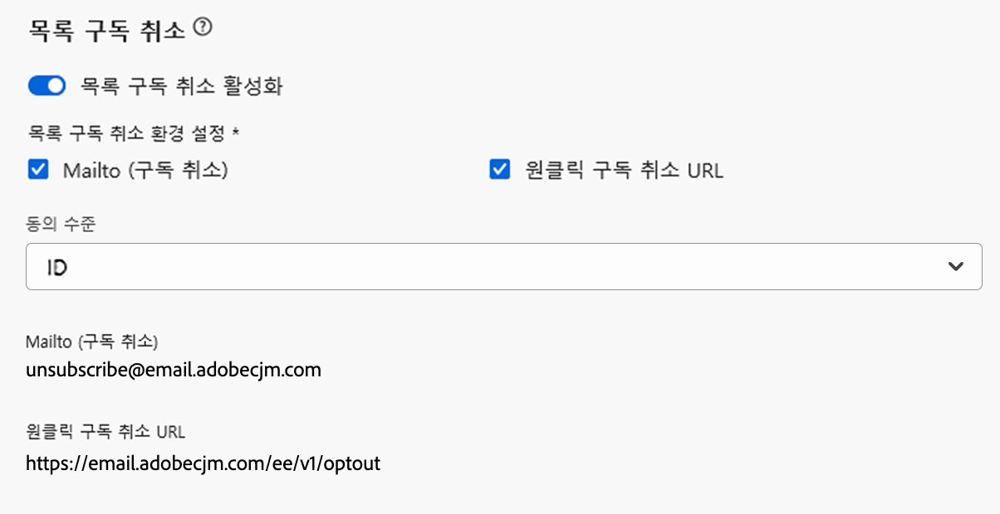

# 이메일 설정 구성 {#email-settings}

이메일 만들기를 시작하려면 메시지에 필요한 모든 기술 매개 변수를 정의하는 이메일 채널 표면을 설정해야 합니다. [표면 생성 방법 알아보기](../configuration/channel-surfaces.md)

>[!NOTE]
>
>평판을 유지하고 전달성을 향상시키려면 이메일 표면을 만들기 전에 이메일 전송에 사용할 하위 도메인을 설정합니다. [자세히 알아보기](../configuration/about-subdomain-delegation.md)

아래에 자세히 설명된 대로 채널 표면 구성의 전용 섹션에서 이메일 설정을 정의합니다.

{width="50%" align="left"}

아래 논리에 따라 통신을 전송하기 위해 이메일 표면 구성이 선택됩니다.

* 배치 여정의 경우 이메일 표면 구성이 만들어지기 전에 이미 시작된 배치 실행에는 적용되지 않습니다. 다음 반복 또는 새 실행 시 변경 사항이 선택됩니다.

* 트랜잭션 메시지의 경우 다음 통신(최대 5분 지연)을 위해 변경 사항이 즉시 선택됩니다.

>[!NOTE]
>
>업데이트된 이메일 표면 설정은 표면이 사용되는 여정 또는 캠페인에서 자동으로 선택됩니다.

## 이메일 유형 {#email-type}

>[!CONTEXTUALHELP]
>id="ajo_admin_presets_emailtype"
>title="이메일 유형 정의"
>abstract="이 표면을 사용할 때 보낼 이메일 유형을 선택합니다. 사용자 동의가 필요한 홍보 이메일의 마케팅 또는 특정 컨텍스트의 구독 취소 프로필에도 보낼 수 있는 비상업적 이메일의 트랜잭션."

다음에서 **이메일 유형** 섹션에서 서피스에 대한 메시지 유형을 선택합니다. **[!UICONTROL 마케팅]** 또는 **[!UICONTROL 트랜잭션]**.

* 선택 **마케팅** 소매점의 주별 프로모션과 같은 프로모션 이메일의 경우. 이러한 메시지에는 사용자의 동의가 필요합니다.

* 선택 **트랜잭션** 예를 들어 주문 확인, 암호 재설정 알림 또는 게재 정보와 같은 비상업적인 이메일의 경우 다음 사용자에게 이러한 이메일을 보낼 수 있습니다. **구독 취소됨** 마케팅 커뮤니케이션에서. 이러한 메시지는 특정 컨텍스트에서만 보낼 수 있습니다.

메시지를 만들 때 이메일에 대해 선택한 범주와 일치하는 유효한 채널 표면을 선택해야 합니다.

## 하위 도메인 {#subdomains}

이메일을 보내는 데 사용할 하위 도메인을 선택합니다.

도메인의 평판을 유지하려면 IP 준비 프로세스를 가속화하고 게재 능력을 향상시키려면 보내는 하위 도메인을 Adobe에 위임하십시오. [자세히 알아보기](../configuration/about-subdomain-delegation.md)

<!--If needed, you can define dynamic subdomains. [Learn more](../email/surface-personalization.md#dynamic-subdomains)-->

## IP 풀 세부 정보 {#ip-pools}

표면과 연결할 IP 풀을 선택합니다. [자세히 알아보기](../configuration/ip-pools.md)

{width="50%" align="left"}

선택한 IP 풀이 아래에 있는 동안에는 표면 생성을 계속할 수 없습니다. [에디션](../configuration/ip-pools.md#edit-ip-pool) (**[!UICONTROL 처리 중]** 상태) 및 은(는) 선택한 하위 도메인과 연결된 적이 없습니다. 그렇지 않으면 가장 오래된 버전의 IP 풀/하위 도메인 연결이 계속 사용됩니다. 이 경우 표면을 초안으로 저장하고 IP 풀에 가 있으면 다시 시도하십시오. **[!UICONTROL 성공]** 상태.

>[!NOTE]
>
>비프로덕션 환경의 경우, Adobe은 기본 제공 테스트 하위 도메인을 만들거나 공유 전송 IP 풀에 대한 액세스 권한을 부여하지 않습니다. 다음을 수행해야 합니다. [자신의 하위 도메인 위임](../configuration/delegate-subdomain.md) 및 조직에 할당된 풀의 IP를 사용합니다.

IP 풀을 선택한 후 IP 풀 드롭다운 목록 아래에 표시된 IP 주소 위로 마우스를 가져가면 PTR 정보가 표시됩니다. [PTR 레코드에 대한 자세한 정보](../configuration/ptr-records.md)

>[!NOTE]
>
>PTR 기록이 구성되지 않은 경우 Adobe 담당자에게 문의하십시오.

## 목록 구독 취소 헤더{#list-unsubscribe}

<!--Do not modify - Legal Review Done -->

다음 일자에 [하위 도메인 선택](#subdomains-and-ip-pools) 목록에서 **[!UICONTROL 목록 구독 취소 활성화]** 옵션이 표시됩니다.

이 옵션은 기본적으로 활성화되어 이메일 헤더에 다음과 같은 원클릭 구독 취소 URL을 포함합니다.

이 옵션을 비활성화하면 원클릭 구독 취소 URL이 이메일 헤더에 표시되지 않습니다.

다음에서 동의 수준을 선택할 수 있습니다. **[!UICONTROL 동의 수준]** 드롭다운 목록입니다. 채널 또는 프로필 ID에만 해당될 수 있습니다. 이 설정을 기반으로 사용자가 이메일 헤더에 있는 구독 취소 URL 목록을 사용하여 구독을 취소하면 Adobe Journey Optimizer에서 채널 수준 또는 ID 수준에서 동의가 업데이트됩니다.

목록 구독 취소 헤더에는 두 개의 기능(Mailto 및 아래 설명된 대로 원클릭 구독 취소 URL)이 포함되어 있으며, 이 기능은 한 개 또는 두 개의 기능을 모두 선택 취소하지 않는 한 기본적으로 활성화됩니다.

* A **Mailto(구독 취소)** address - 자동 처리를 위해 구독 취소 요청이 라우팅되는 대상 주소입니다.

  Journey Optimizer에서 구독 취소 이메일 주소가 기본값입니다 **Mailto(구독 취소)** 다음에 준하여 채널 표면에 표시되는 주소 [선택한 하위 도메인](#subdomains-and-ip-pools).

  {width="50%" align="left"}

* 다음 **한 번의 클릭으로 구독 취소 URL**, 기본적으로 사용자가 설정하고 채널 표면 설정에서 구성한 하위 도메인을 기반으로 한 원클릭 선택 URL 생성 목록 구독 취소 헤더입니다.

  >[!AVAILABILITY]
  >
  >원클릭 구독 취소 URL 헤더 는 2024년 6월 3일부터 Adobe Journey Optimizer에서 사용할 수 있습니다.
  >

다음 **[!UICONTROL Mailto(구독 취소)]** 기능 및 **[!UICONTROL 한 번의 클릭으로 구독 취소 URL]** 기능은 선택 사항입니다. 생성된 기본 원클릭 구독 취소 URL을 사용하지 않으려면 이 기능을 선택 취소할 수 있습니다. 다음과 같은 시나리오에서 **[!UICONTROL 옵트아웃 구성]** 옵션이 켜지고 **[!UICONTROL 한 번의 클릭으로 구독 취소 URL]** 을(를) 추가하면 기능이 선택 취소됩니다. [원클릭 옵트아웃 링크](../privacy/opt-out.md#one-click-opt-out) 이 표면을 사용하여 만든 메시지에 대해 구독 취소 헤더 목록은 이메일 본문에 삽입한 원클릭 옵트아웃 링크를 선택하고 이를 원클릭 구독 취소 URL 값으로 사용합니다.

>[!NOTE]
>
>메시지 콘텐츠에 원클릭 옵트아웃 링크를 추가하지 않고 채널 표면 설정에서 기본 원클릭 구독 취소 URL이 선택 취소된 경우 URL이 목록 구독 취소 헤더의 일부로 이메일 헤더에 전달되지 않습니다.

메시지에서 구독 취소 기능을 관리하는 방법에 대해 자세히 알아보기 [이 섹션](../email/email-opt-out.md#unsubscribe-header).

## 헤더 매개 변수 {#email-header}

다음에서 **[!UICONTROL 헤더 매개 변수]** 섹션에는 해당 표면을 사용하여 보낸 이메일 유형과 연관된 발신자 이름 및 이메일 주소를 입력합니다.

* **[!UICONTROL 보낸 사람 이름]**: 보낸 사람의 이름(예: 브랜드 이름)
* **[!UICONTROL 보낸 사람 이메일]**: 커뮤니케이션에 사용할 이메일 주소입니다.
* **[!UICONTROL (이름)에게 회신]**: 수신자가 를 클릭할 때 사용할 이름 **답변** 이메일 클라이언트 소프트웨어의 버튼입니다.
* **[!UICONTROL 회신 대상(이메일)]**: 수신자가 을(를) 클릭할 때 사용할 이메일 주소 **답변** 이메일 클라이언트 소프트웨어의 버튼입니다. [자세히 알아보기](#reply-to-email)
* **[!UICONTROL 오류 이메일]**: 메일이 게재된 후 며칠(비동기 바운스) ISP에서 생성한 모든 오류가 이 주소에서 수신됩니다. 부재 중 알림 및 문제 응답도 이 주소로 수신됩니다.

  Adobe에게 위임되지 않은 특정 이메일 주소에 대한 부재 중 알림 및 질문 응답을 수신하려면 [전진 프로세스](#forward-email). 이 경우 이 받은 편지함에 도착하는 이메일을 처리할 수동 또는 자동화된 솔루션이 있는지 확인하십시오.

>[!CAUTION]
>
>다음 **[!UICONTROL 보낸 사람 이메일]** 및 **[!UICONTROL 오류 이메일]** 주소는 현재 선택된 항목을 사용해야 합니다. [위임된 하위 도메인](../configuration/about-subdomain-delegation.md). 예를 들어 위임된 하위 도메인이 *marketing.luma.com*, 다음을 사용할 수 있습니다 *contact@marketing.luma.com* 및 *error@marketing.luma.com*.

>[!NOTE]
>
>주소는 문자(A-Z)로 시작해야 하며 영숫자만 포함할 수 있습니다. 밑줄을 사용할 수도 있습니다 `_`, 점`.` 및 하이픈 `-` 자.

### 전자 메일에 회신 {#reply-to-email}

을(를) 정의할 때 **[!UICONTROL 회신 대상(이메일)]** 주소, 유효한 이메일 주소를 입력하고 오타가 없는 올바른 형식으로 지정할 수 있습니다.

회신에 사용되는 받은 편지함은 부재 중 알림 및 챌린지 응답을 제외하고 모든 회신 이메일을 수신합니다. **[!UICONTROL 오류 이메일]** 주소.

올바른 회신 관리를 위해 아래 권장 사항을 따르십시오.

* 전용 받은 편지함이 이메일 표면을 사용하여 보내는 모든 회신 이메일을 받을 수 있는 충분한 수신 용량을 갖추고 있는지 확인합니다. 받은 편지함이 반송되면 고객으로부터 일부 답글이 수신되지 않을 수 있습니다.

* 답글에는 개인 식별 정보(PII)가 포함될 수 있으므로 개인 정보 및 준수 의무를 고려하여 처리해야 합니다.

* 이 주소로 전송된 다른 모든 답글에 영향을 주므로 답글 받은 편지함에서 메시지를 스팸으로 표시하지 마십시오.

또한 을 정의할 때 **[!UICONTROL 회신 대상(이메일)]** 주소, 유효한 MX 레코드 구성이 있는 하위 도메인을 사용해야 합니다. 그렇지 않으면 이메일 표면 처리가 실패합니다.

이메일 표면 제출 시 오류가 발생하면 입력한 주소의 하위 도메인에 대해 MX 레코드가 구성되지 않은 것입니다. 해당 MX 레코드를 구성하려면 관리자에게 문의하거나 다른 주소를 유효한 MX 레코드 구성과 함께 사용하십시오.

>[!NOTE]
>
>입력한 주소의 하위 도메인이 [완전히 위임됨](../configuration/delegate-subdomain.md#full-subdomain-delegation) Adobe을 하려면 Adobe 계정 담당자에게 문의하십시오.

### 이메일 전달 {#forward-email}

받은 모든 이메일을 특정 이메일 주소로 전달하려면 [!DNL Journey Optimizer] 위임된 하위 도메인은 Adobe 고객 지원 센터에 문의하십시오.

>[!NOTE]
>
>에 하위 도메인을 사용하는 경우 **[!UICONTROL 회신 대상(이메일)]** 주소가 Adobe에게 위임되지 않았습니다. 이 주소에 대해 전달이 작동하지 않습니다.

다음을 제공해야 합니다.

* 선택한 전달 이메일 주소입니다. 전달 이메일 주소 도메인은 Adobe에게 위임된 하위 도메인과 일치할 수 없습니다.
* 샌드박스 이름.
* 전달 이메일 주소가 사용될 표면 이름 또는 하위 도메인입니다.
  <!--* The current **[!UICONTROL Reply to (email)]** address or **[!UICONTROL Error email]** address set at the channel surface level.-->

>[!NOTE]
>
>하위 도메인당 하나의 전달 이메일 주소만 있을 수 있습니다. 따라서 여러 서피스가 동일한 하위 도메인을 사용하는 경우 모든 서피스에 동일한 전달 이메일 주소를 사용해야 합니다.

전달 이메일 주소는 Adobe에 의해 설정됩니다. 3~4일 정도 소요될 수 있습니다.

완료되면 모든 메시지가 **[!UICONTROL 회신 대상(이메일)]** 및 **[!UICONTROL 오류 이메일]** 주소는 제공한 특정 이메일 주소로 전달됩니다.

## BCC 이메일 {#bcc-email}

에서 보낸 이메일의 동일한 사본(또는 숨은 참조)을 보낼 수 있습니다. [!DNL Journey Optimizer] BCC 받은 편지함으로 전송되며, 이 받은 편지함은 규정 준수 또는 보관 목적으로 저장됩니다.

이렇게 하려면 다음을 활성화합니다. **[!UICONTROL BCC 이메일]** 채널 서피스 레벨의 선택적 피쳐입니다. [자세히 알아보기](../configuration/archiving-support.md#bcc-email)

또한 을 정의할 때 **[!UICONTROL BCC 이메일]** 주소, 유효한 MX 레코드 구성이 있는 하위 도메인을 사용해야 합니다. 그렇지 않으면 이메일 표면 처리가 실패합니다.

이메일 표면 제출 시 오류가 발생하면 입력한 주소의 하위 도메인에 대해 MX 레코드가 구성되지 않은 것입니다. 해당 MX 레코드를 구성하려면 관리자에게 문의하거나 다른 주소를 유효한 MX 레코드 구성과 함께 사용하십시오.

## 억제된 이메일 주소로 보내기 {#send-to-suppressed-email-addresses}

>[!CONTEXTUALHELP]
>id="ajo_surface_suppressed_addresses"
>title="제외 목록 우선 순위 재정의"
>abstract="스팸 고객 불만으로 인해 해당 이메일 주소가 Adobe Journey Optimizer 제외 목록에 있는 경우에도 프로필로 트랜잭션 메시지를 보내도록 결정할 수 있습니다. 이 옵션은 기본적으로 비활성화되어 있습니다."
>additional-url="https://experienceleague.adobe.com/docs/journey-optimizer/using/configuration/monitor-reputation/manage-suppression-list.html?lang=ko" text="제외 목록 관리"

>[!IMPORTANT]
>
>이 옵션은 다음을 선택한 경우에만 사용할 수 있습니다. **[!UICONTROL 트랜잭션]** 이메일 유형. [자세히 알아보기](#email-type)

위치 [!DNL Journey Optimizer], 하드 바운스, 소프트 바운스 및 스팸 불만으로 표시되는 모든 이메일 주소는 자동으로 [비표시 목록](../configuration/manage-suppression-list.md) 여정 또는 캠페인에서 제외됩니다.

하지만 의 메시지를 계속 보내도록 결정할 수 있습니다. **트랜잭션** 사용자의 스팸 불만으로 인해 이메일 주소가 제외 목록에 있는 경우에도 프로필을 입력합니다.

실제로 트랜잭션 메시지에는 일반적으로 주문 확인 또는 암호 재설정 알림과 같은 유용하고 예상되는 정보가 포함됩니다. 따라서 마케팅 메시지 중 하나를 스팸으로 보고했더라도 대부분의 경우 고객이 이러한 유형의 비상업적 이메일을 받기를 원합니다.

트랜잭션 메시지 대상자에 스팸 불만으로 인해 억제된 이메일 주소를 포함하려면 다음에서 해당 옵션을 선택합니다. **[!UICONTROL 억제된 이메일 주소로 보내기]** 섹션.

>[!NOTE]
>
>이 옵션은 기본적으로 비활성화되어 있습니다.

게재 모범 사례로서, 이 옵션은 옵트아웃한 고객에게 연락하지 않도록 기본적으로 비활성화되어 있습니다. 그러나 이 기본 옵션을 변경하면 고객에게 트랜잭션 메시지를 보낼 수 있습니다.

이 옵션이 활성화되면 고객이 마케팅 이메일을 스팸으로 표시했지만 이러한 고객은 현재 표면을 사용하여 트랜잭션 메시지를 받을 수 있습니다. 항상 게재 가능성 모범 사례에 따라 옵트아웃 환경 설정을 관리하십시오.

## 시드 목록 {#seed-list}

>[!CONTEXTUALHELP]
>id="ajo_surface_seed_list"
>title="시드 목록 추가"
>abstract="대상의 특정 내부 주소를 자동으로 추가하려면 선택한 시드 목록을 선택하십시오. 이러한 시드 주소는 게재 실행 시 포함되며 확인을 위해 메시지의 정확한 사본을 받게 됩니다."
>additional-url="https://experienceleague.adobe.com/docs/journey-optimizer/using/configuration/seed-lists.html#use-seed-list" text="시드 목록이란 무엇입니까?"

의 시드 목록 [!DNL Journey Optimizer] 을 사용하면 게재에 특정 이메일 시드 주소를 자동으로 포함할 수 있습니다. [자세히 알아보기](../configuration/seed-lists.md)

>[!CAUTION]
>
>현재 이 기능은 이메일 채널에만 적용됩니다.

에서 나와 관련된 목록을 선택합니다. **[!UICONTROL 시드 목록]** 섹션. 에서 시드 목록을 만드는 방법 알아보기 [이 섹션](../configuration/seed-lists.md#create-seed-list).

>[!NOTE]
>
>시드 목록은 한 번에 하나만 선택할 수 있습니다.

현재 표면이 캠페인이나 여정에서 사용되는 경우, 선택한 시드 목록의 이메일 주소는 게재 실행 시간에 포함됩니다. 즉, 보증 목적으로 게재 사본을 받게 됩니다.

의 여정 또는 캠페인에서 시드 목록을 사용하는 방법 알아보기 [이 섹션](../configuration/seed-lists.md#use-seed-list).

## 이메일 재시도 매개 변수 {#email-retry}

>[!CONTEXTUALHELP]
>id="ajo_admin_presets_retryperiod"
>title="재시도 기간 조정"
>abstract="임시 소프트 바운스 오류로 인해 이메일 게재에 실패하면 3.5일(84시간) 동안 다시 시도합니다. 필요에 따라 이 기본 재시도 기간을 조정할 수 있습니다."
>additional-url="https://experienceleague.adobe.com/docs/journey-optimizer/using/configuration/monitor-reputation/retries.html" text="다시 시도 정보"

다음을 구성할 수 있습니다. **이메일 재시도 매개 변수**.

기본적으로 [재시도 기간](../configuration/retries.md#retry-duration) 은 84시간으로 설정되지만, 필요에 따라 이 설정을 조정할 수 있습니다.

다음 범위 내의 정수 값(시간 또는 분)을 입력해야 합니다.

* 마케팅 이메일의 경우 최소 재시도 기간은 6시간입니다.
* 트랜잭션 이메일의 경우 최소 재시도 시간은 10분입니다.
* 두 이메일 유형 모두, 최대 재시도 시간은 84시간(또는 5040분)입니다.

의 재시도에 대해 자세히 알아보기 [이 섹션](../configuration/retries.md).

## URL 추적 {#url-tracking}

>[!CONTEXTUALHELP]
>id="ajo_admin_preset_utm"
>title="URL 추적 매개 변수 정의"
>abstract="이 섹션을 사용하여 추적 매개 변수를 이메일 콘텐츠에 있는 URL에 자동으로 추가합니다. 이 기능은 선택 사항입니다."

>[!CONTEXTUALHELP]
>id="ajo_admin_preset_url_preview"
>title="URL 추적 매개 변수 미리 보기"
>abstract="추적 매개 변수가 이메일 콘텐츠에 있는 URL에 추가되는 방법을 검토하십시오."

다음을 사용할 수 있습니다. **[!UICONTROL URL 추적 매개 변수]** 채널 전반에서 마케팅 활동의 효과를 측정합니다. 이 기능은 선택 사항입니다.

이 섹션에 정의된 매개 변수는 이메일 메시지 콘텐츠에 포함된 URL의 끝에 추가됩니다. 그런 다음 Adobe Analytics 또는 Google Analytics과 같은 웹 분석 도구에서 이러한 매개 변수를 캡처하고 다양한 성능 보고서를 만들 수 있습니다.

를 사용하여 최대 10개의 추적 매개 변수를 추가할 수 있습니다. **[!UICONTROL 새 매개 변수 추가]** 단추를 클릭합니다.

URL 추적 매개 변수를 구성하려면 다음에서 원하는 값을 직접 입력할 수 있습니다 **[!UICONTROL 이름]** 및 **[!UICONTROL 값]** 필드.

또한 다음을 편집할 수도 있습니다. **[!UICONTROL 값]** 를 사용하는 필드 [개인화 편집기](../personalization/personalization-build-expressions.md). 편집 아이콘을 클릭하여 편집기를 엽니다. 여기에서 사용 가능한 컨텍스트 속성을 선택하거나 텍스트를 직접 편집할 수 있습니다.

개인화 편집기를 통해 다음과 같은 사전 정의된 값을 사용할 수 있습니다.

* **소스 작업 ID**: 여정 또는 캠페인에 추가된 이메일 작업 ID.

* **소스 작업 이름**: 여정 또는 캠페인에 추가된 이메일 작업 이름.

* **소스 ID**: 이메일이 전송된 여정 또는 캠페인의 ID입니다.

* **소스 이름**: 이메일이 전송된 여정 또는 캠페인의 이름입니다.

* **소스 버전 ID**: 이메일이 전송된 여정 또는 캠페인 버전의 ID입니다.

* **오퍼 id**: 이메일에 사용된 오퍼의 ID입니다.

>[!NOTE]
>
>텍스트 값을 입력하고 개인화 편집기에서 컨텍스트 속성을 사용하여 결합할 수 있습니다. 각 **[!UICONTROL 값]** 필드에는 최대 5KB까지 여러 문자를 사용할 수 있습니다.

<!--You can drag and drop the parameters to reorder them.-->

다음은 Adobe Analytics 및 Google Analytics 호환 URL의 예입니다.

* Adobe Analytics 호환 URL: `www.YourLandingURL.com?cid=email_AJO_{{context.system.source.id}}_image_{{context.system.source.name}}`

* Google Analytics 호환 URL: `www.YourLandingURL.com?utm_medium=email&utm_source=AJO&utm_campaign={{context.system.source.id}}&utm_content=image`

결과 추적 URL을 동적으로 미리 볼 수 있습니다. 매개변수를 추가, 편집 또는 제거할 때마다 미리보기가 자동으로 업데이트됩니다.

>[!NOTE]
>
>이메일 콘텐츠에 있는 링크에 동적 개인화된 추적 매개 변수를 추가할 수도 있지만, 표면 수준에서는 가능하지 않습니다. 이메일 디자이너를 사용하여 메시지를 작성할 때 이 작업을 수행해야 합니다. [자세히 알아보기](message-tracking.md#url-tracking)
