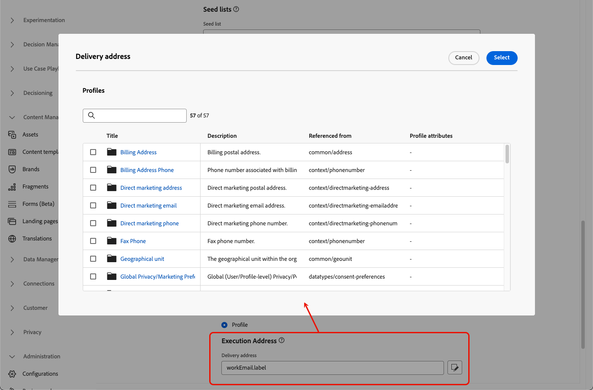

# 이메일 설정 구성 {#email-settings}

이메일 만들기를 시작하려면 메시지에 필요한 모든 기술 매개 변수를 정의하는 이메일 채널 구성을 설정해야 합니다. [구성을 만드는 방법 알아보기](../configuration/channel-surfaces.md)

>[!NOTE]
>
>전달률을 유지하고 전달성을 향상시키기 위해, 이메일 구성을 만들기에 앞서 이메일 전송에 사용할 하위 도메인을 설정합니다. [자세히 알아보기](../configuration/about-subdomain-delegation.md)

이메일 설정은 아래에서 자세히 설명하는 바와 같이 채널 구성의 전용 섹션에서 정의합니다.

{width="50%" align="left"}

이메일 구성이 적용되어 아래 논리에 따라 커뮤니케이션을 보내게 됩니다.

* 배치 여정의 경우 이메일 표면 구성이 만들어지기 전에 이미 시작된 배치 실행에는 적용되지 않습니다. 다음 반복 또는 새로운 실행 시 변경 사항이 적용됩니다.

* 트랜잭션 메시지의 경우 다음 커뮤니케이션에 변경 사항이 즉시 적용됩니다(최대 5분 지연).

>[!NOTE]
>
>업데이트된 이메일 구성 설정은 구성이 사용되는 여정 또는 캠페인에 자동으로 적용됩니다.

## 이메일 유형 {#email-type}

>[!CONTEXTUALHELP]
>id="ajo_admin_presets_emailtype"
>title="이메일 유형 정의"
>abstract="이 구성을 사용할 때 전송할 이메일 유형 선택: 사용자 동의가 필요한 프로모션 이메일을 위한 마케팅 또는 특정 컨텍스트에서 구독 해지 프로필로 전송할 수도 있는 비상업적 이메일을 위한 트랜잭션."

**이메일 유형** 섹션에서 구성에 사용할 메시지 유형을 **[!UICONTROL 마케팅]** 또는 **[!UICONTROL 트랜잭션]** 중에서 선택합니다.

* 소매점의 주간 프로모션 등 프로모션 이메일의 경우 **마케팅**&#x200B;을 선택합니다. 이 메시지에는 사용자의 동의가 필요합니다.

* 주문 확인, 암호 재설정 알림 또는 배송 정보 등 비상업적 이메일에 대해서는 **트랜잭션**&#x200B;을 선택합니다. 이 이메일은 마케팅 커뮤니케이션에서 **구독 취소**&#x200B;한 프로필에도 보낼 수 있습니다. 이 메시지는 특정 컨텍스트에서만 보낼 수 있습니다.

메시지를 만들 때는 이메일에 대해 선택한 카테고리에 맞는 유효한 채널 구성을 선택해야 합니다.

## 하위 도메인 {#subdomains}

이메일을 보내는 데 사용할 하위 도메인을 선택합니다.

>[!NOTE]
>
>이메일 설정에 대한 제어를 강화하기 위해 동적 하위 도메인을 정의할 수 있습니다. [자세히 알아보기](../email/surface-personalization.md#dynamic-subdomains)

도메인 기본값을 유지하고 IP 준비 프로세스의 속도를 높이며 전달성을 개선하기 위해 발신 하위 도메인을 Adobe에 위임할 수 있습니다. [자세히 알아보기](../configuration/about-subdomain-delegation.md)

## IP 풀 세부 정보 {#ip-pools}

구성과 연결할 IP 풀을 선택합니다. [자세히 알아보기](../configuration/ip-pools.md)

{width="50%" align="left"}

선택한 IP 풀이 [편집](../configuration/ip-pools.md#edit-ip-pool) 중이고(**[!UICONTROL 처리 중]** 상태) 선택한 하위 도메인과 연결된 적이 없는 경우 구성 만들기를 진행할 수 없습니다. 그렇지 않으면 가장 오래된 버전의 IP 풀/하위 도메인 연결이 계속 사용됩니다. 이 경우 구성을 초안으로 저장하고 IP 풀이 **[!UICONTROL 성공]** 상태가 되면 다시 시도하십시오.

>[!NOTE]
>
>비프로덕션 환경의 경우, Adobe는 기본 제공 테스트 하위 도메인을 만들거나 공유 전송 IP 풀에 대한 액세스 권한을 부여하지 않습니다. [자신의 하위 도메인을 위임](../configuration/delegate-subdomain.md)하고 조직에 할당된 풀의 IP를 사용해야 합니다.

IP 풀을 선택한 후 IP 풀 드롭다운 목록 아래에 표시된 IP 주소 위로 마우스를 가져가면 PTR 정보가 표시됩니다. [PTR 기록에 대해 자세히 알아보기](../configuration/ptr-records.md)

>[!NOTE]
>
>PTR 기록이 구성되지 않은 경우 Adobe 담당자에게 문의하십시오.

## 목록 구독 취소 {#list-unsubscribe}

목록에서 하위 도메인을 선택하면 **[!UICONTROL 목록 구독 취소 활성화]** 옵션이 표시됩니다. 이 옵션은 기본적으로 활성화되어 있습니다.

이 옵션을 사용하면 원클릭 구독 취소 URL을 이메일 헤더에 포함할 수 있습니다. [자세히 알아보기](list-unsubscribe.md)

## 헤더 매개변수 {#email-header}

**[!UICONTROL 헤더 매개변수]** 섹션에서 해당 구성을 사용하여 보내는 이메일 유형과 연결된 발신자 이름 및 이메일 주소를 입력합니다. [자세히 알아보기](header-parameters.md)

## BCC 이메일 {#bcc-email}

[!DNL Journey Optimizer]에서 보낸 이메일의 동일한 복사본(또는 숨은 참조)을 BCC 받은 편지함으로 보내어 규정 준수 또는 보관 목적으로 저장할 수 있습니다.

이렇게 하려면 채널 구성 수준에서 **[!UICONTROL BCC 이메일]** 선택 기능을 활성화합니다. [자세히 알아보기](../configuration/archiving-support.md#bcc-email)

또한 **[!UICONTROL Bcc 이메일]** 주소를 정의할 때 유효한 MX 레코드 구성이 있는 하위 도메인을 사용해야 합니다. 그렇지 않으면 이메일 구성 처리가 실패합니다.

이메일 구성 제출 시 오류가 발생하면 입력한 주소의 하위 도메인에 대해 MX 레코드가 구성되지 않은 것입니다. 관리자에게 문의하여 해당 MX 레코드를 구성하거나, 유효한 MX 레코드 구성이 있는 다른 주소를 사용하십시오.

## 표시되지 않는 이메일 주소로 보내기 {#send-to-suppressed-email-addresses}

>[!CONTEXTUALHELP]
>id="ajo_surface_suppressed_addresses"
>title="금지 목록 우선순위 무시"
>abstract="스팸 불만 사항으로 인해 이메일 주소가 Adobe Journey Optimizer 금지 목록에 포함된 경우에도 해당 프로필에 트랜잭션 메시지를 보내도록 결정할 수 있습니다. 이 옵션은 기본적으로 비활성화되어 있습니다."
>additional-url="https://experienceleague.adobe.com/docs/journey-optimizer/using/configuration/monitor-reputation/manage-suppression-list.html?lang=ko" text="금지 목록 관리"

>[!IMPORTANT]
>
>이 옵션은 **[!UICONTROL 트랜잭션]** 이메일 유형을 선택한 경우에만 사용할 수 있습니다. [자세히 알아보기](#email-type)

[!DNL Journey Optimizer]에서 하드 바운스, 소프트 바운스, 스팸 불만으로 표시된 모든 이메일 주소는 [제외 목록](../configuration/manage-suppression-list.md)에 자동으로 수집되어 여정 또는 캠페인의 전송 대상에서 제외됩니다.

그러나 사용자의 스팸 불만 때문에 이메일 주소가 금지 목록에 있는 경우에도 프로필에 **트랜잭션** 유형의 메시지는 계속 보내도록 설정할 수 있습니다.

실제로 트랜잭션 메시지에는 일반적으로 주문 확인 또는 암호 재설정 알림 등 유용하고 필요한 정보가 포함됩니다. 따라서 대부분은 고객이 마케팅 메시지 하나를 스팸으로 신고했더라도 이 유형의 비상업적 이메일은 받기를 원합니다.

스팸 불만으로 인해 금지된 이메일 주소를 트랜잭션 메시지 대상자에 포함하려면 **[!UICONTROL 표시되지 않은 이메일 주소로 보내기]** 섹션에서 해당 옵션을 선택합니다.

>[!NOTE]
>
>이 옵션은 기본적으로 비활성화되어 있습니다.

전달성 모범 사례로서, 이 옵션은 기본적으로 비활성화되어 있습니다. 옵트아웃한 고객에게 연락하지 않도록 보장하기 위해서입니다. 그러나 이 기본 옵션을 변경하여 고객에게 트랜잭션 메시지를 보낼 수 있습니다.

이 옵션이 활성화되면 고객이 마케팅 이메일을 스팸으로 표시한 경우에도 해당 고객이 현재 구성을 사용한 트랜잭션 메시지를 받을 수 있습니다. 항상 전달성 모범 사례에 따라 옵트아웃 환경 설정을 관리해야 합니다.

## 시드 목록 {#seed-list}

>[!CONTEXTUALHELP]
>id="ajo_surface_seed_list"
>title="시드 목록 추가"
>abstract="특정 내부 주소를 대상자에게 자동으로 추가하려면 원하는 시드 목록을 선택합니다. 이러한 시드 주소는 게재 실행 시간에 포함되며 확인 목적으로 메시지와 동일한 사본을 수신합니다."
>additional-url="https://experienceleague.adobe.com/docs/journey-optimizer/using/configuration/seed-lists.html#use-seed-list" text="시드 목록이란 무엇입니까?"

[!DNL Journey Optimizer]의 시드 목록을 사용하면 특정 이메일 시드 주소를 게재에 자동으로 포함할 수 있습니다. [자세히 알아보기](../configuration/seed-lists.md)

>[!CAUTION]
>
>현재 이 기능은 이메일 채널에만 적용됩니다.

**[!UICONTROL 시드 목록]** 섹션에서 사용자와 관련된 목록을 선택합니다. [이 섹션](../configuration/seed-lists.md#create-seed-list)에서는 시드 목록을 만드는 방법을 알아봅니다.

{width="80%"}

>[!NOTE]
>
>시드 목록은 한 번에 하나만 선택할 수 있습니다.

현재 구성을 캠페인이나 여정에서 사용하면 게재 실행 시 선택한 시드 목록의 이메일 주소가 포함됩니다. 즉, 보증 목적으로 게재 사본을 받게 됩니다.

[이 섹션](../configuration/seed-lists.md#use-seed-list)에서는 캠페인 또는 여정에서 시드 목록을 사용하는 방법을 알아봅니다.

## 이메일 재시도 매개변수 {#email-retry}

>[!CONTEXTUALHELP]
>id="ajo_admin_presets_retryperiod"
>title="재시도 기간 조정"
>abstract="일시적인 소프트 바운스 오류로 인해 이메일을 게재하지 못하면 3.5일(84시간)간 재시도를 수행합니다. 필요에 맞게 이 기본 재시도 기간을 조정할 수 있습니다."
>additional-url="https://experienceleague.adobe.com/docs/journey-optimizer/using/configuration/monitor-reputation/retries.html?lang=ko" text="재시도 정보"

**이메일 재시도 매개변수**&#x200B;를 구성할 수 있습니다.

기본적으로 [재시도 시간](../configuration/retries.md#retry-duration)은 84시간으로 설정되어 있지만 필요에 맞게 이 설정을 조정할 수 있습니다.

다음 범위 내의 정수 값(시간 또는 분)을 입력해야 합니다.

* 마케팅 이메일의 경우 최소 재시도 시간은 6시간입니다.
* 트랜잭션 이메일의 경우 최소 재시도 시간은 10분입니다.
* 두 이메일 유형 모두 최대 재시도 시간은 84시간(또는 5040분)입니다.

[이 섹션](../configuration/retries.md)에서는 재시도에 대해 자세히 알아봅니다.

## URL 추적 {#url-tracking}

**[!UICONTROL URL 추적 매개변수]**&#x200B;를 사용하여 채널 전반의 마케팅 활동의 효과를 측정할 수 있습니다. [자세히 알아보기](url-tracking.md)

## 실행 주소 {#execution-address}

>[!CONTEXTUALHELP]
>id="ajo_email_config_execution_address"
>title="사용할 기본 실행 주소 재정의"
>abstract="데이터베이스에서 여러 이메일 주소를 사용하는 경우(개인용, 업무용 등) 전송의 우선순위를 지정할 수 있는 항목을 선택할 수 있습니다. 기본 주소는 샌드박스 수준에서 정의되지만 여기서 이 특정 이메일 구성에 대한 기본 설정을 재정의할 수 있습니다."

프로필을 타기팅하면 데이터베이스에서 여러 이메일 주소(업무 이메일 주소, 개인 이메일 주소 등)를 사용 가능할 수도 있습니다.

이 경우 [!DNL Journey Optimizer]에서는 샌드박스 수준에서 **[!UICONTROL 실행 필드]**&#x200B;에 지정된 주소를 사용하여 프로필 서비스에서 우선 사용할 이메일 주소를 결정합니다. [자세히 알아보기](../configuration/primary-email-addresses.md)

>[!NOTE]
>
>현재 기본적으로 사용되는 필드를 확인하려면 **[!UICONTROL 관리]** > **[!UICONTROL 채널]** > **[!UICONTROL 일반 설정]** > **[!UICONTROL 실행 필드]** 메뉴에 액세스합니다.

하지만 이메일 채널 구성 수준에서 이 기본 실행 필드를 변경할 수 있습니다. 그런 다음에는 특정 캠페인이나 여정에 이 설정을 적용할 수 있습니다.

이렇게 하려면 **[!UICONTROL 게재 주소]** 필드를 편집하고 사용 가능한 이메일 유형 XDM 필드 목록에서 항목을 선택합니다.

실행 필드가 업데이트되고 기본 주소로 사용됩니다. 샌드박스 수준의 일반 설정보다 우선 적용됩니다.
