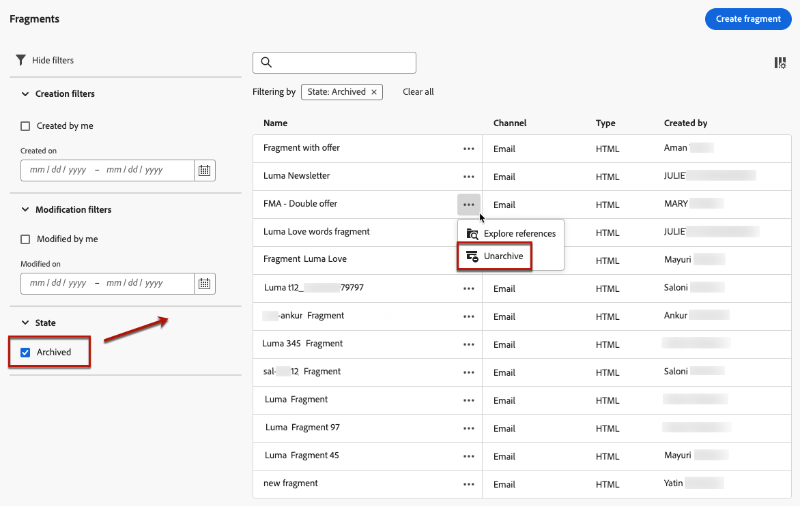

# 조각을 사용한 작업 {#fragments}

조각은 의 하나 이상의 이메일에서 참조할 수 있는 재사용 가능한 구성 요소입니다 [!DNL Journey Optimizer] 캠페인 및 여정.

이 기능을 사용하면 기술 전문가가 아닌 마케팅 사용자가 향상된 디자인 프로세스에서 이메일 콘텐츠를 빠르게 조합하는 데 사용할 수 있는 여러 사용자 지정 콘텐츠 블록을 미리 빌드할 수 있습니다.

<!--
➡️ [Learn how to create and use templates in this video](#video-templates)-->

>[!CAUTION]
>
>조각을 만들고 편집하고 보관하려면 **[!DNL Manage Library Items]** 에 포함된 권한 **[!DNL Content Library Manager]** 제품 프로필. [자세히 알아보기](../administration/ootb-product-profiles.md#content-library-manager)

조각을 최대한 활용하려면 다음을 수행하십시오.

* 나만의 조각을 만들어 보세요. 다음을 참조하십시오 [조각 만들기](#create-fragments)
* 이메일에서 필요한 만큼 많이 사용합니다. 다음을 참조하십시오 [조각 사용](#use-fragments)

>[!NOTE]
>
>현재 이 기능은 이메일에만 사용할 수 있습니다.

## 조각 액세스 및 관리 {#access-manage-fragments}

조각 목록에 액세스하려면 다음을 선택합니다. **[!UICONTROL 콘텐츠 관리]** > **[!UICONTROL 조각]** 왼쪽 메뉴에서

현재 샌드박스에서 생성된 모든 조각( **[!UICONTROL 조각]** 메뉴, 다음 중 하나를 사용하여 [조각으로 저장](#save-as-fragment) option - 이 표시됩니다.

생성 또는 수정 날짜에 조각을 필터링할 수 있습니다. 모든 조각을 표시하도록 선택하거나 현재 사용자가 만들거나 수정한 항목만 표시하도록 선택할 수 있습니다. 다음을 표시할 수도 있습니다 **[!UICONTROL 보관됨]** 조각. [자세히 알아보기](#archive-fragments)

다음에서 **[!UICONTROL 추가 작업]** 각 조각 옆에 있는 아이콘을 사용하여 다음을 수행할 수 있습니다.

* 조각을 복제합니다.

* 사용 **[!UICONTROL 참조 탐색]** 옵션을 사용하여 여정, 캠페인 또는 템플릿이 사용되는 위치를 확인합니다. [자세히 알아보기](#explore-references)

* 조각 보관 [자세히 알아보기](#archive-fragments)

### 조각 편집 {#edit-fragments}

조각을 편집하려면 아래 단계를 따르십시오.

1. 에서 원하는 항목을 클릭합니다. **[!UICONTROL 조각]** 목록을 표시합니다.
1. 조각 속성에서 다음을 수행할 수 있습니다. [참조 살펴보기](#explore-references), [액세스 관리](../administration/object-based-access.md) 조각 세부 사항을 업데이트합니다.

   

1. 조각을 처음부터 만들 때와 마찬가지로 해당 버튼을 선택하여 콘텐츠를 편집합니다. [자세히 알아보기](#create-from-scratch)

>[!NOTE]
>
>조각을 편집하면 해당 조각을 포함하는 모든 이메일 또는 템플릿에 변경 사항이 자동으로 전파됩니다. 단, 에서 사용되는 이메일은 예외입니다. **[!UICONTROL 라이브]** 여정 또는 캠페인. 원본 조각에서 상속을 중단할 수도 있습니다. [자세히 알아보기](#break-inheritance)

<!--Changes made to a fragment are not propagated to live journeys or campaigns where it is used.-->

<!--When added to an email, if you want to modify a fragment for a specific email, you can break the synchronization with the original fragment. The fragment becomes part of the email content and the changes will not be synchronized anymore. [Learn more](#break-inheritance)-->

### 참조 탐색 {#explore-references}

현재 조각을 사용 중인 여정, 캠페인 및 콘텐츠 템플릿 목록을 표시할 수 있습니다.

이렇게 하려면 을(를) 선택합니다 **[!UICONTROL 참조 탐색]** 다음 중 하나에서 **[!UICONTROL 추가 작업]** 조각 목록 또는 조각 속성 화면의 메뉴

여정, 캠페인 및 템플릿 간에 전환하려면 탭을 선택합니다. 해당 상태를 보고 조각을 참조하는 해당 항목으로 리디렉션할 이름을 클릭할 수 있습니다.

>[!NOTE]
>
>조각에 액세스할 수 없는 레이블이 있는 여정, 캠페인 또는 템플릿에서 조각을 사용하는 경우 선택한 탭 위에 경고 메시지가 표시됩니다. [OLAC(Object Level Access Control)에 대해 자세히 알아보기](../administration/object-based-access.md)

### 조각 보관 {#archive-fragments}

더 이상 브랜드와 관련이 없는 항목에서 조각 목록을 정리할 수 있습니다.

이렇게 하려면 **[!UICONTROL 추가 작업]** 아이콘 원하는 조각 옆에 있는 을 선택하고 **[!UICONTROL 보관]**. 조각 목록에서 사라지므로 사용자가 향후 이메일 또는 템플릿에서 사용할 수 없습니다.

>[!NOTE]
>
>이메일이나 콘텐츠 템플릿에 사용되는 조각을 보관하는 경우 <!--it will remain in the email or template, but you won't be able to select it from the fragment list to edit it-->이메일 또는 템플릿은 영향을 받지 않습니다.

조각을 보관 해제하려면 **[!UICONTROL 보관됨]** 항목 및 선택 **[!UICONTROL 보관 해제]** 다음에서 **[!UICONTROL 추가 작업]** 메뉴 아래의 제품에서 사용할 수 있습니다. 이제 조각 목록에서 다시 액세스할 수 있으며 모든 이메일 또는 템플릿에서 사용할 수 있습니다.

## 조각 만들기 {#create-fragments}

조각을 만드는 방법에는 두 가지가 있습니다.

* 조각을 사용하여 처음부터 새로 만들기 **[!UICONTROL 조각]** 전용 메뉴. [방법 알아보기](#create-template-from-scratch)

* 이메일 또는 콘텐츠 템플릿을 디자인할 때 콘텐츠의 일부를 조각으로 저장합니다. [방법 알아보기](#save-as-template)

저장되면 여정, 캠페인 또는 템플릿에서 조각을 사용할 수 있습니다. 처음부터 만들거나 기존 콘텐츠에서 만드는 경우에도 이제 다음 조각을 작성할 때 이 조각을 사용할 수 있습니다. [이메일](get-started-email-design.md) 또는 [콘텐츠 템플릿](content-templates.md) 다음 범위 내 [!DNL Journey Optimizer]. [자세히 알아보기](#use-fragments)

### 처음부터 만들기 {#create-from-scratch}

>[!CONTEXTUALHELP]
>id="ajo_create_fragment"
>title="나만의 조각 정의"
>abstract="독립 실행형 조각을 처음부터 만들어 여러 여정 및 캠페인에서 콘텐츠를 재사용할 수 있도록 합니다."

조각을 처음부터 만들려면 아래 단계를 수행합니다.

1. 다음을 통해 조각 목록에 액세스 **[!UICONTROL 콘텐츠 관리]** > **[!UICONTROL 조각]** 왼쪽 메뉴.

1. 선택 **[!UICONTROL 조각 만들기]**.

1. 조각 세부 사항, 즉 이름 및 설명(필요한 경우)을 입력합니다.

   

   >[!NOTE]
   >
   >현재는 **[!UICONTROL 시각적 조각]** 및 을 입력합니다. **이메일** 채널이 지원됩니다.

1. 조각에 사용자 지정 또는 핵심 데이터 사용 레이블을 할당하려면 다음을 선택합니다. **[!UICONTROL 액세스 관리]**. [OLAC(Object Level Access Control)에 대해 자세히 알아보기](../administration/object-based-access.md).

1. **[!UICONTROL 만들기]**&#x200B;를 클릭합니다.

1. 다음 [이메일 디자이너](get-started-email-design.md) 표시됩니다. 여정 또는 캠페인 내의 이메일에 대해 수행하는 것과 동일한 방식으로 필요에 따라 콘텐츠를 편집합니다.

   >[!NOTE]
   >
   >개인화 필드 및 다이내믹 콘텐츠를 추가할 수 있지만 컨텍스트 속성은 조각에서 지원되지 않습니다.

   

1. 조각이 준비되면 **[!UICONTROL 저장]**.

1. 필요한 경우 조각 이름 옆에 있는 화살표를 클릭하여 로 돌아갑니다. **[!UICONTROL 세부 사항]** 화면을 표시하고 편집합니다.

   

이제 이 조각을 작성할 때 사용할 준비가 되었습니다. [이메일](get-started-email-design.md) 또는 [콘텐츠 템플릿](content-templates.md) 다음 범위 내 [!DNL Journey Optimizer]. [방법 알아보기](#use-fragments)

### 조각으로 저장 {#save-as-fragment}

디자인 시 [콘텐츠 템플릿](content-templates.md) 또는 [이메일](get-started-email-design.md) 캠페인 또는 여정에서 나중에 재사용할 수 있도록 콘텐츠의 일부를 조각으로 저장할 수 있습니다. 이렇게 하려면 아래 단계를 수행합니다.

1. 다음에서 [이메일 디자이너](get-started-email-design.md)을 클릭하고 화면 오른쪽 위의 생략 부호를 클릭합니다.

1. 선택 **[!UICONTROL 조각으로 저장]** 드롭다운 메뉴에서 을(를) 선택합니다.

   

1. 다음 **[!UICONTROL 조각으로 저장]** 화면이 표시됩니다. 여기에서 개인화 필드 및 다이내믹 콘텐츠를 포함하여 조각에 포함할 요소를 선택합니다. 컨텍스트 속성은 조각에서 지원되지 않습니다.

   >[!CAUTION]
   >
   >서로 인접한 섹션만 선택할 수 있습니다. 빈 구조나 다른 조각은 선택할 수 없습니다.

   

1. **[!UICONTROL 만들기]**&#x200B;를 클릭합니다. 조각 세부 사항, 즉 이름 및 설명(필요한 경우)을 입력합니다.

   

   >[!NOTE]
   >
   >현재는 **[!UICONTROL 시각적 조각]** 및 을 입력합니다. **이메일** 채널이 지원됩니다.

1. 조각에 사용자 지정 또는 핵심 데이터 사용 레이블을 할당하려면 다음을 선택합니다. **[!UICONTROL 액세스 관리]**. [OLAC(Object Level Access Control)에 대해 자세히 알아보기](../administration/object-based-access.md).

1. 클릭 **[!UICONTROL 만들기]** 다시. 조각이 **[!UICONTROL 조각]** 목록, 액세스 가능 [!DNL Journey Optimizer] 전용 메뉴.

   다음과 같을 수 있는 독립형 조각이 됩니다. [액세스됨](#access-manage-fragments), [편집됨](#edit-fragments) 및 [보관됨](#archive-fragments) 을(를) 해당 목록의 다른 항목으로 사용하십시오.

이제 작성할 때 이 조각을 사용할 수 있습니다. [이메일](get-started-email-design.md) 또는 [콘텐츠 템플릿](content-templates.md) 다음 범위 내 [!DNL Journey Optimizer]. [방법 알아보기](#use-fragments)

>[!NOTE]
>
>해당 새 조각에 대한 모든 변경 사항은 원래 이메일이나 템플릿에 전파되지 않습니다. 마찬가지로 원래 콘텐츠가 해당 이메일 또는 템플릿 내에서 편집되는 경우 새 조각은 수정되지 않습니다.

## 조각 사용 {#use-fragments}

다음에서 조각을 사용할 수 있습니다. [이메일](get-started-email-design.md) 여정, 캠페인 내 또는 [콘텐츠 템플릿](content-templates.md).

1. 을(를) 사용하여 이메일 또는 템플릿 콘텐츠를 엽니다. [이메일 디자이너](get-started-email-design.md).

1. 다음 항목 선택 **[!UICONTROL 조각]** 왼쪽 레일의 아이콘

   

1. 현재 샌드박스에서 만든 모든 조각 목록이 표시됩니다. 다음을 수행할 수 있습니다.

   * 레이블 입력을 시작하여 특정 조각을 검색합니다.
   * 오름차순 또는 내림차순으로 조각을 정렬합니다.
   * 조각이 표시되는 방법(카드 또는 목록 보기)을 변경합니다.

1. 목록을 새로 고칠 수도 있습니다.

   >[!NOTE]
   >
   >콘텐츠를 편집하는 동안 일부 조각이 수정되거나 추가된 경우 목록이 최신 변경 내용으로 업데이트됩니다.

1. 목록의 조각을 삽입할 영역으로 끌어다 놓습니다.

   

1. 다른 구성 요소와 마찬가지로 콘텐츠에서 조각을 이동할 수 있습니다.

1. 조각을 선택하여 오른쪽에 해당 창을 표시합니다. 여기에서 콘텐츠에서 조각을 삭제하거나 복제할 수 있습니다. 조각 위에 표시되는 상황별 메뉴에서 직접 이러한 작업을 수행할 수도 있습니다.

   

1. 다음에서 **[!UICONTROL 설정]** 탭에서 다음 작업을 수행할 수 있습니다.

   * 조각을 표시할 장치를 선택합니다.
   * 필요한 경우 새 탭에서 조각을 열어 편집합니다. [자세히 알아보기](#edit-fragments)
   * 참조 살펴보기. [자세히 알아보기](#explore-references)

1. 다음을 사용하여 조각을 추가로 사용자 정의할 수 있습니다. **[!UICONTROL 스타일]** 탭.

1. 필요한 경우 원본 조각으로 상속을 중단할 수 있습니다. [자세히 알아보기](#break-inheritance)

1. 원하는 만큼 조각을 추가하고 **[!UICONTROL 저장]** 변경 사항.

### 상속 중단 {#break-inheritance}

조각을 편집하면 변경 사항이 동기화됩니다. 모든 사용자에게 자동으로 전파됩니다 **[!UICONTROL 초안]** 여정/캠페인 및 해당 조각을 포함하는 콘텐츠 템플릿.

>[!NOTE]
>
>변경 사항은에서 사용하는 이메일에 전파되지 않습니다. **[!UICONTROL 라이브]** 여정 또는 캠페인.

이메일 또는 콘텐츠 템플릿에 추가되면 조각은 기본적으로 동기화됩니다.

그러나 원본 조각에서 상속을 중단할 수 있습니다. 이 경우 조각의 콘텐츠가 현재 디자인에 복사되며, 변경 사항은 더 이상 동기화되지 않습니다.

상속을 중단하려면 아래 단계를 수행합니다.

1. 조각을 선택합니다.

1. 상황별 툴바에서 잠금 해제 아이콘을 클릭합니다.

   

1. 해당 조각은 원래 조각에 더 이상 연결되지 않는 독립 실행형 요소가 됩니다. 콘텐츠의 다른 콘텐츠 구성 요소로 편집합니다. [자세히 알아보기](content-components.md)

<!--

## How-to video {#video-templates}

Learn how to create, edit, and use fragments in [!DNL Journey Optimizer].

>[!VIDEO](https://video.tv.adobe.com/v/3413743/?quality=12)

-->
