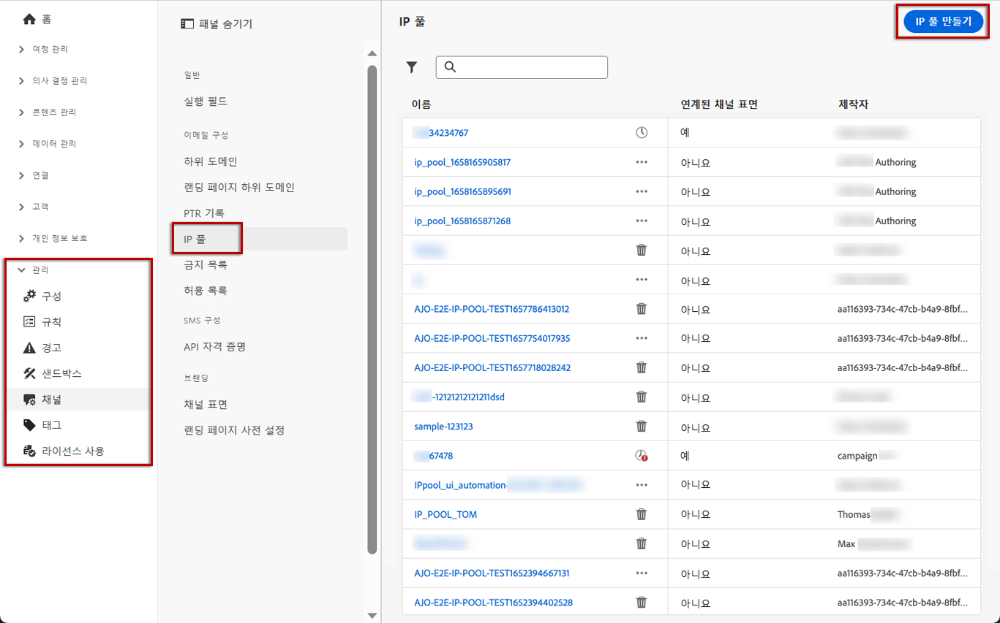
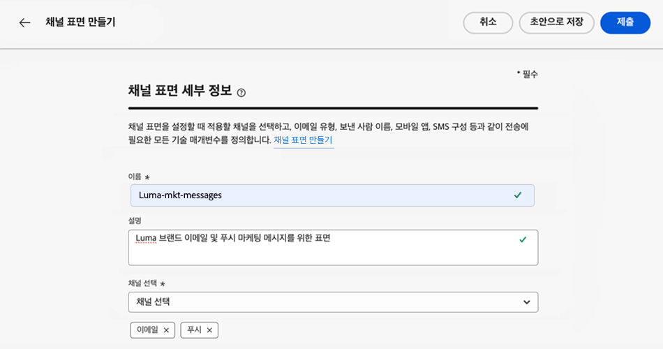
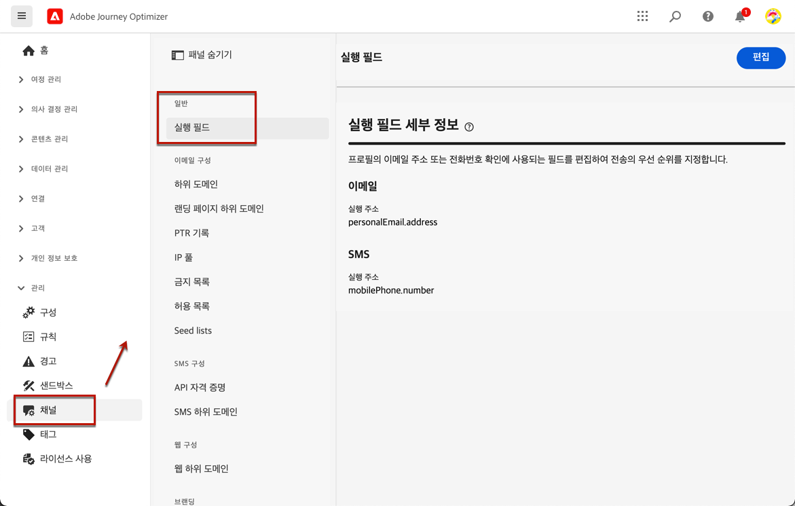

# 이메일 구성 시작 {#get-starte-email-config}

[!DNL Journey Optimizer]에서 여정 및 캠페인을 통해 이메일을 보내려면 몇 가지 구성 단계를 완료해야 합니다.

1. 최적의 전달성을 확보하고 평판을 지키기 위해 먼저 [!DNL Journey Optimizer]로 이메일을 보낼 때 사용할 하위 도메인을 Adobe에 위임합니다. 하위 도메인은 추적할 웹 페이지와 미러 페이지 URL 등 요소를 결정합니다. [자세히 알아보기](../configuration/about-subdomain-delegation.md)

   

1. 인스턴스에서 프로비저닝하는 IP 주소를 그룹화하여 이메일의 전달성과 평판을 개선합니다. [자세히 알아보기](../configuration/ip-pools.md)

   

1. 채널 표면을 만들고 **[!UICONTROL 이메일]** 채널을 선택합니다. [자세히 알아보기](../configuration/channel-surfaces.md)

   

1. 각 이메일 채널 표면에서 이메일을 게재하는 데 필요한 기술 매개 변수를 모두 구성합니다. [자세히 알아보기](email-settings.md)

   * 이때 이메일을 보내는 데 사용할 하위 도메인과, 표면에 연결할 IP 풀을 선택합니다. [자세히 알아보기](email-settings.md#subdomains-and-ip-pools)

   

   * **[!UICONTROL 보내는 사람 이메일]**&#x200B;과 **[!UICONTROL 오류 이메일]** 주소는 현재 선택한 위임된 하위 도메인을 사용해야 합니다. [자세히 알아보기](email-settings.md#email-header)

   

1. Adobe Experience Platform에서 수신자의 주소를 여러 개 사용할 수 있는 경우 어느 이메일 주소를 우선으로 사용할지 정합니다. [자세히 알아보기](../configuration/primary-email-addresses.md)

   

1. 금지 목록에 이메일 주소를 보내기 전에 재시도를 하는 기간(일)을 관리합니다. [자세히 알아보기](../configuration/manage-suppression-list.md)

   
