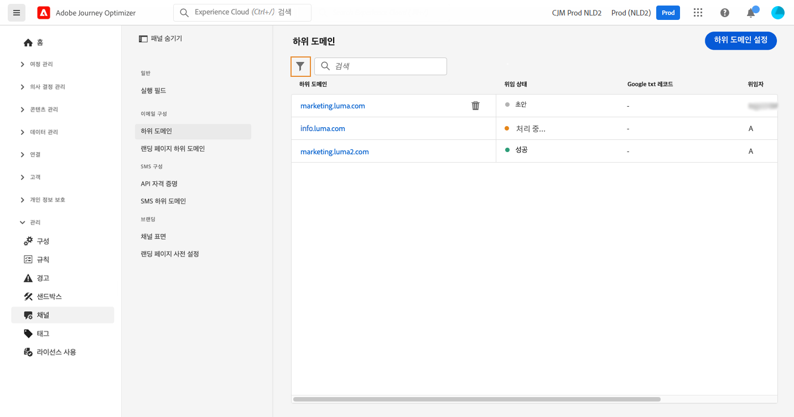
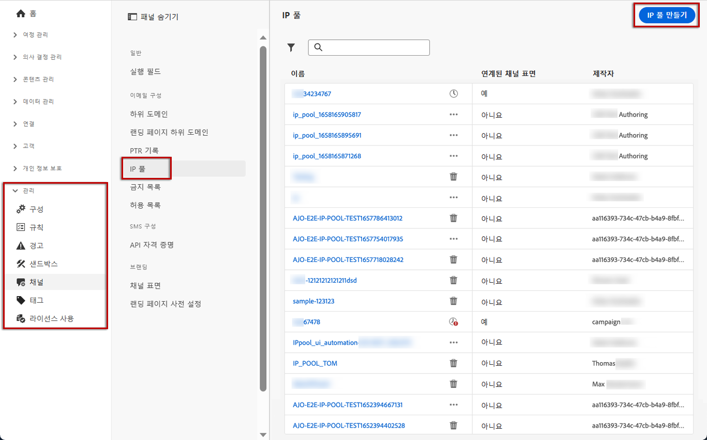
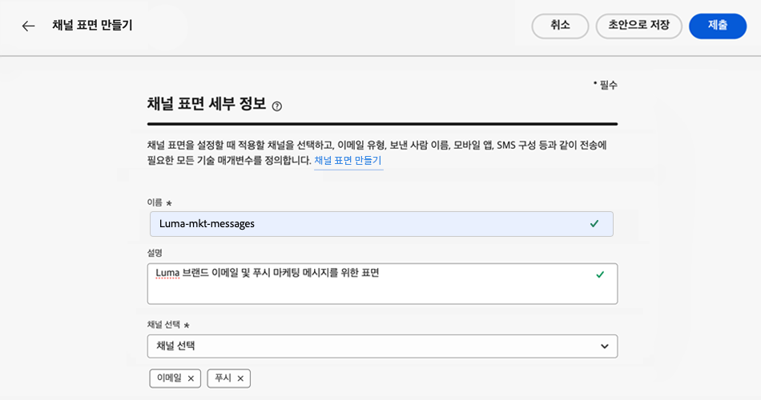
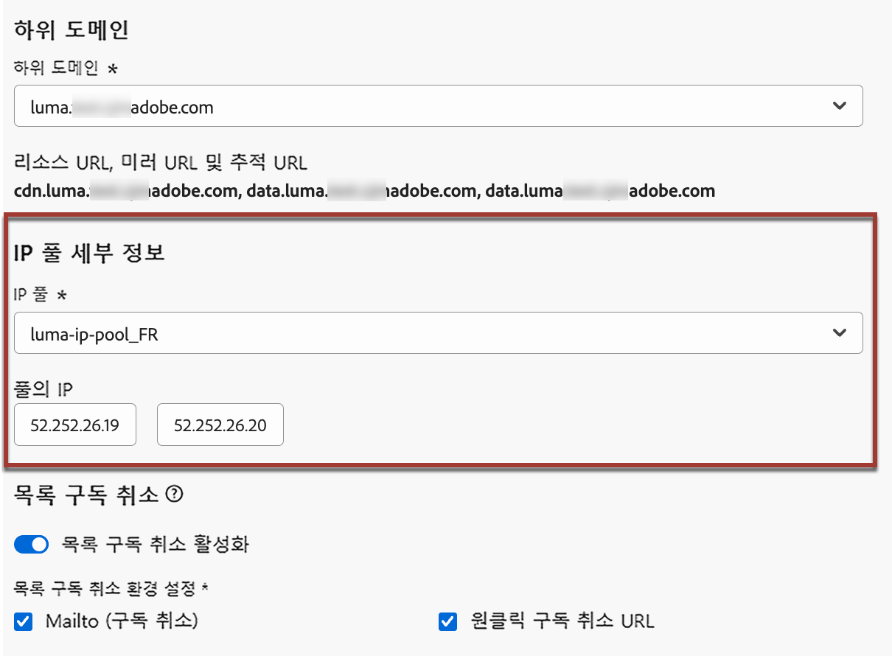
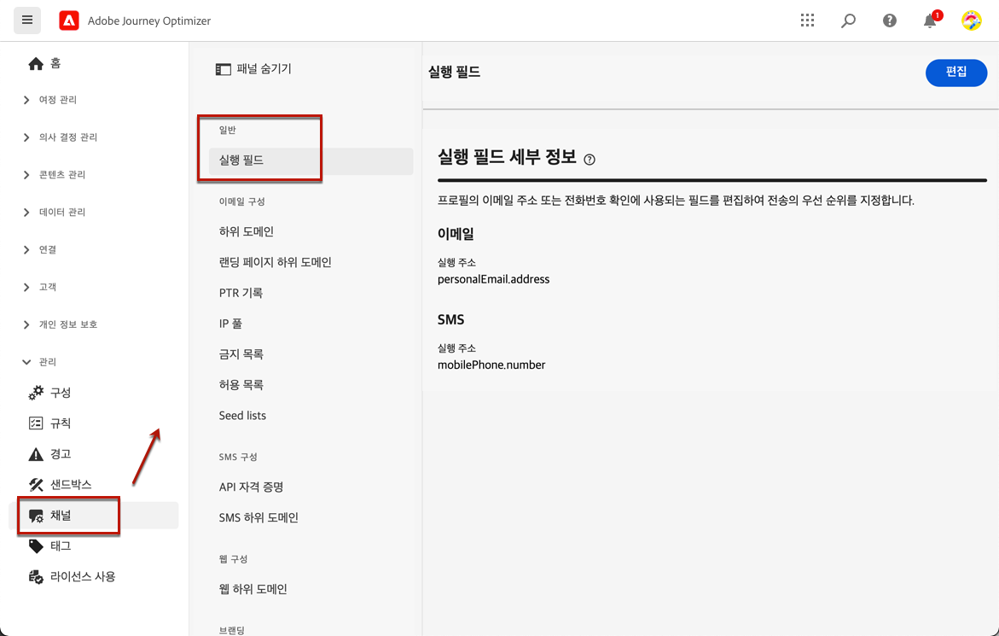
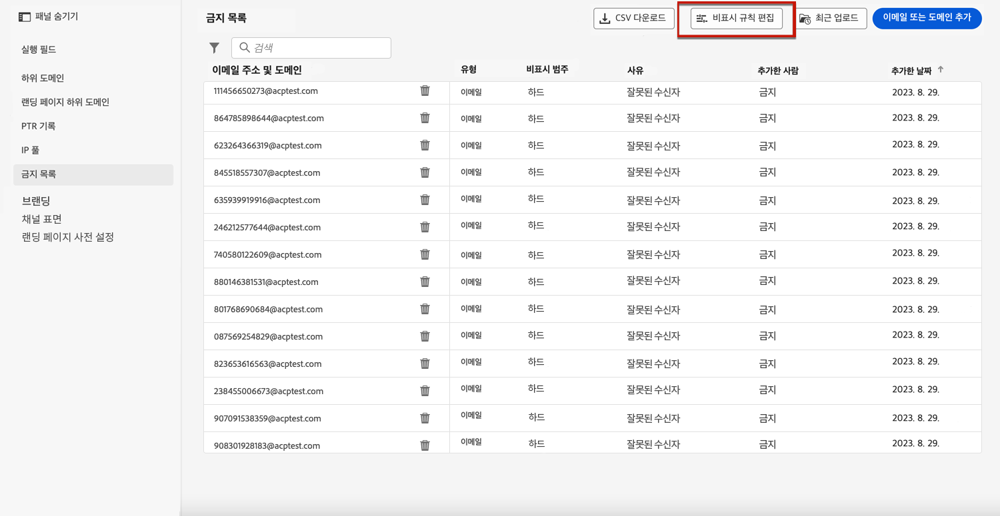

# 이메일 구성 시작 {#get-starte-email-config}

Adobe Journey Optimizer에서 이메일 채널을 구성하는 것은 대상자를 효과적으로 참여시키는 영향력 있고 개인화된 이메일 경험을 만드는 출발점입니다.

이 섹션에서는 [!DNL Journey Optimizer]을(를) 통해 전자 메일을 보내기 위해 따라야 하는 필수 구성 단계를 안내합니다. 또한 이메일 헤더를 설정하고, 여러 브랜드에 대한 설정을 개인화하고, 분석에 대한 URL 추적을 활성화하고, 사용자 편의를 위해 한 번의 클릭으로 구독 취소 링크를 추가하는 방법도 알아봅니다. 각 주제는 마지막 주제를 기반으로 하며 제어와 정밀도를 유지하면서 이메일 전략을 세밀하게 조정할 수 있는 도구를 제공합니다.

[!DNL Journey Optimizer]에서 여정 및 캠페인을 통해 이메일을 보내려면 몇 가지 구성 단계를 완료해야 합니다. 이러한 단계는 아래에 나와 있습니다.

1. 최적의 전달성을 확보하고 평판을 지키기 위해 먼저 [!DNL Journey Optimizer]로 이메일을 보낼 때 사용할 **하위 도메인을 Adobe에 위임**&#x200B;합니다. 하위 도메인은 추적할 웹 페이지와 미러 페이지 URL 등 요소를 결정합니다. [자세히 알아보기](../configuration/about-subdomain-delegation.md)

   

1. 인스턴스와 함께 제공된 **IP 주소를 모아 그룹화**&#x200B;할 IP 풀을 만듭니다. [자세히 알아보기](../configuration/ip-pools.md)

   

1. **채널 구성**&#x200B;을 만들고 **[!UICONTROL 이메일]** 채널을 선택합니다. [자세히 알아보기](../configuration/channel-surfaces.md)

   

1. 각 이메일 채널 구성에서 이메일을 게재하는 데 필요한 **기술 매개 변수**&#x200B;를 모두 구성합니다. [자세히 알아보기](email-settings.md)

   * 이때 이메일을 보내는 데 사용할 하위 도메인과, 구성에 연결할 IP 풀을 선택합니다. [자세히 알아보기](email-settings.md#ip-pools)

   

   * **[!UICONTROL 보낸 사람 전자 메일 접두사]** 및 **[!UICONTROL 오류 전자 메일 접두사]**&#x200B;은(는) 현재 선택한 [위임된 하위 도메인](../configuration/about-subdomain-delegation.md)을(를) 사용합니다. 선택적으로 **[!UICONTROL 보낸 사람 이름]** 및 **[!UICONTROL 보낸 사람 전자 메일]**&#x200B;은(는) 다른 보낸 사람(하위 도메인 접미사에 연결되지 않은 전체 **보낸 사람** 주소)을 식별할 수 있습니다. [자세히 알아보기](header-parameters.md#sender-header)

   

1. BCC 활성화, Analytics에 대한 URL 추적 정의 또는 사용자 편의를 위한 원클릭 구독 취소 링크 추가와 같은 기타 고급 매개 변수를 설정하여 이메일 채널 구성을 완료합니다. [자세히 알아보기](email-settings.md)

1. Adobe Experience Platform에서 수신자의 주소를 여러 개 사용할 수 있는 경우 어느 **실행 필드**&#x200B;를 우선으로 사용할지 정합니다. [자세히 알아보기](../configuration/primary-email-addresses.md)

   

1. 금지 목록에 이메일 주소를 보내기 전에 **재시도**&#x200B;를 하는 기간(일)을 관리합니다. [자세히 알아보기](../configuration/manage-suppression-list.md)

   

:::: landing-cards-container
:::

이메일 구성 시작

하위 도메인 위임, IP 풀, 금지 목록 관리 등 이메일 기능을 구성하는 필수 단계에 대해 알아봅니다.

[이메일 구성 시작](get-started-email-config.md)
:::

:::

이메일 구성 설정 정의

BCC, 제외 무시, URL 추적과 같은 고급 기능을 사용하여 전달성, 규정 준수, 사용자 지정에 대한 이메일 구성을 설정합니다.

[설정 구성](email-settings.md)
:::

:::

목록 구독 취소 활성화 및 구성

&#39;목록 구독 취소&#39; 기능을 활성화하여 수신자 옵트아웃에 대한 이메일 헤더에 클릭 한 번으로 구독 취소 URL을 포함하는 방법을 알아봅니다.

[목록 구독 취소 설정](list-unsubscribe.md)
:::

:::

이메일 헤더 매개변수 구성

효율적인 커뮤니케이션을 위해 발신자 및 회신 이메일 주소를 사용자 정의하고, 오류를 처리하며, 이메일을 전달합니다.

[헤더 매개변수 설정](header-parameters.md)
:::

:::

이메일 채널에 대한 URL 추적 구성

URL 추적 매개변수를 설정하여 이메일 캠페인의 효과를 측정하고 분석 도구와 통합합니다.

[URL 추적 설정](url-tracking.md)
:::

:::

개인화된 이메일 구성 설정

다이내믹 하위 도메인, 개인화된 헤더, URL 추적을 설정하여 맞춤형 이메일 경험을 제공합니다.

[개인화된 이메일 구성](surface-personalization.md)
:::

::::
