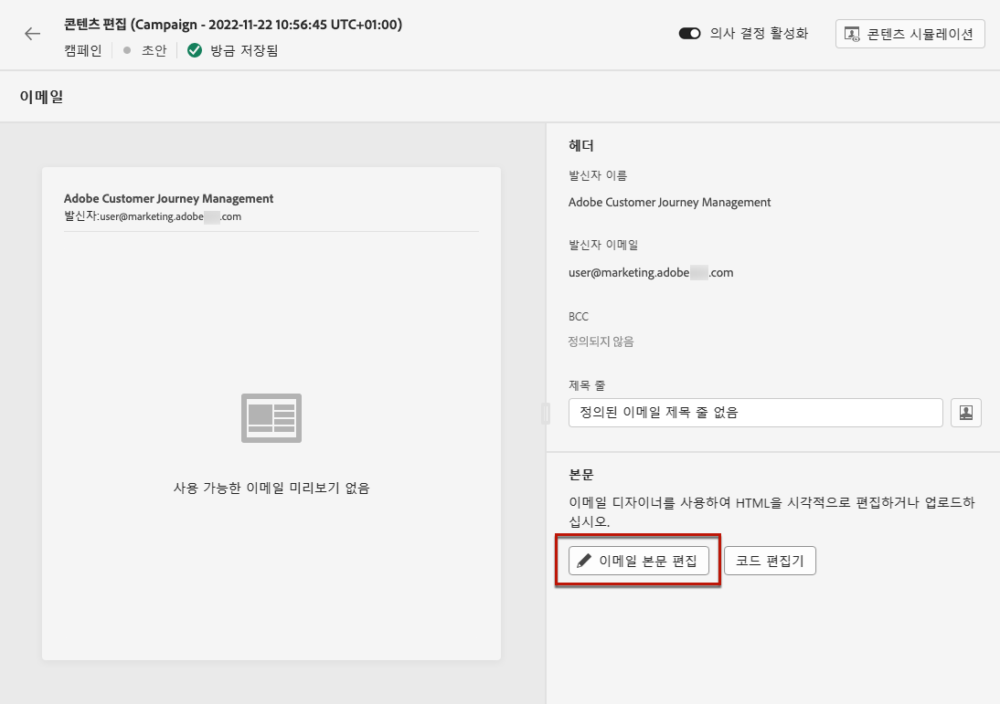
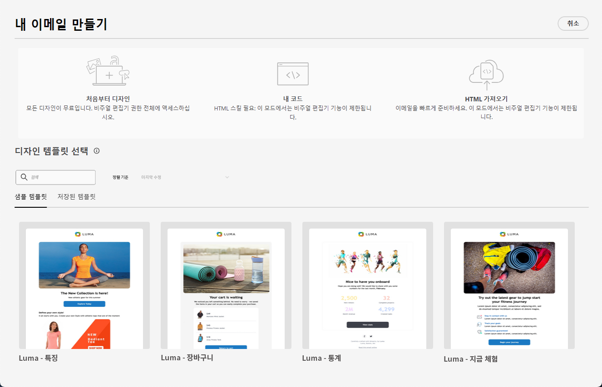
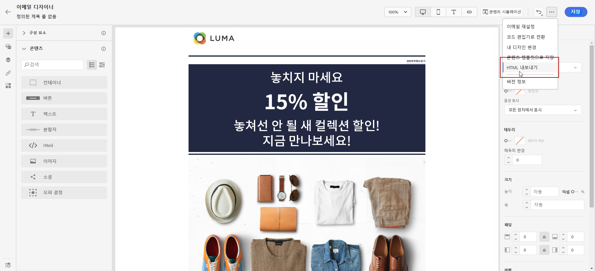

# 이메일 디자인 시작 {#get-started-content-design}

다음과 같이 [!DNL Journey Optimizer]의 기존 콘텐츠를 가져오거나 콘텐츠 디자인 기능을 활용할 수 있습니다.

* [!DNL Journey Optimizer] **이메일 디자인 기능**&#x200B;으로 반응형 이메일을 디자인하거나 가져옵니다. [자세히 알아보기](content-from-scratch.md)

* **Adobe Experience Manager Assets Essentials**&#x200B;를 활용하여 이메일을 보강하고 에셋 데이터베이스를 빌드하고 관리합니다. [자세히 알아보기](../integrations/assets.md)

* **Adobe Stock 사진**&#x200B;을 찾아 콘텐츠를 빌드하고 이메일 디자인을 개선합니다. [자세히 알아보기](../integrations/stock.md)

* 프로필 속성에 따라 개인화한 동적 메시지를 만들어 고객의 경험을 향상시킬 수 있습니다. [개인화](../personalization/personalize.md) 및 [다이내믹 콘텐츠](../personalization/get-started-dynamic-content.md)에 대해 자세히 알아보십시오.

➡️ [비디오에서 이 기능 살펴보기](#video)

## 이메일 디자인 모범 사례 {#best-practices}

이메일 전송 시 수신자가 이메일을 전달할 수 있다는 것을 고려해야 합니다. 이로 인해 이메일 렌더링에 문제가 발생하는 경우도 있습니다. “is-desktop-hidden” CSS 클래스를 사용하여 모바일 디바이스에 이미지를 숨기는 경우와 같이, 이는 특히 이메일 공급자가 지원할 수 없는 전달용 CSS 클래스를 사용하는 경우에 해당됩니다.

이런 렌더링 문제를 최소화하기 위해 이메일 디자인 구조를 가능한 한 간단하게 유지하는 것이 좋습니다. 데스크톱과 모바일 디바이스 모두에 적합한 단일 디자인을 사용하고, 복잡한 CSS 클래스나 기타 모든 이메일 클라이언트가 완전히 지원하지 않을 가능성이 있는 디자인 요소는 사용하지 않는 것이 좋습니다. 이 모범 사례를 적용하면 수신자가 이메일을 보거나 전달하는 방식에 관계없이 이메일이 일관되게 렌더링되도록 할 수 있습니다.

이메일 디자인에 대한 모범 사례는 아래 테이블을 참조하십시오.

| 권장 | 주의하여 사용 | 권장하지 않음 |
|-|-|-|
| <ul><li>구조화를 위한 <b>정적, 테이블 기반 레이아웃</b></li> <li>레이아웃 일관성을 위한 <b>HTML 테이블 및 중첩 테이블</b></li> <li>600px~800픽셀 사이의 <b>템플릿 너비</b> </li> <li>스타일 지정을 위한 <b>간단한 인라인 CSS</b> </li> <li>범용 호환성을 위한 <b>웹 지원 글꼴</b></li> | <ul><li><b>배경 이미지</b>의 경우 특정 이메일 플랫폼에서는 표시되지 않을 수 있습니다.</li><li><b>사용자 정의 웹 글꼴</b>은 범용으로 지원되지 않습니다.</li><li><b>넓은 레이아웃</b>의 경우 작은 화면에서는 제대로 표시되지 않을 수 있습니다.</li><li><b>이미지 맵</b>은 제한된 기능만 제공합니다.</li><li><b>포함된 CSS</b>는 이메일 게재 중에 제거되는 경우가 있습니다.</li> | <ul><li><b>JavaScript</b>는 일반적으로 이메일 환경에서 지원되지 않습니다.</li> <li> <b>`<iframe>`</b> 태그는 대부분의 플랫폼에서 차단되어 있습니다. </li> <li><b>Flash</b>는 오래되어 더 이상 지원되지 않습니다.</li> <li><b>포함된 오디오</b>는 재생되지 않는 경우가 많습니다.</li> <li><b>포함된 비디오</b>는 많은 이메일 플랫폼과 호환되지 않습니다.</li> <li> <b>Forms</b>는 이메일 내에서 작동하지 않습니다.</li> <li> `
` 계층화로 인해 렌더링 문제가 발생할 수 있습니다.</li> |

## 이메일 콘텐츠를 만드는 주요 단계 {#key-steps}

여정이나 캠페인에 [이메일을 추가](create-email.md)한 다음에는 이메일 콘텐츠를 만들기 시작할 수 있습니다.

1. 여정 또는 캠페인 구성 화면에서 **[!UICONTROL 콘텐츠 편집]** 화면으로 이동하여 [이메일 디자이너]에 액세스합니다. [자세히 알아보기](create-email.md#define-email-content)

   

1. [이메일 디자이너] 홈페이지에서 다음 옵션 중 이메일을 디자인할 방법을 선택합니다.

   * 이메일 디자이너의 인터페이스를 통해 **이메일을 처음부터 디자인**&#x200B;하고 [Adobe Experience Manager Assets](../integrations/assets.md)의 이미지를 활용합니다. 이메일 콘텐츠를 디자인하는 방법은 [이 섹션](content-from-scratch.md)을 참조하십시오 .

   * 이메일 디자이너에서 바로 **원시 HTML을 코딩하거나 붙여 넣습니다**. 콘텐츠를 직접 코딩하는 방법은 [이 섹션](code-content.md)을 참조하십시오.

     >[!NOTE]
     >
     >캠페인의 **[!UICONTROL 콘텐츠 편집]** 화면에서 **[!UICONTROL 코드 편집기]** 버튼을 선택할 수도 있습니다. [자세히 알아보기](create-email.md#define-email-content)

   * 파일이나 .zip 폴더의 **기존 HTML 콘텐츠를 가져옵니다**. 이메일 콘텐츠를 가져오는 방법은 [이 섹션](existing-content.md)을 참조하십시오.

   * 기본 제공 또는 사용자 정의 템플릿 목록에서 **기존 콘텐츠를 선택합니다**. 이메일 템플릿으로 작업하는 방법은 [이 섹션](../email/use-email-templates.md)을 참조하십시오.

   

1. 이메일 콘텐츠를 정의하고 개인화한 다음에는 콘텐츠를 내보내 유효성 검사를 하거나 나중에 사용할 수 있습니다. HTML과 자산이 들어 있는 zip 파일을 컴퓨터에 저장하려면 **[!UICONTROL HTML 내보내기]**&#x200B;를 클릭합니다.

   

## 방법 비디오 {#video}

메시지 편집기로 이메일 콘텐츠를 만드는 방법을 알아봅니다.

>[!VIDEO](https://video.tv.adobe.com/v/334150?quality=12)

A/B 테스트를 위한 콘텐츠 실험을 구성하여 비즈니스 목표 달성에 가장 도움이 되는 이메일 콘텐츠를 탐색하는 방법에 대해 알아봅니다.

>[!VIDEO](https://video.tv.adobe.com/v/3419893)
