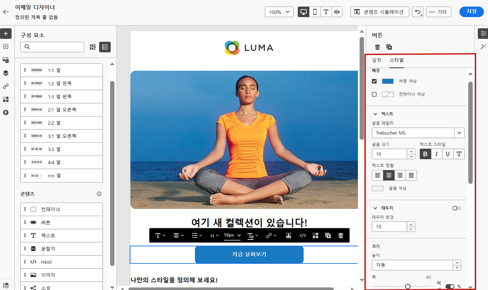

# 이메일 스타일 시작 {#get-started-email-style}

[!DNL Journey Optimizer]에서 이메일 콘텐츠를 만들 때는 [이메일 디자이너]의 **[!UICONTROL 스타일]** 창에서 여러 스타일 매개 변수와 속성을 조정할 수 있습니다.

이메일 본문이나 구조 구성 요소 또는 콘텐츠 구성 요소를 변경할 수 있습니다.

아래 링크에서 이메일의 스타일 설정 몇 가지를 조정하는 방법을 확인할 수 있습니다.

* [이메일 배경 개인화](backgrounds.md) 방법 알아보기
* [세로 정렬 및 여백 관리](alignment-and-padding.md) 방법 알아보기
* [인라인 스타일 속성 사용자 정의](inline-styling.md) 방법 알아보기
* [사용자 지정 CSS를 이메일 콘텐츠에 추가](custom-css.md)하는 방법을 알아보세요.
* [다크 모드 콘텐츠를 관리하는 방법](dark-mode.md) 알아보기

>[!NOTE]
>
>[유럽 접근성 법률](https://eur-lex.europa.eu/legal-content/EN/TXT/?uri=CELEX%3A32019L0882){target="_blank"}에는 모든 디지털 통신에 액세스할 수 있어야 한다고 명시되어 있습니다. [에서 콘텐츠를 디자인할 때는 명확성을 위해 색상, 레이블 및 아이콘을 조정하고, 모바일 및 응답형 레이아웃으로 디자인을 최적화하는 등 ](../email/accessible-content.md)이 페이지[!DNL Journey Optimizer]에 나열된 특정 스타일 지침을 따라야 합니다.