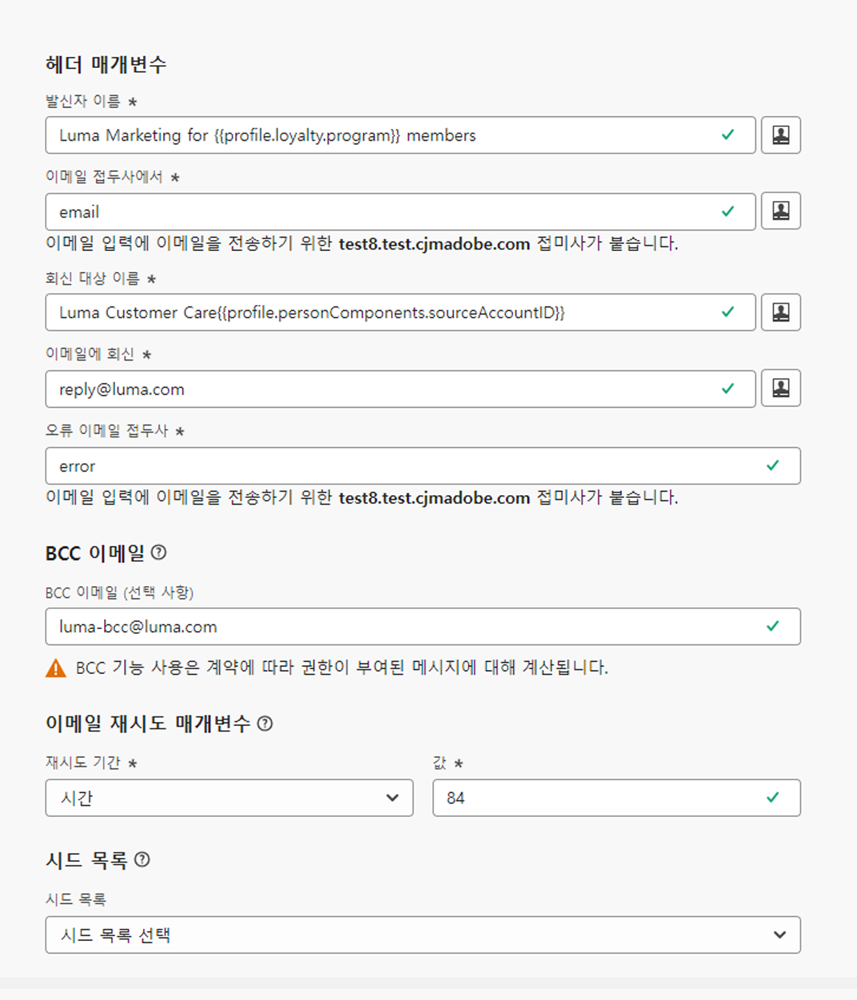

# 헤더 매개변수 {#email-header}

새 [전자 메일 채널 구성](email-settings.md)을 구성할 때 **[!UICONTROL 헤더 매개 변수]** 섹션에서 해당 구성을 사용하여 보낸 전자 메일 형식과 연결된 보낸 사람 이름 및 전자 메일 주소를 입력하십시오.

>[!NOTE]
>
>이메일 설정에 대한 제어를 강화하려면 헤더 매개변수를 개인화할 수 있습니다. [자세히 알아보기](../email/surface-personalization.md#personalize-header)
>
>[전자 메일 구성을 편집](../configuration/channel-surfaces.md#edit-channel-surface)할 때 헤더 매개 변수에 새 [프로필 특성](../personalization/personalization-build-expressions.md#sources)을 추가할 수 없습니다. 새 채널 구성을 만들어야 합니다.

* **[!UICONTROL 발신자 이름]**: 보내는 사람의 이름입니다. 브랜드 이름 등을 사용할 수 있습니다.

* **[!UICONTROL 발신자 이메일 접두사]**: 커뮤니케이션에 사용할 이메일 주소입니다.

* **[!UICONTROL 회신 대상 이름]**: 수신자가 이메일 클라이언트 소프트웨어에서 **회신** 버튼을 클릭했을 때 사용할 이름입니다.

* **[!UICONTROL 회신 대상 이메일]**: 수신자가 이메일 클라이언트 소프트웨어에서 **회신** 버튼을 클릭했을 때 사용할 이메일 주소입니다. [자세히 알아보기](#reply-to-email)

* **[!UICONTROL 오류 이메일 접두사]**: 메일 전달 후 며칠 간 ISP에서 생성한 오류(비동기 바운스)는 모두 이 주소로 수신됩니다. 부재 중 알림 및 문제 응답도 이 주소로 수신됩니다.

  Adobe에 위임되지 않은 특정 이메일 주소에 대한 부재 중 알림 및 문제 응답을 받으려면 [전달 프로세스](#forward-email)를 설정해야 합니다. 이 경우 해당 받은 편지함에 도착하는 이메일을 처리할 수동 또는 자동화된 솔루션이 있는지 확인합니다.

>[!NOTE]
>
>**[!UICONTROL 발신자 이메일 접두사]** 및 **[!UICONTROL 오류 이메일 접두사]** 주소는 현재 선택한 [위임된 하위 도메인](../configuration/about-subdomain-delegation.md)을 사용하여 이메일을 보냅니다. 예를 들어 위임된 하위 도메인이 *marketing.luma.com*&#x200B;인 경우를 가정해 보겠습니다.
>
>* *contact*&#x200B;를 **[!UICONTROL 발신자 이메일 접두사]**&#x200B;로 입력하면 발신자 이메일은 *contact@marketing.luma.com*&#x200B;입니다.
>* *error*&#x200B;를 **[!UICONTROL 오류 이메일 접두사]**&#x200B;로 입력하면 오류 주소는 *error@marketing.luma.com*&#x200B;입니다.

{width="80%"}

>[!NOTE]
>
>**[!UICONTROL 전자 메일 접두사]** 및 **[!UICONTROL 오류 전자 메일 접두사]**&#x200B;의 경우 값은 문자(A-Z)로 시작해야 하며 영숫자만 포함할 수 있습니다. 밑줄 `_`, 점 `.` 및 하이픈 `-`자를 사용할 수도 있습니다.

## 보낸 사람 헤더 {#sender-header}

>[!CONTEXTUALHELP]
>id="ajo_admin_preset_sender_header"
>title="보낸 사람 헤더"
>abstract="전송 엔티티(발신자)가 작성 엔티티(보낸 사람)와 다른 경우(예: 하위 브랜드에 대한 메시지를 발송하는 기업 상위 또는 여러 고객을 위한 메시지를 보내는 에이전시) 이러한 옵션 필드를 사용합니다. 이를 지원하는 이메일 클라이언트는 일반적으로 &quot;보낸 사람을 대신하여 보낸 사람&quot;으로 렌더링하거나 &quot;경유&quot; 표시기를 표시합니다."

일부 사용 사례에서는 메시지를 전송하는 사서함이 **보낸 사람** 작성자와 달라야 합니다(예: 자회사를 대신하여 보내는 상위 조직, 여러 브랜드의 공유 마케팅 팀 또는 여러 클라이언트의 에이전시에서 보내는 경우).

즉, **보낸 사람**&#x200B;은(는) 메시지 작성자이고(&quot;보낸 사람&quot;) **보낸 사람**&#x200B;은(는) 메시지 전송을 담당하는 에이전트입니다(실제로 보낸 사람). **Sender** 필드는 전송 엔터티가 작성자와 다른 경우에 사용하기 위한 것입니다.

이 경우 **보낸 사람 헤더** 섹션의 다음 필드를 사용하여 전자 메일 헤더에 다른 **보낸 사람** 이름 및 전자 메일 주소를 추가하도록 설정할 수 있습니다.

* **[!UICONTROL 보낸 사람 이름]**: 메시지를 보낸 사람이 **보낸 사람** 작성자와 다를 경우 메시지를 보낸 사람의 이름입니다.

* **[!UICONTROL 보낸 사람 전자 메일]**: 해당 보낸 사람의 전자 메일 주소입니다.

{width="80%"}

>[!NOTE]
>
>이러한 필드는 선택 사항입니다. 다른 헤더 필드와 같이 [개인 설정](surface-personalization.md#personalize-header)할 수 있습니다.

**[!UICONTROL 보낸 사람 이름]** 및 **[!UICONTROL 보낸 사람 전자 메일]**&#x200B;이 설정되면 [!DNL Journey Optimizer]에서 **보낸 사람** SMTP 헤더를 전자 메일<!--as defined in [RFC 5322](https://datatracker.ietf.org/doc/html/rfc5322#section-3.6.2){target="_blank"}-->에 추가합니다. 이를 지원하는 이메일 클라이언트에는 **보낸 사람 대신 보낸 사람** 또는 **via** 표시기와 같은 단어가 표시될 수 있습니다.

>[!NOTE]
>
>**[!UICONTROL 보낸 사람 이름]** 및 **[!UICONTROL 보낸 사람 전자 메일]**&#x200B;을 비워 두거나 확인된 **보낸 사람**&#x200B;이(가) **보낸 사람**&#x200B;과(와) 같은 경우 **보낸 사람** 헤더가 추가되지 않습니다.

참고:

* **Sender** 주소는 SPF, DKIM 또는 DMARC 정렬에 사용되지 않습니다. **format** 유효성 검사만 수행됩니다. SPF, DKIM 및 DMARC은 **시작** 필드에 계속 의존합니다. 구성에 대해 선택한 [위임된 하위 도메인](../configuration/about-subdomain-delegation.md)은(는) 이러한 검사에 사용된 전송 도메인으로 유지됩니다.

* **Sender**&#x200B;이(가) 구성되어 있고 개인화가 받는 사람의 값으로 확인되지 않으면 해당 받는 사람에게 메시지가 배달되지 않습니다.

## 회신 대상 이메일 {#reply-to-email}

**[!UICONTROL 회신 대상 이메일]** 주소를 정의할 때는 어떤 이메일 주소든 유효한 주소이고 올바른 형식이며 오타가 없기만 하면 지정할 수 있습니다.

부재 중 알림 및 문제 응답을 제외한 모든 회신 이메일은 회신에 사용되는 받은 편지함에서 받게 되며, 부재 중 알림과 문제 응답은 **오류 이메일** 주소로 수신됩니다.

올바른 회신 관리를 위해서는 아래 추천 사항을 따라야 합니다.

* 전용 받은 편지함의 수신 용량이 이메일 구성을 사용하여 보내는 모든 회신 이메일을 받기에 충분한지 확인합니다. 받은 편지함에서 바운스를 반환하면 고객 회신이 수신되지 않을 수 있습니다.

* 답장에는 PII(개인 식별 정보)가 포함될 수 있으므로 개인 정보 및 준수 의무를 고려하여 처리해야 합니다.

* 회신 받은 편지함에서는 메시지를 스팸으로 표시하지 마십시오. 이 주소로 전송된 다른 모든 답장에 영향을 줍니다.

또한 **[!UICONTROL 회신 대상 이메일]** 주소를 정의할 때 유효한 MX 레코드 구성이 있는 하위 도메인을 사용해야 합니다. 그렇지 않으면 이메일 구성 처리가 실패합니다.

이메일 구성 제출 시 오류가 발생하면 입력한 주소의 하위 도메인에 대해 MX 레코드가 구성되지 않은 것입니다. 관리자에게 문의하여 해당 MX 레코드를 구성하거나, 유효한 MX 레코드 구성이 있는 다른 주소를 사용하십시오.

>[!NOTE]
>
>입력한 주소의 하위 도메인이 Adobe에 [완전히 위임](../configuration/delegate-subdomain.md#set-up-subdomain)된 도메인인 경우 Adobe 담당자에게 문의하십시오.

## 이메일 전달 {#forward-email}

위임된 하위 도메인에 대해 [!DNL Journey Optimizer]에서 수신한 모든 이메일을 특정 이메일 주소로 전달하려면 Adobe 고객 지원 센터에 문의하십시오.

>[!NOTE]
>
>**[!UICONTROL 회신 대상 이메일]** 주소에 사용되는 하위 도메인이 Adobe에 위임되지 않은 경우 이 주소에 대해 전달이 작동하지 않습니다.

다음 사항을 입력해야 합니다.

* 원하는 전달 이메일 주소. 전달 이메일 주소 도메인은 Adobe에 위임된 하위 도메인과 일치할 수 없습니다.
* 사용자의 샌드박스 이름.
* 전달 이메일 주소를 사용할 구성 이름 또는 하위 도메인.
  <!--* The current **[!UICONTROL Reply to (email)]** address or **[!UICONTROL Error email]** address set at the channel configuration level.-->

>[!NOTE]
>
>* 하위 도메인당 전달 이메일 주소는 하나만 있을 수 있습니다. — 여러 구성이 동일한 하위 도메인을 사용하는 경우 모든 구성에 대해 동일한 전달 이메일 주소를 사용해야 합니다.
>* 전달을 사용하지 않으면 기본적으로 **보낸 사람 전자 메일** 주소로 직접 보낸 전자 메일은 무시됩니다.

전달 이메일 주소는 Adobe에 의해 설정됩니다. 3~4일 정도 소요될 수 있습니다.

완료되면 **[!UICONTROL 회신 대상 이메일]** 및 **오류 이메일** 주소에서 받은 모든 메시지와 **발신자 이메일** 주소로 보낸 모든 이메일이 사용자가 입력한 특정 이메일 주소로 전달됩니다.

