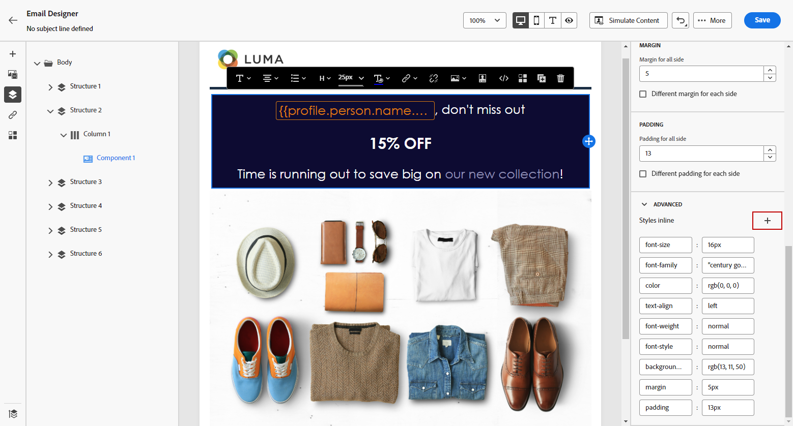

# 인라인 스타일 속성 추가 {#inline-styling}

이메일 디자이너 인터페이스에서 요소를 선택하고 사이드 패널에 해당 설정을 표시하는 경우 해당 특정 요소의 인라인 속성과 해당 값을 사용자 지정할 수 있습니다.

1. 콘텐츠에서 요소를 선택합니다.

1. 에서 **[!UICONTROL 스타일]** 탭에서 **[!UICONTROL 스타일 인라인]** 설정 **[!UICONTROL 고급]** 드롭다운.

   

1. 기존 속성의 값을 수정하거나 **+** 버튼을 클릭합니다. CSS를 준수하는 모든 속성과 값을 추가할 수 있습니다.

   

그러면 선택한 요소에 스타일이 적용됩니다. 하위 요소에 특정 스타일 속성이 정의되어 있지 않으면 상위 요소의 스타일이 상속됩니다.
