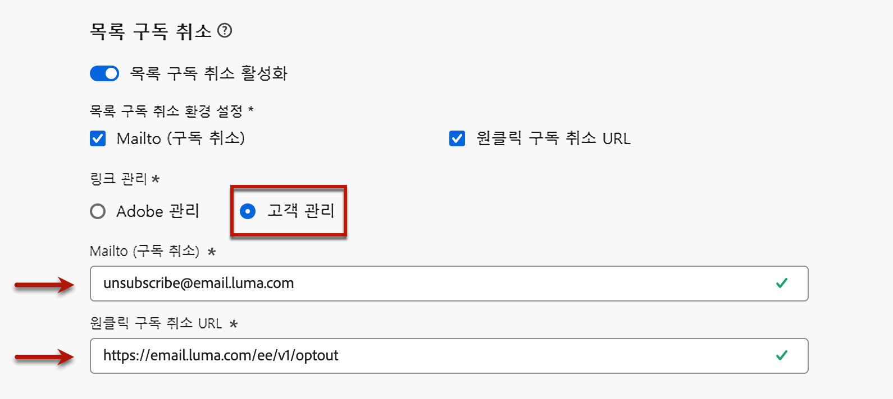

# 목록 구독 취소{#list-unsubscribe}

<!--Do not modify - Legal Review Done -->

[!DNL Adobe Journey Optimizer]에서 새 이메일 채널 구성을 구성할 때 목록에서 [하위 도메인을 선택](email-settings.md#subdomains-and-ip-pools)하면 **[!UICONTROL 목록 구독 취소 활성화]** 옵션이 표시됩니다. 기본적으로 활성화되어 있습니다.


원클릭 목록 구독 취소 URL은 이메일 발신자 정보 옆에 표시되는 구독 취소 링크 또는 버튼으로, 수신자가 한 번의 클릭으로 메일링 목록에서 즉시 옵트아웃할 수 있습니다.

예를 들어 원클릭 구독 취소 URL은 Gmail에 다음과 같은 링크를 표시합니다.


>[!IMPORTANT]
>
>이메일 헤더에 원클릭 구독 취소 URL을 표시하려면 수신자의 이메일 클라이언트가 이 기능을 지원해야 합니다.

이메일 클라이언트 및 이메일 구성 구독 취소 설정에 따라서, 이메일 헤더의 구독 취소 링크를 클릭하면 다음과 같은 영향을 받을 수 있습니다.

* **Mailto(구독 취소)** 기능이 활성화된 경우 구성한 하위 도메인에 따른 기본 구독 취소 주소로 구독 취소 요청이 전송됩니다.
* **원클릭 구독 취소 URL** 기능이 활성화되어 있거나 이메일 본문 콘텐츠에 구독 취소 URL을 삽입한 경우, 수신자가 원클릭 구독 취소 URL을 클릭하면(구성한 하위 도메인에 따라) 수신자가 채널 수준이나 ID 수준(동의 설정 방법에 따라 결정)에서 직접 옵트아웃됩니다.

>[!NOTE]
>
>아래의 [이 섹션](#enable-list-unsubscribe)에서 구독 취소 설정을 관리하는 방법을 알아봅니다.

두 경우 모두 수신자가 옵트아웃 링크를 클릭하면 수신자의 구독 취소 요청이 그에 따라 처리됩니다. 해당 프로필은 즉시 옵트아웃되고 [Experience Platform](https://experienceleague.adobe.com/docs/experience-platform/profile/ui/user-guide.html?lang=ko#getting-started){target="_blank"}에서 이 선택이 업데이트됩니다. 

>[!NOTE]
>
>경우에 따라 다운스트림 데이터 처리로 인해 구독 취소 이벤트가 프로필 수준에 반영되는 데 시간이 더 오래 걸릴 수 있습니다. 시스템이 업데이트될 때까지 잠시 기다립니다.

## 목록 구독 취소 활성화 {#enable-list-unsubscribe}

>[!CONTEXTUALHELP]
>id="ajo_admin_preset_unsubscribe"
>title="이메일에 구독 취소 URL 추가"
>abstract="이 옵션을 활성화하여 이메일 헤더에 구독 취소 URL을 자동으로 추가합니다. 원클릭 옵트아웃 링크를 이메일 콘텐츠에 삽입하여 메시지에서 구독 취소 URL을 설정할 수 있습니다."
>additional-url="https://experienceleague.adobe.com/ko/docs/journey-optimizer/using/channels/email/email-opt-out#one-click-opt-out" text="이메일 콘텐츠의 원클릭 옵트아웃 설정"

**[!UICONTROL 목록 구독 취소 활성화]** 옵션을 활성화하면 수신자의 이메일 클라이언트에서 지원하는 경우 이메일 헤더에 수신자가 메일링 목록 구독을 취소하는 데 사용할 수 있는 mailto 및/또는 URL이 모두 포함됩니다.

>[!NOTE]
>
>이 옵션을 비활성화하면 원클릭 구독 취소 URL이 이메일 헤더에 표시되지 않습니다.

목록 구독 취소 헤더에는 두 가지 옵션이 있는데, 둘 중 하나 또는 두 가지 모두의 선택을 취소하지 않는 한 기본적으로 활성화됩니다.

{width="80%"}

* 구독 취소 요청이 자동 처리를 위해 전달되는 대상 주소인 **[!UICONTROL Mailto(구독 취소)]** 주소입니다. [!DNL Journey Optimizer]에서 구독 취소 이메일 주소는 [선택한 하위 도메인](email-settings.md#subdomains)에 따라 채널 구성에 표시되는 기본 **[!UICONTROL Mailto(구독 취소)]** 주소입니다. <!--With this method, clicking the Unsubscribe link sends a pre-filled email to the unsubscribe address specified in the email header.-->

* **[!UICONTROL 원구독 취소 URL]**&#x200B;은 기본적으로 [선택한 하위 도메인](email-settings.md#subdomains)에 따라 원클릭 구독 취소 URL에서 생성한 [목록 구독 취소] 헤더입니다. <!--With this method, clicking the Unsubscribe link directly unsubscribes the user, requiring only a single action to unsubscribe.-->

해당 드롭다운 목록에서 **[!UICONTROL 동의 수준]**&#x200B;을 선택할 수 있습니다. 특정 채널 또는 프로필 ID에 맞춰 적용될 수 있습니다. 이 설정에 따라서, 사용자가 이메일 헤더에 있는 구독 취소 URL 목록을 사용하여 구독을 취소했을 때 [!DNL Adobe Journey Optimizer]에서 채널 수준 또는 ID 수준의 동의 여부가 업데이트됩니다.

## 가드레일 및 추천 사항 {#list-unsubscribe-guardrails}

원클릭 목록 구독 취소 URL 기능을 사용하면 수신자가 커뮤니케이션에서 쉽게 옵트아웃할 수 있습니다. 그러나 모든 이메일 클라이언트가 이메일 헤더에서 이 링크를 지원하는 것은 아니므로 Adobe는 [원클릭 옵트아웃 링크](email-opt-out.md#one-click-opt-out) 또는 [구독 취소 링크](email-opt-out.md#add-unsubscribe-link)를 이메일 본문에도 추가하는 것을 권장합니다.

**[!UICONTROL Mailto(구독 취소)]** 기능 및 **[!UICONTROL 원클릭 구독 취소 URL]** 기능은 선택 사항입니다.

* [이메일 구성 설정](email-settings.md)에서 **[!UICONTROL 목록 구독 취소 활성화]** 옵션을 켠 경우 두 가지 메서드 즉, **Mailto(구독 취소)** 및 **원클릭 구독 취소 URL**&#x200B;을 모두 활성화하는 것이 좋습니다. 모든 이메일 클라이언트가 HTTP 메서드를 지원하는 것은 아닙니다. 대체 항목을 선택할 수 있도록 제공되는 Mailto 목록 구독 취소 기능을 사용하면 발신자 신뢰도를 보다 잘 보호할 수 있으며 모든 수신자가 구독 취소 기능을 사용할 수 있습니다.

* 기본적으로 생성된 원클릭 구독 취소 URL을 사용하지 않으려면 이 기능의 선택을 해제할 수 있습니다. 

   * **[!UICONTROL 목록 구독 취소 활성화]** 옵션이 켜져 있고 **[!UICONTROL 원클릭 구독 취소 URL]** 기능의 선택이 해제된 시나리오에서 이 구성을 사용하여 만든 메시지에 [원클릭 옵트아웃 링크](../email/email-opt-out.md#one-click-opt-out)를 추가하는 경우, 목록 구독 취소 헤더에는 이메일 본문에 삽입한 원클릭 옵트아웃 링크가 적용되고 이를 원클릭 구독 취소 URL 값으로 사용합니다.

     

   * 메시지 콘텐츠에 원클릭 옵트아웃 링크를 추가하지 않고 채널 구성 설정에서 기본 **[!UICONTROL 원클릭 구독 취소 URL]**&#x200B;의 선택을 해제한 경우 이메일 헤더에 목록 구독 취소 헤더의 일부로 URL이 전달되지 않습니다.

  >[!NOTE]
  >
  >[이 섹션](../email/email-opt-out.md#unsubscribe-header)에서 메시지 내 구독 취소 기능을 관리하는 방법에 대해 자세히 알아보십시오.

[!DNL Journey Optimizer]에서 동의는 Experience Platform [동의 스키마](https://experienceleague.adobe.com/docs/experience-platform/xdm/field-groups/profile/consents.html?lang=ko){target="_blank"}가 처리합니다. 기본적으로 동의 필드의 값은 비어 있으며 커뮤니케이션을 수신하기 위한 동의로 처리됩니다. 온보딩하는 동안 이 기본값을 [여기](https://experienceleague.adobe.com/docs/experience-platform/xdm/data-types/consents.html?lang=ko#choice-values){target="_blank"}에 나열된 가능한 값 중 하나로 수정하거나 [동의 정책](../action/consent.md)을 사용하여 기본 논리를 재정의할 수 있습니다.

현재 [!DNL Journey Optimizer]에서는 [목록 구독 취소] 기능에 의해 트리거된 구독 취소 이벤트에 특정 태그를 추가하지 않습니다. [목록 구독 취소] 클릭을 다른 구독 취소 작업과 구별해야 하는 경우 외부에서 사용자 정의 태그 지정을 구현하거나 외부 랜딩 페이지를 활용하여 추적해야 합니다.

## 외부에서 구독 취소 데이터 관리 {#custom-managed}

>[!CONTEXTUALHELP]
>id="ajo_email_config_unsubscribe_custom"
>title="구독 취소 데이터 관리 방법 정의"
>abstract="**Adobe 관리**: 동의 데이터는 Adobe 시스템 내에서 관리합니다.<br>**고객 관리**: 동의 데이터는 외부 시스템에서 사용자가 관리하며, 사용자가 시작하지 않는 한 Adobe 시스템에서 동의 데이터의 동기화가 업데이트되지 않습니다."

>[!CONTEXTUALHELP]
>id="ajo_email_config_unsubscribe_custom_url"
>title="사용자의 자체 원클릭 구독 취소 URL 입력"
>abstract="**원클릭 구독 취소 URL**&#x200B;에서는 POST 요청 메서드를 사용해야 합니다."

Adobe 외부에서 동의를 관리하는 경우 **[!UICONTROL 고객 관리]** 옵션을 선택하여 사용자 정의 구독 취소 이메일 주소와 고유한 원클릭 구독 취소 URL을 입력합니다.

{width="80%"}

**[!UICONTROL 원클릭 구독 취소 URL]**&#x200B;은 POST URL이어야 합니다.

>[!WARNING]
>
>**[!UICONTROL 고객 관리]** 옵션을 사용하는 경우 Adobe에서 구독 취소 또는 동의 데이터를 저장하지 않습니다. **[!UICONTROL 고객 관리]** 옵션을 사용하면 조직은 외부 시스템을 사용하도록 선택하는 것이며, 이 외부 시스템에서 동의 데이터를 관리할 책임이 있습니다. 외부 시스템과 [!DNL Journey Optimizer] 사이에서 동의 데이터의 자동 동기화가 이루어지지 않습니다. [!DNL Journey Optimizer]에서 사용자 동의 데이터를 업데이트하기 위해 외부 시스템에서 가져온 동의 데이터의 모든 동기화는 조직에서 동의 데이터를 [!DNL Journey Optimizer]에 다시 푸시하는 데이터 전송으로 시작해야 합니다.

### 암호 해독 API 구성 {#configure-decrypt-api}

**[!UICONTROL 고객 관리]** 옵션을 선택한 상태에서 사용자 정의 엔드포인트를 입력하여 캠페인이나 여정에서 사용하는 경우 [!DNL Journey Optimizer]에서는 수신자가 구독 취소 링크를 클릭할 때 일부 기본 프로필별 매개 변수를 동의 업데이트 이벤트<!--sent to the custom endpoint -->에 추가합니다.

이 매개 변수는 엔드포인트에 암호화된 형태로 전송됩니다. 따라서 외부 동의 시스템에서는 [Adobe Developer](https://developer.adobe.com){target="_blank"}를 통해 특정 API를 구현하여 Adobe에서 보낸 매개 변수를 해독해야 합니다.

이 매개 변수를 검색하는 GET 호출은 사용하는 목록 구독 취소 옵션(**[!UICONTROL 원클릭 구독 취소 URL]** 또는 **[!UICONTROL Mailto(구독 취소)]**)에 따라 다릅니다.

<!--To configure the API to send back the information to [!DNL Adobe Journey Optimizer] when a recipient has unsubscribed using the List unsubscribe option with custom endpoints, follow the steps below.-->

+++ 원클릭 구독 취소 URL

**[!UICONTROL 원클릭 구독 취소 URL]** 옵션을 사용하는 경우 구독 취소 링크를 클릭하면 사용자의 구독이 바로 취소됩니다.

GET 호출은 다음과 같습니다.

엔드포인트: https://platform.adobe.io/journey/imp/consent/decrypt

쿼리 매개 변수:

* **params**: 암호화된 페이로드 포함
* **pid**: 암호화된 프로필 ID

이 두 매개 변수는 사용자 정의 엔드포인트로 전송되는 동의 업데이트 이벤트에 포함됩니다.

헤더 요구 사항:

* x-api-key
* x-gw-ims-org-id
* 인증(기술 계정의 사용자 토큰)

다음은 샘플 매개변수와 동의 응답입니다.

| 쿼리 매개변수 | 샘플 페이로드 |
|---------|----------|
| pid | {<br>&quot;pid&quot;  : &quot;5142733041546020095851529937068211571&quot;,<br>&quot;pns&quot;  : &quot;CRMID&quot;,<br>&quot;e&quot;    : &quot;john@google.com&quot;,<br>&quot;ens&quot;  : &quot;Email&quot;,<br>} |
| params | {<br>&quot;m&quot;  : &quot;messageExecutionId&quot;,<br>&quot;ci&quot;  : &quot;campaignId&quot;,<br>&quot;jv&quot; : &quot;journeyVersionId&quot;,<br>&quot;ja&quot; : &quot;journeyActionId&quot;,<br>&quot;s&quot;  : &quot;sandboxId&quot;,<br>&quot;us&quot; : &quot;unsubscribeScope&quot;<br>} |

동의 응답:

```
{
    "profileNameSpace": " CRMID ",
    "profileId": "5142733041546020095851529937068211571",
    "emailAddress": "john@google.com",
    "emailNameSpace": "Email",
    "sandboxId": "sandboxId",
    "optOutLevel": "channel",
    "channelType": "email",
    "timestamp": "2024-11-26T14:25:09.316930Z"
}
```

+++

+++ Mailto(구독 취소)

**[!UICONTROL Mailto(구독 취소)]** 옵션을 사용하는 경우 구독 취소 링크를 클릭하면 지정된 구독 취소 주소로 미리 채워진 이메일이 보내집니다.

GET 호출은 다음과 같습니다.

엔드포인트: https://platform.adobe.io/journey/imp/consent/decrypt

쿼리 매개 변수:

* **emailParams**: **params**(암호화된 페이로드) 및 **pid**(암호화된 프로필 ID) 매개 변수를 포함하는 문자열입니다.

**params** 및 **pid** 매개 변수는 사용자 정의 엔드포인트로 전송되는 동의 업데이트 이벤트에 포함됩니다.

헤더 요구 사항:

* x-api-key
* x-gw-ims-org-id
* 인증(기술 계정의 사용자 토큰)

다음은 샘플 매개변수와 동의 응답입니다.

| 쿼리 매개변수 | 샘플 페이로드 |
|---------|----------|
| emailParams | {<br>&quot;p&quot;  : &quot;profileId&quot;,<br>&quot;pn&quot;  : &quot;profileNamespace&quot;,<br>&quot;en&quot;  : &quot;emailNamespace&quot;,<br>&quot;ci&quot;  : &quot;campaignId&quot;,<br>&quot;jv&quot; : &quot;journeyVersionId&quot;,<br>&quot;ja&quot; : &quot;journeyActionId&quot;,<br>&quot;si&quot;  : &quot;sandboxId&quot;,<br>&quot;us&quot;: &quot;unsubscribeScope&quot;<br>} |

동의 응답:

```
{
    "profileNameSpace": " CRMID ",
    "profileId": "5142733041546020095851529937068211571",
    "emailAddress": "john@google.com",
    "emailNameSpace": "Email",
    "sandboxId": "sandboxId",
    "optOutLevel": "channel",
    "channelType": "email",
    "timestamp": "2024-11-26T14:25:09.316930Z"
}
```

+++
