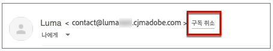
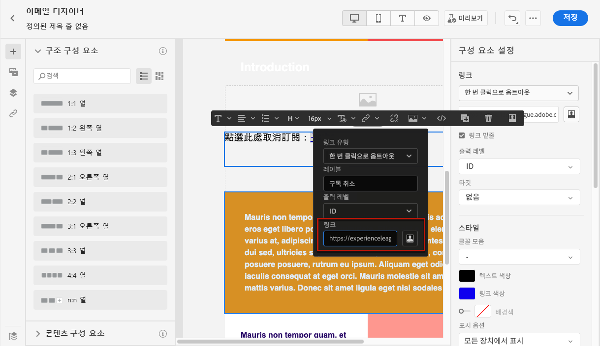

# 목록 구독 취소{#list-unsubscribe}

<!--Do not modify - Legal Review Done -->

새 이메일 채널 구성을 구성할 때 목록에서 [하위 도메인을 선택](email-settings.md#subdomains-and-ip-pools)하면 **[!UICONTROL 목록 구독 취소 활성화]** 옵션이 표시됩니다.

## 목록 구독 취소 활성화 {#enable-list-unsubscribe}

이 옵션은 기본적으로 활성화되어 있으며, 이메일 헤더에 다음과 같은 원클릭 구독 취소 URL을 포함합니다.

>[!NOTE]
>
>이 옵션을 비활성화하면 원클릭 구독 취소 URL이 이메일 헤더에 표시되지 않습니다.

목록 구독 취소 헤더에는 두 가지 옵션이 있는데, 둘 중 하나 또는 두 가지 모두의 선택을 취소하지 않는 한 기본적으로 활성화됩니다.

{width="80%"}

* 구독 취소 요청이 자동 처리를 위해 전달되는 대상 주소인 **[!UICONTROL Mailto(구독 취소)]** 주소입니다.

  [!DNL Journey Optimizer]에서 구독 취소 이메일 주소는 [선택한 하위 도메인](#subdomains-and-ip-pools)에 따라 채널 구성에 표시되는 기본 **[!UICONTROL Mailto(구독 취소)]** 주소입니다. <!--With this method, clicking the Unsubscribe link sends a pre-filled email to the unsubscribe address specified in the email header.-->

* **[!UICONTROL 원클릭 구독 취소 URL]**&#x200B;로, 기본적으로 원클릭 옵트아웃 URL에서 생성한 목록 구독 취소 헤더이며, 사용자가 채널 구성 설정에서 설정 및 구성한 하위 도메인에 기반합니다.<!--With this method, clicking the Unsubscribe link directly unsubscribes the user, requiring only a single action to unsubscribe.-->

해당 드롭다운 목록에서 **[!UICONTROL 동의 수준]**&#x200B;을 선택할 수 있습니다. 특정 채널 또는 프로필 ID에 맞춰 적용될 수 있습니다. 이 설정에 따라서, 사용자가 이메일 헤더에 있는 구독 취소 URL 목록을 사용하여 구독을 취소했을 때 [!DNL Adobe Journey Optimizer]에서 채널 수준 또는 ID 수준의 동의 여부가 업데이트됩니다.

**[!UICONTROL Mailto(구독 취소)]** 기능 및 **[!UICONTROL 원클릭 구독 취소 URL]** 기능은 선택 사항입니다.

기본적으로 생성된 원클릭 구독 취소 URL을 사용하지 않으려면 이 기능의 선택을 해제할 수 있습니다. **[!UICONTROL 목록 구독 취소 활성화]** 옵션이 켜져 있고 **[!UICONTROL 원클릭 구독 취소 URL]** 기능의 선택이 해제된 시나리오에서 이 구성을 사용하여 만든 메시지에 [원클릭 옵트아웃 링크](../email/email-opt-out.md#one-click-opt-out)를 추가하는 경우, 목록 구독 취소 헤더에는 이메일 본문에 삽입한 원클릭 옵트아웃 링크가 적용되고 이를 원클릭 구독 취소 URL 값으로 사용합니다.

>[!NOTE]
>
>메시지 콘텐츠에 원클릭 옵트아웃 링크를 추가하지 않고 채널 구성 설정에서 기본 **[!UICONTROL 원클릭 구독 취소 URL]**&#x200B;의 선택을 해제한 경우 이메일 헤더에 목록 구독 취소 헤더의 일부로 URL이 전달되지 않습니다.

[이 섹션](../email/email-opt-out.md#unsubscribe-header)에서는 메시지 내 구독 취소 기능을 관리하는 방법에 대해 자세히 알아봅니다.

## 외부에서 구독 취소 데이터 관리 {#custom-managed}

>[!CONTEXTUALHELP]
>id="ajo_email_config_unsubscribe_custom"
>title="구독 취소 데이터 관리 방법 정의"
>abstract="**Adobe 관리**: 동의 데이터는 Adobe 시스템 내에서 관리합니다. **고객 관리**: 동의 데이터는 외부 시스템에서 사용자가 관리하며, 사용자가 시작하지 않는 한 Adobe 시스템에서 동의 데이터의 동기화가 업데이트되지 않습니다."

Adobe 외부에서 동의를 관리하는 경우 **[!UICONTROL 고객 관리]** 옵션을 선택하여 사용자 정의 구독 취소 이메일 주소와 고유한 원클릭 구독 취소 URL을 입력합니다.

{width="80%"}

>[!WARNING]
>
>**[!UICONTROL 고객 관리]** 옵션을 사용하는 경우 Adobe에서 구독 취소 또는 동의 데이터를 저장하지 않습니다. **[!UICONTROL 고객 관리]** 옵션을 사용하면 조직은 외부 시스템을 사용하도록 선택하는 것이며, 이 외부 시스템에서 동의 데이터를 관리할 책임이 있습니다. 외부 시스템과 [!DNL Journey Optimizer] 사이에서 동의 데이터의 자동 동기화가 이루어지지 않습니다. [!DNL Journey Optimizer]에서 사용자 동의 데이터를 업데이트하기 위해 외부 시스템에서 가져온 동의 데이터의 모든 동기화는 조직에서 동의 데이터를 [!DNL Journey Optimizer]에 다시 푸시하는 데이터 전송으로 시작해야 합니다.

### 암호 해독 API 구성 {#configure-decrypt-api}

**[!UICONTROL 고객 관리]** 옵션을 선택한 상태에서 사용자 정의 엔드포인트를 입력하여 캠페인이나 여정에서 사용하는 경우 [!DNL Journey Optimizer]에서는 수신자가 구독 취소 링크를 클릭할 때 일부 기본 프로필별 매개 변수를 동의 업데이트 이벤트<!--sent to the custom endpoint -->에 추가합니다.

이 매개 변수는 엔드포인트에 암호화된 형태로 전송됩니다. 따라서 외부 동의 시스템에서는 [Adobe Developer](https://developer.adobe.com){target="_blank"}를 통해 특정 API를 구현하여 Adobe에서 보낸 매개 변수를 해독해야 합니다.

이 매개 변수를 검색하는 GET 호출은 사용하는 목록 구독 취소 옵션(**[!UICONTROL 원클릭 구독 취소 URL]** 또는 **[!UICONTROL Mailto(구독 취소)]**)에 따라 다릅니다.

<!--To configure the API to send back the information to [!DNL Adobe Journey Optimizer] when a recipient has unsubscribed using the List unsubscribe option with custom endpoints, follow the steps below.-->

+++ 원클릭 구독 취소 URL

**[!UICONTROL 원클릭 구독 취소 URL]** 옵션을 사용하는 경우 구독 취소 링크를 클릭하면 사용자의 구독이 바로 취소됩니다.

GET 호출은 다음과 같습니다.

엔드포인트: https://platform.adobe.io/journey/imp/consent/decrypt

쿼리 매개 변수:

* **params**: 암호화된 페이로드 포함
* **pid**: 암호화된 프로필 ID

이 두 매개 변수는 사용자 정의 엔드포인트로 전송되는 동의 업데이트 이벤트에 포함됩니다.

헤더 요구 사항:

* x-api-key
* x-gw-ims-org-id
* 인증(기술 계정의 사용자 토큰)

+++

+++ Mailto(구독 취소)

**[!UICONTROL Mailto(구독 취소)]** 옵션을 사용하는 경우 구독 취소 링크를 클릭하면 지정된 구독 취소 주소로 미리 채워진 이메일이 보내집니다.

GET 호출은 다음과 같습니다.

엔드포인트: https://platform.adobe.io/journey/imp/consent/decrypt

쿼리 매개 변수:

* **emailParams**: **params**(암호화된 페이로드) 및 **pid**(암호화된 프로필 ID) 매개 변수를 포함하는 문자열입니다.

**params** 및 **pid** 매개 변수는 사용자 정의 엔드포인트로 전송되는 동의 업데이트 이벤트에 포함됩니다.

헤더 요구 사항:

* x-api-key
* x-gw-ims-org-id
* 인증(기술 계정의 사용자 토큰)

+++
