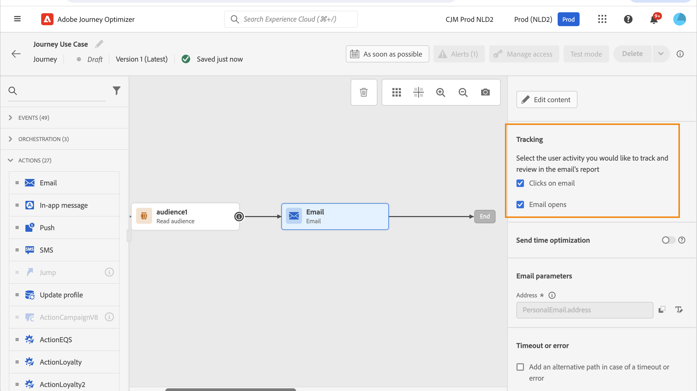

# 링크 추가 및 메시지 추적 {#tracking}

사용 [!DNL Journey Optimizer] 를 사용하여 콘텐츠에 링크를 추가하고, 전송된 메시지를 추적하여 수신자의 동작을 모니터링합니다.

## 추적 활성화 {#enable-tracking}

다음을 확인하여 이메일 메시지 수준에서 추적을 활성화할 수 있습니다. **[!UICONTROL 이메일 열람수]** 및/또는 **[!UICONTROL 이메일 클릭]** 여정 또는 캠페인 내에서 메시지를 만들 때 선택할 수 있습니다.

>[!BEGINTABS]

>[!TAB 여정에서 추적 활성화]

>[!TAB 캠페인에서 추적 활성화]

>[!ENDTABS]

>[!NOTE]
>
>두 옵션은 기본적으로 활성화되어 있습니다.

이를 통해 다음을 통해 수신자의 동작을 추적할 수 있습니다.

* **[!UICONTROL 이메일 열람수]**: 열려 있는 메시지.
* **[!UICONTROL 이메일 클릭]**: 이메일의 링크를 클릭합니다.

## 링크 삽입 {#insert-links}

메시지를 디자인할 때 콘텐츠에 링크를 추가할 수 있습니다.

>[!NOTE]
>
>날짜 [추적이 활성화됨](#enable-tracking), 메시지 콘텐츠에 포함된 모든 링크가 추적됩니다.

이메일 콘텐츠에 링크를 삽입하려면 다음 단계를 따르십시오.

1. 요소를 선택하고 상황별 도구 모음에서 **[!UICONTROL 링크 삽입]**&#x200B;을 클릭합니다.

   

1. 만들려는 링크의 유형을 선택합니다.

   * **[!UICONTROL 외부 링크]**: 외부 URL에 대한 링크를 삽입합니다.

   * **[!UICONTROL 랜딩 페이지]**: 랜딩 페이지에 링크를 삽입합니다. [자세히 알아보기](../landing-pages/get-started-lp.md)

   * **[!UICONTROL 한 번의 클릭으로 옵트아웃]**: 사용자가 옵트아웃을 확인할 필요 없이 커뮤니케이션에서 빠르게 구독을 취소할 수 있도록 링크를 삽입합니다. [자세히 알아보기](email-opt-out.md#one-click-opt-out).

   * **[!UICONTROL 외부 옵트인/구독]**: 브랜드로부터 커뮤니케이션 수신을 수락하는 링크를 삽입합니다.

   * **[!UICONTROL 외부 옵트아웃/구독 취소]**: 브랜드로부터 커뮤니케이션 수신을 거부할 수 있는 링크를 삽입합니다. [이 섹션](email-opt-out.md#opt-out-management)에서 옵트아웃 관리에 대해 자세히 알아보십시오.

   * **[!UICONTROL 미러 페이지]**: 웹 브라우저에 이메일 콘텐츠를 표시하는 링크를 추가합니다. [자세히 알아보기](#mirror-page)

1. 해당 필드에 원하는 URL을 입력하거나 랜딩 페이지를 선택하고 링크 설정 및 스타일을 정의합니다. [자세히 알아보기](#adjust-links)

   >[!NOTE]
   >
   >URL 해석의 경우 [!DNL Journey Optimizer] 는 URI 구문()을 준수합니다.[RFC 3986 표준](https://datatracker.ietf.org/doc/html/rfc3986){target="_blank"})를 입력하여 URL에 일부 특수 국제 문자를 비활성화할 수 있습니다. 증명 또는 이메일을 전송하려고 할 때 콘텐츠에 추가된 URL과 관련된 오류가 반환되면 URL로 문자열을 인코딩할 수 있습니다.

1. 링크를 개인화할 수 있습니다. [자세히 알아보기](../personalization/personalization-syntax.md#perso-urls)

1. 변경 내용을 저장합니다.

1. 링크가 만들어지더라도 **[!UICONTROL 설정]** 및 **[!UICONTROL 스타일]** 오른쪽 창.

   

>[!NOTE]
>
>마케팅 유형 이메일 메시지에는 다음 항목이 포함되어야 합니다. [옵트아웃 링크](../privacy/opt-out.md#opt-out-management)트랜잭션 메시지에는 필요하지 않습니다. 메시지 카테고리(**[!UICONTROL 마케팅]** 또는 **[!UICONTROL 트랜잭션]**)는에 정의되어 있습니다 [채널 표면](../configuration/channel-surfaces.md#email-type) 메시지를 만들 때.

## 링크 조정 {#adjust-links}

다음을 사용하여 링크를 조정할 수 있습니다. **[!UICONTROL 설정]** 및 **[!UICONTROL 스타일]** 오른쪽 창. 링크에 밑줄을 긋고 색상을 편집한 다음 대상을 선택할 수 있습니다.

1. 링크가 삽입된 **[!UICONTROL 텍스트]** 구성 요소에서 링크를 선택합니다.

1. 다음에서 **[!UICONTROL 설정]** 탭에서 대상자를 리디렉션할 방법을 선택합니다. **[!UICONTROL Target]** 드롭다운:

   * **[!UICONTROL None]**: 링크를 클릭한 프레임과 동일한 프레임에서 링크를 엽니다(기본값).
   * **[!UICONTROL Blank]**: 새 창이나 탭에서 링크를 엽니다.
   * **[!UICONTROL Self]**: 링크를 클릭한 프레임과 동일한 프레임에서 링크를 엽니다.
   * **[!UICONTROL Parent]**: 상위 프레임에서 링크를 엽니다.
   * **[!UICONTROL Top]**: 최상위 창에서 링크를 엽니다.

   

1. 확인 **[!UICONTROL 링크 밑줄]** 를 클릭하여 링크의 레이블 텍스트에 밑줄을 긋습니다.

   

1. 링크 색상을 변경하려면 **[!UICONTROL 스타일]** 탭에서 **[!UICONTROL 링크 색상]**&#x200B;을 클릭합니다.

   

1. 변경 내용을 저장합니다.

## 미러 페이지 링크 {#mirror-page}

미러 페이지는 웹 브라우저를 통해 온라인으로 액세스할 수 있는 HTML 페이지입니다. 콘텐츠는 이메일의 콘텐츠와 동일합니다.

이메일의 미러 페이지에 링크를 추가하려면 [링크 삽입](#insert-links) 및 선택 **[!UICONTROL 미러 페이지]** 를 링크의 유형으로 사용하십시오.

미러 페이지가 자동으로 생성됩니다.

>[!IMPORTANT]
>
>미러 페이지 링크는 자동 생성되며 편집할 수 없습니다. 여기에는 원본 이메일을 렌더링하는 데 필요한 모든 암호화 및 개인화된 데이터가 포함되어 있습니다. 따라서 값이 큰 개인화된 속성을 사용하면 미러 페이지 URL이 길어질 수 있으며 이로 인해 최대 URL 길이 제한이 있는 웹 브라우저에서 링크가 작동하지 않을 수 있습니다.

이메일이 전송된 후 수신자가 미러 페이지 링크를 클릭하면 이메일 콘텐츠가 기본 웹 브라우저에 표시됩니다.

>[!NOTE]
>
>다음에서 [증명](preview.md#send-proofs) 테스트 프로필로 전송되면 미러 페이지에 대한 링크가 활성화되지 않습니다. 최종 메시지에서만 활성화됩니다.

미러 페이지의 보존 기간은 60일입니다. 이 지연 후에는 미러 페이지를 더 이상 사용할 수 없습니다.

## 추적 관리 {#manage-tracking}

[이메일 디자이너](content-from-scratch.md)를 통해 각 링크에 대한 추적 유형을 편집하는 등 추적된 URL을 관리할 수 있습니다.

1. 다음을 클릭합니다. **[!UICONTROL 링크]** 왼쪽 창의 아이콘을 클릭하면 추적할 콘텐츠의 모든 URL 목록이 표시됩니다.

   이 목록을 통해 URL을 중앙 집중식으로 볼 수 있으며 이메일 콘텐츠에서 각 URL을 찾을 수 있습니다.

1. 링크를 편집하려면 해당 연필 아이콘을 클릭합니다.

1. 필요한 경우 **[!UICONTROL 추적 유형]**&#x200B;을 수정할 수 있습니다.

   

   추적된 각 URL에 대해 추적 모드를 다음 중 원하는 값으로 설정할 수 있습니다.

   * **[!UICONTROL 추적됨]**: 이 URL에 대한 추적을 활성화합니다.
   * **[!UICONTROL 옵트아웃]**: 이 URL을 옵트아웃 또는 구독 취소 URL로 간주합니다.
   * **[!UICONTROL 미러 페이지]**: 이 URL을 미러 페이지 URL로 간주합니다.
   * **[!UICONTROL 활성화 안 함]**: 이 URL의 추적을 활성화하지 않습니다. <!--This information is saved: if the URL appears again in a future message, its tracking is automatically deactivated.-->

열기 및 클릭에 대한 보고는 [라이브 보고서](../reports/live-report.md) 및 [글로벌 보고서](../reports/global-report.md).

## URL 추적 {#url-tracking}

보통 [URL 추적](email-settings.md#url-tracking) 는 서피스 수준에서 관리되지만 프로필 속성은 지원되지 않습니다. 현재 이 작업을 수행하는 유일한 방법은 [URL 개인화](../personalization/personalization-syntax.md#perso-urls) 이메일 디자이너에서.

개인화된 URL 추적 매개 변수를 링크에 추가하려면 아래 단계를 따르십시오.

1. 링크를 선택하고 **[!UICONTROL 링크 삽입]** 상황별 도구 모음에서 작성합니다.

1. 개인화 아이콘을 선택합니다. 다음 유형의 링크에만 사용할 수 있습니다. **외부 링크**, **구독 취소 링크** 및 **옵트아웃**.

   

1. URL 추적 매개 변수를 추가하고 표현식 편집기에서 선택한 프로필 속성을 선택합니다.

   

1. 변경 내용을 저장합니다.

1. 이 추적 매개 변수를 추가할 각 링크에 대해 위의 단계를 반복합니다.

이제 이메일이 발송되면 이 매개 변수가 URL의 끝에 자동으로 추가됩니다. 그런 다음 웹 분석 도구 또는 성능 보고서에서 이 매개 변수를 캡처할 수 있습니다.

>[!NOTE]
>
>최종 URL을 확인하려면 [증명 보내기](preview.md#send-proofs) 증명을 받은 후 이메일 콘텐츠의 링크를 클릭합니다. URL에 추적 매개 변수가 표시되어야 합니다. 위의 예에서 최종 URL은 https://luma.enablementadobe.com/content/luma/us/en.html?utm_contact=profile.userAccount.contactDetails.homePhone.number이 됩니다.
