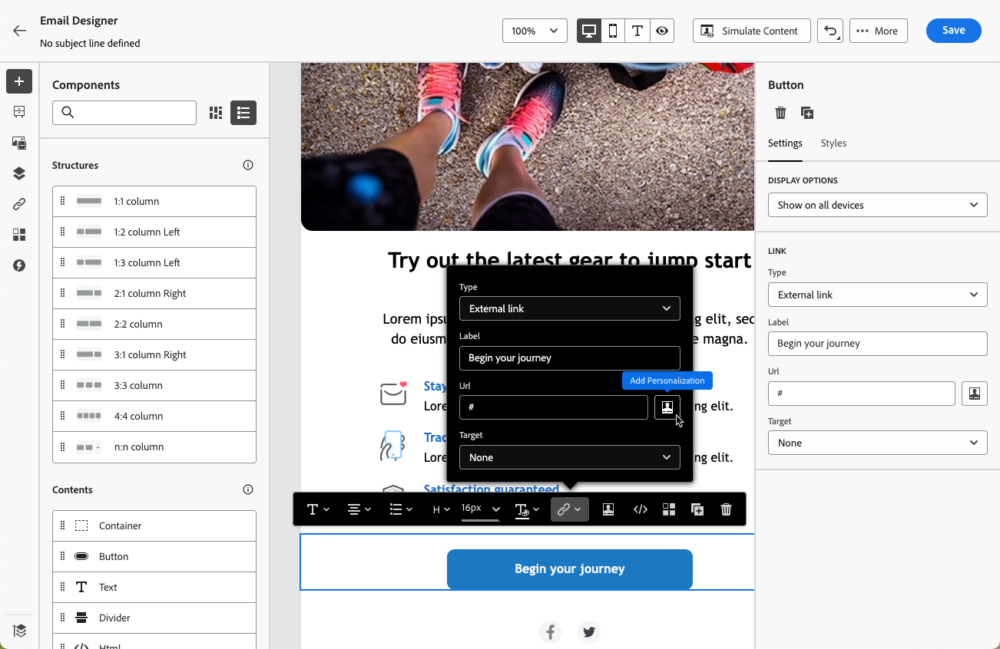

# 링크 추가 및 메시지 추적 {#tracking}

[!DNL Journey Optimizer]을(를) 사용하여 콘텐츠에 링크를 추가하고 보낸 메시지를 추적하여 받는 사람의 동작을 모니터링합니다.

## 추적 활성화 {#enable-tracking}

아래 탭에 표시된 대로 여정 또는 캠페인 내에서 메시지를 만들 때 **[!UICONTROL 전자 메일 열기]** 및/또는 **[!UICONTROL 전자 메일 클릭]** 옵션을 확인하여 전자 메일 메시지 수준에서 추적을 활성화할 수 있습니다.

>[!BEGINTABS]

>[!TAB 여정에서 추적 사용]

>[!TAB 캠페인에서 추적 사용]

>[!ENDTABS]

>[!NOTE]
>
>두 옵션은 기본적으로 활성화되어 있습니다.

이 옵션을 활성화하면 메시지 수신자의 동작을 추적합니다.

* **[!UICONTROL 이메일 열기]** 지표는 열린 메시지 수를 확인합니다.
* **[!UICONTROL 전자 메일 클릭]** 지표는 전자 메일의 링크 클릭 수를 계산합니다.

## 링크 삽입 {#insert-links}

[추적을 사용하도록 설정](#enable-tracking)하면 메시지 콘텐츠에 포함된 모든 링크가 추적됩니다.

이메일 콘텐츠에 링크를 삽입하려면 다음 단계를 따르십시오.

1. 요소(텍스트 또는 이미지)를 선택하고 상황별 도구 모음에서 **[!UICONTROL 링크 삽입]**&#x200B;을 클릭합니다.

   

1. 만들려는 링크의 유형을 선택합니다.

   * 외부 URL에 대한 링크를 삽입하려면 **[!UICONTROL 외부 링크]**&#x200B;를 선택하십시오.

   * **[!UICONTROL 랜딩 페이지]**&#x200B;를 선택하여 랜딩 페이지에 링크를 삽입합니다. [자세히 알아보기](../landing-pages/get-started-lp.md)

   * **[!UICONTROL 한 번의 클릭으로 옵트아웃]**&#x200B;을 선택하여 사용자가 옵트아웃을 확인할 필요 없이 커뮤니케이션에서 빠르게 구독을 취소할 수 있는 링크를 삽입합니다. [자세히 알아보기](email-opt-out.md#one-click-opt-out).

   * **[!UICONTROL 외부 옵트인/구독]**&#x200B;을(를) 선택하여 브랜드의 수신 통신을 수락하는 링크를 삽입합니다.

   * **[!UICONTROL 외부 옵트아웃/구독 취소]**&#x200B;를 선택하여 브랜드로부터 커뮤니케이션 수신을 취소할 링크를 삽입합니다. [이 섹션](email-opt-out.md#opt-out-management)에서 옵트아웃 관리에 대해 자세히 알아보십시오.

   * **[!UICONTROL 미러 페이지]**&#x200B;을(를) 선택하여 이메일 미러 페이지에 대한 링크를 추가하십시오. [자세히 알아보기](#mirror-page)

1. 해당 필드에 원하는 URL을 입력하거나 랜딩 페이지를 선택하고 링크 설정 및 스타일을 정의합니다. [자세히 알아보기](#adjust-links)

   >[!NOTE]
   >
   >URL을 해석하기 위해 [!DNL Journey Optimizer]은(는) URL에 일부 특수 국제 문자를 사용하지 않도록 설정하는 URI 구문([RFC 3986 standard](https://datatracker.ietf.org/doc/html/rfc3986){target="_blank"})을 준수합니다. 증명 또는 이메일을 전송하려고 할 때 콘텐츠에 추가된 URL과 관련된 오류가 반환되면 URL로 문자열을 인코딩할 수 있습니다.

1. 링크를 개인화할 수 있습니다. [자세히 알아보기](../personalization/personalization-syntax.md#perso-urls)

1. 변경 내용을 저장합니다.

1. 링크가 만들어져도 오른쪽의 **[!UICONTROL 설정]** 및 **[!UICONTROL 스타일]** 창에서 링크를 수정할 수 있습니다.

   

>[!NOTE]
>
>마케팅 유형 이메일 메시지에는 [옵트아웃 링크](../privacy/opt-out.md#opt-out-management)가 포함되어야 합니다. 이는 트랜잭션 메시지에는 필요하지 않습니다. 메시지를 만들 때 [채널 구성](../configuration/channel-surfaces.md#email-type)에 메시지 범주(**[!UICONTROL 마케팅]** 또는 **[!UICONTROL 트랜잭션]**)가 정의되어 있습니다.

## 미러 페이지 링크 {#mirror-page}

미러 페이지는 이메일의 온라인 버전입니다. 미러 페이지에 링크를 추가하는 것은 이메일 마케팅에 도움이 됩니다. 받은 편지함에서 이메일을 보려고 할 때 렌더링에 실패하거나 이미지가 깨지는 등의 문제가 발생하는 경우, 사용자는 이메일의 미러 페이지를 대신 탐색할 수 있습니다. 접근성 개선을 개선하거나 소셜 공유를 장려하기 위해서도 온라인 버전을 제공하는 것이 좋습니다.

Adobe Journey Optimizer에서 생성한 미러 페이지에는 모든 개인화 데이터가 포함되어 있습니다.

이메일에 미러 페이지에 대한 링크를 추가하려면 [링크를 삽입](#insert-links)하고 링크 유형으로 **[!UICONTROL 미러 페이지]**&#x200B;를 선택하십시오.

미러 페이지가 자동으로 생성됩니다. 이메일이 전송된 후 수신자가 미러 페이지 링크를 클릭하면 이메일 콘텐츠가 기본 웹 브라우저에 표시됩니다.

미러 페이지의 보존 기간은 **60일**&#x200B;입니다. 해당 기간 이후에는 미러 페이지를 더 이상 사용할 수 없습니다.

>[!CAUTION]
>
>* 미러 페이지 링크는 자동 생성되며 편집할 수 없습니다. 여기에는 원본 이메일을 렌더링하는 데 필요한 모든 암호화 및 개인화된 데이터가 포함되어 있습니다. 따라서 값이 큰 개인화된 속성을 사용하면 미러 페이지 URL이 길어질 수 있으며 이로 인해 최대 URL 길이 제한이 있는 웹 브라우저에서 링크가 작동하지 않을 수 있습니다.
>
>* 테스트 프로필로 보낸 [증명](../content-management/proofs.md)에서 미러 페이지 링크가 활성화되지 않았습니다. 최종 메시지에서만 활성화됩니다.

## 링크 모양 및 대상 사용자 지정 {#adjust-links}

링크에 밑줄 긋기, 색상 변경 또는 대상 선택과 같이 링크를 조정할 수 있습니다.  이러한 변경 내용은 콘텐츠 편집기의 오른쪽 섹션에 있는 **[!UICONTROL 설정]** 및 **[!UICONTROL 스타일]** 창에서 설정됩니다.

### Target {#link-target}

**target** 특성은 연결된 페이지가 열릴 위치를 제어하는 데 사용됩니다. 앵커 태그에 타겟 속성을 추가하면 링크가 새 탭에서 열려야 하는지, 동일한 탭에서 열려야 하는지, 아니면 다른 프레임에서 열려야 하는지를 지정할 수 있습니다.

링크 대상을 정의하려면 다음 단계를 수행합니다.

1. 링크가 삽입된 **[!UICONTROL 텍스트]** 구성 요소에서 링크를 선택합니다.

1. **[!UICONTROL 설정]** 탭에서 **[!UICONTROL Target]** 드롭다운에서 링크가 열리는 위치를 선택합니다. 가능한 값은 다음과 같습니다.

   * **[!UICONTROL None]**: 링크를 클릭한 프레임과 동일한 프레임에서 링크를 엽니다(기본값).
   * **[!UICONTROL Blank]**: 새 창이나 탭에서 링크를 엽니다.
   * **[!UICONTROL Self]**: 링크를 클릭한 프레임과 동일한 프레임에서 링크를 엽니다.
   * **[!UICONTROL Parent]**: 상위 프레임에서 링크를 엽니다.
   * **[!UICONTROL Top]**: 최상위 창에서 링크를 엽니다.

   

1. 변경 내용을 저장합니다.

### 링크 밑줄 {#link-underline}

링크 레이블에 밑줄을 긋으려면 **[!UICONTROL 링크 밑줄]** 옵션을 선택하십시오.

### 링크 색상 {#link-color}

링크 색상을 변경하려면 **[!UICONTROL 스타일]** 탭에서 **[!UICONTROL 링크 색상]**&#x200B;을 클릭합니다.

## 추적 관리 {#manage-tracking}

[이메일 디자이너](content-from-scratch.md)를 통해 각 링크에 대한 추적 유형을 편집하는 등 추적된 URL을 관리할 수 있습니다.

1. 추적할 콘텐츠의 모든 URL 목록을 표시하려면 왼쪽 창에서 **[!UICONTROL 링크]** 아이콘을 클릭합니다.

   이 목록을 통해 URL을 중앙 집중식으로 볼 수 있으며 이메일 콘텐츠에서 각 URL을 찾을 수 있습니다.

1. 링크를 편집하려면 해당 연필 아이콘을 클릭합니다.

1. 필요한 경우 **[!UICONTROL 추적 유형]**&#x200B;을 수정할 수 있습니다.

   

   추적된 각 URL에 대해 추적 모드를 다음 중 원하는 값으로 설정할 수 있습니다.

   * **[!UICONTROL 추적됨]**: 이 URL에 대한 추적을 활성화합니다.
   * **[!UICONTROL 옵트아웃]**: 이 URL을 옵트아웃 또는 구독 취소 URL로 간주합니다.
   * **[!UICONTROL 미러 페이지]**: 이 URL을 미러 페이지 URL로 간주합니다.
   * **[!UICONTROL 사용 안 함]**: 이 URL의 추적을 활성화하지 않습니다.

열기 및 클릭에 대한 보고는 [라이브 보고서](../reports/live-report.md) 및 [Customer Journey Analytics 보고서](../reports/report-gs-cja.md)에서 사용할 수 있습니다.

## URL 추적 개인화 {#url-tracking}

일반적으로 [URL 추적](email-settings.md#url-tracking)은(는) 구성 수준에서 관리되지만 프로필 특성은 지원되지 않습니다. 현재 전자 메일 디자이너에서 [URL을 개인 설정](../personalization/personalization-syntax.md#perso-urls)하는 방법만 있습니다.

개인화된 URL 추적 매개 변수를 링크에 추가하려면 아래 단계를 따르십시오.

1. 링크를 선택하고 상황별 도구 모음에서 **[!UICONTROL 링크 삽입]**&#x200B;을 클릭합니다.

1. 개인화 아이콘을 선택합니다. **외부 링크**, **구독 취소 링크** 및 **옵트아웃** 링크 유형에만 사용할 수 있습니다.

   

1. URL 추적 매개 변수를 추가하고 개인화 편집기에서 선택한 프로필 속성을 선택합니다.

   

1. 변경 내용을 저장합니다.

1. 이 추적 매개 변수를 추가할 각 링크에 대해 위의 단계를 반복합니다.

이제 이메일이 발송되면 이 매개 변수가 URL의 끝에 자동으로 추가됩니다. 그런 다음 웹 분석 도구 또는 성능 보고서에서 이 매개 변수를 캡처할 수 있습니다.

>[!NOTE]
>
>최종 URL을 확인하려면 증명을 [보내고](../content-management/preview-test.md#send-proofs) 증명을 받은 후 전자 메일의 콘텐츠에서 링크를 클릭할 수 있습니다. URL에 추적 매개 변수가 표시되어야 합니다. 위의 예에서 최종 URL은 <https://luma.enablementadobe.com/content/luma/us/en.html?utm_contact=profile.userAccount.contactDetails.homePhone.number>입니다.
