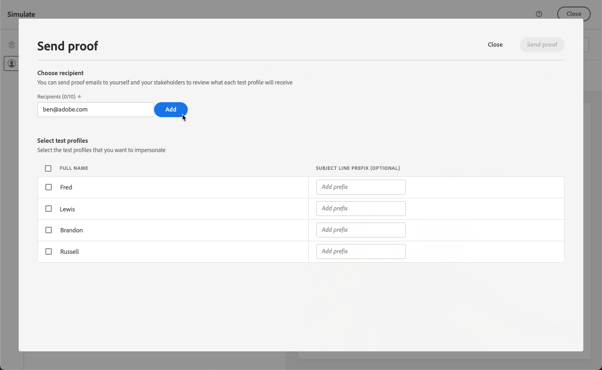

# 이메일 미리 보기 및 테스트 {#preview-and-proof}

>[!CONTEXTUALHELP]
>id="ac_preview_testprofiles"
>title="메시지 미리보기 및 테스트"
>abstract="메시지가 정의되면 테스트 프로필을 사용하여 미리 보고 테스트할 수 있습니다."

이메일 콘텐츠를 정의했으면 테스트 프로필을 사용하여 미리 보고 테스트할 수 있습니다. 를 삽입한 경우 [개인화된 콘텐츠](../personalization/personalize.md), 테스트 프로필 데이터를 사용하여 이 콘텐츠가 메시지에 어떻게 표시되는지 확인할 수 있습니다.

이메일 콘텐츠 또는 개인화 설정에서 발생할 수 있는 오류를 탐지하려면 테스트 프로필로 증명을 보냅니다. 최신 콘텐츠의 유효성을 검사하려면 변경 사항이 있을 때마다 증명을 보내야 합니다.

>[!CAUTION]
>
>메시지를 미리 보고 증명을 보내려면 테스트 프로필을 사용할 수 있어야 합니다.
>
>에서 테스트 프로필을 만드는 방법을 알아봅니다 [이 페이지](../audience/creating-test-profiles.md).

이메일 콘텐츠를 테스트하려면 다음을 수행해야 합니다.

* [테스트 프로필 선택](#select-test-profiles)
* [메시지 미리 보기 확인](#preview-your-messages)

그러면 다음을 수행할 수 있습니다. [증명 보내기](#send-proofs) 테스트 프로필로 이동합니다.

또한 **Litmus** 계정을 [!DNL Journey Optimizer]에 활용하면 인기 있는 이메일 클라이언트에서 **이메일 렌더링**&#x200B;을 즉시 미리 볼 수 있습니다. 그런 다음 모든 받은 편지함에서 이메일 콘텐츠가 제대로 표시되고 제대로 작동하는지 확인할 수 있습니다. 에서 Litmus 이메일 미리 보기를 잠금 해제하는 방법을 알아봅니다. [이 섹션](#email-rendering).

>[!CAUTION]
>
>메시지를 미리 보거나 증명을 보낼 때 프로필 개인화 데이터만 표시됩니다. 이벤트 정보와 같은 컨텍스트 데이터를 기반으로 한 개인화는 여정 컨텍스트에서만 테스트할 수 있습니다. 에서 개인화를 테스트하는 방법 알아보기 [이 사용 사례](../personalization/personalization-use-case.md).

➡️ [이 비디오에서 이메일 미리 보기 및 증명 방법을 살펴보십시오.](#video-preview)

## 테스트 프로필 선택 {#select-test-profiles}

사용 [테스트 프로필](../audience/creating-test-profiles.md) 정의된 타겟팅 기준과 일치하지 않는 추가 수신자를 타겟팅하려면 다음 작업을 수행하십시오.

테스트 프로필을 선택하려면 아래 단계를 수행합니다.

1. 다음에서 [콘텐츠 편집](create-email.md#define-email-content) 을 클릭하거나 이메일 디자이너에서 **[!UICONTROL 콘텐츠 시뮬레이션]** 단추를 클릭하여 테스트 프로필 선택에 액세스합니다.

   

1. 선택 **[!UICONTROL 테스트 프로필 관리]**.

   

1. 다음을 클릭하여 테스트 프로필을 식별하는 데 사용할 네임스페이스를 선택합니다. **[!UICONTROL ID 네임스페이스]** 선택 아이콘입니다.

   

   Adobe Experience Platform ID 네임스페이스에 대해 자세히 알아보기 [이 섹션에서](../audience/get-started-identity.md).

   아래 예에서는 **이메일** 네임스페이스입니다.

1. 검색 필드를 사용하여 네임스페이스를 찾아 선택한 다음 를 클릭합니다. **[!UICONTROL 선택]**

   

1. 다음에서 **[!UICONTROL ID 값]** 필드에 테스트 프로필을 식별할 값(여기서는 이메일 주소)을 입력하고 를 클릭합니다. **[!UICONTROL 프로필 추가]**.

   <!---->

1. 메시지에 개인화를 추가한 경우 프로필 데이터에 따라 메시지의 다양한 변형을 테스트할 수 있도록 다른 프로필을 추가합니다. 추가한 프로필은 선택한 필드 아래에 나열됩니다.

   

   이 목록은 메시지 개인화 요소를 기반으로 관련 열의 각 테스트 프로필에 대한 데이터를 표시합니다.

### 이메일 미리 보기 {#preview-email}

한 번 [테스트 프로필](#select-test-profiles) 이 옵션을 선택하면 이메일 콘텐츠를 미리 볼 수 있습니다. 아래 단계를 따르십시오.

1. 다음에서 [콘텐츠 편집](create-email.md#define-email-content) 을 클릭하거나 이메일 디자이너에서 **[!UICONTROL 콘텐츠 시뮬레이션]** 단추를 클릭합니다.

1. 테스트 프로필을 선택합니다. 열에서 사용 가능한 값을 확인할 수 있습니다. 오른쪽/왼쪽 화살표를 사용하여 데이터를 찾아봅니다.

   

   >[!NOTE]
   >
   >테스트 프로필을 더 추가하려면 다음을 선택합니다. **[!UICONTROL 테스트 프로필 관리]**. [자세히 알아보기](#select-test-profiles)

1. 다음을 클릭합니다. **[!UICONTROL 데이터 선택]** 목록 위에 있는 아이콘을 클릭하여 열을 추가하거나 제거합니다.

   

   목록의 끝에 현재 메시지와 관련된 개인화 필드를 볼 수 있습니다. 이 예에서는 프로필 도시, 이름 및 성입니다. 해당 필드를 선택하고 테스트 프로필에 이러한 값이 채워져 있는지 확인합니다.

1. 메시지 미리 보기에서 개인화된 요소는 선택한 테스트 프로필 데이터로 바뀝니다.

   예를 들어 이 메시지의 경우 이메일 콘텐츠와 이메일 제목이 모두 개인화됩니다.

   

1. 다른 테스트 프로필을 선택하여 메시지의 각 변형에 대한 이메일 렌더링을 미리 봅니다.

## 증명 보내기 {#send-proofs}

증명은 메시지를 주요 대상에게 보내기 전에 테스트할 수 있는 특정 메시지입니다. 증명 수신자는 메시지 승인(렌더링, 콘텐츠, 개인화 설정, 구성)을 담당합니다.

한 번 [테스트 프로필](#select-test-profiles) 이(가) 선택되면 증명을 보낼 수 있습니다.

1. 다음에서 **[!UICONTROL 시뮬레이트]** 화면에서 **[!UICONTROL 증명 보내기]** 단추를 클릭합니다.

   

1. 다음에서 **[!UICONTROL 증명 보내기]** 창에서 수신자 이메일을 입력하고 **[!UICONTROL 추가]** 본인 또는 조직의 멤버에게 증명을 보낼 수 있습니다.

   증명 게재에 최대 10명의 수신자를 추가할 수 있습니다.

   

1. 그런 다음 **테스트 프로필** 메시지 콘텐츠를 개인화하는 데 사용됩니다.

   증명의 각 수신자는 선택한 테스트 프로필 수만큼 메시지를 수신하게 됩니다. 예를 들어 5개의 수신자 이메일을 추가하고 10개의 테스트 프로필을 선택한 경우 50개의 증명 메시지를 보내고 각 수신자는 그 중 10개를 받습니다.

1. 필요한 경우 증명의 제목 줄에 접두사를 추가할 수 있습니다. 영숫자와 특수 문자(예: )만 - _ ( ) [ ] 제목 줄에 접두사로 사용할 수 있습니다.

1. 클릭 **[!UICONTROL 증명 보내기]**.

   

1. 뒤로 이동  **[!UICONTROL 시뮬레이트]** 화면에서  **[!UICONTROL 증명 보기]** 상태 확인 단추

   

메시지 콘텐츠를 수정할 때마다 증명을 보내는 것이 좋습니다.

>[!NOTE]
>
>보낸 증명에서 미러 페이지 링크가 활성화되지 않았습니다. 최종 메시지에서만 활성화됩니다.

## 전자 메일 렌더링 사용 {#email-rendering}

다음을 활용할 수 있습니다. **리트머스** 계정 대상 [!DNL Journey Optimizer] 을(를) 즉시 미리 보려면 **전자 메일 렌더링** 인기 있는 이메일 클라이언트에서.

전자 메일 렌더링 기능에 액세스하려면 다음을 수행해야 합니다.

* Litmus 계정이 있음
* [테스트 프로필 선택](#select-test-profiles)

그런 다음 아래 단계를 수행합니다.

1. 다음에서 [콘텐츠 편집](create-email.md#define-email-content) 을 클릭하거나 이메일 디자이너에서 **[!UICONTROL 콘텐츠 시뮬레이션]** 단추를 클릭합니다.

1. 다음 항목 선택 **[!UICONTROL 이메일 렌더링]** 단추를 클릭합니다.

   

1. 클릭 **Litmus 계정 연결** 오른쪽 상단입니다.

   

1. 자격 증명을 입력하고 로그인하십시오.

   

1. 다음을 클릭합니다. **테스트 실행** 이메일 미리 보기를 생성하는 단추입니다.

1. 인기 있는 데스크탑, 모바일 및 웹 기반 클라이언트에서 이메일 콘텐츠를 확인합니다.

   

>[!CAUTION]
>
>연결 시 **리트머스** 계정 [!DNL Journey Optimizer], 테스트 메시지가 Litmus로 전송되는 것에 동의합니다. 한 번 전송되면 이러한 이메일은 더 이상 Adobe에서 관리되지 않습니다. 따라서 이러한 테스트 메시지에 포함될 수 있는 개인화 데이터를 포함하여 이러한 이메일에 Litmus 데이터 보존 이메일 정책이 적용됩니다.

## 방법 비디오 {#video-preview}

여러 받은 편지함에서 이메일 렌더링을 테스트하고, 테스트 프로필에 따라 개인화된 이메일을 미리 보고, 증명을 보내는 방법을 알아봅니다.

>[!VIDEO](https://video.tv.adobe.com/v/334239?quality=12)
