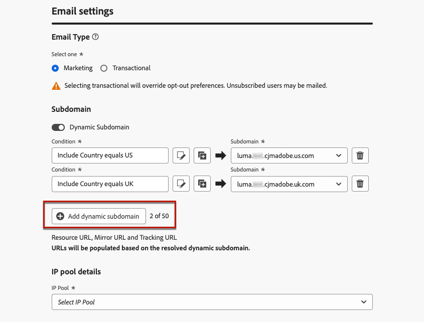
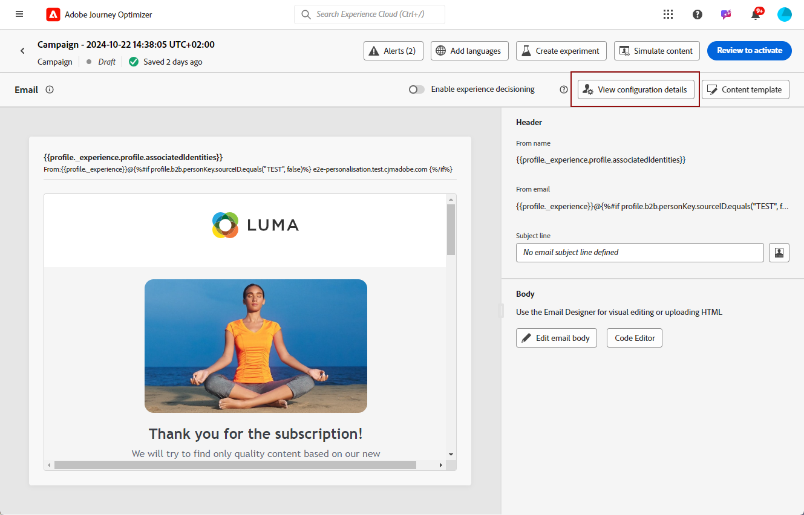

# 이메일 구성 설정 개인화 {#surface-personalization}

유연성을 높이고 이메일 설정을 제어할 수 있도록 [!DNL Journey Optimizer]을(를) 사용하면 이메일 구성을 만들 때 하위 도메인 및 헤더에 대해 개인화된 값을 정의<!--and URL tracking parameters-->할 수 있습니다.

## 동적 하위 도메인 추가 {#dynamic-subdomains}

>[!CONTEXTUALHELP]
>id="ajo_surface_perso_not_available"
>title="개인화를 사용할 수 없음"
>abstract="이 구성은 개인화 속성 없이 생성되었습니다. 개인화가 필요한 경우 해결 단계는 설명서를 참조하십시오."

>[!CONTEXTUALHELP]
>id="ajo_surface_dynamic_subdomain"
>title="동적 하위 도메인 활성화"
>abstract="이메일 구성을 생성할 때 개인화 편집기를 사용하여 정의한 조건을 기반으로 동적 하위 도메인을 설정할 수 있습니다. 최대 50개의 동적 하위 도메인을 추가할 수 있습니다."

이메일 구성을 만들 때 특정 조건에 따라 동적 하위 도메인을 설정할 수 있습니다.

예를 들어 국가별 전용 이메일 주소에서 메시지를 보낼 수 있는 법적 제한이 있는 경우 동적 하위 도메인을 사용할 수 있습니다. 이렇게 하면 각 국가에 대해 여러 구성을 만드는 대신 다른 국가에 해당하는 여러 전송 하위 도메인으로 단일 구성을 만들 수 있습니다. 그런 다음 하나의 캠페인으로 통합된 다양한 국가의 고객을 타겟팅할 수 있습니다.

이메일 채널 구성에서 동적 하위 도메인을 정의하려면 아래 단계를 따르십시오.

1. 구성을 만들기 전에 사용 사례에 따라 이메일 전송에 사용할 하위 도메인을 설정합니다. [방법 알아보기](../configuration/about-subdomain-delegation.md)

   예를 들어 국가마다 다른 하위 도메인을 사용한다고 가정해 보겠습니다. 예를 들어 미국에 고유한 하위 도메인 하나, 영국에 고유한 하위 도메인 하나를 설정합니다.

1. 채널 구성을 만듭니다. [방법 알아보기](../configuration/channel-surfaces.md)

1. **[!UICONTROL 전자 메일]** 채널을 선택하십시오.

1. **하위 도메인** 섹션에서 **[!UICONTROL 동적 하위 도메인]** 옵션을 사용하도록 설정합니다.

   

1. 첫 번째 **[!UICONTROL 조건]** 필드 옆에 있는 편집 아이콘을 선택합니다.

1. [개인화 편집기](../personalization/personalization-build-expressions.md)가 열립니다. 이 예제에서는 `Country`과(와) 같은 조건을 `US`로 설정합니다.

   

1. 이 조건과 연결할 하위 도메인을 선택하십시오. [하위 도메인에 대해 자세히 알아보기](../configuration/about-subdomain-delegation.md)

   >[!NOTE]
   >
   >보류 중인 [피드백 루프](../reports/deliverability.md#feedback-loops) 등록으로 인해 특정 하위 도메인을 선택할 수 없습니다. 이 과정은 영업일 기준 최대 10일 정도 소요될 수 있습니다. 완료되면 사용 가능한 모든 하위 도메인 중에서 선택할 수 있습니다. <!--where FL registration happens? is it when delegating a subdomain and you're awaiting from subdomain validation? or is it on ISP side only?-->

   

   미국에 기반을 둔 모든 수신자는 해당 국가에 대해 선택한 하위 도메인을 사용하여 메시지를 수신하게 됩니다. 즉, 관련된 모든 URL(예: 미러 페이지, 추적 URL 또는 구독 취소 링크)이 해당 하위 도메인을 기반으로 채워집니다.

1. 다른 동적 하위 도메인을 원하는 대로 설정합니다. 최대 50개의 항목을 추가할 수 있습니다.

   

   <!--Select the [IP pool](../configuration/ip-pools.md) to associate with the configuration. [Learn more](email-settings.md#subdomains-and-ip-pools)-->

1. 다른 [전자 메일 설정](email-settings.md) 및 [제출](../configuration/channel-surfaces.md#create-channel-surface)을(를) 모두 정의합니다.

구성에 동적 하위 도메인을 한 개 이상 추가하면 다음 항목이 이 구성에 대해 확인된 동적 하위 도메인을 기반으로 채워집니다.

* 모든 URL(리소스 URL, 미러 페이지 URL 및 추적 URL)

* [구독 취소 URL](email-settings.md#list-unsubscribe)

* **보낸 사람 전자 메일** 및 **오류 전자 메일** 접미사

>[!NOTE]
>
>동적 하위 도메인을 설정한 다음 **[!UICONTROL 동적 하위 도메인]** 옵션을 사용하지 않도록 설정하면 모든 동적 값이 제거됩니다. 하위 도메인을 선택하고 변경 사항을 적용하기 위한 구성을 제출합니다.

## 헤더 개인화 {#personalize-header}

구성에 정의된 모든 헤더 매개 변수에 개인화를 사용할 수도 있습니다.

예를 들어 여러 브랜드가 있는 경우 단일 구성을 만들고 이메일 헤더에 개인화된 값을 사용할 수 있습니다. 이를 통해 서로 다른 브랜드에서 보낸 모든 이메일이 올바른 **보낸 사람** 이름과 이메일을 사용하여 각 고객에게 발송되도록 할 수 있습니다. 마찬가지로 수신자가 이메일 클라이언트 소프트웨어에서 **회신** 버튼을 누르면 **회신 대상** 이름 및 이메일이 올바른 사용자에 대한 올바른 브랜드에 해당하게 됩니다.

구성 헤더 매개 변수에 개인화된 변수를 사용하려면 아래 단계를 따르십시오.

>[!NOTE]
>
>**[!UICONTROL 오류 이메일 접두사]** 필드를 제외한 모든 **[!UICONTROL 헤더 매개 변수]** 필드를 개인화할 수 있습니다.

1. 일반적인 방법으로 헤더 매개 변수를 정의합니다. [방법 알아보기](email-settings.md#email-header)

1. 각 필드에 대해 편집 아이콘을 선택합니다.

   

1. [개인화 편집기](../personalization/personalization-build-expressions.md)가 열립니다. 원하는 대로 조건을 정의하고 변경 사항을 저장합니다.

   <!--For example, set a condition such as each recipient receives an email from their own brand representative.-->

   >[!NOTE]
   >
   >**[!UICONTROL 프로필 특성]** 및 **[!UICONTROL 도우미 함수]**&#x200B;만 선택할 수 있습니다.

   판매 도우미를 대신하여 전송된 다이내믹한 이메일을 처리하고 싶은데, 여기서 판매 도우미는 이벤트 또는 캠페인 컨텍스트 매개 변수에서 검색됩니다. 예:

   * [여정](../building-journeys/journey-gs.md)에서 구매 이벤트가 특정 매장의 영업 도우미에 연결된 경우 이벤트 특성에서 가져온 영업 도우미 매개 변수를 사용하여 전자 메일 머리글(보낸 사람 이름, 보낸 사람 전자 메일, 회신 주소)을 개인화할 수 있습니다.

   * 판매 도우미가 외부에서 시작한 [API 트리거 캠페인](../campaigns/api-triggered-campaigns.md)에서, 캠페인 컨텍스트 매개 변수에서 가져온 판매 도우미와 헤더 개인화 값을 대신하여 트리거된 이메일을 보낼 수 있습니다.

1. 개인화를 추가할 각 매개 변수에 대해 위의 단계를 반복합니다.

>[!NOTE]
>
>구성에 동적 하위 도메인을 하나 이상 추가한 경우 **전자 메일에서** 및 **오류 전자 메일** 접미사는 해결된 [동적 하위 도메인](#dynamic-subdomains)을 기반으로 채워집니다.

<!--
## Use personalized URL tracking {#personalize-url-tracking}

To use personalized URL tracking prameters, follow the steps below.

1. Select the profile attribute of your choice from the personalization editor.

1. Repeat the steps above for each tracking parameter you want to personalize.

Now when the email is sent out, this parameter will be automatically appended to the end of the URL. You can then capture this parameter in web analytics tools or in performance reports.
-->

## 구성 세부 정보 보기 {#view-surface-details}

캠페인이나 여정에서 개인화된 설정이 있는 구성을 사용할 때 캠페인이나 여정 내에서 직접 구성 세부 정보를 표시할 수 있습니다. 아래 단계를 수행합니다.

1. [여정](../campaigns/create-campaign.md) 또는 [캠페인](../building-journeys/journey-gs.md) 전자 메일을 만듭니다.

1. **[!UICONTROL 콘텐츠 편집]** 단추를 선택하십시오.

1. **[!UICONTROL 구성 세부 정보 보기]** 단추를 클릭합니다.

   

1. **[!UICONTROL 게재 설정]** 창이 표시됩니다. 동적 하위 도메인 및 개인화된 헤더 매개 변수를 포함하여 모든 구성 설정을 볼 수 있습니다.

   >[!NOTE]
   >
   >이 화면의 모든 정보는 읽기 전용입니다.

1. 동적 하위 도메인의 세부 정보를 표시하려면 **[!UICONTROL 확장]**&#x200B;을 선택하십시오.

   

## 구성 확인 {#check-configuration}

캠페인 또는 여정에서 개인화된 구성을 사용할 때 이메일 콘텐츠를 미리 보고 정의한 동적 설정으로 잠재적인 오류가 있는지 확인할 수 있습니다. 아래 단계를 수행합니다.

1. 메시지의 콘텐츠 편집 화면 또는 이메일 Designer에서 **[!UICONTROL 콘텐츠 시뮬레이션]** 단추를 클릭합니다. [자세히 알아보기](../content-management/preview.md)

1. [테스트 프로필](../content-management/test-profiles.md)을 선택하세요.

1. 오류가 표시되면 **[!UICONTROL 구성 세부 정보 보기]** 단추를 클릭합니다.

   

1. 오류 세부 정보는 **[!UICONTROL 게재 설정]** 화면을 확인하십시오.

   

가능한 오류는 다음과 같습니다.

* 선택한 테스트 프로필에 대해 **하위 도메인**&#x200B;이(가) 확인되지 않았습니다. 예를 들어 구성에 다른 국가에 해당하는 여러 전송 하위 도메인이 사용되지만 선택한 프로필에 `Country` 특성에 대해 정의된 값이 없거나 특성이 `France`(으)로 설정되어 있지만 이 값은 해당 구성의 하위 도메인과 연결되어 있지 않습니다.

* 선택한 프로필에 하나 이상의 **헤더 매개 변수**&#x200B;에 대해 연결된 값이 없습니다.

이러한 오류가 발생하면 선택한 테스트 프로필로 이메일이 전송되지 않습니다.

이러한 유형의 오류를 방지하려면 정의하는 헤더 매개 변수가 대부분의 프로필에 대한 값과 함께 개인화된 속성을 사용하는지 확인하십시오. 값이 누락되면 이메일 전달성에 영향을 줄 수 있습니다.

>[!NOTE]
>
>[이 섹션](../reports/deliverability.md)에서 전달성에 대해 자세히 알아보기
