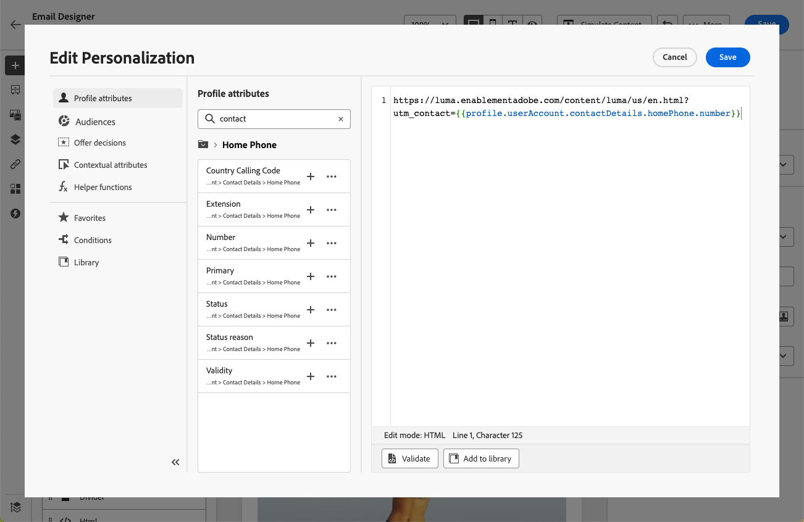

# 이메일의 URL 개인화 {#url-personalization}

개인화된 URL을 사용하면 받는 사람별 링크를 생성하거나 동적 매개 변수를 추가하는 등, [!DNL Journey Optimizer] 전자 메일 메시지를 통해 상황별 경험을 제공할 수 있습니다.

프로필 속성에 따라 수신자를 웹 사이트의 특정 페이지 또는 개인화된 마이크로사이트로 안내합니다.

## URL 개인화 {#personalize-url}

URL을 개인화하려면 아래 단계를 수행합니다.

1. 이메일 Designer에서 콘텐츠에서 요소를 선택하고 상황별 도구 모음을 사용하여 [링크 삽입](message-tracking.md#insert-links)을 합니다.

   >[!IMPORTANT]
   >
   >Personalization은 **[!UICONTROL 외부 링크]**, **[!UICONTROL 구독 취소 링크]** 및 **[!DNL Opt-Out]**&#x200B;에만 사용할 수 있습니다. 적절한 링크 유형을 선택해야 합니다.

1. 개인화 아이콘을 선택합니다.

   

1. 개인화 편집기를 사용하여 URL을 개인화할 프로필 속성을 추가합니다.

1. 변경 내용을 저장합니다.

다음은 개인화된 URL의 몇 가지 예입니다.

* `https://www.adobe.com/users/{{profile.person.name.lastName}}`
* `https://www.adobe.com/users?uid={{profile.person.name.firstName}}`
* `https://www.adobe.com/usera?uid={{context.journey.technicalProperties.journeyUID}}`
* `https://www.adobe.com/users?uid={{profile.person.crmid}}&token={{context.token}}`

>[!NOTE]
>
>개인화 편집기에서 개인화된 URL을 편집할 때 보안상의 이유로 도우미 함수와 대상자 멤버십이 비활성화됩니다.
>
>URL 내에서 사용되는 개인화 토큰에는 공백이 지원되지 않습니다.

안정적인 렌더링 및 추적을 위해 아래의 [모범 사례 및 보호 기능](#best-practices)을 따르십시오.

## 전체/기본 URL 개인화 {#personalize-complete-base-url}

Journey Optimizer은 다음과 같은 URL의 **전체** URL 또는 **기본 도메인** 개인화도 지원합니다.

```html
<a href="{{profile.social.link}}" />
<a href="{{profile.social.baseUrl}}/profile" />
<a href="https://{{profile.social.baseUrl}}/profile" />
```

>[!IMPORTANT]
>
>전체 또는 기본 URL 개인화를 활성화하려면 Adobe에 연락하여 허용된 도메인 목록을 제공하십시오. 안전하지 않은 리디렉션을 방지하기 위해 필요합니다.

## URL 추적 매개 변수 개인화 {#personalize-url-tracking-parameters}

[URL 추적](url-tracking.md)은(는) 채널 구성 수준에서 관리되며 메시지 콘텐츠에 포함된 모든 URL에 적용됩니다. 이메일 Designer에서 개별 링크에 대한 URL 추적 매개 변수를 개인화할 수도 있습니다. 이렇게 하면 수신자별 매개 변수를 단일 링크에 추가할 수 있습니다(예: 웹 분석 도구에 식별자를 전달).

이렇게 하려면 [링크를 삽입](message-tracking.md#insert-links)하고 개인화 아이콘을 선택하고 URL 추적 매개 변수를 추가한 다음 [개인화 편집기](../personalization/personalization-build-expressions.md)에서 선택한 프로필 특성을 선택하십시오.



이 추적 매개 변수를 추가할 각 링크에 대해 위의 단계를 반복합니다.

이제 이메일이 발송되면 이 매개 변수가 URL의 끝에 자동으로 추가됩니다. 그런 다음 웹 분석 도구 또는 성능 보고서에서 이 매개 변수를 캡처할 수 있습니다.

>[!NOTE]
>
>최종 URL을 확인하려면 증명을 [보내고](../content-management/proofs.md) 증명을 받은 후 전자 메일의 콘텐츠에서 링크를 클릭할 수 있습니다. URL에 추적 매개 변수가 표시되어야 합니다. 예: <https://luma.enablementadobe.com/content/luma/us/en.html?utm_contact=profile.userAccount.contactDetails.homePhone.number>

<!--
## Best practices and guardrails {#best-practices}

To keep links valid, clickable, and trackable, follow the best practices and guardrails below.

### Braces for dynamic URLs {#use-braces}

When inserting a URL that contains personalization, use three curly braces (`{{{ ... }}}`) for the dynamic portion of the URL. This prevents escaping from altering special characters (for example `/` and `+`) and helps avoid broken URLs, incorrect redirects, or tracking issues.

Here is an example:

```html
<a href="https://example.com/path/{{{profile.person.customSlug}}}?ref={{{context.system.source.id}}}">View details</a>
```

>[!IMPORTANT]
>
>Using raw output (`{{{ ... }}}`) means the value is inserted as-is. Only use it with values you trust and that are intended to be URL-safe (for example, values you generate or validate upstream).

### Correct URL tracking {#enable-url-tracking}

* When using personalization to generate the URL, ensure the resolved value starts with `http`/`https` for every recipient. Otherwise, tracking may not be applied and the link may not behave as expected.

* Do not use dynamic logic such as `let`, `each`, or `if` statements directly in the personalization editor's URL field. These are disabled for security reasons.

* If your scenario involves complex logic to generate personalized URLs, avoid placing that logic directly in the personalization editor's URL field. Instead:
    * Add the necessary logic and statements in the HTML content above or near the URL field.
    * Generate and store personalized attributes separately, then reference them in your email content.

### URL encoding and length {#encoding}

* URI syntax rules ([RFC 3986 standard](https://datatracker.ietf.org/doc/html/rfc3986){target="_blank"}) apply to all URLs in your email content. However, personalized URLs are more likely to surface encoding issues because recipient-specific values can introduce reserved characters (for example in query parameters). Therefore, ensure your dynamic values are URL-encoded (especially spaces, `&`, `#`, `%`, and `+`) and avoid using `+` for query values.

* Very long URLs can be truncated or rejected by browsers, mail clients, or downstream systems. For example, mirror page URLs can grow significantly when runtime personalization is heavy. Keep personalized payloads small and avoid embedding large objects into URLs.

### Recommended validation steps {#validation}

Before activating a journey or campaign, follow the recommendations below:

* Send a [proof](../content-management/proofs.md) and click links to confirm the resolved URL starts with `http`/`https` and keeps the expected structure.
* If tracking parameters are appended, confirm the final URL includes them (either via configuration-level URL tracking or per-link tracking parameters).
-->
