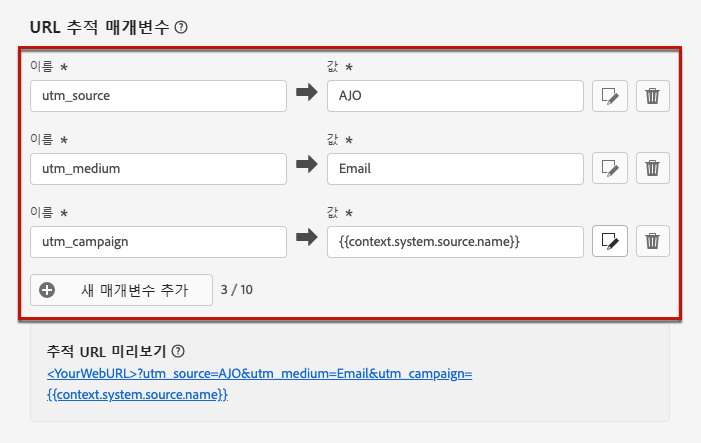

# URL 추적 {#url-tracking}

>[!CONTEXTUALHELP]
>id="ajo_admin_preset_utm"
>title="URL 추적 매개변수 정의"
>abstract="이 섹션을 사용하여 추적 매개변수를 이메일 콘텐츠에 있는 URL에 자동으로 추가합니다. 이 기능은 선택 사항입니다."

>[!CONTEXTUALHELP]
>id="ajo_admin_preset_url_preview"
>title="URL 추적 매개변수 미리보기"
>abstract="추적 매개변수를 이메일 콘텐츠에 있는 URL에 추가하는 방법을 확인합니다."

새 [전자 메일 채널 구성](email-settings.md)을 구성할 때 **[!UICONTROL URL 추적 매개 변수]**&#x200B;를 정의하여 채널 전반에서 마케팅 활동의 효과를 측정할 수 있습니다. 이 기능은 활성화할 수 없습니다.

해당 섹션에 정의된 매개 변수가 이메일 메시지 콘텐츠에 포함된 URL의 끝에 추가됩니다. 그런 다음 Adobe Analytics나 Google Analytics 등 웹 분석 도구에서 이 매개변수를 캡처하여 다양한 성과 보고서를 만들 수 있습니다.

**[!UICONTROL 새 매개변수 추가]** 버튼을 사용하여 최대 10개의 추적 매개변수를 추가할 수 있습니다.

{width="80%"}

URL 추적 매개변수를 구성하기 위해 **[!UICONTROL 이름]** 및 **[!UICONTROL 값]** 필드에 원하는 값을 직접 입력할 수 있습니다.

[개인화 편집기](../personalization/personalization-build-expressions.md)를 사용하여 각 **[!UICONTROL 값]** 필드를 편집할 수도 있습니다. 편집 아이콘을 클릭하여 편집기를 엽니다. 여기에서는 사용 가능한 상황별 속성을 선택하거나 텍스트를 직접 편집할 수 있습니다.

개인화 편집기를 통해 다음과 같은 사전 정의된 값을 사용할 수 있습니다.

* **소스 액션 ID**: 여정 또는 캠페인에 추가된 이메일 액션의 ID입니다.

* **소스 액션 이름**: 여정 또는 캠페인에 추가된 이메일 액션의 이름입니다.

* **소스 ID**: 이메일을 보낸 여정 또는 캠페인의 ID입니다.

* **소스 이름**: 이메일을 보낸 여정 또는 캠페인의 이름입니다.

* **소스 버전 ID**: 이메일을 보낸 여정 또는 캠페인 버전의 ID입니다.

* **오퍼 ID**: 이메일에 사용된 오퍼의 ID입니다.

>[!NOTE]
>
>개인화 편집기의 상황별 속성 사용과 텍스트 값 입력을 결합하여 사용할 수 있습니다. 각 **[!UICONTROL 값]** 필드에는 최대 5KB까지 여러 문자를 사용할 수 있습니다.

<!--You can drag and drop the parameters to reorder them.-->

다음은 Adobe Analytics 및 Google Analytics 호환 URL의 예입니다.

* Adobe Analytics 호환 URL: `www.YourLandingURL.com?cid=email_AJO_{{context.system.source.id}}_image_{{context.system.source.name}}`

* Google Analytics 호환 URL: `www.YourLandingURL.com?utm_medium=email&utm_source=AJO&utm_campaign={{context.system.source.id}}&utm_content=image`

결과 추적 URL을 동적으로 미리 볼 수 있습니다. 매개변수를 추가, 편집 또는 제거할 때마다 미리보기가 자동으로 업데이트됩니다.

>[!NOTE]
>
>이메일 콘텐츠에 있는 링크에 동적 개인화 추적 매개변수를 추가할 수도 있지만, 구성 수준에서는 가능하지 않습니다. 이 작업은 이메일 디자이너를 사용하여 메시지를 작성할 때 수행해야 합니다. [자세히 알아보기](message-tracking.md#url-tracking)
