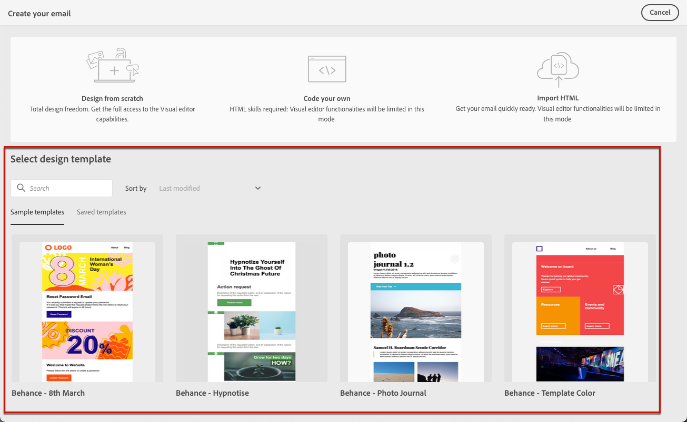

# 이메일 템플릿 사용 {#email-templates}

>[!BEGINSHADEBOX]

**이 페이지에서:** 전자 메일 Designer의 샘플 또는 저장된 디자인 템플릿에서 전자 메일 콘텐츠 작성을 시작하는 방법에 대해 알아봅니다.

>[!ENDSHADEBOX]

>[!CONTEXTUALHELP]
>id="ajo_use_template"
>title="템플릿에서 콘텐츠 제작"
>abstract="이메일 콘텐츠를 만들려면 기본 제공 템플릿 또는 처음부터 새로 만들었거나 이전 이메일에서 템플릿으로 저장한 기존 사용자 정의 템플릿 중 하나를 선택하십시오."

**[!UICONTROL 전자 메일 만들기]** 화면에서 **[!UICONTROL 디자인 템플릿 선택]** 섹션을 사용하여 템플릿에서 콘텐츠 빌드를 시작합니다.

다음 중에서 선택할 수 있습니다.

* **샘플 템플릿**. [!DNL Journey Optimizer] 인터페이스에서는 선택할 수 있는 20개의 기본 전자 메일 템플릿을 제공합니다.

* **저장된 템플릿**. 다음 중 한 가지 방법으로 사용자 지정 템플릿을 사용할 수도 있습니다.

   * **[!UICONTROL 콘텐츠 템플릿]** 메뉴를 사용하여 처음부터 새로 만들었습니다. [자세히 알아보기](../content-management/content-templates.md#content-templates)

   * **[!UICONTROL 콘텐츠 템플릿으로 저장]** 옵션을 사용하여 여정 또는 캠페인에 있는 전자 메일에서 저장되었습니다. [자세히 알아보기](../content-management/content-templates.md#video-templates)

샘플 또는 저장된 템플릿 중 하나를 사용하여 콘텐츠 작성을 시작하려면 아래 단계를 따르십시오.

1. [전자 메일 **[!UICONTROL 콘텐츠 편집]** 화면에서 전자 메일 Designer에 액세스](get-started-email-design.md)합니다.

1. **[!UICONTROL 전자 메일 만들기]** 화면에서 기본적으로 **[!UICONTROL 샘플 템플릿]** 탭이 선택됩니다.

1. 사용자 지정 템플릿을 사용하려면 **[!UICONTROL 저장된 템플릿]** 탭으로 이동하십시오.

   

1. 현재 샌드박스에서 만든 모든 [콘텐츠 템플릿](../content-management/content-templates.md#content-templates) 목록이 표시됩니다. **[!UICONTROL 이름]**, **[!UICONTROL 마지막 수정일]** 및 **[!UICONTROL 마지막 생성일]**&#x200B;을 기준으로 템플릿을 정렬할 수 있습니다.

   

1. 목록에서 원하는 템플릿을 선택합니다.

1. 선택한 후에는 오른쪽 및 왼쪽 화살표를 사용하여 한 카테고리의 모든 템플릿(선택에 따라 샘플 또는 저장) 간을 탐색할 수 있습니다.

   

1. 화면 오른쪽 상단의 **[!UICONTROL 이 서식 파일 사용]**&#x200B;을 클릭합니다.

1. 이메일 Designer을 사용하여 원하는 대로 콘텐츠를 편집합니다.
