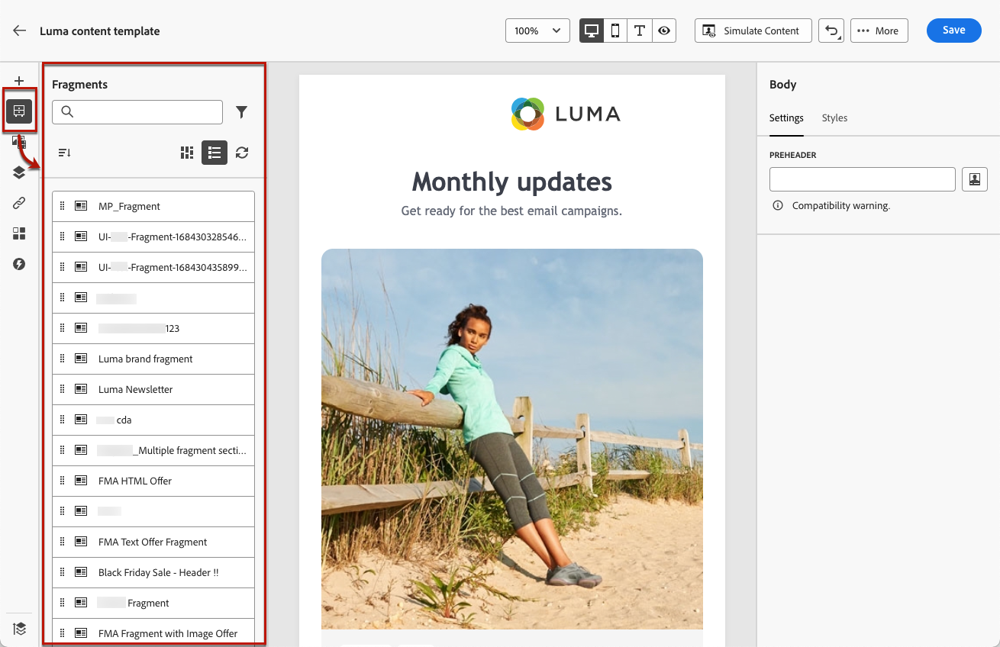
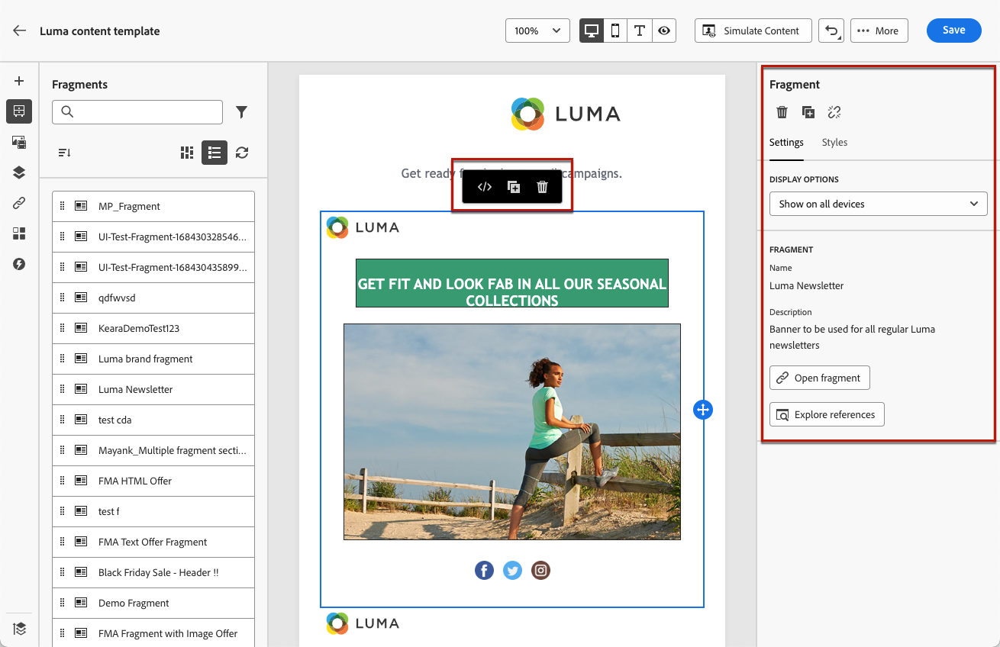
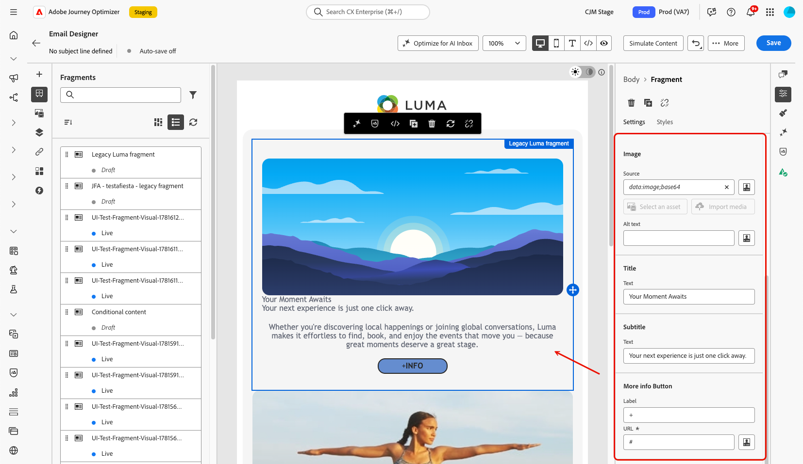
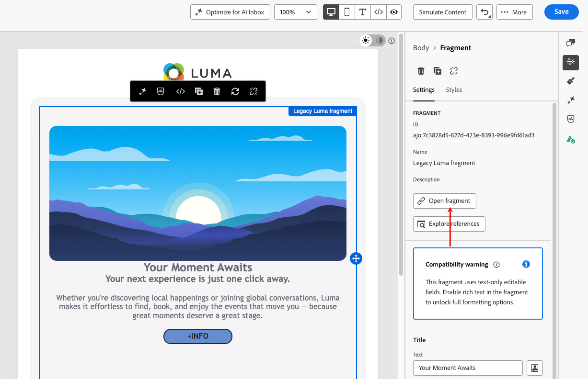
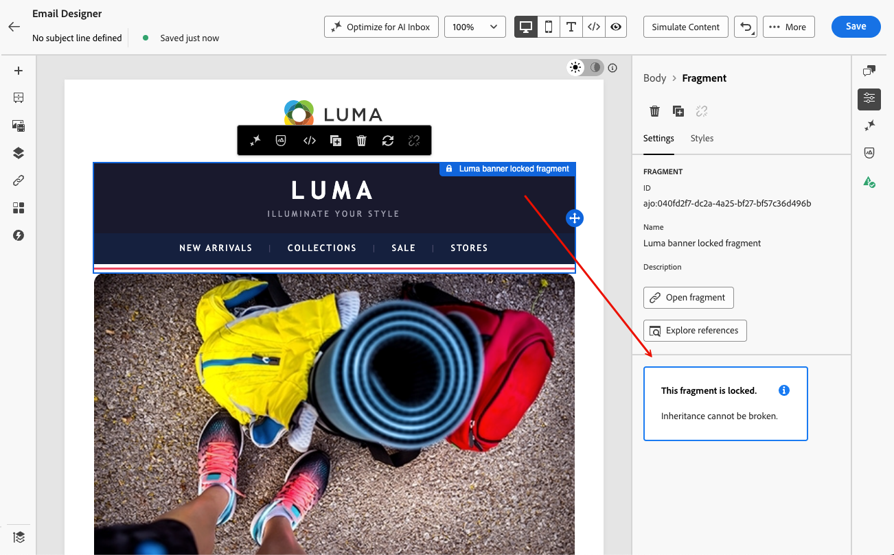

# 이메일에 비주얼 조각 추가 {#use-visual-fragments}

>[!BEGINSHADEBOX]

**이 페이지에서:** 재사용할 수 있는 시각적 조각을 전자 메일에 삽입하고, 편집 가능한 필드를 사용자 지정하고, 원본 조각으로 상속을 끊거나 유지하는 방법을 알아봅니다.

>[!ENDSHADEBOX]

조각은 Journey Optimizer 캠페인, 여정 또는 콘텐츠 템플릿 간의 하나 이상의 이메일에서 참조할 수 있는 재사용 가능한 구성 요소입니다. 이 기능을 사용하면 마케팅 사용자가 향상된 디자인 프로세스에서 이메일 콘텐츠를 빠르게 조합하는 데 사용할 수 있는 여러 사용자 지정 콘텐츠 블록을 사전 빌드할 수 있습니다. [조각을 만들고 관리하는 방법을 알아보세요](../content-management/fragments.md).

➡️ [이 비디오에서 조각을 관리, 작성 및 사용하는 방법을 알아봅니다.](../content-management/fragments.md#video-fragments)

## 조각 사용 {#use-fragment}

이메일에 조각을 사용하려면 아래 단계를 따르십시오.

>[!NOTE]
>
>주어진 게재에서 최대 30개의 조각을 추가할 수 있습니다. 조각은 최대 1개 수준까지만 중첩할 수 있습니다.

1. [전자 메일 Designer](get-started-email-design.md)을(를) 사용하여 전자 메일 또는 템플릿 콘텐츠를 엽니다.

1. 왼쪽 레일에서 **[!UICONTROL 조각]** 아이콘을 선택합니다.

   

1. 현재 샌드박스에서 만든 모든 시각적 조각 목록이 표시됩니다. 만든 날짜별로 정렬됩니다. 최근에 추가된 시각적 조각이 목록에 먼저 표시됩니다. 다음과 같은 작업을 수행할 수 있습니다.

   * 레이블 입력을 시작하여 특정 조각을 검색합니다.
   * 오름차순 또는 내림차순으로 조각을 정렬합니다.
   * 조각이 표시되는 방법(카드 또는 목록 보기)을 변경합니다.
   * 목록을 새로 고칩니다.

   >[!NOTE]
   >
   >콘텐츠를 편집하는 동안 일부 조각이 수정되거나 추가된 경우 목록이 최신 변경 내용으로 업데이트됩니다.

1. 목록의 조각을 삽입할 영역으로 끌어다 놓습니다.

   

   >[!CAUTION]
   >
   >콘텐츠에 **초안** 또는 **라이브** 조각을 추가할 수 있습니다. 하지만 초안 상태의 조각을 사용 중인 경우에는 여정 또는 캠페인을 활성화할 수 없습니다. 여정 또는 캠페인 게시 시 초안 조각에 오류가 표시되며 이를 승인해야 게시할 수 있습니다.

1. 다른 구성 요소와 마찬가지로 콘텐츠에서 조각을 이동할 수 있습니다.

1. 조각을 선택하여 오른쪽에 해당 창을 표시합니다. 여기에서 콘텐츠에서 조각을 삭제하거나 복제할 수 있습니다. 조각 위에 표시되는 상황별 메뉴에서 직접 이러한 작업을 수행할 수도 있습니다.

   

1. **[!UICONTROL 설정]** 탭에서 다음을 수행할 수 있습니다.

   * 조각을 표시할 장치를 선택합니다.
   * 새 탭에서 조각을 열고 필요한 경우 편집합니다. [자세히 알아보기](../content-management/manage-fragments.md#edit-fragments)
   * 참조 살펴보기. [자세히 알아보기](../content-management/fragments.md#visual-expression)

1. 필요한 경우 원본 조각으로 상속을 중단할 수 있습니다. [자세히 알아보기](#break-inheritance)

   잠금을 해제하면 다른 구성 요소로 조각을 추가로 사용자 지정하고 **[!UICONTROL 스타일]** 탭을 사용할 수 있습니다.

1. 원하는 만큼 조각을 추가하고 변경 내용을 **[!UICONTROL 저장]**&#x200B;합니다.

## 조각의 조건부 콘텐츠 관리 {#fragment-dynamic-content}

조건부 콘텐츠가 포함된 시각적 조각을 사용하여 작업할 때 다음 지침을 따르십시오. [다이내믹 콘텐츠에 대해 자세히 알아보기](../personalization/dynamic-content.md#emails)

>[!CAUTION]
>
>**조건부 콘텐츠로 조각 중첩을 지원하지 않습니다.** 조건부 콘텐츠가 포함된 잠금 해제된 조각 내에 조건부 콘텐츠가 포함된 조각을 배치할 수 없습니다. 이 지원되지 않는 구성으로 인해 다음과 같은 문제가 발생할 수 있습니다.
>
>* 조건부 콘텐츠 변형 매핑 손실
>* 이메일 Designer의 호환성 모드 경고
>* 일관성 없는 이메일 렌더링

**전자 메일을 올바르게 구조화:** 조건부 콘텐츠로 여러 조각을 사용하는 경우 각 조각을 전자 메일 수준의 자체 구조 블록에 직접 추가하십시오. 조건부 콘텐츠도 포함하는 잠금 해제된 다른 조각 내에 조건부 콘텐츠가 있는 조각을 중첩하지 마십시오.

**미리 계획하기:** 전자 메일에 조각을 추가하기 전에 조건부 콘텐츠가 포함된 조각을 식별하고 그에 따라 레이아웃을 계획합니다. 이렇게 하면 구성 문제를 방지하고 처음부터 깔끔한 구조를 만들 수 있습니다.

**재사용 가능한 조각 디자인:** 조건부 콘텐츠가 포함될 조각을 만들 때 해당 조각의 사용 방법을 고려하십시오. 조각을 다른 조각 내에 중첩해야 하는 경우 상위 조각과 하위 조각 모두에 조건부 콘텐츠를 추가하지 마십시오.

**문제 해결:** 손실된 조건부 콘텐츠 변형 매핑 또는 호환성 모드 경고가 발생한 경우 아래 단계를 수행하십시오.

* 이메일 구조에 조건부 콘텐츠가 포함된 중첩된 조각이 있는지 확인
* 조건부 콘텐츠가 있는 각 조각을 이메일 수준에서 자체 구조 블록으로 이동하여 재구성
* 조건부 콘텐츠 변형이 제대로 복원되었는지 저장 및 확인

## 암시적 변수 사용 {#implicit-variables-in-fragments}

암시적 변수는 기존 조각 기능을 향상시켜 콘텐츠 재사용 가능성 및 스크립팅 사용 사례의 효율성을 개선합니다. 조각은 입력 변수를 사용하고 캠페인 및 여정 콘텐츠에 사용할 수 있는 출력 변수를 만들 수 있습니다.

[이 섹션](../personalization/use-expression-fragments.md#implicit-variables)에서 암시적 변수를 사용하는 방법을 알아봅니다.

## 편집 가능한 필드 사용자 지정 {#customize-fields}

선택한 조각의 특정 부분을 편집할 수 있게 만든 경우 조각을 콘텐츠에 추가한 후 기본값을 무시할 수 있습니다. [조각을 사용자 지정할 수 있게 만드는 방법을 알아봅니다](../content-management/customizable-fragments.md)

이메일에 사용된 조각에서 편집 가능한 필드를 사용자 정의하려면 다음 단계를 따르십시오.

1. 사용자 지정 가능한 조각을 전자 메일 콘텐츠에 추가한 다음 선택하여 오른쪽의 **[!UICONTROL 조각]** 창을 엽니다.

1. 조각에서 편집 가능한 모든 필드는 조각 속성 아래의 **[!UICONTROL 설정]** 탭에 표시됩니다.

   아래 예에서 이미지 소스와 대체 텍스트는 물론 &quot;제목&quot;/&quot;부제&quot; 필드와 &quot;추가 정보&quot; 버튼 URL을 편집할 수 있습니다.

   

1. 중앙 캔버스에서 편집 가능한 필드 위로 마우스를 가져갑니다. 필드는 녹색으로 강조 표시되고 포함된 텍스트를 클릭하면 연필 아이콘이 표시됩니다.

   {width="80%" align="center"}

1. 중앙 이메일 Designer 캔버스에서 직접 필드 텍스트를 인라인으로 편집합니다.

   >[!NOTE]
   >
   >콘텐츠에서 편집 가능한 필드를 쉽게 찾기 위해 오른쪽 창에서 선택할 수도 있지만 중앙 캔버스에서 이러한 필드만 편집할 수 있습니다.

1. **[!UICONTROL Text]**, **[!UICONTROL Button]** 및 **[!UICONTROL Html]** 구성 요소의 경우 이메일 Designer 도구 모음을 통해 굵게, 기울임꼴, 하이퍼링크 등 서식 있는 텍스트 서식 옵션에 액세스할 수도 있습니다.

   

   >[!TIP]
   >
   >리치 텍스트 편집 기능이 도입되기 전에 만들어진 조각은 기본적으로 편집 가능한 필드가 텍스트 전용 모드로 설정되어 있습니다. 전체 서식 옵션을 사용하려면 **[!UICONTROL 조각 열기]** 단추를 사용하여 조각 편집기로 이동하고 **[!UICONTROL 활성화]**&#x200B;를 클릭하여 서식 있는 텍스트 모드를 잠금 해제하고 조각을 **[!UICONTROL 저장]**&#x200B;하십시오. [자세히 알아보기](../content-management/customizable-fragments.md#rich-text-visual)

   {width="50%" align="left" zoomable="yes"}

1. **[!UICONTROL 콘텐츠 시뮬레이션]**&#x200B;을 클릭하여 편집 가능한 콘텐츠와 스타일이 렌더링되는 방식을 확인할 수 있습니다. [콘텐츠 미리 보기에 대한 자세한 정보](../content-management/preview-test.md)

>[!CAUTION]
>
>버튼 구성 요소의 **label** 및 **URL**&#x200B;을(를) 모두 조각에서 편집할 수 있게 되면 추적 보고서에 버튼 레이블 대신 URL이 표시됩니다. [추적에 대해 자세히 알아보기](message-tracking.md)

## 상속 중단 {#break-inheritance}

시각적 조각을 편집하면 변경 사항이 동기화됩니다. 모든 초안 또는 라이브 여정/캠페인 및 해당 조각을 포함하는 콘텐츠 템플릿에 자동으로 전파됩니다.

이메일 또는 콘텐츠 템플릿에 추가되면 조각은 기본적으로 동기화됩니다. 그러나 원본 조각에서 상속을 중단할 수 있습니다. 이 경우 조각의 콘텐츠가 현재 디자인에 복사되며, 변경 사항은 더 이상 동기화되지 않습니다.

상속을 중단하려면 아래 단계를 수행합니다.

1. 조각을 선택합니다.

1. 상황별 툴바에서 잠금 해제 아이콘을 클릭합니다.

   

1. 해당 조각은 원래 조각에 더 이상 연결되지 않는 독립 실행형 요소가 됩니다. 콘텐츠의 다른 콘텐츠 구성 요소로 편집합니다. [자세히 알아보기](content-components.md)

### 잠긴 조각 {#locked-fragments}

작성자가 조각을 잠근 경우 잠금 해제 아이콘이 회색으로 표시되고 상속을 중단하는 데 사용할 수 없습니다.

잠긴 조각은 나타나는 모든 곳에서 동기화된 상태로 유지되므로 브랜드 표준이나 규정 준수 요구 사항을 위반할 수 있는 로컬 편집을 방지할 수 있습니다.

[이 섹션](../content-management/create-fragments.md#lock-visual-fragment)에서 조각을 잠그는 방법에 대해 알아봅니다.

>[!NOTE]
>
>조각 작성자는 나중에 조각 설정에서 상속이 끊어지도록 **[!UICONTROL 허용]**(으)로 동작을 다시 설정하여 설정을 변경할 수 있습니다.

