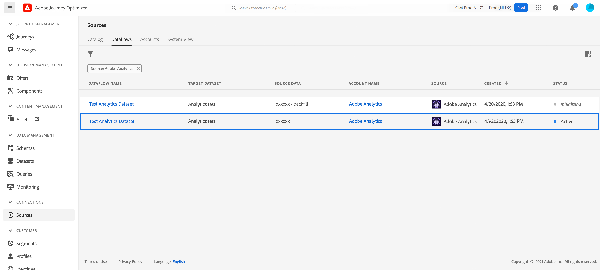

# Adobe Analytics 데이터 활용{#analytics-data}

이미 플랫폼에 스트리밍 및 캡처하고 있는 모든 Adobe Analytics 행동 이벤트 데이터를 활용하여 여정을 트리거하고 고객을 위한 경험을 자동화할 수 있습니다.

>[!NOTE]
>
>이 섹션은 Adobe Analytics 데이터를 사용해야 하는 규칙 기반 이벤트 및 고객에게만 적용됩니다.

이를 수행하려면 Adobe Experience Platform에서 활용할 보고서 세트를 활성화해야 합니다.

1. Adobe Experience Platform의 Adobe Analytics 섹션에서 **[!UICONTROL Sources]** 을 선택하고 **[!UICONTROL Add data]** 을 선택합니다. 사용 가능한 Adobe Analytics 보고서 세트 목록이 표시됩니다.

1. 활성화할 보고서 세트를 선택하고 **[!UICONTROL Next]** 을 클릭한 다음 **[!UICONTROL Finish]** 를 클릭합니다.

1. 소스 데이터 ID를 베타 프로그램 담당자와 공유합니다.

이렇게 하면 해당 보고서 세트에 대한 Analytics 소스 커넥터가 활성화됩니다. 데이터가 들어올 때마다 경험 이벤트로 변환되어 Adobe Experience Platform으로 전송됩니다.

[Adobe Experience Platform 설명서](https://experienceleague.adobe.com/docs/experience-platform/sources/connectors/adobe-applications/analytics.html){target=&quot;_blank&quot;} 및 [tutorial](https://experienceleague.adobe.com/docs/experience-platform/sources/ui-tutorials/create/adobe-applications/analytics.html){target=&quot;_blank&quot;}에서 Adobe Analytics 소스 커넥터에 대해 자세히 알아보십시오.
