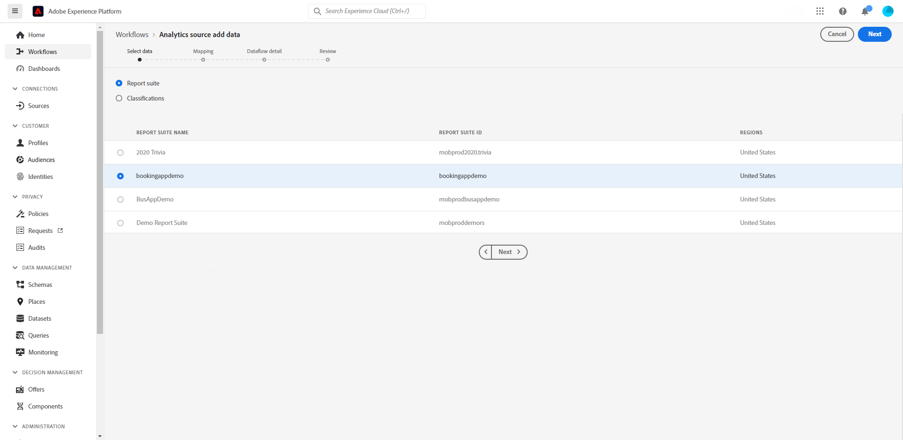
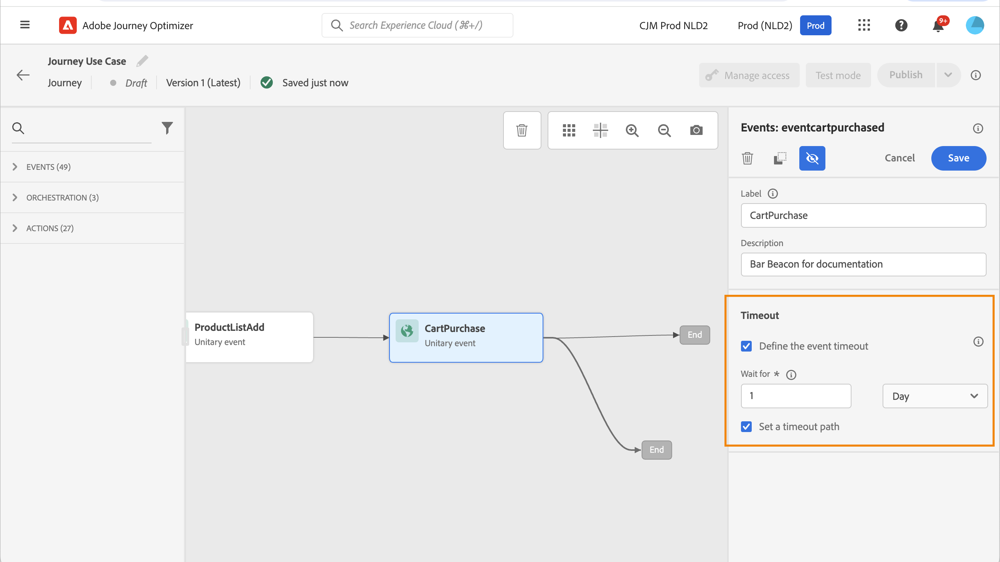

# Adobe Analytics 데이터 작업 {#analytics-data}

Adobe Analytics 또는 Web SDK을 통해 이미 캡처하고 Adobe Experience Platform으로 스트리밍하는 모든 웹 행동 이벤트 데이터를 활용하여 고객을 위한 여정을 트리거하고 경험을 자동화할 수 있습니다.

Adobe Analytics에서 사용하려면 다음을 수행해야 합니다.

1. 사용할 보고서 세트를 활성화합니다. [자세히 알아보기](#leverage-analytics-data)
1. Journey Optimizer에서 Adobe Analytics 데이터 소스를 사용할 수 있도록 합니다. [자세히 알아보기](#activate-analytics-data)
1. 여정에 특정 이벤트를 추가합니다. [자세히 알아보기](#event-analytic)

>[!NOTE]
>
>이 섹션은 Adobe Analytics 또는 웹 SDK 데이터를 사용해야 하는 규칙 기반 이벤트 및 고객에게만 적용됩니다.
> 
>Adobe Customer Journey Analytics을 사용하는 경우 [이 페이지](../reports/cja-ajo.md)를 참조하세요.
>

## Adobe Analytics 또는 웹 SDK 데이터 구성 {#leverage-analytics-data}

Adobe Analytics 또는 Adobe Experience Platform Web SDK에서 가져온 데이터를 여정에서 사용하려면 활성화해야 합니다.

이렇게 하려면 아래 단계를 수행합니다.

1. **[!UICONTROL 소스]** 메뉴로 이동합니다.

1. Adobe Analytics 섹션에서 **[!UICONTROL 데이터 추가]**&#x200B;를 선택합니다.

   

1. 사용 가능한 Adobe Analytics 보고서 세트 목록에서 활성화할 **[!UICONTROL 보고서 세트]**&#x200B;를 선택합니다. 그런 다음 **[!UICONTROL 다음]**&#x200B;을 클릭합니다.

   

1. 기본 또는 사용자 지정 스키마를 사용할지 여부를 선택합니다.

1. **[!UICONTROL 데이터 흐름 세부 정보]** 화면에서 **[!UICONTROL 데이터 흐름 이름]**&#x200B;을 선택하세요.

1. 구성이 완료되면 **[!UICONTROL 마침]**&#x200B;을 클릭합니다.

   

이렇게 하면 해당 보고서 세트에 대한 Analytics 소스 커넥터가 활성화됩니다. 데이터가 들어올 때마다 경험 이벤트로 변환되어 Adobe Experience Platform으로 전송됩니다.

[Adobe Analytics 설명서](https://experienceleague.adobe.com/docs/experience-platform/sources/connectors/adobe-applications/analytics.html){target="_blank"} 및 [자습서](https://experienceleague.adobe.com/docs/experience-platform/sources/ui-tutorials/create/adobe-applications/analytics.html){target="_blank"}에서 Adobe Experience Platform 소스 커넥터에 대해 자세히 알아보세요.

## 이 구성 활성화 {#activate-analytics-data}

이 구성이 완료되면 Adobe에 문의하여 Journey Optimizer 환경에서 이 데이터 소스를 사용할 수 있도록 설정하십시오. 이 단계는 Adobe Analytics 데이터 소스에만 필요합니다. 다음을 수행하십시오.

1. 데이터 소스 ID를 가져옵니다. 이 정보는 사용자 인터페이스에서 사용할 수 있습니다. **원본** 메뉴의 **데이터 흐름** 탭에서 만든 데이터 원본을 찾습니다. 이를 찾는 가장 쉬운 방법은 Adobe Analytics 소스를 필터링하는 것입니다.
1. 다음 세부 정보는 Adobe 고객 지원 센터에 문의하십시오.

   * 제목: 여정에 대해 Adobe Analytics 이벤트 활성화

   * 콘텐츠: AA 이벤트를 사용하도록 내 환경을 활성화하십시오.

      * 조직 ID: &quot;XXX@AdobeOrg&quot;

      * 데이터 소스 ID: &quot;ID: xxxxx&quot;

1. 환경이 준비되었다는 확인이 있으면 여정에서 Adobe Analytics 데이터를 사용할 수 있습니다.

## Adobe Analytics 또는 Web SDK 데이터를 사용하여 이벤트가 있는 여정 만들기 {#event-analytics}

이제 여정에서 사용할 Adobe Analytics 또는 Adobe Experience Platform Web SDK 데이터를 기반으로 이벤트를 만들 수 있습니다.

아래 예에서는 장바구니에 제품을 추가한 사용자를 타겟팅하는 방법을 알아봅니다.

* 주문이 완료되면 사용자는 이틀 후 피드백을 요청하는 후속 이메일을 받습니다.
* 주문이 완료되지 않은 경우, 사용자는 주문을 완료하라는 이메일을 받게 됩니다.

1. Adobe Journey Optimizer에서 **[!UICONTROL 구성]** 메뉴에 액세스합니다.

1. 그런 다음 **[!UICONTROL 이벤트]** 카드에서 **[!UICONTROL 관리]**&#x200B;를 선택합니다.

   

1. **[!UICONTROL 이벤트 만들기]**&#x200B;를 클릭합니다. 그러면 화면 오른쪽에 이벤트 구성 창이 열립니다.

1. **[!UICONTROL Event]** 매개 변수 입력:

   * **[!UICONTROL 이름]**: **[!UICONTROL 이벤트]**&#x200B;의 이름을 개인화합니다.
   * **[!UICONTROL 유형]**: **[!UICONTROL 단일]** 유형을 선택합니다. [자세히 알아보기](../event/about-events.md)
   * **[!UICONTROL 이벤트 ID 유형]**: **[!UICONTROL 규칙 기반]** 이벤트 ID 유형을 선택합니다. [자세히 알아보기](../event/about-events.md#event-id-type)
   * **[!UICONTROL 스키마]**: [&#128279;](#leverage-analytics-data) 전에 만든 Analytics 또는 WebSDK 스키마 을(를) 선택하십시오.
   * **[!UICONTROL 필드]**: 페이로드 필드를 선택합니다. [자세히 알아보기](../event/about-creating.md#define-the-payload-fields)
   * **[!UICONTROL 여정 ID 조건]**: 이벤트를 트리거할 이벤트를 식별하는 조건을 정의합니다.

     여기서 이벤트는 고객이 장바구니에 품목을 추가할 때 트리거됩니다.
   * **[!UICONTROL 프로필 식별자]**: 페이로드 필드에서 필드를 선택하거나 공식을 정의하여 이벤트와 연결된 사용자를 식별합니다.

   

1. 구성된 경우 **[!UICONTROL 저장]**&#x200B;을 선택합니다.

이제 이벤트가 준비되었으므로 사용할 여정을 만듭니다.

1. **[!UICONTROL 여정]** 메뉴에서 여정을 열거나 만듭니다. 이 작업에 대한 자세한 정보는 [이 섹션](../building-journeys/journey-gs.md)을 참조하십시오.

1. 이전에 구성한 Analytics 이벤트를 여정에 추가합니다.

   

1. 주문이 완료되면 트리거되는 이벤트를 추가합니다.

1. **[!UICONTROL 이벤트 메뉴]**&#x200B;에서 **[!UICONTROL 이벤트 시간 제한 정의]** 및 **[!UICONTROL 시간 제한 경로 설정]** 옵션을 선택합니다.

   

1. 시간 제한 경로에서 **[!UICONTROL 전자 메일]** 작업을 추가합니다. 이 경로는 주문을 완료하지 않은 고객에게 카트를 계속 사용할 수 있음을 알리는 이메일을 보내는 데 사용됩니다.

1. 기본 경로 뒤에 **[!UICONTROL 대기]** 활동을 추가하고 필요한 기간으로 설정합니다.

   

1. 그런 다음 **[!UICONTROL 전자 메일 동작]**&#x200B;을 추가하세요. 이 이메일에는 주문한 제품에 대한 피드백을 제공하라는 메시지가 표시됩니다.

이제 여정을 테스트하고 게시할 수 있습니다. [자세히 알아보기](../building-journeys/publishing-the-journey.md)

