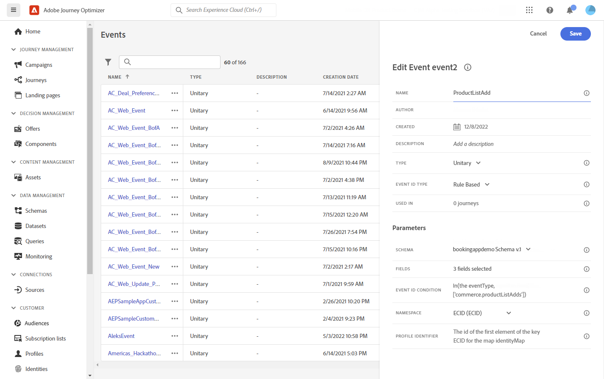

# Adobe Analytics 통합 {#analytics-data}

## Adobe Analytics 또는 Web SDK 데이터 활용 {#leverage-analytics-data}

Adobe Analytics 또는 Web SDK를 통해 이미 Adobe Experience Platform으로 캡처 및 스트리밍하고 있는 모든 웹 행동 이벤트 데이터를 활용하여 여정을 트리거하고 고객을 위한 경험을 자동화할 수 있습니다.

>[!NOTE]
>
>이 섹션은 Adobe Analytics 또는 WebSDK 데이터를 사용해야 하는 규칙 기반 이벤트 및 고객에게만 적용됩니다.

Adobe Analytics에서 사용하려면 사용할 보고서 세트를 Adobe Experience Platform에서 활성화해야 합니다. 이렇게 하려면 아래 단계를 수행합니다:

1. Adobe Experience Platform에 연결하고 **[!UICONTROL 소스]**.

1. Adobe Analytics 섹션에서 을(를) 선택합니다 **[!UICONTROL 데이터 추가]**

   

1. 사용 가능한 Adobe Analytics 보고서 세트 목록에서 **[!UICONTROL 보고서 세트]** 활성화하십시오. 그런 다음 **[!UICONTROL 다음]**.

   

1. 기본 또는 사용자 지정 스키마를 사용할지 선택합니다.

1. 에서 **[!UICONTROL 데이터 흐름 세부 정보]** 화면에서 **[!UICONTROL 데이터 흐름 이름]**.

1. 구성이 완료되면 을(를) 클릭합니다. **[!UICONTROL 완료]**.

   

이렇게 하면 해당 보고서 세트에 대한 Analytics 소스 커넥터가 활성화됩니다. 데이터가 들어올 때마다 경험 이벤트로 변환되어 Adobe Experience Platform으로 전송됩니다.

에서 Adobe Analytics 소스 커넥터에 대해 자세히 알아보십시오  [Adobe Experience Platform 설명서](https://experienceleague.adobe.com/docs/experience-platform/sources/connectors/adobe-applications/analytics.html?lang=ko-KR){target=&quot;_blank&quot;} 및 [튜토리얼](https://experienceleague.adobe.com/docs/experience-platform/sources/ui-tutorials/create/adobe-applications/analytics.html?lang=ko-KR){target=&quot;_blank&quot;}.

## Adobe Analytics 또는 웹 SDK 데이터를 사용하여 이벤트를 사용하여 여정 만들기 {#event-analytics}

Adobe Analytics과 통합을 구현한 후 [Adobe Analytics 소스](#leverage-analytics-data) 또는 [Adobe Experience Platform Web SDK](https://experienceleague.adobe.com/docs/experience-platform/edge/home.html)를 입력하면 나중에 여정에서 사용할 수 있는 이벤트를 만들 수 있습니다.

이 예에서는 장바구니에 제품을 추가한 사용자를 타겟팅합니다.

* 주문이 완료되면, 2일 후 후속 이메일을 수신하여 피드를 요청합니다.
* 주문이 완료되지 않으면 주문 완료를 알리는 이메일을 받게 됩니다.

1. Adobe Journey Optimizer에서 **[!UICONTROL 구성]** 메뉴 아래의 제품에서 사용할 수 있습니다.

1. 그런 다음 **[!UICONTROL 관리]** 에서 **[!UICONTROL 이벤트]** 카드.

   

1. 클릭 **[!UICONTROL 이벤트 만들기]**. 그러면 화면 오른쪽에 이벤트 구성 창이 열립니다.

1. 을 입력합니다. **[!UICONTROL 이벤트]** 매개 변수:

   * **[!UICONTROL 이름]**: 사용자 이름 개인화 **[!UICONTROL 이벤트]**.
   * **[!UICONTROL 유형]**: 을(를) 선택합니다 **[!UICONTROL 단일]** 유형. [자세히 알아보기](../event/about-events.md)
   * **[!UICONTROL 이벤트 ID 유형]**: 을(를) 선택합니다 **[!UICONTROL 규칙 기반]** 이벤트 ID 유형입니다. [자세히 알아보기](../event/about-events.md#event-id-type)
   * **[!UICONTROL 스키마]**: 위의 섹션에서 만든 Analytics 또는 WebSDK 스키마를 선택합니다.
   * **[!UICONTROL 필드]**: 페이로드 필드를 선택합니다. [자세히 알아보기](../event/about-creating.md#define-the-payload-fields)
   * **[!UICONTROL 이벤트 ID 조건]**: 여정을 트리거할 이벤트를 식별하는 데 시스템에서 사용할 조건을 정의합니다.

      여기서 이벤트는 고객이 장바구니에 품목을 추가할 때 트리거됩니다.
   * **[!UICONTROL 프로필 식별자]**: 페이로드 필드에서 필드를 선택하거나 공식을 정의하여 이벤트와 연관된 사용자를 지정합니다.

   

1. 구성된 경우 을 선택합니다. **[!UICONTROL 저장]**. 이제 여정에서 이벤트를 사용할 준비가 되었습니다.

1. 에서 **[!UICONTROL 여정]**&#x200B;이제 여정 만들기를 시작할 수 있습니다. 이 작업에 대한 자세한 정보는 [이 섹션](../building-journeys/journey-gs.md)을 참조하십시오.

1. 이전에 구성한 Analytics 이벤트를 여정에 추가합니다.

   

1. 주문이 완료되면 트리거되는 이벤트를 추가합니다.

1. 사용 **[!UICONTROL 이벤트 메뉴]**&#x200B;에서 을(를) 선택합니다. **[!UICONTROL 이벤트 시간 제한 정의]** 및 **[!UICONTROL 시간 제한 경로 설정]** 옵션.

   

1. 시간 제한 경로에서 을 추가합니다 **[!UICONTROL 이메일]** 작업. 이 경로는 주문 완료를 완료하지 않은 고객에게 카트를 계속 사용할 수 있음을 알리는 이메일을 보내는 데 사용됩니다.

1. 추가 **[!UICONTROL 대기]** 활동 을 기본 경로 후에 설정하고 필요한 기간으로 설정합니다.

   

1. 그런 다음 **[!UICONTROL 이메일 작업]**. 이 이메일에서는 고객에게 주문한 내용에 대한 피드백을 제공하라는 메시지가 표시됩니다.

이제 유효성을 테스트한 후 여정을 게시할 수 있습니다. [자세히 알아보기](../building-journeys/publishing-the-journey.md)

