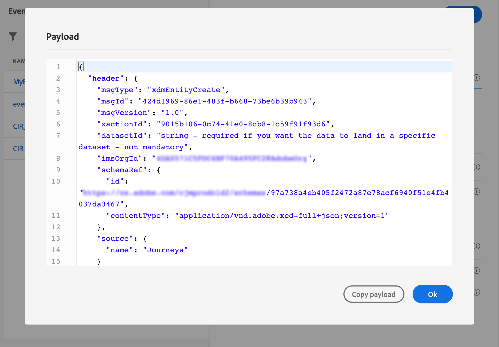

# 비즈니스 이벤트 {#configure-a-business-event} 구성

단일 이벤트와 달리, 비즈니스 이벤트는 특정 프로필과 연결되어 있지 않습니다. 이벤트 ID 유형은 항상 규칙을 기반으로 합니다. [이 섹션](../event/about-events.md)에서 비즈니스 이벤트에 대한 자세한 내용을 참조하십시오.

이벤트 발생 시 일정별로 스케줄러를 통해 또는 비즈니스 이벤트로, 읽기 세그먼트 기반 여정을 한 번에 트리거할 수 있습니다.

비즈니스 이벤트는 &quot;제품이 다시 재고가 있다&quot;, &quot;회사의 주가가 일정값에 도달함&quot; 등이 될 수 있습니다.

## 중요 정보

* 이벤트 스키마는 기본 ID를 포함해야 합니다.
* 비즈니스 이벤트는 여정의 첫 단계로만 삭제할 수 있습니다.
* 비즈니스 이벤트를 여정의 첫 번째 단계로 놓을 때 여정의 스케줄러 유형은 &quot;비즈니스 이벤트&quot;가 됩니다.
* 비즈니스 이벤트 후에는 읽기 세그먼트 활동만 삭제할 수 있습니다. 다음 단계로 자동으로 추가됩니다.
* 비즈니스 이벤트는 1시간 이상 더 자주 트리거할 수 없습니다.
* 비즈니스 이벤트가 트리거되면 세그먼트를 15분에서 1시간까지 내보내는 데 지연이 발생합니다.
* 비즈니스 이벤트를 테스트할 때는 테스트 여정에 들어갈 이벤트 매개 변수와 테스트 프로필의 식별자를 전달해야 합니다. 또한 비즈니스 이벤트 기반 여정을 테스트할 때는 단일 프로필 입장만 트리거할 수 있습니다. [이 섹션](../building-journeys/testing-the-journey.md#test-business)을 참조하십시오. 테스트 모드에서는 &quot;코드 보기&quot; 모드를 사용할 수 없습니다.
* 새로운 비즈니스 이벤트가 도착하면 현재 여정에 있는 개인에게는 어떻게 됩니까? 이것은 새로운 재개가 일어날 때 개인들이 여전히 되풀이되는 여정에 있을 때와 같은 방식으로 동작합니다. 경로가 종료되었습니다. 따라서 빈번한 비즈니스 이벤트로 예상될 경우 마케터는 너무 긴 여정을 만들지 않도록 주의해야 합니다.

## 비즈니스 이벤트 시작

비즈니스 이벤트를 구성하는 첫 번째 단계는 다음과 같습니다.

1. 왼쪽 메뉴에서 **[!UICONTROL Admin]** 아이콘을 클릭한 다음 **[!UICONTROL Events]**&#x200B;을 클릭합니다. 그러면 이벤트 목록이 표시됩니다.

   

1. 새 이벤트를 만들려면 **[!UICONTROL Add]**&#x200B;를 클릭합니다. 그러면 화면 오른쪽에 이벤트 구성 창이 열립니다.

   

1. 이벤트 이름을 입력합니다. 설명을 추가할 수도 있습니다.

   

   >[!NOTE]
   >
   >공백이나 특수 문자는 사용하지 말고 이름은 30자까지만 입력하십시오.

1. **[!UICONTROL Type]** 필드에서 **비즈니스**&#x200B;를 선택합니다.

   

1. 이 이벤트를 사용하는 경로 수가 **[!UICONTROL Used in]** 필드에 표시됩니다. **[!UICONTROL View journeys]** 아이콘을 클릭하여 이 이벤트를 사용하는 경로 목록을 표시할 수 있습니다.

1. 스키마 및 페이로드 필드를 정의합니다.여기에서 수신할 이벤트 정보(일반적으로 페이로드라고 함) 여정을 선택합니다. 그러면 이 정보를 경로에 사용할 수 있습니다. [이 섹션](../event/about-creating-business.md#define-the-payload-fields)을 참조하십시오.

   

   시간 시리즈 스키마만 사용할 수 있습니다. 경험 이벤트, 결정 이벤트 및 여정 단계 이벤트 스키마를 사용할 수 없습니다. 이벤트 스키마는 기본 ID를 포함해야 합니다.

   

1. **[!UICONTROL Event ID condition]** 필드 내부를 클릭합니다. 간단한 표현식 편집기를 사용하여 여정을 트리거할 이벤트를 식별하는 데 시스템에서 사용할 조건을 정의합니다.
   

   이 예에서는 제품 ID에 따라 조건을 작성했습니다. 즉, 시스템이 이 조건과 일치하는 이벤트를 받을 때마다 여정에 전달됩니다.

1. **[!UICONTROL Save]**&#x200B;을 클릭합니다.

   

   이제 이벤트가 구성되었으며 경로에 추가할 수 있는 상태가 되었습니다. 이벤트를 수신하려면 추가 구성 단계를 수행해야 합니다. [이 페이지](../event/additional-steps-to-send-events-to-journey-orchestration.md)를 참조하십시오.

## 페이로드 필드 정의 {#define-the-payload-fields}

페이로드 정의를 사용하면 시스템에서 여정의 이벤트에서 수신할 정보와 이벤트에 연결된 사람을 식별할 키를 선택할 수 있습니다. 페이로드가 Experience Cloud XDM 필드 정의를 기반으로 합니다. XDM에 대한 자세한 내용은 [이 페이지](https://experienceleague.adobe.com/docs/experience-platform/xdm/home.html?lang=ko)를 참조하십시오.

1. 목록에서 XDM 스키마를 선택하고 **[!UICONTROL Payload]** 필드 또는 **[!UICONTROL Edit]** 아이콘을 클릭합니다.

   

   스키마에 정의된 모든 필드가 표시됩니다. 필드 목록은 스키마마다 다릅니다. 특정 필드를 검색하거나 필터를 사용하여 모든 노드 및 필드를 표시하거나 선택한 필드만 표시할 수 있습니다. 스키마 정의에 따라 일부 필드는 필수일 수도 있고 미리 선택할 수도 있습니다. 선택 취소할 수 없습니다. 여정에서 이벤트를 제대로 수신해야 하는 모든 필드는 기본적으로 선택됩니다.

   

1. 이벤트에서 받을 필드를 선택합니다. 비즈니스 사용자가 여정에서 활용할 필드입니다.

   

1. 필요한 필드 선택이 끝나면 **[!UICONTROL Save]**&#x200B;을 클릭하거나 **[!UICONTROL Enter]**&#x200B;을(를) 누릅니다.

   선택한 필드의 수가 **[!UICONTROL Payload]** 필드에 표시됩니다.

   

## 페이로드 미리 보기 {#preview-the-payload}

페이로드 미리 보기를 사용하면 페이로드 정의의 유효성을 확인할 수 있습니다.

1. 시스템에서 필요한 페이로드를 미리 보려면 **[!UICONTROL View Payload]** 아이콘을 클릭합니다.

   

   선택한 필드가 표시됩니다.

   

1. 미리 보기를 선택하여 페이로드 정의를 확인합니다.

1. 그런 다음 페이로드 미리 보기를 이벤트 전송을 담당하는 사람과 공유할 수 있습니다. 이 페이로드는 [!DNL Journey Optimizer]에 푸시되는 이벤트의 설정을 설계하는 데 도움이 될 수 있습니다. [이 페이지](../event/additional-steps-to-send-events-to-journey-orchestration.md)를 참조하십시오.
