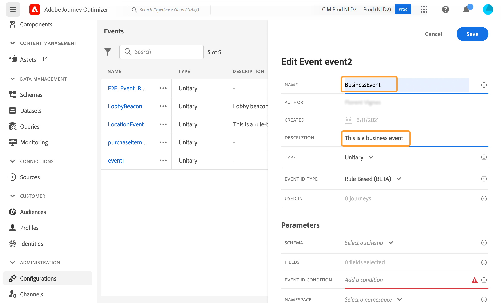

# 비즈니스 이벤트 구성 {#configure-a-business-event}

>[!CONTEXTUALHELP]
>id="ajo_journey_event_business"
>title="비즈니스 이벤트"
>abstract="이벤트 구성에서는 Journey Optimizer가 이벤트로 수신할 정보를 정의할 수 있습니다. 여정의 각 단계에서 여러 이벤트를 사용할 수 있으며 여러 여정에서 같은 이벤트를 사용할 수도 있습니다. 단일 이벤트와 달리 비즈니스 이벤트는 특정 프로필에 연결되지 않습니다. 이벤트 ID 유형은 항상 규칙을 기반으로 합니다."

단일 이벤트와 달리 비즈니스 이벤트는 특정 프로필에 연결되지 않습니다. 이벤트 ID 유형은 항상 규칙을 기반으로 합니다. [이 섹션](../event/about-events.md)의 비즈니스 이벤트에 대해 자세히 알아보세요.

대상자 기반 읽기 여정은 한 번에, 정기적으로 스케줄러에 의해 또는 이벤트가 발생할 때 비즈니스 이벤트에 의해 트리거될 수 있습니다.

비즈니스 이벤트는 &quot;제품이 재입고됨&quot;, &quot;기업의 주가가 일정 값에 도달함&quot; 등이 될 수 있습니다.

>[!NOTE]
>
>비즈니스 이벤트 사용 사례 [자습서](https://experienceleague.adobe.com/docs/journey-optimizer-learn/tutorials/create-journeys/use-case-business-event.html)를 볼 수도 있습니다. 프로필에 대해 스키마를 활성화할 필요가 없습니다.

## 중요 정보 {#important-notes}

* 시계열 스키마만 사용할 수 있습니다. 경험 이벤트, 의사 결정 이벤트 및 여정 단계 이벤트 스키마를 사용할 수 없습니다.
* 이벤트 스키마에 사람 기반이 아닌 기본 ID가 포함되어야 합니다. 이벤트를 정의할 때 다음 필드를 선택해야 합니다. `_id` 및 `timestamp`
* 비즈니스 이벤트는 여정의 첫 번째 단계로만 드롭할 수 있습니다.
* 비즈니스 이벤트를 여정의 첫 번째 단계로 드롭할 때 여정의 스케줄러 유형은 &quot;비즈니스 이벤트&quot;가 됩니다.
* 비즈니스 이벤트 후에는 대상자 읽기 활동만 삭제할 수 있습니다. 다음 단계로 자동 추가됩니다.
* 여러 비즈니스 이벤트 실행을 허용하려면 여정 속성의 **[!UICONTROL 실행]** 섹션에서 해당 옵션을 활성화합니다.
* 비즈니스 이벤트가 트리거되면 대상을 15분에서 최대 1시간까지 내보내는 데 지연이 있습니다.
* 비즈니스 이벤트를 테스트할 때 이벤트 매개 변수 및 테스트의 여정을 입력할 테스트 프로필의 식별자를 전달해야 합니다. 또한 비즈니스 이벤트 기반 프로필을 테스트할 때 단일 여정 시작만 트리거할 수 있습니다. [이 섹션](../building-journeys/testing-the-journey.md#test-business)을 참조하세요. 테스트 모드에서는 사용 가능한 &quot;코드 보기&quot; 모드가 없습니다.
* 새로운 비즈니스 이벤트가 도착하면 현재 여정에 있는 개인들은 어떻게 됩니까? 이는 새로운 재발이 발생할 때 개인이 여전히 반복 여정에 있을 때와 동일한 방식으로 동작합니다. 그들의 길은 끝이다. 따라서 마케터는 빈번한 비즈니스 이벤트를 예상할 경우 너무 긴 여정을 만들지 않도록 주의를 기울여야 합니다.
* 비즈니스 이벤트는 단일 이벤트 또는 대상자 선별 활동과 함께 사용할 수 없습니다. 

## 여러 비즈니스 이벤트 {#multiple-business-events}

다음은 여러 비즈니스 이벤트가 연달아 수신될 때 적용되는 몇 가지 중요한 정보입니다.

**여정을 처리하는 동안 비즈니스 이벤트를 받을 때 나타나는 동작은 무엇입니까?**

비즈니스 이벤트는 단일 이벤트와 동일한 방식으로 재입장 규칙을 따릅니다. 여정이 재입장을 허용하면 다음 비즈니스 이벤트가 처리됩니다.

**구체화된 대상자를 오버로드할 수 없도록 하는 보호 기능은 무엇입니까?**

실시간 비즈니스 이벤트의 경우 지정된 여정 동안 첫 번째 이벤트 작업에서 푸시한 데이터가 1시간 기간 동안 재사용됩니다. 예약된 여정의 경우 가드레일이 없습니다. 대상자에 대한 자세한 내용은 [Adobe Experience Platform 세그먼테이션 서비스 설명서](https://experienceleague.adobe.com/docs/experience-platform/segmentation/home.html?lang=ko)를 참조하세요.

## 비즈니스 이벤트 시작 {#gs-business-events}

비즈니스 이벤트를 구성하는 첫 번째 단계는 다음과 같습니다.

1. 관리 메뉴 섹션에서 **[!UICONTROL 구성]**&#x200B;을 선택합니다. **[!UICONTROL 이벤트]** 섹션에서 **[!UICONTROL 관리]**&#x200B;를 클릭합니다. 이벤트 목록이 표시됩니다.

   

1. 새 이벤트를 만들려면 **[!UICONTROL 이벤트 만들기]**&#x200B;를 클릭합니다. 그러면 화면 오른쪽에 이벤트 구성 창이 열립니다.

   

1. 이벤트의 이름을 입력합니다. 설명을 추가할 수도 있습니다.

   

   >[!NOTE]
   >
   >영숫자와 밑줄만 허용됩니다. 최대 길이는 30자입니다.

1. **[!UICONTROL 유형]** 필드에서 **비즈니스**&#x200B;를 선택합니다.

   

1. 이 이벤트를 사용하는 여정 수는 **[!UICONTROL 다음 항목에서 사용됨]** 필드에 표시됩니다. **[!UICONTROL 여정 보기]** 아이콘을 클릭하여 이 이벤트를 사용하는 여정 목록을 표시할 수 있습니다.

1. 여정 및 페이로드 필드를 정의합니다. 이 단계에서 스키마가 수신할 이벤트 정보(또는 페이로드)를 선택합니다. 이 정보는 나중에 여정에서 사용하게 됩니다. [이 섹션](../event/about-creating-business.md#define-the-payload-fields)을 참조하십시오.

   

   시계열 스키마만 사용할 수 있습니다. `Experience Events`, `Decision Events` 및 `Journey Step Events` 스키마를 사용할 수 없습니다. 이벤트 스키마에 사람 기반이 아닌 기본 ID가 포함되어야 합니다. 이벤트를 정의할 때 다음 필드를 선택해야 합니다. `_id` 및 `timestamp`

   

1. **[!UICONTROL 이벤트 ID 조건]** 필드 내부를 클릭합니다. 단순 표현식 편집기를 사용하여 시스템에서 여정을 트리거하는 이벤트를 식별하는 데 사용하는 조건을 정의합니다.

   

   이 예제에서는 제품 ID를 기반으로 조건을 작성했습니다. 즉, 시스템이 이 조건과 일치하는 이벤트를 받을 때마다 여정에게 전달합니다.

   >[!NOTE]
   >
   >단순 표현식 편집기에서 모든 연산자를 사용할 수 있는 것은 아니며, 데이터 유형에 따라 다릅니다. 예를 들어 필드의 문자열 유형의 경우 &quot;포함&quot; 또는 &quot;같음&quot;을 사용할 수 있습니다.

1. **[!UICONTROL 저장]**&#x200B;을 클릭합니다.

   

   이제 이벤트가 구성되었으며 경로에 추가할 수 있는 상태가 되었습니다. 이벤트를 수신하려면 추가 구성 단계를 수행해야 합니다. [이 페이지](../event/additional-steps-to-send-events-to-journey.md)에서 자세히 알아보세요.

## 페이로드 필드 정의 {#define-the-payload-fields}

페이로드 정의를 사용하면 여정의 이벤트에서 시스템이 받을 것으로 예상되는 정보와 해당 이벤트와 연관된 사용자를 식별하는 키를 선택할 수 있습니다. 페이로드는 Experience Cloud XDM 필드 정의를 기반으로 합니다. XDM에 대한 자세한 내용은 [Adobe Experience Platform 설명서](https://experienceleague.adobe.com/docs/experience-platform/xdm/home.html?lang=ko-KR){target="_blank"}를 참조하세요.

1. 목록에서 XDM 스키마를 선택하고 **[!UICONTROL 필드]** 필드 또는 **[!UICONTROL 편집]** 아이콘을 클릭합니다.

   

   스키마에 정의된 모든 필드가 표시됩니다. 필드 목록은 스키마마다 다릅니다. 특정 필드를 검색하거나 필터를 사용하여 모든 노드 및 필드를 표시하거나 선택한 필드만 표시할 수 있습니다. 스키마 정의에 따라 일부 필드는 필수이고 미리 선택될 수 있습니다. 선택을 취소할 수 없습니다. 여정이 이벤트를 제대로 수신하기 위해 반드시 필요한 모든 필드가 기본적으로 선택됩니다.

   

   >[!NOTE]
   >
   > `_id` 및 `timestamp` 필드가 선택되어 있는지 확인하십시오.

1. 이벤트에서 수신할 필드를 선택합니다. 비즈니스 사용자가 여정 시 활용할 필드입니다.

1. 필요한 필드 선택을 마쳤으면 **[!UICONTROL 저장]**&#x200B;을 클릭하거나 **[!UICONTROL Enter]**&#x200B;를 누르십시오.

   선택한 필드 수가 **[!UICONTROL 필드]**&#x200B;에 나타납니다.

   

## 페이로드 미리 보기 {#preview-the-payload}

페이로드 미리 보기를 사용하여 페이로드 정의의 유효성을 검사합니다.

1. 시스템에서 예상한 페이로드를 미리 보려면 **[!UICONTROL 페이로드 보기]** 아이콘을 클릭하십시오.

   

   선택한 필드가 표시됩니다.

   

1. 미리 보기를 확인하여 페이로드 정의의 유효성을 검사합니다.

1. 그런 다음 이벤트 전송을 담당하는 사람과 페이로드 미리 보기를 공유할 수 있습니다. 이 페이로드는 [!DNL Journey Optimizer]에 푸시하는 이벤트의 설정을 디자인하는 데 도움이 될 수 있습니다. [이 페이지](../event/additional-steps-to-send-events-to-journey.md)를 참조하십시오.
