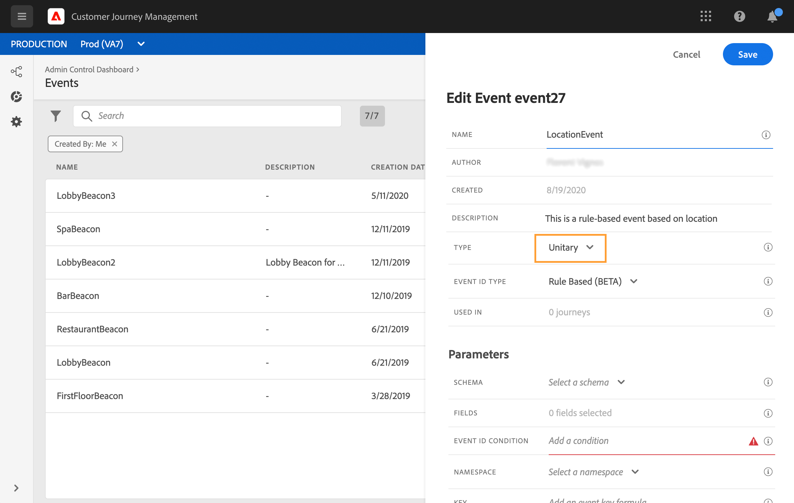
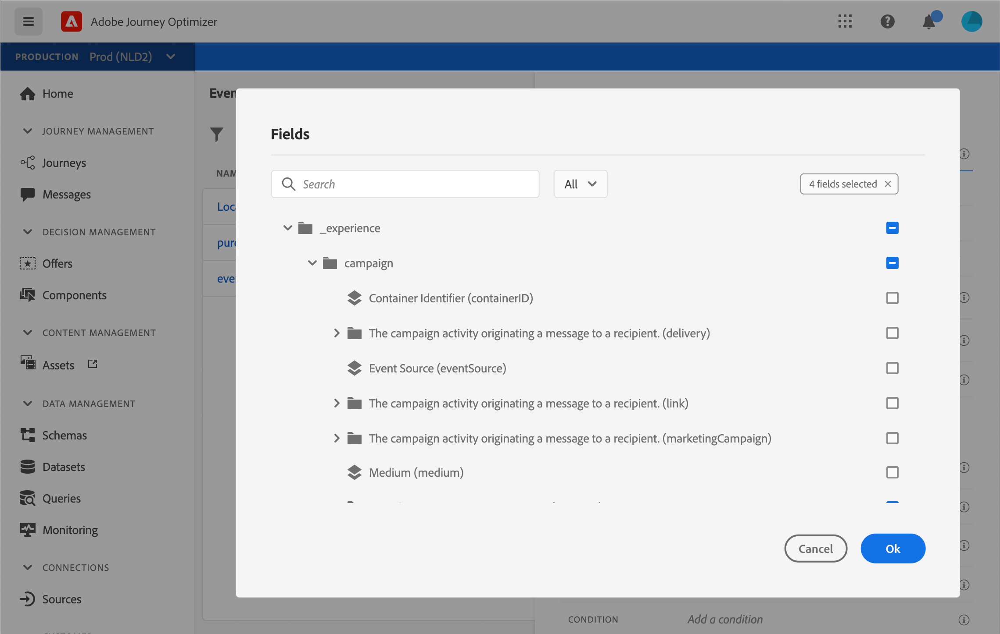
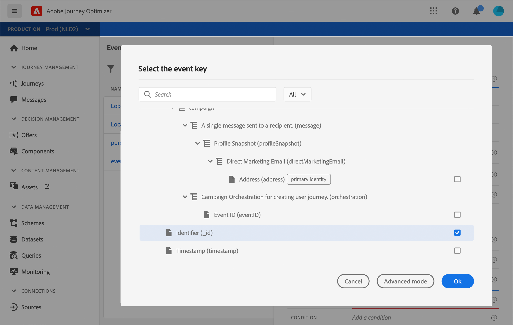

# 단일 이벤트 구성 {#configure-an-event}

단일 이벤트는 특정 프로필에 연결됩니다. 규칙을 기반으로 하거나 시스템에서 생성할 수 있습니다.  단일 이벤트에 대한 자세한 내용 [이 섹션](../event/about-events.md).

새 이벤트를 구성하는 첫 번째 단계는 다음과 같습니다.

1. 관리 메뉴 섹션에서 **[!UICONTROL Configurations]**. 에서  **[!UICONTROL Events]** 섹션을 클릭합니다. **[!UICONTROL Manage]**. 그러면 이벤트 목록이 표시됩니다.

   

1. 새 이벤트를 만들려면 **[!UICONTROL Create Event]**&#x200B;를 클릭합니다. 그러면 화면 오른쪽에 이벤트 구성 창이 열립니다.

   

1. 이벤트의 이름을 입력합니다. 설명을 추가할 수도 있습니다.

   

   >[!NOTE]
   >
   >공백이나 특수 문자는 사용하지 말고 이름은 30자까지만 입력하십시오.

1. 에서 **[!UICONTROL Type]** 필드, 선택 **단일**.

   

1. 에서 **[!UICONTROL Event ID type]** 필드에서 사용할 이벤트 ID 유형을 선택합니다. **규칙 기반** 또는 **시스템 생성**. 의 이벤트 ID 유형에 대해 자세히 알아보십시오 [이 섹션](../event/about-events.md#event-id-type).

   

1. 이 이벤트를 사용하는 경로 수가 **[!UICONTROL Used in]** 필드에 표시됩니다. **[!UICONTROL View journeys]** 아이콘을 클릭하여 이 이벤트를 사용하는 경로 목록을 표시할 수 있습니다.

1. 스키마 및 페이로드 필드를 정의합니다. 여기서 여정이 수신하도록 하는 이벤트 정보(대개 페이로드)를 선택합니다. 그러면 이 정보를 경로에 사용할 수 있습니다. [이 섹션](../event/about-creating.md#define-the-payload-fields)을 참조하십시오.

   

   >[!NOTE]
   >
   >을(를) 선택하는 경우 **[!UICONTROL System Generated]** type으로 eventID 유형 필드가 있는 스키마만 사용할 수 있습니다. 을(를) 선택하는 경우 **[!UICONTROL Rule Based]** type, 모든 Experience Event 스키마를 사용할 수 있습니다.

1. 규칙 기반 이벤트의 경우, **[!UICONTROL Event ID condition]** 필드. 단순 표현식 편집기를 사용하여 시스템에서 여정을 트리거할 이벤트를 식별하는 데 사용할 조건을 정의합니다.
   

   이 예제에서는 프로필의 도시를 기반으로 조건을 작성했습니다. 즉, 시스템이 이 조건(**[!UICONTROL City]** 필드 및 **[!UICONTROL Paris]** 값), 여정에게 전달됩니다.

   >[!NOTE]
   >
   >고급 표현식 편집기는 **[!UICONTROL Event ID condition]**. 단순 표현식 편집기에서 모든 연산자를 사용할 수 있는 것은 아니며, 데이터 유형에 따라 달라집니다. 예를 들어 문자열 유형 필드의 경우 &quot;contains&quot; 또는 &quot;equal to&quot;를 사용할 수 있습니다.

1. 네임스페이스를 추가합니다. 이 단계는 원하는 경우에만 수행하면 되지만, 네임스페이스를 추가하면 실시간 고객 프로필 서비스에 저장된 정보를 활용할 수 있습니다. 이 정보에 따라 이벤트의 키 유형이 정의됩니다. [이 섹션](../event/about-creating.md#select-the-namespace)을 참조하십시오.
1. 프로필 식별자를 정의합니다. 페이로드 필드에서 필드를 선택하거나 공식을 정의하여 이벤트와 연관된 사용자를 지정합니다. 이 키는 네임스페이스를 선택하면 자동으로 설정되지만 편집할 수 있습니다. 네임스페이스에 해당하는 키는 여정에서 자동으로 선택됩니다. 예를 들어 이메일 네임스페이스를 선택하면 이메일 키가 선택됩니다. [이 섹션](../event/about-creating.md#define-the-event-key)을 참조하십시오.

   

1. 시스템 생성 이벤트의 경우 조건을 추가할 수 있습니다. 조건을 추가합니다. 조건을 추가하면 시스템은 조건을 충족하는 이벤트만 처리합니다. 조건은 이벤트에 포함된 정보를 기준으로만 추가할 수 있습니다. [이 섹션](../event/about-creating.md#add-a-condition)을 참조하십시오.
1. **[!UICONTROL Save]**&#x200B;을(를) 클릭합니다.

   이제 이벤트가 구성되었으며 경로에 추가할 수 있는 상태가 되었습니다. 이벤트를 수신하려면 추가 구성 단계를 수행해야 합니다. [이 페이지](../event/additional-steps-to-send-events-to-journey-orchestration.md)를 참조하십시오.

## 페이로드 필드를 정의합니다 {#define-the-payload-fields}

페이로드 정의를 사용하면 시스템에서 여정의 이벤트에서 받게 될 정보를 선택하고 키와 어떤 사람이 이벤트에 연결되어 있는지 식별할 수 있습니다. 페이로드는 Experience Cloud XDM 필드 정의를 기반으로 합니다. XDM에 대한 자세한 내용은 [Adobe Experience Platform 설명서](https://experienceleague.adobe.com/docs/experience-platform/xdm/home.html?lang=ko){target=&quot;_blank&quot;}.

1. 목록에서 XDM 스키마를 선택하고 를 클릭합니다. **[!UICONTROL Fields]** 필드 또는 **[!UICONTROL Edit]** 아이콘.

   

   스키마에 정의된 모든 필드가 표시됩니다. 필드 목록은 스키마마다 다릅니다. 특정 필드를 검색하거나 필터를 사용하여 모든 노드와 필드를 표시하거나 선택한 필드만 표시할 수 있습니다. 스키마 정의에 따라 일부 필드는 필수 필드이며 미리 선택되어 있을 수 있습니다. 선택 취소할 수 없습니다. 여정이 이벤트를 제대로 수신하기 위해 필수 필드인 모든 필드는 기본적으로 선택됩니다.

   >[!NOTE]
   >
   >시스템 생성 이벤트의 경우, XDM 스키마에 &quot;orchestration&quot; 필드 그룹을 추가했는지 확인합니다. 이렇게 하면 스키마에 작업에 필요한 모든 정보가 포함됩니다 [!DNL Journey Optimizer].

   

1. 이벤트에서 받을 필드를 선택합니다. 비즈니스 사용자가 여정에서 활용할 수 있는 필드입니다. 또한 이벤트와 연관된 사용자를 식별하는 데 사용할 키도 포함해야 합니다( 참조). [이 섹션](../event/about-creating.md#define-the-event-key)).

   >[!NOTE]
   >
   >시스템 생성 이벤트의 경우, **[!UICONTROL eventID]** 필드를 선택한 필드 목록에 자동으로 추가하여 [!DNL Journey Optimizer] 이벤트를 식별할 수 있습니다. 이벤트를 푸시하는 시스템은 ID를 생성하지 않아야 하며 페이로드 미리 보기에서 사용할 수 있는 ID를 사용해야 합니다. [이 섹션](../event/about-creating.md#preview-the-payload)을 참조하십시오.

1. 필요한 필드 선택을 완료했으면 을 클릭합니다 **[!UICONTROL Ok]** 또는 **[!UICONTROL Enter]**.

   선택한 필드 수가 **[!UICONTROL Fields]** 필드.

   

## 네임스페이스를 선택합니다 {#select-the-namespace}

네임스페이스를 사용하면 이벤트와 연결된 사람을 식별하는 데 사용되는 키 유형을 정의할 수 있습니다. 구성은 선택 사항입니다. 여정에서 을 통해 전송되는 추가 정보를 검색하려는 경우 필요합니다. [실시간 고객 프로필](https://experienceleague.adobe.com/docs/experience-platform/profile/home.html?lang=ko){target=&quot;_blank&quot;}. 사용자 지정 데이터 소스를 통해 타사 시스템에서 가져온 데이터만 사용하는 경우에는 네임스페이스 정의가 필요하지 않습니다.

미리 정의된 네임스페이스 중 하나를 사용하거나 ID 네임스페이스 서비스를 사용하여 새 ID를 만들 수 있습니다. 을(를) 참조하십시오. [Adobe Experience Platform 설명서](https://experienceleague.adobe.com/docs/experience-platform/sources/home.html?lang=ko){target=&quot;_blank&quot;}.

기본 ID가 있는 스키마를 선택하는 경우, **[!UICONTROL Profiler identifier]** 및 **[!UICONTROL Namespace]** 필드는 미리 입력되어 있습니다. 정의된 ID가 없으면 _identityMap > ID_ 를 기본 키로 사용합니다. 그런 다음 네임스페이스를 선택해야 합니다. 그러면 키가 **[!UICONTROL Namespace]** 필드) _identityMap > ID_.

필드를 선택할 때 기본 ID 필드에 태그가 지정됩니다.

드롭다운 목록에서 네임스페이스를 선택합니다.

여정 당 하나의 네임스페이스만 허용됩니다. 동일한 여정에서 여러 이벤트를 사용하는 경우 동일한 네임스페이스를 사용해야 합니다. [이 페이지](../building-journeys/journey.md)를 참조하십시오.

## 프로필 식별자 정의 {#define-the-event-key}

키는 이벤트 페이로드 데이터의 일부이며, 시스템에서 이벤트와 연관된 사용자를 식별할 수 있도록 하는 필드 또는 필드 조합입니다. 키는 Experience Cloud ID, CRM ID 또는 이메일 주소와 같은 것일 수 있습니다.

실시간 고객 프로필 데이터베이스에 저장된 데이터를 활용하려는 경우,에서 프로필 ID로 정의한 정보를 이벤트 키로 선택해야 합니다 [실시간 고객 프로필 서비스](https://experienceleague.adobe.com/docs/experience-platform/profile/home.html){target=&quot;_blank&quot;}.

이렇게 하면 시스템이 이벤트와 개인 프로필 간의 조정을 수행할 수 있습니다. 기본 ID가 있는 스키마를 선택하는 경우, **[!UICONTROL Profile identifier]** 및 **[!UICONTROL Namespace]** 필드는 미리 입력되어 있습니다. 정의된 ID가 없으면 _identityMap > ID_ 를 기본 키로 사용합니다. 그런 다음 네임스페이스를 선택해야 합니다. 그러면 키가 **[!UICONTROL Namespace]** 필드) _identityMap > ID_.

필드를 선택할 때 기본 ID 필드에 태그가 지정됩니다.

CRM ID 또는 이메일 주소와 같은 다른 키를 사용해야 하는 경우 수동으로 추가해야 합니다.

1. 의 내부를 클릭합니다. **[!UICONTROL Profile identifier]** 필드 또는 연필 아이콘에 있을 때 사용할 수 있습니다.

   

1. 페이로드 필드 목록에서 키로 선택한 필드를 선택합니다. 고급 표현식 편집기로 전환하여 더 복잡한 키(예: 이벤트의 두 필드 연결)를 만들 수도 있습니다. 이 섹션에서 아래를 참조하십시오.

   

이벤트가 수신되면 키 값을 통해 시스템에서 이벤트와 연관된 사용자를 식별할 수 있습니다. 네임스페이스에 연결됨( [이 섹션](../event/about-creating.md#select-the-namespace)) 키를 사용하여 Adobe Experience Platform에 대한 쿼리를 수행할 수 있습니다. [이 페이지](../building-journeys/about-journey-activities.md#orchestration-activities)를 참조하십시오.
키가 여정에 있는지 확인하는 데에도 사용됩니다. 실제로, 한 사람은 동일한 여정에서 두 개의 다른 위치에 있을 수 없습니다. 따라서 시스템에서 동일한 키(예: CRMID=3224)를 동일한 여정의 다른 위치에 둘 수 없습니다.

고급 표현식 함수(**[!UICONTROL Advanced mode]**) 추가 조작을 수행하려면 다음을 수행합니다. 이러한 함수를 사용하면 필드의 일부(예: 첫 번째 문자 10개)를 고려하여 형식 변경, 필드 연결 수행 등 특정 쿼리를 수행하는 데 사용되는 값을 조작할 수 있습니다. 자세한 내용은 [Journey Orchestration 설명서](../building-journeys/expression/expressionadvanced.md).

## 조건 추가 {#add-a-condition}

조건은 시스템에서 생성한 이벤트에만 사용할 수 있습니다. 시스템에서 이벤트 처리를 필터링할 수 있는 이벤트 조건을 정의할 수 있습니다. 조건이 true면 이벤트가 처리됩니다. 조건이 true가 아니면 이벤트가 무시됩니다.

이벤트에 대한 조건은 이벤트 페이로드에서 전달된 데이터만 기반으로 할 수 있습니다. 이벤트 수준에서 정의된 조건은 마케터가 캔버스에서 변경할 수 없습니다. 이 이벤트를 사용할 때 이 조건을 제한하는 것이 목적입니다. 예를 들어 장바구니 값이 너무 작은 경우 장바구니 포기 이벤트를 사용하지 않도록 하려면 &quot;장바구니 값&quot; 이벤트 필드에 조건을 만들고 100달러 이상의 값을 부과할 수 있습니다.

단순 표현식 편집기 또는 고급 표현식 편집기를 사용하여 이벤트에 대한 조건을 설정할 수 있습니다. 자세한 내용은 [Journey Orchestration 설명서](../building-journeys/expression/expressionadvanced.md).

예를 들어 특정 이벤트 유형의 이벤트만 처리하고 다른 유형을 무시할 조건을 정의할 수 있습니다. 또는 이벤트가 장바구니 중단이고 페이로드에 장바구니 값 필드가 포함된 경우 장바구니 값이 100달러보다 큰 경우에만 이벤트를 처리하도록 이벤트 조건을 정의할 수 있습니다.

## 페이로드 미리 보기 {#preview-the-payload}

페이로드 미리 보기를 사용하면 페이로드 정의의 유효성을 검사할 수 있습니다.

>[!NOTE]
>
>시스템 생성 이벤트의 경우, 이벤트를 만들 때 페이로드 미리 보기를 보기 전에 이벤트를 저장하고 다시 엽니다. 이 단계는 페이로드에서 이벤트 ID를 생성하는 데 필요합니다.

1. 을(를) 클릭합니다. **[!UICONTROL View Payload]** 아이콘을 클릭하여 시스템에 필요한 페이로드를 미리 봅니다.

   

   선택한 필드가 표시되었음을 알 수 있습니다.

   

1. 미리 보기를 선택하여 페이로드 정의의 유효성을 확인합니다.

1. 그런 다음 이벤트 전송을 담당하는 사람과 페이로드 미리 보기를 공유할 수 있습니다. 이 페이로드는 푸시 이벤트 설정을 디자인하는 데 도움이 될 수 있습니다 [!DNL Journey Optimizer]. [이 페이지](../event/additional-steps-to-send-events-to-journey-orchestration.md)를 참조하십시오.
