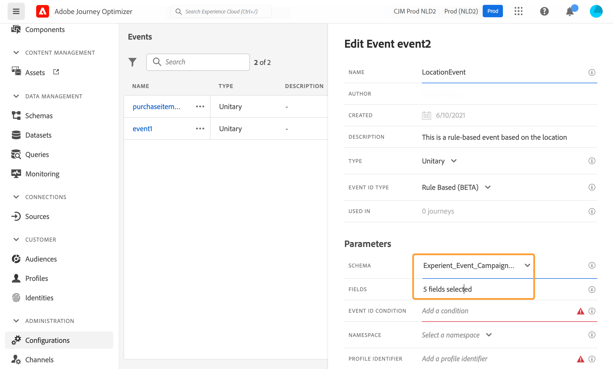
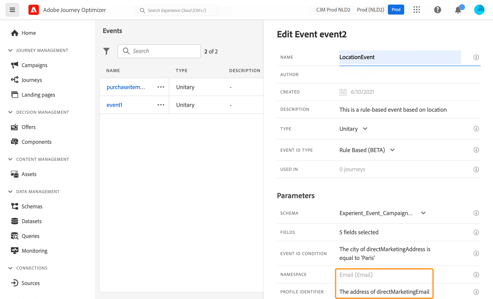

# 단일 이벤트 구성 {#configure-an-event}

>[!CONTEXTUALHELP]
>id="ajo_journey_event_unitary"
>title="단일 이벤트"
>abstract="이벤트 구성에서는 Journey Optimizer가 이벤트로 수신할 정보를 정의할 수 있습니다. 여정의 각 단계에서 여러 이벤트를 사용할 수 있으며 여러 여정에서 같은 이벤트를 사용할 수도 있습니다. 단일 이벤트는 특정 프로필에 연결됩니다. 단일 이벤트는 규칙 기반이거나 시스템 생성일 수 있습니다."

단일 이벤트는 특정 프로필에 연결됩니다. 단일 이벤트는 규칙 기반이거나 시스템 생성일 수 있습니다.  단일 이벤트에 대한 자세한 내용 [이 섹션](../event/about-events.md).

새 이벤트를 구성하는 첫 번째 단계는 다음과 같습니다.

1. 관리 메뉴 섹션에서 다음을 선택합니다. **[!UICONTROL 구성]**. 다음에서  **[!UICONTROL 이벤트]** 섹션, 클릭 **[!UICONTROL 관리]**. 그러면 이벤트 목록이 표시됩니다.

   

1. 클릭 **[!UICONTROL 이벤트 만들기]** 새 이벤트를 만듭니다. 그러면 화면 오른쪽에 이벤트 구성 창이 열립니다.

   

1. 이벤트의 이름을 입력합니다. 설명을 추가할 수도 있습니다.

   

   >[!NOTE]
   >
   >공백이나 특수 문자는 사용하지 말고 이름은 30자까지만 입력하십시오.

1. 다음에서 **[!UICONTROL 유형]** 필드, 선택 **단일**.

   

1. 다음에서 **[!UICONTROL 이벤트 ID 유형]** 필드에서 사용할 이벤트 ID 유형을 선택합니다. **규칙 기반** 또는 **시스템 생성됨**. 에서 이벤트 ID 유형에 대해 자세히 알아보기 [이 섹션](../event/about-events.md#event-id-type).

   

1. 이 이벤트를 사용하는 여정 수는 **[!UICONTROL 다음에서 사용됨]** 필드. 다음을 클릭할 수 있습니다 **[!UICONTROL 여정 보기]** 아이콘을 클릭하여 이 이벤트를 사용하는 여정 목록을 표시합니다.

1. 스키마 및 페이로드 필드를 정의합니다. 이 단계에서 여정이 수신하도록 할 이벤트 정보(대개 페이로드)를 선택합니다. 그러면 이 정보를 경로에 사용할 수 있습니다. [이 섹션](../event/about-creating.md#define-the-payload-fields)을 참조하십시오.

   

   >[!NOTE]
   >
   >다음을 선택하면 **[!UICONTROL 시스템 생성됨]** type을 입력하면 eventID type 필드가 있는 스키마만 사용할 수 있습니다. 다음을 선택하면 **[!UICONTROL 규칙 기반]** 유형, 모든 경험 이벤트 스키마를 사용할 수 있습니다.

1. 규칙 기반 이벤트의 경우 **[!UICONTROL 이벤트 ID 조건]** 필드. 단순 표현식 편집기를 사용하여 여정을 트리거할 이벤트를 식별하는 데 시스템에서 사용할 조건을 정의합니다.
   

   이 예제에서는 프로필의 도시를 기반으로 조건을 작성했습니다. 즉, 시스템이 이 조건(**[!UICONTROL 도시]** 필드 및 **[!UICONTROL 파리]** value)를 입력하면 여정에게 전달됩니다.

   >[!NOTE]
   >
   >고급 표현식 편집기는 를 정의할 때 사용할 수 없습니다. **[!UICONTROL 이벤트 ID 조건]**. 단순 표현식 편집기에서 모든 연산자를 사용할 수 있는 것은 아니며, 데이터 유형에 따라 다릅니다. 예를 들어 필드의 문자열 유형의 경우 &quot;포함&quot; 또는 &quot;같음&quot;을 사용할 수 있습니다.

1. 네임스페이스를 추가합니다. 이 단계는 원하는 경우에만 수행하면 되지만, 네임스페이스를 추가하면 실시간 고객 프로필 서비스에 저장된 정보를 활용할 수 있습니다. 이 정보에 따라 이벤트의 키 유형이 정의됩니다. [이 섹션](../event/about-creating.md#select-the-namespace)을 참조하십시오.

1. 프로필 식별자 정의: 페이로드 필드에서 필드를 선택하거나 공식을 정의하여 이벤트와 연관된 사용자를 식별합니다. 이 키는 네임스페이스를 선택하면 자동으로 설정되지만 편집할 수 있습니다. 네임스페이스에 해당하는 키는 여정이 직접 선택합니다. 예를 들어 이메일 네임스페이스를 선택하면 이메일 키가 선택됩니다. [이 섹션](../event/about-creating.md#define-the-event-key)을 참조하십시오.

   

1. **[!UICONTROL 저장]**&#x200B;을 클릭합니다.

   이제 이벤트가 구성되었으며 경로에 추가할 수 있는 상태가 되었습니다. 이벤트를 수신하려면 추가 구성 단계를 수행해야 합니다. [이 페이지](../event/additional-steps-to-send-events-to-journey.md)를 참조하십시오.

## 페이로드 필드 정의 {#define-the-payload-fields}

페이로드 정의를 사용하면 여정의 이벤트에서 시스템이 받을 것으로 예상되는 정보와 해당 이벤트와 연관된 사용자를 식별하는 키를 선택할 수 있습니다. 페이로드는 Experience Cloud XDM 필드 정의를 기반으로 합니다. XDM에 대한 자세한 내용은 [Adobe Experience Platform 설명서](https://experienceleague.adobe.com/docs/experience-platform/xdm/home.html?lang=ko-KR){target="_blank"}.

1. 목록에서 XDM 스키마를 선택하고 **[!UICONTROL 필드]** 필드 또는 **[!UICONTROL 편집]** 아이콘.

   

   스키마에 정의된 모든 필드가 표시됩니다. 필드 목록은 스키마마다 다릅니다. 특정 필드를 검색하거나 필터를 사용하여 모든 노드 및 필드를 표시하거나 선택한 필드만 표시할 수 있습니다. 스키마 정의에 따라 일부 필드는 필수이고 미리 선택될 수 있습니다. 선택을 취소할 수 없습니다. 여정이 이벤트를 제대로 수신하기 위해 반드시 필요한 모든 필드가 기본적으로 선택됩니다.

   >[!NOTE]
   >
   >시스템 생성 이벤트의 경우 XDM 스키마에 &quot;orchestration&quot; 필드 그룹을 추가했는지 확인하십시오. 이렇게 하면 스키마에 작업에 필요한 모든 정보가 포함됩니다 [!DNL Journey Optimizer].

   

1. 이벤트에서 수신할 필드를 선택합니다. 비즈니스 사용자가 여정 시 활용할 필드입니다. 또한 이벤트와 관련된 사용자를 식별하는 데 사용할 키도 포함해야 합니다(참조) [이 섹션](../event/about-creating.md#define-the-event-key)).

   >[!NOTE]
   >
   >시스템 생성 이벤트의 경우 **[!UICONTROL eventID]** 필드는 선택한 필드 목록에 자동으로 추가되므로 [!DNL Journey Optimizer] 이벤트를 식별할 수 있습니다. 이벤트를 푸시하는 시스템은 ID를 생성하지 않아야 하며 페이로드 미리 보기에서 사용할 수 있는 ID를 사용해야 합니다. [이 섹션](../event/about-creating.md#preview-the-payload)을 참조하십시오.

1. 필요한 필드 선택을 마쳤으면 **[!UICONTROL 확인]** 또는 누르기 **[!UICONTROL 입력]**.

   선택한 필드 수가 **[!UICONTROL 필드]** 필드.

   

## 네임스페이스 선택 {#select-the-namespace}

>[!CONTEXTUALHELP]
>id="ajo_journey_namespace"
>title="ID 네임스페이스"
>abstract="이벤트와 연결된 고객 프로필을 식별하는 키를 선택합니다."

네임스페이스를 통해 이벤트와 연계된 사용자를 식별하는 데 사용되는 키 유형을 정의할 수 있습니다. 구성은 선택 사항입니다. 에서 제공되는 추가 정보를 여정에서 검색하려면 필요합니다. [실시간 고객 프로필](https://experienceleague.adobe.com/docs/experience-platform/profile/home.html?lang=ko){target="_blank"}. 사용자 지정 데이터 소스를 통해 서드파티 시스템에서 오는 데이터만 사용하는 경우에는 네임스페이스 정의가 필요하지 않습니다.

미리 정의된 네임스페이스 서비스 중 하나를 사용하거나 ID 네임스페이스 서비스를 사용하여 새 프로필을 만들 수 있습니다. 을(를) 참조하십시오 [Adobe Experience Platform 설명서](https://experienceleague.adobe.com/docs/experience-platform/identity/home.html?lang=ko-KR){target="_blank"}.

기본 ID가 있는 스키마를 선택하는 경우 **[!UICONTROL 프로파일러 식별자]** 및 **[!UICONTROL 네임스페이스]** 필드는 미리 채워져 있습니다. ID가 정의되지 않은 경우 다음을 선택합니다 _identityMap > id_ 기본 키로 사용됩니다. 그런 다음 네임스페이스를 선택해야 하며 키는 미리 채워집니다( **[!UICONTROL 네임스페이스]** field) 사용 _identityMap > id_.

필드를 선택하면 기본 ID 필드에 태그가 지정됩니다.

드롭다운 목록에서 네임스페이스를 선택합니다.

네임스페이스는 여정 당 하나만 허용됩니다. 동일한 여정에서 여러 이벤트를 사용하는 경우 동일한 네임스페이스를 사용해야 합니다. [이 페이지](../building-journeys/journey.md)를 참조하십시오.

>[!NOTE]
>
>사용자 기반 ID 네임스페이스만 선택할 수 있습니다. 조회 테이블에 대한 네임스페이스를 정의한 경우(예: 제품 조회에 대한 ProductID 네임스페이스) **네임스페이스** 드롭다운 목록입니다.

## 프로필 식별자 정의 {#define-the-event-key}

키는 필드 또는 필드 조합이며, 이는 이벤트 페이로드 데이터의 일부이며 시스템에서 이벤트와 연관된 사용자를 식별할 수 있도록 합니다. 키는 예를 들어 Experience Cloud ID, CRM ID 또는 이메일 주소일 수 있습니다.

Adobe 실시간 고객 프로필 데이터베이스에 저장된 데이터를 사용하려면 이벤트 키는에서 프로필 ID로 정의한 정보여야 합니다. [실시간 고객 프로필 서비스](https://experienceleague.adobe.com/docs/experience-platform/profile/home.html?lang=ko){target="_blank"}.

프로필 식별자를 통해 시스템은 이벤트와 개인의 프로필 간의 조정을 수행할 수 있습니다. 기본 ID가 있는 스키마를 선택하는 경우 **[!UICONTROL 프로필 식별자]** 및 **[!UICONTROL 네임스페이스]** 필드는 미리 채워져 있습니다. ID가 정의되지 않은 경우 _identityMap > id_ 는 기본 키입니다. 그런 다음 네임스페이스를 선택해야 하며, 키를 _identityMap > id_.

필드를 선택하면 기본 ID 필드에 태그가 지정됩니다.

CRM ID 또는 이메일 주소와 같은 다른 키를 사용해야 하는 경우, 아래에 설명된 대로 수동으로 추가해야 합니다.

1. 내부를 클릭합니다. **[!UICONTROL 프로필 식별자]** 필드 또는 연필 아이콘

   

1. 페이로드 필드 목록에서 키로 선택한 필드를 선택합니다. 고급 표현식 편집기로 전환하여 더 복잡한 키(예: 이벤트의 두 필드 연결)를 만들 수도 있습니다.

   

이벤트가 수신될 때, 키의 값은 시스템이 이벤트와 연관된 사람을 식별할 수 있게 한다. 네임스페이스에 연결됨( 참조) [이 섹션](../event/about-creating.md#select-the-namespace)) 키를 사용하여 Adobe Experience Platform에서 쿼리를 수행할 수 있습니다. [이 페이지](../building-journeys/about-journey-activities.md#orchestration-activities)를 참조하십시오.
또한 이 키는 개인이 여정 내에 있는지 확인하는 데도 사용됩니다. 실제로, 한 사람은 같은 여정에서 두 개의 다른 장소에 있을 수 없다. 따라서 시스템은 동일한 키(예: 키 CRMID=3224)가 동일한 여정의 다른 위치에 있는 것을 허용하지 않습니다.

고급 표현식 함수()에 액세스할 수도 있습니다.**[!UICONTROL 고급 모드]**) 추가 조작을 수행하려는 경우. 이러한 함수를 사용하면 필드의 일부(예: 첫 번째 문자 10개)만 고려하여 필드 연결을 수행하는 등 형식 변경과 같은 특정 쿼리를 수행하는 데 사용되는 값을 조작할 수 있습니다. 이 [페이지](../building-journeys/expression/expressionadvanced.md)를 참조하십시오.

## 페이로드 미리 보기 {#preview-the-payload}

페이로드 미리 보기를 사용하면 페이로드 정의의 유효성을 확인할 수 있습니다.

>[!NOTE]
>
>시스템 생성 이벤트의 경우 이벤트를 만들 때 페이로드 미리 보기를 보려면 이벤트를 저장한 다음 다시 엽니다. 이 단계는 페이로드에서 이벤트 ID를 생성하는 데 필요합니다.

1. 다음을 클릭합니다. **[!UICONTROL 페이로드 보기]** 시스템에 필요한 페이로드를 미리 보기 위한 아이콘입니다.

   

   선택한 필드가 표시됩니다.

   

1. 미리 보기를 확인하여 페이로드 정의의 유효성을 검사합니다.

1. 그런 다음 이벤트 전송을 담당하는 사람과 페이로드 미리 보기를 공유할 수 있습니다. 이 페이로드는 을 푸시하는 이벤트의 설정을 디자인하는 데 도움이 됩니다. [!DNL Journey Optimizer]. [이 페이지](../event/additional-steps-to-send-events-to-journey.md)를 참조하십시오.
