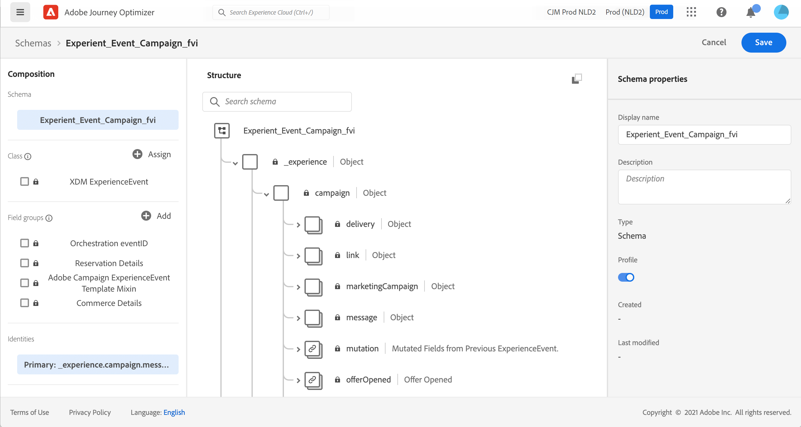

# [!DNL Journey Optimizer] 이벤트에 대한 ExperienceEvent 스키마 정보 {#about-experienceevent-schemas}

[!DNL Journey Optimizer] 이벤트는 스트리밍 수집을 통해 Adobe Experience Platform으로 전송되는 XDM 경험 이벤트입니다.

따라서 [!DNL Journey Optimizer]에 대한 이벤트를 설정하기 위한 중요한 전제 조건은 Adobe Experience Platform의 XDM(Experience Data Model) 및 XDM 경험 이벤트 스키마를 구성하는 방법과 XDM 형식의 데이터를 Adobe Experience Platform으로 스트리밍하는 방법에 대해 잘 알고 있다는 것입니다.

>[!CAUTION]
>
>여정 조건의 경험 이벤트 조회는 더 이상 지원되지 않습니다. 여기에서 대체 모범 사례를 확인하십시오. 여전히 경험 이벤트 조회가 필요하며 나열된 대체 항목을 통해 지원할 수 없는 이벤트 트리거 여정 사용 사례가 있는 경우 Adobe 담당자에게 문의하십시오. 목표에 도달할 수 있도록 도와드리겠습니다.
>
>여정의 시작 이벤트에서 컨텍스트에 액세스하는 것은 영향을 받지 않습니다.

## [!DNL Journey Optimizer] 이벤트에 대한 스키마 요구 사항  {#schema-requirements}

[!DNL Journey Optimizer]에 대한 이벤트를 설정하는 첫 번째 단계는 이벤트를 나타내도록 정의된 XDM 스키마와 Adobe Experience Platform에서 이벤트의 인스턴스를 기록하도록 만들어진 데이터 세트가 있는지 확인하는 것입니다. 이벤트에 대한 데이터 세트를 보유하는 것은 엄격히 필요하지 않지만 이벤트를 특정 데이터 세트에 보내면 향후 참조 및 분석을 위해 사용자의 이벤트 내역을 유지할 수 있으므로 항상 좋은 방법입니다. 이벤트에 적합한 스키마와 데이터 세트가 없는 경우 Adobe Experience Platform 웹 인터페이스에서 두 작업을 모두 수행할 수 있습니다.

[!DNL Journey Optimizer] 이벤트에 사용할 모든 XDM 스키마는 다음 요구 사항을 충족해야 합니다.

* 스키마는 XDM ExperienceEvent 클래스의 스키마여야 합니다.

  

* 시스템 생성 이벤트의 경우 스키마에 오케스트레이션 eventID 필드 그룹이 포함되어야 합니다. [!DNL Journey Optimizer]은(는) 이 필드를 사용하여 여정에서 사용되는 이벤트를 식별합니다.

  

* 이벤트에서 개별 프로필을 식별하기 위한 ID 필드를 선언합니다. ID를 지정하지 않으면 ID 맵을 사용할 수 있습니다. 이러한 방법은 권장되지 않습니다.

  

* 프로필에 이 데이터를 사용하려면 프로필에 대한 스키마와 데이터 세트를 표시하십시오. [자세히 알아보기](../data/lookup-aep-data.md)

  

  

* 사용자, 이벤트가 생성된 장치, 위치 또는 이벤트와 관련된 기타 의미 있는 상황 등 이벤트와 함께 포함하려는 다른 컨텍스트 데이터를 캡처하기 위해 데이터 필드를 자유롭게 포함할 수 있습니다.

  

  

<!--
## Leverage schema relationships{#leverage_schema_relationships}

Adobe Experience Platform allows you to define relationships between schemas in order to use one dataset as a lookup table for another. 

Let's say your brand data model has a schema capturing purchases. You also have a schema for the product catalog. You can capture the product ID in the purchase schema and use a relationship to look up more complete product details from the product catalog. This allows you to create an audience for all customers who bought a laptop, for example, without having to explicitly list out all laptop IDs or capture every single product details in transactional systems.

To define a relationship, you need to have a dedicated field in the source schema, in this case the product ID field in the purchase schema. This field needs to reference the product ID field in the destination schema. The source and destination tables must be enabled for profiles and the destination schema must have that common field defined as its primary identity. 

Here is the product catalog schema enabled for profile with the product ID defined as the primary identity. 

Here is the purchase schema with the relationship defined on the product ID field.

>[!NOTE]
>
>Learn more about schema relationships in the [Experience Platform documentation](https://experienceleague.adobe.com/docs/platform-learn/tutorials/schemas/configure-relationships-between-schemas.html).

In Journey Optimizer, you can then leverage all the fields from the linked tables:

* when configuring a business or unitary event, [Read more](../event/experience-event-schema.md#unitary_event_configuration) 
* when using conditions in a journey, [Read more](../event/experience-event-schema.md#journey_conditions_using_event_context) 
* in message personalization, [Read more](../event/experience-event-schema.md#message_personalization) 
* in custom action personalization, [Read more](../event/experience-event-schema.md#custom_action_personalization_with_journey_event_context) 

### Arrays{#relationships_limitations}

You can define a schema relationship on an array of strings, for example, a list of product IDs.

You can also define a schema relationship with an attribute inside of an array of objects, for example a list of purchase information (product ID, product name, price, discount). The lookup values will be available in journeys (conditions, custom actions, etc.) and message personalization. 

### Event configuration{#unitary_event_configuration}

The linked schema fields are available in unitary and business event configuration:

* when browsing through the event schema fields in the event configuration screen.
* when defining a condition for system-generated events.

The linked fields are not available:

* in the event key formula
* in event id condition (rule-based events)

To learn how to configure a unitary event, refer to this [page](../event/about-creating.md).

### Journey conditions using event context{#journey_conditions_using_event_context}

You can use data from a lookup table linked to an event used in a journey for condition building (expression editor).

Add a condition in a journey, edit the expression and unfold the event node in the expression editor. 

To learn how to define journey conditions, refer to this [page](../building-journeys/condition-activity.md).

### Message personalization{#message_personalization}

The linked fields are available when personalizing a message. The related fields are displayed in the context passed from the journey to the message.

To learn how to personalize a message with contextual journey information, refer to this [page](../personalization/personalization-use-case.md).

### Custom action personalization with journey event context{#custom_action_personalization_with_journey_event_context}

The linked fields are available when configuring the action parameters of a journey custom action activity. 

To learn how to use custom actions, refer to this [page](../building-journeys/using-custom-actions.md).
-->
