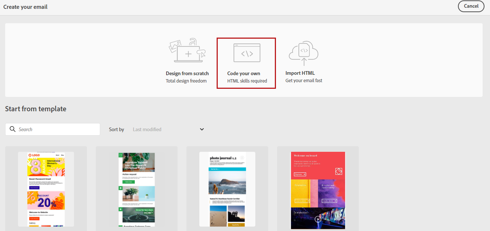
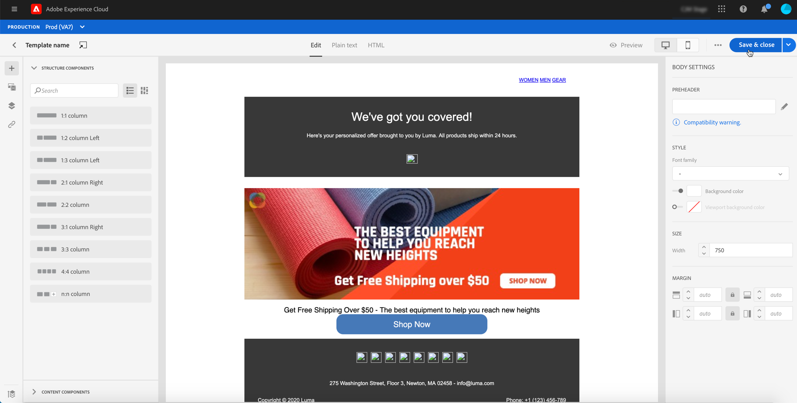

# 이메일 콘텐츠 가져오기 또는 코드 작성 {#existing-content}

Journey Optimizer을 사용하면 기존 HTML 콘텐츠를 가져와서 전자 메일을 디자인할 수 있습니다. 이 컨텐츠는 기존 HTML 파일 또는 zip 폴더의 원시 HTML 코드나 컨텐츠일 수 있습니다.

HTML 콘텐츠를 코딩하거나 기존 콘텐츠를 가져오려면 아래 단계를 수행하십시오.

1. [메시지 만들기](create-message.md)

1. **[!UICONTROL Edit Content]** 섹션에서 **[!UICONTROL Email Designer]** 을 엽니다.

   

1. **[!UICONTROL Code your own]** 또는&#x200B;**[!UICONTROL Import HTML]**&#x200B;를 선택합니다. 다음 단계는 아래 섹션을 참조하십시오.

## 자신의 {#import-raw-html-code} 코드를 지정합니다.

**[!UICONTROL Code your own]** 모드를 사용하여 원시 HTML을 가져오거나 이메일 콘텐츠를 코딩할 수 있습니다. 이 방법에는 HTML 기술이 필요합니다.

>[!CAUTION]
>
> [Adobe Experience Manager Assets Essentials](assets-essentials.md)의 이미지는 이 메서드를 사용할 때 참조할 수 없습니다. HTML 코드에서 참조되는 이미지는 공용 위치에 저장해야 합니다.

1. 전자 메일 디자이너 홈페이지에서 **[!UICONTROL Code your own]** 을 선택합니다.

   

1. 원시 HTML 코드를 입력하거나 붙여넣습니다.

1. 왼쪽 창을 사용하여 [!DNL Journey Optimizer] 개인화 기능을 활용하십시오. 이 작업에 대한 자세한 정보는 [이 섹션](personalization/personalize.md)을 참조하십시오.

   

1. 이메일 디자이너를 열어 새 디자인에서 전자 메일을 시작하려면 옵션 메뉴에서 **[!UICONTROL Change your design]** 을 선택합니다.

   

1. 테스트 프로필을 사용하여 메시지 디자인 및 개인화를 확인하려면 **[!UICONTROL Preview]** 버튼을 클릭합니다. 이 작업에 대한 자세한 정보는 [이 섹션](preview.md)을 참조하십시오.

   

1. 코드가 준비되면 **[!UICONTROL Save]** 을 클릭한 다음 메시지 작성 화면으로 돌아가 메시지를 완료합니다.

   

## HTML 가져오기 {#import-html-content-from-file}

이메일 디자이너에서 HTML 콘텐츠를 가져올 수 있습니다. 이 콘텐츠는 다음과 같습니다.

* 스타일시트가 통합된 **HTML 파일**
* HTML 파일, 스타일 시트(.css) 및 이미지가 포함된 **.zip 폴더**.

   >[!NOTE]
   >
   >.zip 파일 구조에는 제한이 없습니다. 그러나 참조는 .zip 폴더의 트리 구조에 상대적이어야 합니다.

HTML 컨텐츠가 포함된 파일을 가져오려면 아래 단계를 수행하십시오.

1. 전자 메일 디자이너 홈페이지에서 **[!UICONTROL Import HTML]** 을 선택합니다.

   

1. HTML 콘텐츠가 들어 있는 HTML 또는 .zip 파일을 끌어다 놓습니다.

1. HTML 콘텐츠가 업로드되면 이메일 디자이너 기능을 활용하여 이메일을 편집하고 미리 볼 수 있습니다. [이 섹션에서 자세한 내용을 살펴보십시오](create-email-content.md).

   
