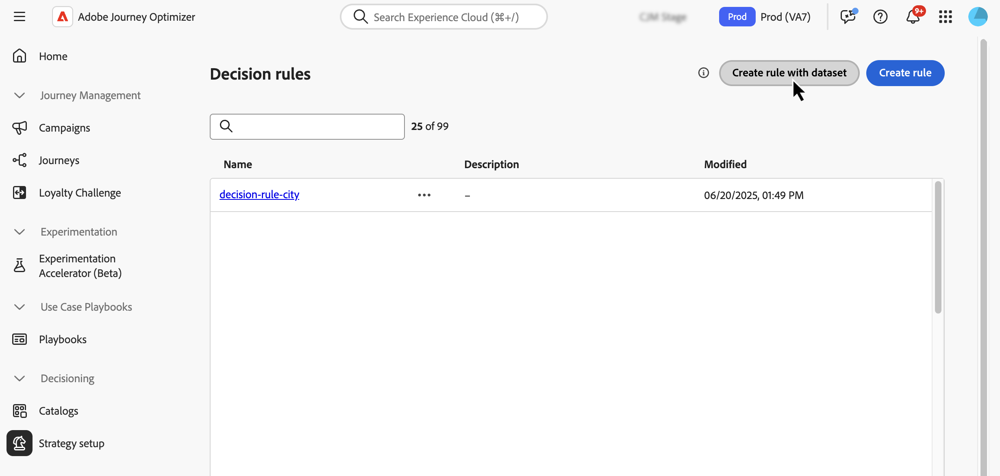
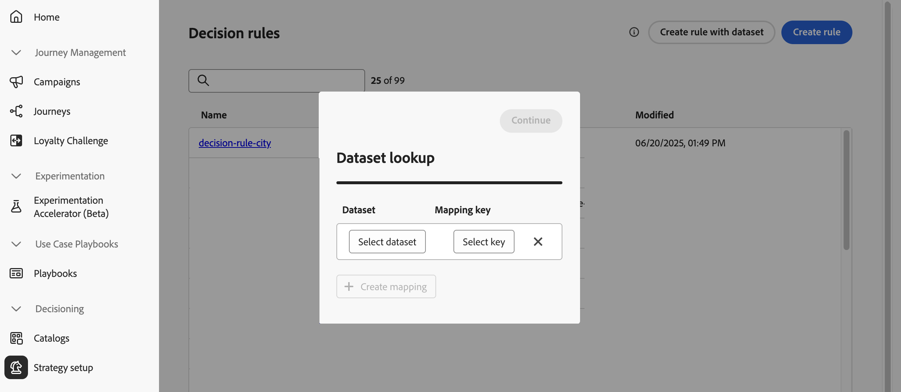

# 의사 결정에 Adobe Experience Platform 데이터 사용{#aep-data}

>[!CONTEXTUALHELP]
>id="ajo_exd_rules_dataset_lookup"
>title="데이터 세트 조회"
>abstract="의사 결정 규칙에서 Adobe Experience Platform 데이터를 사용하면 동적 외부 속성에 따라 자격 조건을 정의할 수 있으므로 의사 결정 항목이 관련성이 있을 때만 표시되도록 합니다. 매핑을 만들어 Adobe Experience Platform 데이터 집합이 [!DNL Journey Optimizer]의 데이터와 결합하는 방법을 정의합니다. 필요한 특성이 있는 데이터 세트를 선택하고 의사 결정 항목 특성과 데이터 세트 모두에 있는 조인 키를 선택합니다."

>[!CONTEXTUALHELP]
>id="ajo_exd_formula_dataset_lookup"
>title="데이터 세트 조회"
>abstract="등급 공식은 의사 결정 항목의 우선 순위를 정의합니다. [!DNL Adobe Experience Platform] 데이터 세트 특성을 사용하면 실제 상황을 반영하도록 순위 논리를 동적으로 조정할 수 있습니다. 매핑을 만들어 Adobe Experience Platform 데이터 집합이 [!DNL Journey Optimizer]의 데이터와 결합하는 방법을 정의합니다. 필요한 특성이 있는 데이터 세트를 선택하고 의사 결정 항목 특성과 데이터 세트 모두에 있는 조인 키를 선택합니다"

>[!AVAILABILITY]
>
>이 기능은 현재 모든 고객이 공개 베타로 사용할 수 있습니다. 이 기능에 액세스하려면 계정 담당자에게 문의하십시오

[!DNL Journey Optimizer]을(를) 사용하면 의사 결정을 위해 [!DNL Adobe Experience Platform]의 데이터를 활용할 수 있습니다. 이렇게 하면 속성을 한 번에 하나씩 수동으로 업데이트할 필요 없이 주기적으로 변경되는 벌크 업데이트에 대해 의사 결정 속성의 정의를 데이터 세트의 추가 데이터로 확장할 수 있습니다. 예: 가용성, 대기 시간 등

## Beta 제한 사항 및 지침 {#guidelines}

시작하기 전에 다음 제한 사항 및 지침에 유의하십시오.

* 의사 결정 정책은 결합된 모든 의사 결정 규칙 및 등급 수식 전체에서 최대 3개의 데이터 세트를 참조할 수 있습니다. 예를 들어, 규칙이 2개의 데이터 세트를 사용하는 경우 공식은 1개의 추가 데이터 세트만 사용할 수 있습니다.
* 의사 결정 규칙은 3개의 데이터 세트를 사용할 수 있습니다.
* 순위 공식은 3개의 데이터 세트를 사용할 수 있습니다.
* 의사 결정 정책이 평가되면 시스템은 총 1000개의 데이터 세트 쿼리(조회)를 수행합니다. 의사 결정 항목에 사용되는 각 데이터 세트 매핑은 하나의 쿼리로 계산됩니다. 예: 의사 결정 항목이 2개의 데이터 세트를 사용하는 경우 해당 오퍼를 평가하는 것은 1000개 쿼리 제한에 대해 2개의 쿼리로 계산됩니다.

## 데이터 조회를 위해 데이터 세트 활성화 {#enable}

의사 결정을 위해 [!DNL Adobe Experience Platform] 데이터 세트의 데이터를 사용하려면 먼저 API 호출을 통해 조회에 사용하도록 설정해야 합니다. 자세한 지침은 [Journey Optimizer에서 Adobe Experience Platform 데이터 세트 활용](../data/lookup-aep-data.md) 섹션을 참조하세요.

## 의사 결정에 Adobe Experience Platform 데이터 사용

조회에 대해 데이터 세트를 활성화하면 해당 속성을 사용하여 외부 데이터로 의사 결정 논리를 보강할 수 있습니다. 이 기능은 제품 가용성 또는 실시간 가격과 같이 자주 변경되는 속성에 특히 유용합니다.

Adobe Experience Platform 데이터 세트의 속성은 의사 결정 논리의 두 부분에서 사용할 수 있습니다.

* **의사 결정 규칙**: 의사 결정 항목을 표시할 수 있는지 여부를 정의합니다.
* **등급 수식**: 외부 데이터를 기반으로 결정 항목의 우선 순위를 지정합니다.

다음 섹션에서는 두 컨텍스트에서 Adobe Experience Platform 데이터를 사용하는 방법에 대해 설명합니다.

### 결정 규칙 {#rules}

의사 결정 규칙에서 Adobe Experience Platform 데이터를 사용하면 동적 외부 속성에 따라 자격 조건을 정의할 수 있으므로 의사 결정 항목이 관련성이 있을 때만 표시되도록 합니다.

예를 들어 온라인 retailer이 로컬 스토어 인벤토리를 기반으로 제품 추천을 홍보하려고 한다고 가정해 보겠습니다. 제품이 가장 가까운 위치에 있는 경우에만 추천할 수 있습니다. 일별 인벤토리 업데이트가 포함된 데이터 세트가 Adobe Experience Platform에 업로드됩니다. 규칙 논리는 지정된 제품에 대한 `inventory_count`이(가) 고객 기본 설정 저장소에 대한 0보다 큰지 확인합니다. 그렇다면 결정 항목이 적격입니다.

의사 결정 규칙에 Adobe Experience Platform 데이터를 사용하려면 다음 단계를 따르십시오.

1. **[!UICONTROL 전략 설정]** / **[!UICONTROL 의사 결정 규칙]** 메뉴로 이동한 다음 **[!UICONTROL 데이터 집합으로 규칙 만들기]**&#x200B;를 선택합니다.

   

1. **[!UICONTROL 매핑 만들기]**&#x200B;를 클릭하여 Adobe Experience Platform 데이터 집합이 [!DNL Journey Optimizer]의 데이터와 결합하는 방법을 정의합니다.

   * 필요한 특성이 있는 데이터 세트를 선택합니다.
   * 의사 결정 항목 속성과 데이터 세트 모두에 있는 결합 키(예: 제품 ID 또는 스토어 ID)를 선택합니다.

   

   >[!NOTE]
   >
   >규칙당 최대 3개의 매핑을 만들 수 있습니다.

1. **[!UICONTROL 계속]**&#x200B;을 클릭합니다. 이제 **[!UICONTROL 데이터 집합 조회]** 메뉴에서 데이터 집합 특성에 액세스하여 규칙 조건에서 사용할 수 있습니다. [의사 결정 규칙을 만드는 방법을 알아봅니다](../experience-decisioning/rules.md#create)

   

### 순위 공식

등급 공식은 의사 결정 항목의 우선 순위를 정의합니다. [!DNL Adobe Experience Platform] 데이터 세트 특성을 사용하면 실제 상황을 반영하도록 순위 논리를 동적으로 조정할 수 있습니다.

예를 들어 항공사가 등급 공식을 사용하여 업그레이드 오퍼의 우선 순위를 정한다고 가정해 보겠습니다. 고객이 높은 충성도 계층을 가지고 있고 현재 시트 가용성이 낮은 경우(시간별로 업데이트된 데이터 세트 기반) 더 높은 우선 순위가 제공됩니다. 데이터 집합에 `flight_number`, `available_seats`, `loyalty_score` 등의 필드가 포함되어 있습니다.

Adobe Experience Platform 데이터를 등급 공식에 사용하려면 다음 단계를 수행합니다.

1. 등급 수식 만들기 또는 편집 **[!UICONTROL 데이터 집합 조회]** 섹션에서 **[!UICONTROL 매핑 만들기]**&#x200B;를 클릭합니다.

1. 데이터 세트 매핑 정의:

   * 적절한 데이터 세트를 선택합니다(예: 항공편을 이용한 좌석 이용 가능).
   * 결정 항목 속성과 데이터 세트 모두에 있는 결합 키(예: 비행 번호 또는 고객 ID)를 선택합니다.

   

   >[!NOTE]
   >
   >등급 수식당 최대 3개의 매핑을 생성할 수 있습니다.

1. 데이터 세트 필드를 사용하여 평소와 같이 등급 공식을 만듭니다. [순위 공식을 만드는 방법을 알아봅니다](../experience-decisioning/exd-ranking-formulas.md#create-ranking-formula)

   
