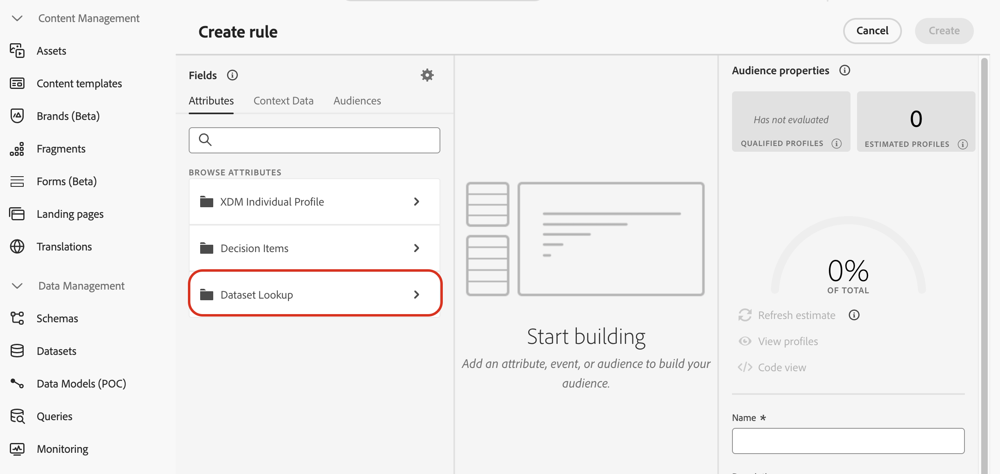

# 결정을 위해 Adobe Experience Platform 데이터 사용 {#aep-data}

>[!CONTEXTUALHELP]
>id="ajo_exd_catalogs_dataset"
>title="데이터 세트 조회"
>abstract="의사 결정을 위해 Adobe Experience Platform의 속성을 사용하려면 Adobe Experience Platform 데이터 세트가 [!DNL Journey Optimizer]의 데이터와 어떻게 결합되는지 정의하는 매핑을 만들어야 합니다."

>[!CONTEXTUALHELP]
>id="ajo_exd_catalogs_dataset_create"
>title="데이터 세트 조회"
>abstract="조회에 대해 활성화된 모든 Adobe Experience Platform 데이터 세트 중에서 필요한 속성이 포함된 데이터 세트를 선택한 다음, 결정 항목 속성 및 데이터 세트 모두에 있는 매핑 키(예: 비행 번호 또는 고객 ID)를 선택합니다."

>[!CONTEXTUALHELP]
>id="ajo_exd_rules_dataset_lookup"
>title="데이터 세트 조회"
>abstract="필요한 속성이 포함된 Adobe Experience Platform 데이터 세트를 선택합니다. 목록에 데이터 세트가 표시되지 않으면 조회에 대해 데이터 세트를 활성화하고 데이터 세트 조회 매핑을 생성했는지 확인합니다."

>[!CONTEXTUALHELP]
>id="ajo_exd_formula_dataset_lookup"
>title="데이터 세트 조회"
>abstract="[!DNL Adobe Experience Platform] 데이터 세트 속성을 사용하여 실제 조건을 반영하도록 순위 논리를 동적으로 조정합니다. **[!UICONTROL 데이터 세트 추가]**&#x200B;를 클릭하여 필요한 속성이 포함된 Adobe Experience Platform 데이터 세트를 선택합니다. 목록에 데이터 세트가 표시되지 않으면 조회에 대해 데이터 세트를 활성화하고 데이터 세트 조회 매핑을 생성했는지 확인합니다."

>[!CONTEXTUALHELP]
>id="ajo_exd_item_capping_dataset"
>title="데이터 세트 추가"
>abstract="[!DNL Adobe Experience Platform] 데이터 세트 속성을 사용하여 동적 외부 속성을 기반으로 상한 기준을 정의합니다. **[!UICONTROL 데이터 세트 추가]**&#x200B;를 클릭하여 필요한 속성이 포함된 Adobe Experience Platform 데이터 세트를 선택합니다. 목록에 데이터 세트가 표시되지 않으면 조회에 대해 데이터 세트를 활성화하고 데이터 세트 조회 매핑을 생성했는지 확인합니다."

[!DNL Journey Optimizer]을(를) 사용하면 의사 결정을 위해 [!DNL Adobe Experience Platform]의 데이터를 활용할 수 있습니다. 그러면 주기적으로 변경되는 일괄 업데이트 시 속성을 일일이 수동으로 업데이트할 필요 없이 결정 속성의 정의를 데이터 세트의 추가 데이터로 확장할 수 있습니다. 예를 들면 가용성, 대기 시간 등이 있습니다.

>[!AVAILABILITY]
>
>이 기능은 현재 모든 고객이 제한된 가용성 릴리스로 사용할 수 있습니다.

## 가드레일 및 제한 사항 {#guardrails}

* **지원되는 채널** - 의사 결정을 사용한 데이터 세트 조회는 현재 전자 메일 및 여정 사용자 지정 작업에 대해 작동합니다. <!--Support for code-based experience channels is coming soon.-->
* **특성 사용** - 의사 결정을 위한 데이터 집합 조회 기능은 결정 항목 정의를 추가 특성으로 확장합니다. 특성이 프로필로 확장되지 않습니다.
* 조회 제한: [!DNL Journey Optimizer]은(는) 단일 결정 정책당 최대 1,000개의 조회를 지원합니다.

## 전제 조건

### 조회에 데이터 세트 활성화

시작하기 전에 의사 결정에 필요한 데이터 세트를 먼저 조회에 대해 활성화해야 합니다. 이 섹션에 자세히 설명된 단계를 따르십시오. [Adobe Experience Platform 데이터 사용](../data/lookup-aep-data.md).

### 매핑 만들기

의사 결정에 Adobe Experience Platform의 특성을 사용하려면 매핑을 만들어 Adobe Experience Platform 데이터 집합이 [!DNL Journey Optimizer]의 데이터와 결합하는 방법을 정의해야 합니다. 이렇게 하려면 다음 단계를 수행합니다.

1. **[!UICONTROL 카탈로그]** / **[!UICONTROL 데이터 세트 조회]**(으)로 이동한 다음 **[!UICONTROL 만들기]**&#x200B;를 클릭합니다.

   

1. 매핑을 구성합니다.

   1. 조회가 활성화된 모든 Adobe Experience Platform 데이터 세트를 표시하려면 **[!UICONTROL 데이터 세트 선택]**&#x200B;을 클릭합니다. 필요한 특성이 있는 데이터 세트를 선택합니다.

   1. **[!UICONTROL 키 선택]**&#x200B;을 클릭하여 결정 항목 특성과 데이터 집합 모두에 있는 조인 키(예: 비행 편 번호 또는 고객 ID)를 선택합니다.

   

1. **[!UICONTROL 저장]**&#x200B;을 클릭합니다.

## Adobe Experience Platform 데이터 활용 {#leverage-aep-data}

조회 및 매핑에 대해 데이터 세트를 활성화하면 이 데이터를 사용하여 외부 데이터로 의사 결정 논리를 보강할 수 있습니다. 이 기능은 제품 가용성 또는 실시간 가격과 같이 자주 변경되는 속성에 특히 유용합니다.

Adobe Experience Platform 데이터 세트의 속성은 의사 결정 논리의 두 부분에서 사용할 수 있습니다.

* **결정 규칙**: 결정 항목을 표시할 수 있는지 여부를 정의합니다.
* **등급 수식**: 외부 데이터를 기반으로 결정 항목의 우선 순위를 지정합니다.
* **최대 가용량 규칙**: 외부 데이터를 사용하여 최대 가용량 규칙에 대한 임계값을 계산합니다.

다음 섹션에서는 이러한 컨텍스트에서 Adobe Experience Platform 데이터를 사용하는 방법을 설명합니다.

### 결정 규칙 {#rules}

의사 결정 규칙에서 Adobe Experience Platform 데이터를 사용하면 동적 외부 속성에 따라 자격 조건을 정의할 수 있으므로 의사 결정 항목이 관련성이 있을 때만 표시되도록 합니다.

예를 들어 온라인 retailer이 로컬 스토어 인벤토리를 기반으로 제품 추천을 홍보하려고 한다고 가정해 보겠습니다. 제품이 가장 가까운 위치에 있는 경우에만 추천할 수 있습니다. 일별 인벤토리 업데이트가 포함된 데이터 세트가 Adobe Experience Platform에 업로드됩니다. 규칙 논리는 지정된 제품에 대한 `inventory_count`이(가) 고객 기본 설정 저장소에 대한 0보다 큰지 확인합니다. 그렇다면 결정 항목이 적격입니다.

의사 결정 규칙에 Adobe Experience Platform 데이터를 사용하려면 다음 단계를 따르십시오.

1. **[!UICONTROL 전략 설정]** / **[!UICONTROL 의사 결정 규칙]** 메뉴로 이동한 다음 **[!UICONTROL 데이터 집합으로 규칙 만들기]**&#x200B;를 선택합니다.

   

1. **[!UICONTROL 데이터 집합 추가]**&#x200B;를 클릭한 다음 필요한 특성이 있는 데이터 집합을 선택하십시오.

   

1. **[!UICONTROL 계속]**&#x200B;을 클릭합니다. 이제 **[!UICONTROL 데이터 집합 조회]** 메뉴에서 데이터 집합 특성에 액세스하여 규칙 조건에서 사용할 수 있습니다. [의사 결정 규칙을 만드는 방법을 알아봅니다](../experience-decisioning/rules.md#create)

   

### 순위 공식 {#ranking-formulas}

순위 공식은 결정 항목의 우선순위를 정의합니다. [!DNL Adobe Experience Platform] 데이터 세트 특성을 사용하면 실제 상황을 반영하도록 순위 논리를 동적으로 조정할 수 있습니다.

예를 들어 항공사가 등급 공식을 사용하여 업그레이드 오퍼의 우선 순위를 정한다고 가정해 보겠습니다. 고객이 높은 충성도 계층을 가지고 있고 현재 시트 가용성이 낮은 경우(시간별로 업데이트된 데이터 세트 기반) 더 높은 우선 순위가 제공됩니다. 데이터 집합에 `flight_number`, `available_seats`, `loyalty_score` 등의 필드가 포함되어 있습니다.

Adobe Experience Platform 데이터를 등급 공식에 사용하려면 다음 단계를 수행합니다.

1. 등급 수식 만들기 또는 편집

1. **[!UICONTROL 데이터 집합 조회]** 섹션에서 **[!UICONTROL 데이터 집합 추가]**&#x200B;를 클릭합니다.

1. 적절한 데이터 세트를 선택합니다.

   

   >[!NOTE]
   >
   >찾고 있는 데이터 세트가 목록에 표시되지 않는 경우 조회에 대해 활성화했으며 데이터 세트 조회 매핑을 만들었는지 확인하십시오. 자세한 내용은 [필수 구성 요소](#prerequisites) 섹션을 참조하십시오.

1. 데이터 세트 필드를 사용하여 평소와 같이 등급 공식을 만듭니다. [순위 공식을 만드는 방법을 알아봅니다](ranking/ranking-formulas.md#create-ranking-formula)

   

### 최대 가용량 규칙 {#capping-rules}

한도 규칙은 의사 결정 항목을 표시할 수 있는 최대 횟수를 정의하는 제약 조건으로 사용됩니다. 최대 가용량 규칙에 Adobe Experience Platform 데이터를 사용하면 동적 외부 속성에 따라 최대 가용량 기준을 정의할 수 있습니다. 이는 원하는 캡핑 임계값을 계산하기 위해 캡핑 규칙의 표현식을 사용하여 수행됩니다.

예를 들어 retailer은 실시간 제품 인벤토리를 기반으로 오퍼를 제한할 수 있습니다. 고정 임계값 500을 설정하는 대신 Adobe Experience Platform 데이터 세트의 `inventory_count` 필드를 참조하는 식을 사용합니다. 데이터 세트에 275개 항목이 재고로 남아 있는 것으로 표시되면 오퍼는 해당 숫자까지만 전달됩니다.

>[!NOTE]
>
>최대 가용량 규칙 **식**&#x200B;은(는) 현재 모든 사용자에게 제한된 가용성 기능으로 사용할 수 있으며 **[!UICONTROL 총]**&#x200B;개의 최대 가용량 유형에 대해서만 지원됩니다.

Adobe Experience Platform 데이터를 사용하여 규칙 표현식을 제한하려면 다음 단계를 따르십시오.

1. 의사 결정 항목을 만들거나 편집합니다.

1. 항목 자격 조건을 정의할 때 **[!UICONTROL 데이터 집합 추가]**&#x200B;를 클릭하고 적절한 데이터 집합을 선택하십시오.

   

   >[!NOTE]
   >
   >찾고 있는 데이터 세트가 목록에 표시되지 않는 경우 조회에 대해 활성화했으며 데이터 세트 조회 매핑을 만들었는지 확인하십시오. 자세한 내용은 [필수 구성 요소](#prerequisites) 섹션을 참조하십시오.

1. **[!UICONTROL 총]** 한도 유형을 선택한 다음 **[!UICONTROL 식]** 옵션을 활성화하십시오.

   

   >[!NOTE]
   >
   >찾고 있는 데이터 세트가 목록에 표시되지 않는 경우 조회에 대해 활성화했으며 데이터 세트 조회 매핑을 만들었는지 확인하십시오. 자세한 내용은 [필수 구성 요소](#prerequisites) 섹션을 참조하십시오.

1. 표현식을 편집하고 데이터 세트 필드를 사용하여 표현식을 작성합니다.

   

1. 평소대로 최대 가용량 및 규칙 결정 항목의 구성을 완료합니다. [최대 가용량 규칙을 설정하는 방법 알아보기](../experience-decisioning/items.md#capping)
