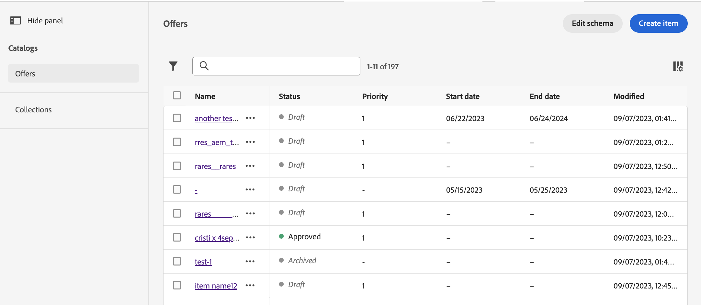
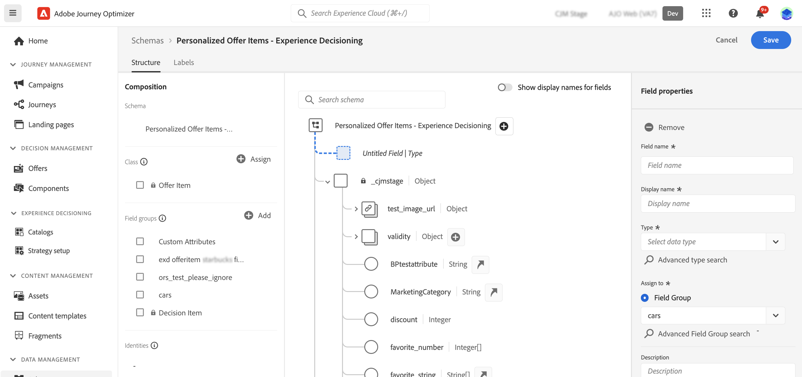

# 항목 카탈로그 {#catalog}

Experience Decisioning에서 카탈로그는 의사 결정 항목을 구성하는 중앙 컨테이너 역할을 합니다. 각 카탈로그는 의사 결정 항목에 할당할 수 있는 모든 속성을 포함하는 Adobe Experience Platform 스키마에 연결됩니다.

지금은 생성된 모든 의사 결정 항목이 단일 &quot;오퍼&quot; 카탈로그 내에 통합되어 를 통해 액세스할 수 있습니다. **[!UICONTROL 카탈로그]** 메뉴 아래의 제품에서 사용할 수 있습니다.

결정 항목 속성이 저장된 카탈로그의 스키마에 액세스하려면 다음 단계를 따르십시오.

1. 항목 목록에서 **[!UICONTROL 스키마 편집]** 다음 옆에 있는 단추 **[!UICONTROL 항목 만들기]** 단추를 클릭합니다.

1. 카탈로그의 스키마가 아래 구조에 따라 새 탭에서 열립니다.

   * 다음 **`_experience`** 노드에는 이름, 시작 및 종료 날짜, 설명 등 표준 결정 항목 속성이 포함됩니다.
   * 다음 **`_<imsOrg>`** 노드에는 사용자 지정 의사 결정 항목 속성이 있습니다. 기본적으로 사용자 지정 속성은 구성되지 않지만 요구 사항에 맞게 필요한 만큼 추가할 수 있습니다. 완료되면 사용자 지정 속성이 표준 속성과 함께 의사 결정 항목 만들기 화면에 표시됩니다.

   

1. 사용자 지정 속성을 스키마에 추가하려면 **`_<imsOrg>`** 노드를 클릭하고 구조에서 원하는 위치에 있는 &quot;+&quot; 단추를 클릭합니다.

   

1. 추가된 속성에 필요한 필드를 입력하고 를 클릭합니다 **[!UICONTROL 적용]**.

   >[!CAUTION]
   >
   >현재 Experience Decisioning은 String, Integer, Boolean, Date, DateTime 및 Decisioning 자산과 같은 데이터 유형만 지원합니다. 이러한 데이터 형식을 벗어나는 필드는 의사 결정 항목이나 카탈로그를 작성할 때 사용할 수 없습니다.

   자산 속성을 결정하는 속성에 입력되는 값은 공개 URL입니다. 대부분의 경우 이미지를 가리킵니다.

   Adobe Experience Platform 스키마로 작업하는 방법에 대한 자세한 내용은 [XDM 시스템 설명서](https://experienceleague.adobe.com/docs/experience-platform/xdm/ui/overview.html?lang=ko).

1. 원하는 사용자 지정 속성이 추가되면 스키마를 저장합니다. 이제 새 필드를 항목 의사 결정 만들기 화면의 **[!UICONTROL 사용자 지정 속성]** 섹션.
