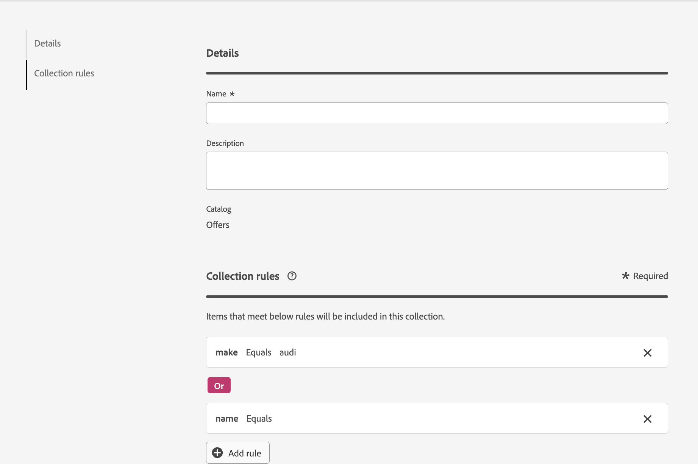

# 컬렉션 {#collections}

>[!CONTEXTUALHELP]
>id="ajo_exd_item_collections"
>title="컬렉션 만들기"
>abstract="컬렉션을 사용하면 환경 설정에 따라 결정 항목을 분류하고 그룹화할 수 있습니다. 이들 범주는 결정 항목의 속성을 활용하는 규칙을 작성하여 생성됩니다."

>[!CONTEXTUALHELP]
>id="ajo_exd_item_collection_rules"
>title="컬렉션에 대한 규칙 정의"
>abstract="하나 이상의 규칙을 추가하여 컬렉션에 포함할 항목을 결정합니다. 기준으로 사용할 항목 속성을 선택합니다. 원하는 연산자를 선택하고 필터링할 값을 입력합니다. 필요한 만큼 규칙을 추가합니다."

>[!CONTEXTUALHELP]
>id="ajo_exd_strategy_collection"
>title="컬렉션 선택"
>abstract="고려할 오퍼가 포함된 컬렉션을 선택합니다. 이 단계는 선택 전략을 생성할 때 필수입니다. 컬렉션을 사용하면 환경 설정에 따라 결정 항목을 분류하고 그룹화할 수 있습니다. 예를 들어 “범주” 사용자 정의 속성에 “요가” 값이 있는 모든 결정 항목을 포함하는 컬렉션을 생성할 수 있습니다."

컬렉션을 사용하면 환경 설정에 따라 결정 항목을 분류하고 그룹화할 수 있습니다. 이들 범주는 결정 항목의 속성을 활용하는 규칙을 작성하여 생성됩니다.

예를 들어 결정 항목의 카탈로그 스키마에 &quot;Category&quot; 사용자 지정 특성을 추가했다고 가정해 보겠습니다. 이렇게 하면 &quot;Category&quot; 특성에 &quot;Yoga&quot; 값이 있는 모든 결정 항목을 포함하는 컬렉션을 만들 수 있습니다.

컬렉션 목록은 **[!UICONTROL 카탈로그]** 메뉴에서 액세스할 수 있습니다.

컬렉션을 만들려면 다음 단계를 수행하십시오.

1. **[!UICONTROL 개의 카탈로그]** > **[!UICONTROL 컬렉션]**(으)로 이동한 다음 **[!UICONTROL 컬렉션 만들기]**&#x200B;를 클릭합니다.
1. 컬렉션에 사용할 이름과 설명을 입력합니다.
1. 하나 이상의 규칙을 추가하여 컬렉션에 포함할 항목을 결정합니다. 방법은 다음과 같습니다.

   1. 기준으로 사용할 항목 속성을 선택합니다. 속성 목록에는 카탈로그 스키마에 정의된 모든 표준 및 사용자 지정 속성이 포함됩니다. [항목 카탈로그에 대한 자세한 정보](catalogs.md)
   1. 원하는 연산자를 선택하고 필터링할 값을 입력합니다.
   1. 필요한 만큼 규칙을 추가하려면 이 단계를 반복하십시오. 여러 규칙이 추가되면 **And**&#x200B;와 **Or** 연산자 중에서 선택하여 결합할 수 있습니다. 이렇게 하려면 운영자 배지를 클릭하여 두 선택 항목 간을 전환합니다.
   1. **[!UICONTROL 컬렉션 미리 보기]** 단추를 클릭하여 정의한 규칙을 충족하는 항목을 표시합니다.

   

1. 컬렉션 규칙이 정의되면 **[!UICONTROL 만들기]**&#x200B;를 클릭합니다. 이제 컬렉션이 목록에 표시됩니다.
