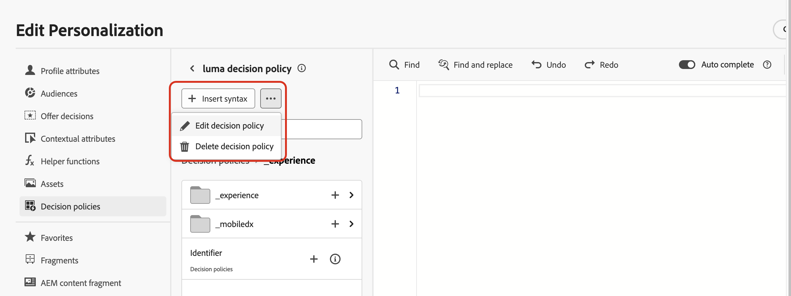

# 결정 정책 만들기 {#create-decision}

>[!CONTEXTUALHELP]
>id="ajo_code_based_decision"
>title="의사 결정은 무엇입니까?"
>abstract="결정 정책에는 결정 엔진이 최상의 콘텐츠를 선택하기 위한 모든 선택 논리가 포함되어 있습니다. 결정 정책은 캠페인별로 다릅니다. 목표는 각 프로필에 가장 적합한 제안을 선택하는 것이며, 캠페인 작성을 통해서는 메시지에 포함될 항목 속성을 포함하여 선택한 결정 항목이 표시될 방법을 지정할 수 있습니다."
>additional-url="https://experienceleague.adobe.com/ko/docs/journey-optimizer/using/decisioning/offer-decisioning/get-started-decision/starting-offer-decisioning" text="결정 정보"

>[!CONTEXTUALHELP]
>id="ajo_journey_decision_policy"
>title="결정 정책 정의"
>abstract="결정 정책을 사용하면 결정 엔진에서 최상의 항목을 선택하여 올바른 대상자에게 전달할 수 있습니다."
>additional-url="https://experienceleague.adobe.com/ko/docs/journey-optimizer/using/decisioning/offer-decisioning/get-started-decision/starting-offer-decisioning" text="결정 정보"

>[!CONTEXTUALHELP]
>id="ajo_exd_decision_policy"
>title="결정 정책"
>abstract="결정 정책을 사용하면 결정 엔진에서 최상의 항목을 선택하여 각 대상자에게 전달할 수 있습니다."

>[!CONTEXTUALHELP]
>id="ajo_exd_placements"
>title="배치"
>abstract="배치는 결정 엔진에서 반환된 항목이 메시지에 나타나는 위치를 결정합니다. 보고에서 다양한 배치에 대한 성과를 추적할 수 있습니다."

>[!CONTEXTUALHELP]
>id="ajo_exd_decision_attribute"
>title="카탈로그에서 결정 속성 선택"
>abstract="결정 속성은 카탈로그의 스키마에 저장됩니다. 선택한 카탈로그에서 여기에서 사용할 속성을 선택합니다."

의사 결정 정책은 의사 결정 엔진을 활용하여 각 대상 구성원에 대해 제공할 최상의 콘텐츠를 동적으로 반환하는 오퍼에 대한 컨테이너입니다. 이 프로필의 목표는 각 프로필에 가장 적합한 오퍼를 선택하는 것이며, 캠페인/여정 작성에서는 메시지에 포함할 항목 속성을 포함하여 선택한 결정 항목을 표시하는 방법을 나타낼 수 있습니다.

## 주요 단계 {#key}

메시지에 의사 결정 정책을 활용하는 주요 단계는 다음과 같습니다.

1. [이메일 또는 코드 기반 경험에서 의사 결정 정책 만들기](#add-decision)

   반환할 항목 수를 선택하고, 선택 전략, 대체 옵션 및 평가 순서를 구성하여 이메일 또는 코드 기반 경험에서 의사 결정 정책을 설정합니다.

1. [콘텐츠의 의사 결정 정책 사용](#use-decision-policy)

   메시지에 표시할 결정 항목의 결정 정책 출력 및 속성으로 콘텐츠를 개인화합니다.

1. [보고 대시보드 만들기](cja-reporting.md)

   사용자 지정 Customer Journey Analytics 대시보드를 작성하여 성과를 측정하고 의사 결정 정책 및 오퍼가 전달되고 참여하는 방식에 대한 통찰력을 얻으십시오.

## 가드레일 및 제한 사항

* **제한된 가용성 - 전자 메일의 의사 결정 정책** - 현재 전자 메일의 의사 결정 정책 생성은 제한된 가용성에서 사용할 수 있습니다. 액세스 권한을 얻으려면 Adobe 담당자에게 문의하십시오.
* **미러 페이지** - 지금은 결정 항목이 이메일 미러 페이지에서 렌더링되지 않습니다.
* **추적 및 링크 유형** - 의사 결정에 의해 생성된 링크를 추적하려면 스키마에서 &quot;Decisioning Assets&quot;로 정의하십시오. 속성 기반 링크는 추적할 수 없습니다.
* **전자 메일에 의사 결정 정책 중첩** - 이미 연결된 의사 결정 정책이 있는 상위 전자 메일 구성 요소에 여러 의사 결정 정책을 중첩할 수 없습니다.
* **의사 결정 기능이 있는 중복된 여정/캠페인** - 의사 결정 정책이 포함된 여정 또는 캠페인을 복제하는 경우 복제된 버전이 원본 전자 메일 또는 코드 기반 경험을 참조하므로 오류가 발생합니다. 항상 복제 후 결정 정책을 재구성합니다.
* **동의 정책** - 동의 정책 업데이트는 적용되는 데 최대 48시간이 걸립니다. 의사 결정 정책이 최근에 업데이트된 동의 정책에 연결된 속성을 참조하는 경우 변경 사항이 즉시 적용되지 않습니다.

  마찬가지로 동의 정책의 대상인 새 프로필 속성이 의사 결정 정책에 추가되면 사용할 수 있지만 지연이 경과할 때까지 연결된 동의 정책이 적용되지 않습니다.

  동의 정책은 Adobe Healthcare Shield 또는 Privacy and Security Shield 추가 기능이 있는 조직만 사용할 수 있습니다.

* **AI 등급** - 현재 AI 등급은 Decisioning이 있는 여정의 이메일 채널에 대해 지원되지 않습니다.

## 이메일 또는 코드 기반 경험에서 의사 결정 정책 만들기 {#add-decision}

>[!CONTEXTUALHELP]
>id="ajo_code_based_item_number"
>title="반환할 항목 수 정의"
>abstract="반환하려는 결정 항목의 수를 선택합니다. 예를 들어 항목 2개를 선택하면 현재 구성에 대한 적격 제안 2개가 표시됩니다."

>[!CONTEXTUALHELP]
>id="ajo_code_based_fallback"
>title="대체 항목 선택"
>abstract="해당 결정 정책에 정의된 선택 전략 중 어느 것도 적합하지 않은 경우 사용자에게 대체 항목이 표시됩니다."

>[!CONTEXTUALHELP]
>id="ajo_code_based_strategy"
>title="전략이란?"
>abstract="선택 전략의 순서에 따라 먼저 평가할 전략을 결정합니다. 적어도 한 개의 전략이 필요합니다. 결합된 전략의 결정 항목을 동시에 평가합니다."
>additional-url="https://experienceleague.adobe.com/ko/docs/journey-optimizer/using/decisioning/offer-decisioning/get-started-decision/starting-offer-decisioning" text="전략 만들기"

웹 사이트 또는 모바일 앱에서 이메일의 수신자 및 방문자에게 최고의 동적 오퍼 및 경험을 제공하려면 이메일 또는 코드 기반 캠페인 또는 여정에 의사 결정 정책을 추가합니다. 그 방법은 다음과 같습니다.

### 의사 결정 정책 만들기 {#add}

1. 여정 또는 캠페인에서 **[!UICONTROL 이메일]** 또는 **[!UICONTROL 코드 기반 경험]** 작업을 추가합니다.

1. 전자 메일의 경우 구성 화면에서 **[!UICONTROL 의사 결정 사용]**&#x200B;을 전환하십시오.

   

   >[!IMPORTANT]
   >
   >의사 결정을 활성화하면 기존 이메일 콘텐츠가 지워집니다. 이미 이메일을 디자인한 경우 콘텐츠를 템플릿으로 미리 저장해야 합니다.
   >
   >이메일 내에 구성된 모든 의사 결정 정책은 템플릿에 저장되지 않습니다. 템플릿을 다른 이메일에 적용하는 경우 정책을 다시 구성해야 합니다.

1. 정책은 개인화 편집기를 사용하여 이메일 및 코드 기반 경험에서 만들 수 있습니다. 이메일 Designer의 전용 메뉴에서 이메일에 만들 수도 있습니다. 자세한 내용을 보려면 아래 섹션을 확장하십시오.

   +++Personalization 편집기

   1. 개인화 편집기를 열고 **[!UICONTROL 결정 정책]**&#x200B;을 선택합니다.
   1. 새 정책을 만들려면 **[!UICONTROL 결정 정책 추가]** 단추를 클릭하십시오.

      

   +++

   +++이메일 Designer **[!UICONTROL 의사 결정]** 메뉴

   1. 구성 요소를 선택하고 도구 모음 또는 속성 창에서 **[!UICONTROL 의사 결정]** 아이콘을 클릭한 다음 **[!UICONTROL 새 정책 추가]**&#x200B;를 선택합니다.

   1. **[!UICONTROL 결정 출력 재사용]**&#x200B;을 선택하여 이 전자 메일 내에 이미 만들어진 결정 정책을 재사용합니다.

      

   +++

1. 이름을 입력하고 카탈로그를 선택하십시오(현재 기본 **[!UICONTROL 오퍼]** 카탈로그로 제한됨).

1. 반환할 항목의 수를 선택합니다. 예를 들어 항목 2개를 선택하면 현재 구성에 대한 적격 제안 2개가 표시됩니다.

   

   이메일의 경우 **[!UICONTROL 반복 그리드]** 콘텐츠 구성 요소에서만 여러 항목을 반환할 수 있습니다. 자세한 내용을 보려면 아래 섹션을 확장하십시오.

   +++ 이메일에 여러 결정 항목 반환

   1. **[!UICONTROL 반복 그리드]** 구성 요소를 캔버스로 드래그하고 **[!UICONTROL 설정]** 창을 사용하여 원하는 대로 구성합니다.

      

   1. 캔버스 도구 모음에서 **[!UICONTROL Decisioning]** 아이콘을 클릭하거나 **[!UICONTROL Decisioning]** 창을 열고 **[!UICONTROL 의사 결정 정책 추가]**&#x200B;를 선택합니다.

   1. **[!UICONTROL 항목 수]** 필드에 반환할 항목 수를 지정한 다음 아래 문서화된 대로 결정 정책을 구성하십시오. 선택할 수 있는 최대 항목 수는 **[!UICONTROL 반복 그리드]** 구성 요소에 정의된 타일 수로 제한됩니다.

   

   +++

1. **[!UICONTROL 다음]**&#x200B;을 클릭합니다.

### 항목 및 선택 전략 선택 {#select}

**[!UICONTROL 전략 시퀀스]** 섹션에서 결정 정책과 함께 제공할 결정 항목 및 선택 전략을 선택할 수 있습니다.

1. **[!UICONTROL 추가]**&#x200B;를 클릭하고 정책에 포함할 개체 유형을 선택하십시오.

   * **[!UICONTROL 선택 전략]**: 하나 이상의 선택 전략을 추가합니다. 의사 결정 전략은 자격 제한 및 등급 방법과 관련된 컬렉션을 활용하여 표시할 항목을 결정합니다. 기존 선택 전략을 선택하거나 **[!UICONTROL 선택 전략 만들기]** 단추를 사용하여 새 선택 전략을 만들 수 있습니다. [선택 전략을 만드는 방법을 알아봅니다](selection-strategies.md)

   * **[!UICONTROL 결정 항목]**: 선택 전략을 실행하지 않고도 표시할 단일 결정 항목을 추가하십시오. 한 번에 하나의 결정 항목만 선택할 수 있습니다. 품목에 대해 설정된 모든 자격 제한이 적용됩니다.

   

   >[!NOTE]
   >
   >의사 결정 정책은 선택 전략과 의사 결정 항목을 합하여 최대 10개까지 지원한다. [보호 기능 및 제한 결정에 대해 자세히 알아보기](gs-experience-decisioning.md#guardrails)

1. 여러 개의 의사 결정 항목 및/또는 전략을 추가할 때 특정 순서로 평가된다. 시퀀스에 추가된 첫 번째 객체가 먼저 평가됩니다. 기본 시퀀스를 변경하려면 개체 및/또는 그룹을 드래그 앤 드롭하여 원하는 대로 순서를 변경합니다. 자세한 내용을 보려면 아래 섹션을 확장하십시오.

   +++의사 결정 정책에서 평가 순서 관리

   정책에 결정 항목 및 선택 전략을 추가한 후에는 해당 순서를 정렬하여 평가 순서를 결정하고 선택 전략을 결합하여 함께 평가할 수 있습니다.

   항목 및 전략을 평가할 **순차적 순서**&#x200B;은 각 개체 또는 개체 그룹의 왼쪽에 숫자로 표시됩니다. 시퀀스 내에서 선택 전략(또는 전략 그룹)의 위치를 이동하려면 해당 위치를 다른 위치로 끌어다 놓습니다.

   

   >[!NOTE]
   >
   >선택 전략만 시퀀스 내에서 드래그하여 놓을 수 있습니다. 결정 항목의 위치를 변경하려면 먼저 평가하려는 다른 항목을 추가한 후 **[!UICONTROL 추가]** 단추를 사용하여 결정 항목을 제거하고 다시 추가해야 합니다.

   여러 선택 전략을 그룹으로 **결합**&#x200B;하여 개별적으로 평가되지 않고 함께 평가할 수도 있습니다. 이렇게 하려면 선택 전략 아래의 **`+`** 단추를 클릭하여 다른 단추와 결합하십시오. 선택 전략을 다른 전략에 끌어다 놓아 두 전략을 그룹으로 그룹화할 수도 있습니다.

   >[!NOTE]
   >
   >결정 항목을 다른 항목이나 선택 전략과 함께 그룹화할 수 없습니다.

   여러 전략과 해당 그룹화에 따라 전략의 우선 순위와 적격 오퍼의 순위가 결정됩니다. 첫 번째 전략은 우선순위가 가장 높고 동일 그룹 내에서 결합된 전략은 우선순위가 같다.

   예를 들어 전략 A와 전략 B에 각각 하나씩, 이렇게 두 개의 컬렉션이 있습니다. 요청은 두 개의 결정 항목이 다시 전송될 수 있도록 하는 것입니다. 전략 A의 2개의 적격 오퍼와 전략 B의 3개의 적격 오퍼가 있다고 가정해 보겠습니다.

   * 두 전략이 **결합되지 않음** 또는 순차적 순서(1과 2)인 경우 첫 번째 전략의 상위 2개의 적격 오퍼가 첫 번째 행에 반환됩니다. 첫 번째 전략에 적합한 오퍼가 두 개 없는 경우, 의사 결정 엔진은 계속해서 필요한 만큼 많은 오퍼를 찾기 위해 다음 전략으로 이동하고, 필요한 경우 최종적으로 대체 오퍼를 반환합니다.

     

   * 두 컬렉션이 **동시에 평가되는 경우**, 전략 A의 2개 적격 오퍼와 전략 B의 3개 적격 오퍼가 있으므로 5개 오퍼는 모두 각 순위 방법으로 결정된 값을 기준으로 스택됩니다. 2개의 오퍼가 요청되므로 이 5개의 오퍼 중 상위 2개의 적격 오퍼가 반환됩니다.

     

   **여러 전략을 사용하는 예제**

   이제 여러 전략을 서로 다른 그룹으로 나눈 예를 살펴보겠습니다. 세 가지 전략을 정의했습니다. 전략 1과 전략 2는 그룹 1에서 함께 결합되고 전략 3은 독립적이다(그룹 2). 각 전략에 대한 적격 오퍼와 해당 우선순위(순위 함수 평가에 사용됨)는 다음과 같습니다.

   * 그룹 1:
      * 전략 1 - (오퍼 1, 오퍼 2, 오퍼 3) - 우선순위 1
      * 전략 2 - (오퍼 3, 오퍼 4, 오퍼 5) - 우선순위 1

   * 그룹 2:
      * 전략 3 - (오퍼 5, 오퍼 6) - 우선순위 0

   우선 순위가 가장 높은 전략 오퍼를 먼저 평가하고 등급 오퍼 목록에 추가합니다.

   * **반복 1:**

     전략 1 및 전략 2 오퍼는 함께 평가됩니다(오퍼 1, 오퍼 2, 오퍼 3, 오퍼 4, 오퍼 5). 그 결과는 다음과 같습니다.

     오퍼 1 - 10
오퍼 2 - 20
전략 1에서 오퍼 3 - 30, 전략 2에서 오퍼 45. 둘 중 가장 높은 것을 고려할 것이므로 45를 고려한다.
오퍼 4 - 40
오퍼 5 - 50

     이제 등급 오퍼는 다음과 같습니다. 오퍼 5, 오퍼 3, 오퍼 4, 오퍼 2, 오퍼 1.

   * **반복 2:**

     전략 3 오퍼가 평가됩니다(오퍼 5, 오퍼 6). 그 결과는 다음과 같습니다.

      * 오퍼 5 - 위의 결과에 이미 있으므로 평가되지 않습니다.
      * 오퍼 6 - 60

     이제 등급 오퍼는 다음과 같습니다. 오퍼 5 , 오퍼 3, 오퍼 4, 오퍼 2, 오퍼 1, 오퍼 6.

   +++

1. **[!UICONTROL 다음]** 클릭

### 대체 오퍼 추가 {#fallback}

결정 항목 및/또는 선택 전략을 선택하면 위의 항목 또는 선택 전략이 모두 충족되지 않는 경우 표시할 대체 오퍼를 추가할 수 있습니다.

현재 샌드박스에서 만든 모든 결정 항목을 표시하는 목록에서 항목을 선택할 수 있습니다. 적합한 선택 전략이 없으면 선택한 항목<!--nor frequency capping when available - TO CLARIFY-->에 적용된 날짜 및 자격 제한에 관계없이 대체 항목이 사용자에게 표시됩니다.


>[!NOTE]
> 폴백은 선택 사항입니다. 요청된 항목 수까지 선택할 수 있습니다. 적합한 항목이 없고 대체 항목이 설정되지 않은 경우 아무것도 표시되지 않습니다.

### 의사 결정 정책 저장 및 관리 {#save}

결정 정책이 준비되면 저장한 다음 **[!UICONTROL 만들기]**&#x200B;를 클릭합니다.

이메일의 경우 의사 결정 정책과 연관된 구성 요소에 대한 배치를 정의해야 합니다. 이렇게 하려면 구성 요소 속성 창에서 **[!UICONTROL 의사 결정]** 단추를 클릭하고 **[!UICONTROL 배치 할당]**&#x200B;을 선택합니다. [배치 작업 방법 알아보기](../experience-decisioning/placements.md)


개인화 편집기의 줄임표 단추나 구성 요소 속성 창의 **[!UICONTROL 결정]** 메뉴에서 언제든지 결정 정책을 편집하거나 삭제할 수 있습니다.

>[!BEGINTABS]

>[!TAB 개인화 편집기에서 정책을 편집하거나 삭제]



>[!TAB 구성 요소의 속성에서 정책을 편집하거나 삭제합니다]


>[!ENDTABS]

## 콘텐츠에서 의사 결정 정책 사용 {#use-decision-policy}

만든 후, 결정 정책 및 반환된 결정 항목에 연결된 속성을 콘텐츠에서 사용하여 콘텐츠를 개인화할 수 있습니다. 이렇게 하려면 다음 단계를 수행합니다.

### 의사 결정 정책 코드 삽입 {#insert-code}

1. 개인화 편집기를 열고 **[!UICONTROL 의사 결정 정책]** 메뉴에 액세스합니다.

1. 전자 메일의 경우 **[!UICONTROL 구문 삽입]**&#x200B;을 클릭하여 결정 정책에 해당하는 코드를 추가합니다. 코드 기반 경험의 경우 **[!UICONTROL 정책 삽입]**&#x200B;을 클릭하세요.

   +++이메일에 의사 결정 정책 코드 삽입

   

   전자 메일의 경우, 미리 구성 요소에 연결된 배치가 없으면 목록에서 배치를 선택하고 **[!UICONTROL 할당]**&#x200B;을 클릭합니다.

   

   +++

   +++코드 기반 환경에 의사 결정 정책 코드 삽입

   

   +++

   >[!NOTE]
   >
   >코드 삽입 단추가 표시되지 않으면 상위 구성 요소에 대해 의사 결정 정책이 이미 구성되어 있을 수 있습니다.

1. 결정 정책에 대한 코드가 추가됩니다. 이 순서는 결정 정책이 반환될 횟수를 반복합니다. 예를 들어 [결정을 만들](#add-decision) 때 다시 2개 항목을 반환하도록 선택한 경우 동일한 시퀀스가 두 번 반복됩니다.

### 의사 결정 항목 속성 활용 {#attributes}

이제 해당 코드 내에 원하는 모든 결정 특성을 추가할 수 있습니다. 사용 가능한 특성은 **[!UICONTROL 오퍼]** 카탈로그의 스키마에 저장됩니다. 사용자 지정 특성은 **`_<imsOrg`>** 폴더에 저장되고 표준 특성은 **`_experience`** 폴더에 저장됩니다. [오퍼 카탈로그의 스키마에 대해 자세히 알아보기](catalogs.md)


>[!NOTE]
>
>결정 정책 항목 추적의 경우 결정 정책 콘텐츠에 대해 `trackingToken` 특성을 다음과 같이 추가해야 합니다.
>&#x200B;>`trackingToken: {{item._experience.decisioning.decisionitem.trackingToken}}`

1. 각 폴더를 클릭하여 확장합니다. 원하는 위치에 마우스 커서를 놓고 추가하려는 속성 옆에 있는 + 아이콘을 클릭합니다. 코드에 원하는 수만큼 속성을 추가할 수 있습니다.

   

1. 대괄호 `#each` 쌍 안에 `[ ]` 루프를 래핑하고 닫는 `/each` 바로 앞에 쉼표를 추가해야 합니다.

   

1. 프로필 속성과 같이 개인화 편집기에서 사용할 수 있는 다른 속성을 추가할 수도 있습니다.

   

### 조각 활용 {#fragments}

의사 결정 정책에 조각이 포함된 의사 결정 항목이 포함되어 있는 경우 의사 결정 정책 코드에서 이러한 조각을 활용할 수 있습니다. [조각에 대해 자세히 알아보기](../content-management/fragments.md)

>[!AVAILABILITY]
>
>이 기능은 현재 조직 집합(제한된 가용성)에만 사용할 수 있습니다. 자세한 내용은 Adobe 담당자에게 문의하십시오.

예를 들어 여러 모바일 디바이스 모델에 대해 서로 다른 콘텐츠를 표시하려고 한다고 가정해 보겠습니다. 해당 디바이스에 해당하는 조각을 결정 정책에서 사용 중인 결정 항목에 추가했는지 확인하십시오. [방법을 알아보세요](items.md#attributes).

{width=70%}

완료되면 다음 방법 중 하나를 사용할 수 있습니다.

>[!BEGINTABS]

>[!TAB 직접 코드 삽입]

아래의 코드 블록을 의사 결정 정책 코드에 복사하여 붙여넣기만 하면 됩니다. `variable`을(를) 조각 ID로 바꾸고 `placement`을(를) 조각 참조 키로 바꿉니다.

```

{{fragment id = variable}}
```

>[!TAB 자세한 단계 따르기]

1. **[!UICONTROL 도우미 함수]**(으)로 이동하고 조각에 대한 변수를 선언할 수 있는 코드 창에 **Let** 함수 ` {{variable}}`을(를) 추가합니다.

   

1. **맵** > **Get** 함수 ``을(를) 사용하여 식을 빌드합니다. 맵은 결정 항목에서 참조된 조각이며 문자열은 **[!UICONTROL 조각 참조 키]**(으)로 결정 항목에 입력한 장치 모델일 수 있습니다.

   

1. 이 디바이스 모델 ID가 포함된 상황별 속성을 사용할 수도 있습니다.

   

1. 조각에 대해 선택한 변수를 조각 ID로 추가합니다.

   

>[!ENDTABS]

결정 항목의 **[!UICONTROL 조각]** 섹션에서 조각 ID와 참조 키가 선택됩니다.

>[!WARNING]
>
>조각 키가 올바르지 않거나 조각 컨텐츠가 유효하지 않은 경우 렌더링이 실패하여 Edge 호출에 오류가 발생합니다.

#### 조각을 사용할 때의 보호 기능 {#fragments-guardrails}

**결정 항목 및 컨텍스트 특성**

[!DNL Journey Optimizer] 조각에서는 기본적으로 결정 항목 특성 및 contextal 특성이 지원되지 않습니다. 그러나 아래 설명된 것처럼 전역 변수를 대신 사용할 수 있습니다.

조각에서 *sport* 변수를 사용한다고 가정해 보겠습니다.

1. 조각에서 이 변수를 참조합니다. 예를 들면 다음과 같습니다.

   ```
   Elevate your practice with new {{sport}} gear!
   ```

1. 결정 정책 블록 내에서 **Let** 함수를 사용하여 변수를 정의합니다. 아래 예에서 *sport*&#x200B;은(는) 결정 항목 특성으로 정의됩니다.

   ```
   {#each decisionPolicy.13e1d23d-b8a7-4f71-a32e-d833c51361e0.items as |item|}}
   
   {{fragment id = get(item._experience.decisioning.offeritem.contentReferencesMap, "placement1").id }}
   {{/each}}
   ```

**결정 항목 조각 콘텐츠 유효성 검사**

* 이러한 조각의 동적 특성으로 인해 캠페인에서 사용할 경우, 의사 결정 항목에서 참조되는 조각에 대해 캠페인 콘텐츠 생성 중 메시지 유효성 검사를 건너뜁니다.

* 조각 콘텐츠의 유효성 검사는 조각 생성 및 게시 중에만 수행됩니다.

* JSON 조각의 경우 JSON 개체의 유효성이 보장되지 않습니다. 표현식 조각 콘텐츠가 결정 항목에서 사용할 수 있도록 유효한 JSON인지 확인하십시오.

런타임 시 캠페인 콘텐츠(의사 결정 항목의 조각 콘텐츠 포함)의 유효성이 검사됩니다. 유효성 검사 실패 시 캠페인이 렌더링되지 않습니다.

## 최종 단계 {#final-steps}

콘텐츠가 준비되면 캠페인 또는 여정을 검토하고 게시합니다.

* [여정 게시](../building-journeys/publishing-the-journey.md)
* [캠페인 검토 활성화](../campaigns/review-activate-campaign.md)
* [코드 기반 경험 게시 및 활성화](../code-based/publish-code-based.md)

코드 기반 경험의 경우 개발자가 채널 구성에 정의된 표면에 대한 콘텐츠를 가져오기 위해 API 또는 SDK 호출을 수행하면 바로 웹 페이지 또는 앱에 변경 사항이 적용됩니다.

>[!NOTE]
>
>현재 [코드 기반 경험](../code-based/create-code-based.md) 캠페인이나 여정에서 의사 결정을 사용하여 사용자 인터페이스의 콘텐츠를 시뮬레이션할 수 없습니다. [이 섹션](../code-based/code-based-decisioning-implementations.md)에서 해결 방법을 사용할 수 있습니다.

의사 결정의 성과를 확인하려면 사용자 지정 [Customer Journey Analytics 보고 대시보드](cja-reporting.md)를 만들 수 있습니다.
