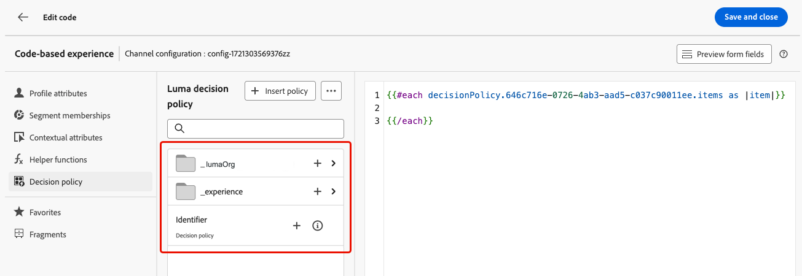

# 결정 정책 만들기 {#create-decision}

>[!CONTEXTUALHELP]
>id="ajo_code_based_decision"
>title="의사 결정은 무엇입니까?"
>abstract="결정 정책에는 결정 엔진이 최상의 콘텐츠를 선택하기 위한 모든 선택 논리가 포함되어 있습니다. 결정 정책은 캠페인별로 다릅니다. 목표는 각 프로필에 가장 적합한 제안을 선택하는 것이며, 캠페인 작성을 통해서는 메시지에 포함될 항목 속성을 포함하여 선택한 결정 항목이 표시될 방법을 지정할 수 있습니다."
>additional-url="https://experienceleague.adobe.com/en/docs/journey-optimizer/using/decisioning/offer-decisioning/get-started-decision/starting-offer-decisioning" text="경험 결정 정보"

의사 결정 정책은 대상자에 따라 제공할 최상의 콘텐츠를 선택하기 위해 경험 의사 결정 엔진을 활용하는 오퍼에 대한 컨테이너입니다.

결정 정책에는 결정 엔진이 최상의 콘텐츠를 선택하기 위한 모든 선택 논리가 포함되어 있습니다. 결정 정책은 캠페인별로 다릅니다. 목표는 각 프로필에 가장 적합한 제안을 선택하는 것이며, 캠페인 작성을 통해서는 메시지에 포함될 항목 속성을 포함하여 선택한 결정 항목이 표시될 방법을 지정할 수 있습니다.

>[!NOTE]
>
>다음에서 [!DNL Journey Optimizer] 사용자 인터페이스, 의사 결정 정책은 의사 결정으로 레이블이 지정됩니다.<!--but they are decision policies. TBC if this note is needed-->.

## 코드 기반 캠페인에 결정 정책 추가 {#add-decision}

>[!CONTEXTUALHELP]
>id="ajo_code_based_item_number"
>title="반환할 항목 수 정의"
>abstract="반환하려는 결정 항목의 수를 선택합니다. 예를 들어 항목 2개를 선택하면 현재 표면에 대한 적격 제안 2개가 표시됩니다."

>[!CONTEXTUALHELP]
>id="ajo_code_based_fallback"
>title="대체 항목 선택"
>abstract="해당 결정 정책에 정의된 선택 전략 중 어느 것도 적합하지 않은 경우 사용자에게 대체 항목이 표시됩니다."

>[!CONTEXTUALHELP]
>id="ajo_code_based_strategy"
>title="전략이란?"
>abstract="선택 전략의 순서에 따라 먼저 평가할 전략을 결정합니다. 적어도 한 개의 전략이 필요합니다. 결합된 전략의 결정 항목을 동시에 평가합니다."
>additional-url="https://experienceleague.adobe.com/en/docs/journey-optimizer/using/decisioning/offer-decisioning/get-started-decision/starting-offer-decisioning" text="전략 만들기"
>additional-url="https://experienceleague.adobe.com/en/docs/journey-optimizer/using/decisioning/offer-decisioning/get-started-decision/starting-offer-decisioning" text="평가 순서"

웹 사이트 또는 모바일 앱에서 방문자에게 최고의 동적 오퍼 및 경험을 제공하려면 코드 기반 캠페인에 의사 결정 정책을 추가하십시오. 그 방법은 다음과 같습니다.

1. 캠페인을 만들고 다음을 선택합니다. **[!UICONTROL 코드 기반 경험]** 작업. [자세히 알아보기](../code-based/create-code-based.md)

1. 다음에서 [코드 편집기](../code-based/create-code-based.md#edit-code)를 선택하고 **[!UICONTROL 결정 정책]** 아이콘 및 클릭 **[!UICONTROL 결정 정책 추가]**.

   

1. 결정 정책에 대한 세부 정보를 입력합니다. 이름을 추가하고 카탈로그를 선택합니다.

   >[!NOTE]
   >
   >현재는 기본값만 **[!UICONTROL 오퍼]** 카탈로그를 사용할 수 있습니다.

   

1. 반환할 항목 수를 선택합니다. 예를 들어 2를 선택하면 현재 표면에 대해 가장 적합한 2개의 오퍼가 표시됩니다. 클릭 **[!UICONTROL 다음]**

1. 사용 **[!UICONTROL 전략 추가]** 단추를 클릭하여 의사 결정 정책에 대한 선택 전략을 정의합니다. 각 전략은 자격 제한 사항과 관련된 오퍼 컬렉션 및 표시할 오퍼를 결정하는 등급 메서드로 구성됩니다. [자세히 알아보기](selection-strategies.md)

   

   >[!NOTE]
   >
   >적어도 한 개의 전략이 필요합니다. 10개 이상의 전략을 추가할 수 없습니다.

1. 다음에서 **[!UICONTROL 전략 추가]** 화면에서 전략을 만들 수도 있습니다. 다음 **[!UICONTROL 선택 전략 만들기]** 버튼은 사용자를 로 리디렉션합니다. **[!UICONTROL Experience decisioning]** > **[!UICONTROL 전략 설정]** 메뉴 아래의 제품에서 사용할 수 있습니다. [자세히 알아보기](selection-strategies.md)

   

1. 몇 가지 전략을 추가할 때 특정 순서로 평가된다. 시퀀스에 추가된 첫 번째 전략이 먼저 평가됩니다. [자세히 알아보기](#evaluation-order)

   기본 시퀀스를 변경하려면 전략 및/또는 그룹을 드래그하여 놓아 원하는 대로 순서를 변경할 수 있습니다.

   

1. 대체 항목을 추가합니다. 위의 선택 전략 중 어느 것도 충족되지 않는 경우 대체 항목이 사용자에게 표시됩니다.

   

   현재 샌드박스에서 만든 모든 결정 항목을 표시하는 목록에서 항목을 선택할 수 있습니다. 적합한 선택 전략이 없으면 선택한 항목에 적용된 날짜 및 자격 제한에 관계없이 대체 항목이 사용자에게 표시됩니다<!--nor frequency capping when available - TO CLARIFY-->.

   >[!NOTE]
   >
   >대체 항목은 선택 사항입니다. 대체 을 선택하지 않고 적합한 전략이 없으면 다음 기준에 따라 아무것도 표시되지 않습니다. [!DNL Journey Optimizer].

1. 선택 내용을 저장하고 **[!UICONTROL 만들기]**. 의사 결정 정책이 만들어졌으므로 이제 코드 기반 경험 콘텐츠 내에서 의사 결정 특성을 사용할 수 있습니다. [자세히 알아보기](#use-decision-policy)

   

## 평가 순서 {#evaluation-order}

전술한 바와 같이 전략은 집합, 순위 방법, 자격 제약으로 구성된다.

다음과 같은 작업을 수행할 수 있습니다.

* 평가할 전략에 대해 원하는 순차적 순서를 설정합니다.
* 여러 전략을 결합하여 개별적으로 평가되지 않고 함께 평가됩니다.

여러 전략과 해당 그룹화에 따라 전략의 우선 순위와 적격 오퍼의 순위가 결정됩니다. 첫 번째 전략은 우선순위가 가장 높고 동일 그룹 내에서 결합된 전략은 우선순위가 같다.

예를 들어 전략 A와 전략 B에 각각 하나씩, 이렇게 두 개의 컬렉션이 있습니다. 요청은 두 개의 결정 항목이 다시 전송될 수 있도록 하는 것입니다. 전략 A의 2개의 적격 오퍼와 전략 B의 3개의 적격 오퍼가 있다고 가정해 보겠습니다.

* 두 가지 전략이 **결합되지 않음** 또는 순차적 순서 (1 및 2)로 첫 번째 전략의 상위 2개의 적격 오퍼가 첫 번째 행에 반환됩니다. 첫 번째 전략에 적합한 오퍼가 두 개 없는 경우, 의사 결정 엔진은 계속해서 필요한 만큼 많은 오퍼를 찾기 위해 다음 전략으로 이동하고, 필요한 경우 최종적으로 대체 오퍼를 반환합니다.

  

* 두 컬렉션이 **동시에 평가됨**, 전략 A의 적격 오퍼가 2개, 전략 B의 적격 오퍼가 3개 있으므로, 5개의 오퍼는 모두 각 순위 방법으로 결정된 값을 기준으로 스택됩니다. 2개의 오퍼가 요청되므로 이 5개의 오퍼 중 상위 2개의 적격 오퍼가 반환됩니다.

  

+++ **여러 전략을 사용한 예**

이제 여러 전략을 서로 다른 그룹으로 나눈 예를 살펴보겠습니다.

세 가지 전략을 정의했습니다. 전략 1과 전략 2는 그룹 1에서 함께 결합되고 전략 3은 독립적이다(그룹 2).

각 전략에 대한 적격 오퍼와 해당 우선순위(순위 함수 평가에 사용됨)는 다음과 같습니다.

* 그룹 1:
   * 전략 1 - (오퍼 1, 오퍼 2, 오퍼 3) - 우선순위 1
   * 전략 2 - (오퍼 3, 오퍼 4, 오퍼 5) - 우선순위 1

* 그룹 2:
   * 전략 3 - (오퍼 5, 오퍼 6) - 우선순위 0

우선 순위가 가장 높은 전략 오퍼를 먼저 평가하고 등급 오퍼 목록에 추가합니다.

**반복 1:**

전략 1 및 전략 2 오퍼는 함께 평가됩니다(오퍼 1, 오퍼 2, 오퍼 3, 오퍼 4, 오퍼 5). 그 결과는 다음과 같습니다.

오퍼 1 - 10 오퍼 2 - 20 오퍼 3 - 30 전략 1에서, 45 전략 2에서. 둘 중 가장 높은 것을 고려할 것이므로 45를 고려한다.
오퍼 4 - 40 오퍼 5 - 50

이제 등급 오퍼는 다음과 같습니다. 오퍼 5, 오퍼 3, 오퍼 4, 오퍼 2, 오퍼 1.

**반복 2:**

전략 3 오퍼가 평가됩니다(오퍼 5, 오퍼 6). 그 결과는 다음과 같습니다.

* 오퍼 5 - 위의 결과에 이미 있으므로 평가되지 않습니다.
* 오퍼 6 - 60

이제 등급 오퍼는 다음과 같습니다. 오퍼 5 , 오퍼 3, 오퍼 4, 오퍼 2, 오퍼 1, 오퍼 6.

+++

## 코드 편집기에서 의사 결정 정책 사용 {#use-decision-policy}

의사 결정 정책을 만들면 [표현식 편집기](../code-based/create-code-based.md#edit-code). 그 방법은 다음과 같습니다.

>[!NOTE]
>
>코드 기반 경험은 [!DNL Journey Optimizer] 모든 개인화 및 작성 기능이 있는 표현식 편집기. [자세히 알아보기](../personalization/personalization-build-expressions.md)

1. 다음을 클릭합니다. **[!UICONTROL 정책 삽입]** 단추를 클릭합니다. 결정 정책에 해당하는 코드가 추가됩니다.

   

   >[!NOTE]
   >
   >이 순서는 결정 정책이 반환될 횟수를 반복합니다. 예를 들어 다음과 같은 경우에 2개의 항목을 반환하도록 선택한 경우 [의사 결정 만들기](#add-decision), 동일한 시퀀스가 두 번 반복됩니다.

1. 이제 해당 코드 내에 원하는 모든 결정 특성을 추가할 수 있습니다. 사용 가능한 속성은에 저장됩니다. **[!UICONTROL 오퍼]** 카탈로그의 스키마. 사용자 지정 속성은 **`_<imsOrg`>** 의 폴더 및 표준 속성 **`_experience`** 폴더를 삭제합니다. [오퍼 카탈로그의 스키마에 대해 자세히 알아보기](catalogs.md)

   

   >[!NOTE]
   >
   >의사 결정 정책 항목 추적의 경우 `trackingToken`결정 정책 콘텐츠에 대해 속성을 다음과 같이 추가해야 합니다.
   >`trackingToken: {{item._experience.decisioning.decisionitem.trackingToken}}`

1. 각 폴더를 클릭하여 확장합니다. 원하는 위치에 마우스 커서를 놓고 추가하려는 속성 옆에 있는 + 아이콘을 클릭합니다. 코드에 원하는 수만큼 속성을 추가할 수 있습니다.

   

1. 표현식 편집기에서 사용할 수 있는 다른 속성(예: 프로필 속성)을 추가할 수도 있습니다.

   

## Customer Journey Analytics에서 보고 {#cja}

Customer Journey Analytics으로 작업하는 경우 Experience Decisioning을 활용하는 코드 기반 캠페인에 대한 사용자 지정 보고 대시보드를 만들 수 있습니다.

주요 단계는 아래에 나와 있습니다. Customer Journey Analytics 작업 방법에 대한 자세한 내용은 [Customer Journey Analytics 설명서](https://experienceleague.adobe.com/en/docs/analytics-platform/using/cja-landing){target="_blank"}.

1. 만들기 및 구성 **연결** Customer Journey Analytics. 이렇게 하면 보고서를 보낼 데이터 세트에 연결할 수 있습니다. [연결 만들기 방법 알아보기](https://experienceleague.adobe.com/en/docs/analytics-platform/using/cja-connections/create-connection){target="_blank"}

1. 만들기 **데이터 보기** 을(를) 이전에 만든 연결에 연결합니다. 다음에서 **[!UICONTROL 구성 요소]** 탭에서 보고에 표시할 관련 스키마 필드를 선택합니다. Experience Decisioning의 경우 다음을 포함해야 합니다. **propositioninteract** 및 **제안 표시** 필드. [데이터 보기를 만들고 구성하는 방법 알아보기](https://experienceleague.adobe.com/en/docs/analytics-platform/using/cja-dataviews/create-dataview){target="_blank"}

1. 에서 데이터 구성 요소, 테이블 및 시각화 결합 **작업 공간 프로젝트** 코드 기반 캠페인에 대한 보고서를 만들고 공유하려면[작업 영역 프로젝트를 만드는 방법 알아보기](https://experienceleague.adobe.com/en/docs/analytics-platform/using/cja-workspace/build-workspace-project/create-projects){target="_blank"}
