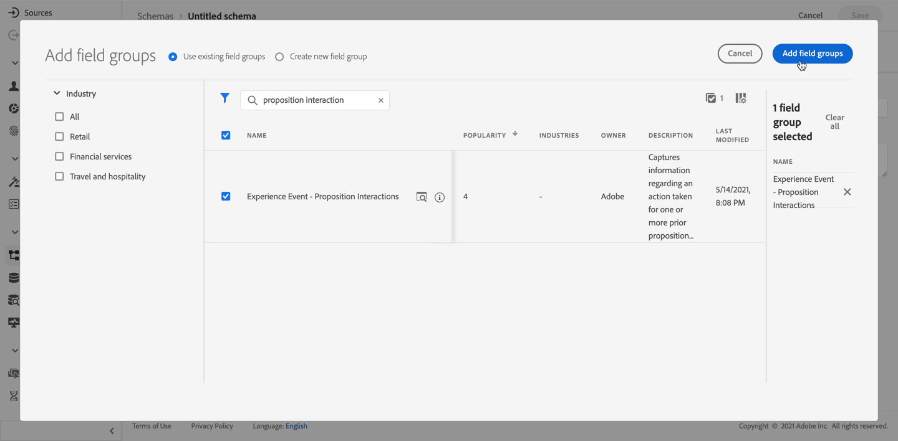

# 이벤트를 수집할 데이터 세트 만들기 {#create-dataset}

>[!BEGINSHADEBOX]

**이 페이지에서:** 제안 상호 작용을 캡처하는 데 필요한 경험 이벤트 스키마 및 데이터 세트를 빌드하면 의사 결정 피드백을 AI 등급 모델에 제공할 수 있습니다.

>[!ENDSHADEBOX]

경험 이벤트를 수집하려면 먼저 이러한 이벤트를 전송할 데이터 세트를 만들어야 합니다.

먼저 데이터 세트에 사용할 스키마를 만듭니다.

1. **[!UICONTROL 데이터 관리]** 메뉴에서 **[!UICONTROL 스키마]**&#x200B;을(를) 선택합니다.

1. **[!UICONTROL 스키마 만들기]**&#x200B;를 클릭하고 오른쪽 상단에서 **[!UICONTROL 경험 이벤트]**&#x200B;를 선택한 후 **다음**&#x200B;을 클릭합니다.

   

   >[!NOTE]
   >
   >[XDM 시스템 개요 설명서](https://experienceleague.adobe.com/docs/experience-platform/xdm/home.html?lang=ko-KR){target="_blank"}에서 XDM 스키마 및 필드 그룹에 대해 자세히 알아보세요.

1. 스키마의 이름과 설명을 입력하고 **마침**&#x200B;을 클릭합니다.
   

1. 왼쪽의 **[!UICONTROL 필드 그룹]** 섹션에서 **[!UICONTROL 추가]**&#x200B;를 선택합니다.

   

1. **[!UICONTROL 검색]** 필드에 &quot;제안 상호 작용&quot;을 입력하십시오.

1. **[!UICONTROL 경험 이벤트 - 제안 상호 작용]** 필드 그룹을 선택하고 **[!UICONTROL 필드 그룹 추가]**&#x200B;를 클릭합니다.

   

   >[!CAUTION]
   >
   >데이터 세트에 사용할 스키마에는 **[!UICONTROL 경험 이벤트 - 제안 상호 작용]** 필드 그룹이 연결되어 있어야 합니다. 그렇지 않으면 AI 모델에서 사용할 수 없습니다.

1. 스키마를 저장합니다.

>[!NOTE]
>
>[스키마 컴포지션의 기본 사항](https://experienceleague.adobe.com/docs/experience-platform/xdm/schema/composition.html?lang=ko#understanding-schemas){target="_blank"}에서 스키마 빌드에 대해 자세히 알아보세요.

이제 이 스키마를 사용하여 데이터 세트를 만들 준비가 되었습니다. 이렇게 하려면 아래 단계를 수행합니다.

1. **[!UICONTROL 데이터 관리]** 메뉴에서 **[!UICONTROL 데이터 세트]**&#x200B;를 선택하고 **[!UICONTROL 찾아보기]** 탭으로 이동합니다.

1. **[!UICONTROL 데이터 집합 만들기]**&#x200B;를 클릭하고 **[!UICONTROL 스키마에서 데이터 집합 만들기]**&#x200B;를 선택합니다.

   

1. 목록에서 방금 만든 스키마를 선택하고 **[!UICONTROL 다음]**&#x200B;을(를) 클릭합니다.

1. **[!UICONTROL 이름]** 필드에 데이터 집합에 대한 고유한 이름을 입력하고 **[!UICONTROL 마침]**&#x200B;을 클릭합니다.

   

>[!NOTE]
>
>이제 [AI 모델](../ranking/create-ai-models.md)을(를) 만들 때 이벤트 데이터를 수집하도록 이 데이터 세트를 선택할 수 있습니다.
