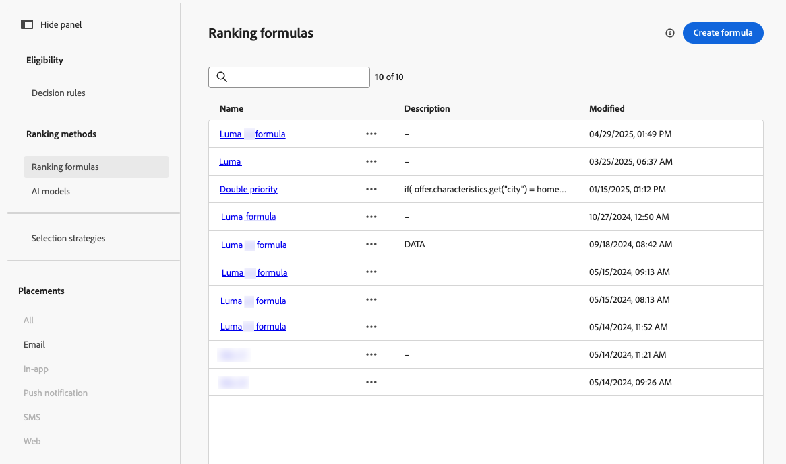

# AI 수식 빌더 사용 {#create-ranking-formulas}

**등급 수식**&#x200B;을 사용하면 우선 순위 점수를 고려하지 않고 먼저 제시해야 할 오퍼를 결정하는 규칙을 정의할 수 있습니다.

<!--In today's world, relevance demands more than static priorities.The new formula builder in **[!UICONTROL Adobe Journey Optimizer]** empowers marketers to dynamically rank offers by blending AI-driven model scores with business priorities, offer attributes, and contextual signals — no coding required.-->

이러한 규칙을 만들기 위해 **[!UICONTROL Adobe Journey Optimizer]**&#x200B;의 AI 수식 빌더는 오퍼의 등급을 매기는 방법을 보다 유연하게 제어하고 제어할 수 있습니다. 이제 정적 오퍼 우선 순위에만 의존하는 대신 안내가 있는 인터페이스를 통해 AI 모델 점수, 오퍼 우선 순위, 프로필 속성, 오퍼 속성 및 컨텍스트 신호를 결합하는 사용자 지정 등급 공식을 정의할 수 있습니다.

이 접근 방식을 사용하면 AI 중심의 성향, 비즈니스 가치 및 실시간 컨텍스트의 조합에 따라 오퍼 순위를 동적으로 조정할 수 있으므로 마케팅 목표와 고객 요구 사항 모두에 맞게 의사 결정을 보다 쉽게 조정할 수 있습니다. AI 수식 빌더는 적용하려는 제어 양에 따라 간단한 수식 또는 고급 수식을 지원합니다.

순위 수식을 만들면 [선택 전략](selection-strategies.md)에 할당할 수 있습니다. 이 선택 전략을 사용할 때 여러 오퍼를 표시할 수 있는 경우, 의사 결정 엔진은 선택한 공식을 사용하여 먼저 게재할 오퍼를 계산합니다.

## 등급 수식 만들기 {#create-ranking-formula}

>[!CONTEXTUALHELP]
>id="ajo_exd_config_formulas"
>title="순위 공식 만들기"
>abstract="공식을 사용하면 항목의 우선 순위 점수를 고려하지 않고 먼저 제시해야 하는 결정 항목을 결정하는 규칙을 정의할 수 있습니다. 등급 공식이 생성되면 이를 선택 전략에 지정할 수 있습니다."

순위 공식을 만들려면 아래 단계를 수행합니다.

1. **[!UICONTROL 전략 설정]** 메뉴에 액세스한 다음 **[!UICONTROL 등급 수식]** 탭을 선택합니다. 이전에 만든 수식의 목록이 표시됩니다.

   

1. **[!UICONTROL 수식 만들기]**&#x200B;를 클릭합니다.

1. 공식 이름을 지정하고 원하는 경우 설명을 추가합니다.

   {width="80%"}

1. 선택적으로 **[!UICONTROL AI 모델 선택]**&#x200B;을 클릭하여 순위 공식을 만드는 데 참조로 사용할 모델을 설정합니다. 아래 공식을 정의할 때 모델 점수를 참조할 때마다 선택한 AI 모델이 사용됩니다.

   >[!CAUTION]
   >
   >순위 공식에 통합된 AI 모델을 사용할 때 데이터는 [홀드아웃 및 모델 기반 트래픽에 대한 전환율](../reports/campaign-global-report-cja-code.md#conversion-rate) 보고서에 반영되지 않습니다.

1. 일치하는 결정 항목에 대한 순위 점수를 결정할 조건을 정의합니다. 다음을 수행할 수 있습니다.

   * [사용자 인터페이스](#ranking-select-criteria)에서 **[!UICONTROL 기준]** 섹션을 채우십시오.
   * 또는 [코드 편집기](#ranking-code-editor)(으)로 전환하십시오.

<!--## Select an ELS dataset {#els-dataset}

To leverage data from an AEP dataset, you can select it in the **[!UICONTROL ELS settings]** section.

1. Select an ELS dataset from the list.

1. Select a decision attribute. This action is mandatory.

{width="80%"}

-->

## 공식 빌더를 사용하여 기준 정의 {#ranking-select-criteria}

직관적인 인터페이스를 통해 AI 점수(성향), 오퍼 가치(우선 순위), 컨텍스트 레버 및 외부 프로필 성향을 개별적으로 또는 조합하여 조정하여 의사 결정을 세밀하게 조정하여 모든 상호 작용을 최적화할 수 있습니다. <!--Whether you're maximizing revenue, promoting strategic offers, or balancing business goals with real-time context, the formula builder gives you total control in defining ranking strategies.-->

인터페이스에서 직접 기준을 정의하려면 아래 단계를 따르십시오.

<!--{width="80%"}-->

1. **[!UICONTROL 기준 1]** 섹션에서 다음을 수행하여 순위 점수를 적용할 결정 항목을 지정합니다.
   * [결정 항목 특성](items.md#attributes)을 선택합니다.
   * 논리 연산자 선택,
   * 일치하는 조건 추가 - 값을 입력하거나 프로필 특성 또는 [컨텍스트 데이터](context-data.md)를 선택할 수 있습니다.

   {width="70%"}

   <!--You can refer to [offer attributes](items.md#attributes), profile attributes, or [context data](context-data.md).-->

1. 선택적으로 추가 요소를 지정하여 기준이 true가 되도록 일치하는 조건을 구체화할 수 있습니다.

   {width="80%"}

   예를 들어, *날씨* 사용자 지정 특성 *같음*&#x200B;과 같은 기준 1을 *따뜻한* 조건으로 정의했습니다. 또한 첫 번째 조건이 충족되고 요청 시 온도가 75도를 초과하는 경우 기준 1이 참인 경우와 같은 다른 조건을 추가할 수 있습니다.<!--Add a screenshot with the example-->

1. 위에 정의된 조건을 충족하는 결정 항목에 등급 점수를 지정할 표현식을 만듭니다. 다음 중 하나를 참조할 수 있습니다.

   * **[!UICONTROL 세부 정보]** 섹션 [위](#create-ranking-formula)에서 선택적으로 선택한 AI 모델에서 나온 점수;
   * [결정 항목을 만들 때 수동으로 할당된 값인 결정 항목의 우선 순위](items.md#attributes); <!--If a profile qualifies for multiple decision items, a higher priority grants the item precedence over others.-->
   * 외부에서 파생된 성향 점수와 같이 프로필에 있을 수 있는 모든 속성
   * 자유 형식으로 할당할 수 있는 정적 값
   * 위의 모든 조합.

   {width="70%"}

   >[!NOTE]
   >
   >필드 옆에 있는 아이콘을 클릭하여 사전 정의된 변수를 추가합니다.

1. 하나 이상의 기준을 필요한 횟수만큼 추가하려면 **[!UICONTROL 기준 추가]**&#x200B;를 클릭하십시오. 논리는 다음과 같습니다.
   * 주어진 결정 항목에 대해 첫 번째 기준이 참인 경우 다음 기준보다 우선합니다.
   * true가 아닌 경우 의사 결정 엔진이 두 번째 기준으로 이동합니다.

1. 마지막 필드에서 위의 기준을 충족하지 않는 모든 결정 항목에 지정할 표현식을 작성할 수 있습니다.

   {width="70%"}

1. 순위 공식을 완료하려면 **[!UICONTROL 만들기]**&#x200B;를 클릭하세요. 이제 목록에서 선택하여 세부 정보를 보고 편집하거나 삭제할 수 있습니다. 적격한 결정 항목의 등급을 매기기 위해 [선택 전략](selection-strategies.md)에서 사용할 준비가 되었습니다.

### 순위 공식 예

아래 예제를 생각해 보십시오. <!--To be checked by PM-->

{width="80%"}

의사 결정 항목의 지역(사용자 지정 속성)이 프로필의 지리적 레이블(프로필 속성)과 같은 경우, 여기에 표시된 등급 점수(의사 결정 항목 우선 순위, AI 모델 점수 및 정적 값의 조합임)는 해당 조건을 충족하는 모든 의사 결정 항목에 적용됩니다.

## 코드 편집기 사용 {#ranking-code-editor}

**PQL 구문**&#x200B;에서 등급 수식을 표현하려면 화면 오른쪽 상단의 전용 단추를 사용하여 코드 편집기로 전환하십시오. PQL 구문을 사용하는 방법에 대한 자세한 내용은 [전용 설명서](https://experienceleague.adobe.com/docs/experience-platform/segmentation/pql/overview.html?lang=ko)를 참조하세요.

>[!CAUTION]
>
>이 작업을 수행하면 이 수식의 기본 빌더 보기로 되돌아 가는 것이 방지됩니다.

그런 다음 프로필 특성 [컨텍스트 데이터](context-data.md) 및 [결정 항목 특성](items.md#attributes)을 활용할 수 있습니다.

예를 들어, 실제 날씨가 더운 경우 &quot;hot&quot; 속성을 사용하여 모든 오퍼의 우선 순위를 높이려고 합니다. 이를 위해 **contextData.weather=hot**&#x200B;이(가) 의사 결정 호출에서 전달되었습니다. <!--[Learn how to work with context data](context-data.md)-->

{width="80%"}

>[!IMPORTANT]
>
>등급 수식 생성 시 공식의 구성 요소로 지난 달 내에 발생한 경험 이벤트를 추가하는 등 이전 기간을 되돌아보는 기능은 지원되지 않습니다. 공식을 만드는 동안 전환 확인 기간을 포함하려고 하면 저장 시 오류가 트리거됩니다.

### 등급 공식 PQL 예 {#ranking-formula-examples}

필요에 따라 다양한 등급 수식을 만들 수 있습니다. 다음은 몇 가지 예입니다.

+++프로필 속성에 따라 특정 오퍼 속성이 있는 오퍼 증폭

프로필이 오퍼에 해당하는 도시에 거주하는 경우 해당 도시의 모든 오퍼에 대한 우선 순위를 두 배로 늘립니다.

**순위 수식:**

```
if( offer.characteristics.get("city") = homeAddress.city, offer.rank.priority * 2, offer.rank.priority)
```

+++

+++종료 날짜가 지금부터 24시간 미만인 오퍼 증폭

**순위 수식:**

```
if( offer.selectionConstraint.endDate occurs <= 24 hours after now, offer.rank.priority * 3, offer.rank.priority)
```

+++

+++제공 중인 제품을 구매하려는 고객의 성향을 기반으로 오퍼를 증폭

고객 성향 점수를 기반으로 오퍼에 대한 점수를 높일 수 있습니다.

이 예제에서 인스턴스 테넌트는 *_salesvelocity*&#x200B;이고 프로필 스키마에는 배열에 저장된 다양한 점수가 포함되어 있습니다.


지정된 프로필에 대해 다음 작업을 수행하십시오.

```
{"_salesvelocity": {"individualScoring": [
                    {"core": {
                            "category":"insurance",
                            "propensityScore": 96.9
                        }},
                    {"core": {
                            "category":"personalLoan",
                            "propensityScore": 45.3
                        }},
                    {"core": {
                            "category":"creditCard",
                            "propensityScore": 78.1
                        }}
                    ]}
}
```

+++

+++컨텍스트 데이터 {#context-data}을(를) 기반으로 오퍼 증폭

[!DNL Journey Optimizer]을(를) 사용하면 호출에서 전달되는 컨텍스트 데이터를 기반으로 특정 오퍼를 늘릴 수 있습니다. 예를 들어 `contextData.weather=hot`이(가) 전달되면 `attribute=hot`이(가) 있는 모든 오퍼의 우선 순위를 높여야 합니다. **Edge Decisioning** 및 **Decisioning** API를 사용하여 컨텍스트 데이터를 전달하는 방법에 대한 자세한 내용은 [이 섹션](context-data.md)을 참조하세요.

**Decisioning** API를 사용하는 경우 아래 예와 같이 컨텍스트 데이터가 요청 본문의 프로필 요소에 추가됩니다.

```
"xdm:profiles": [
{
    "xdm:identityMap": {
        "crmid": [
            {
            "xdm:id": "CRMID1"
            }
        ]
    },
    "xdm:contextData": [
        {
            "@type":"_xdm.context.additionalParameters;version=1",
            "xdm:data":{
                "xdm:weather":"hot"
            }
        }
    ]
    
}],
```

+++