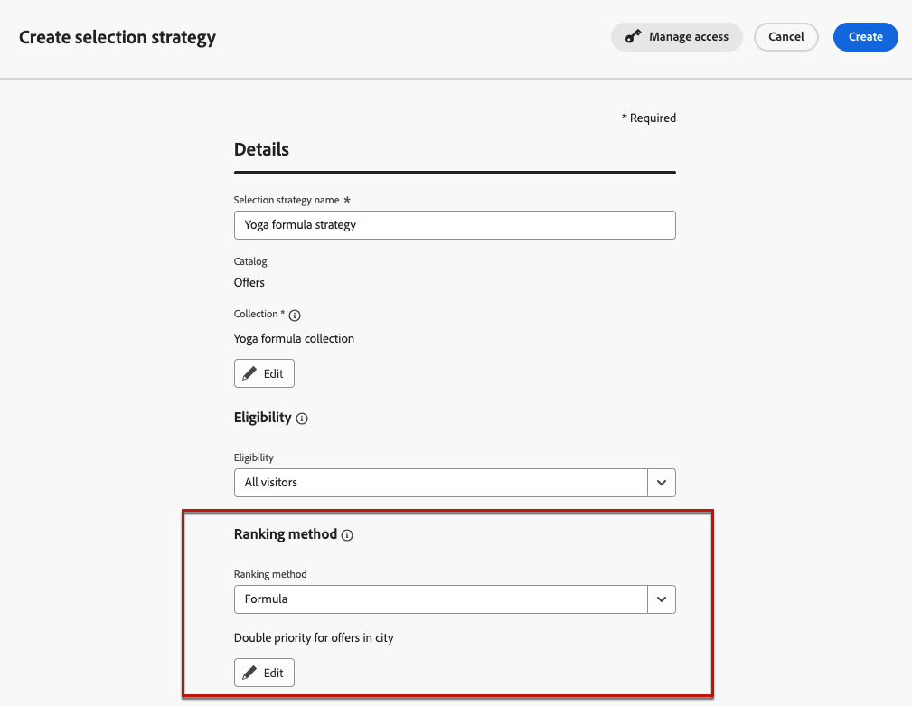
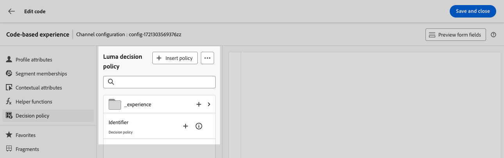

# 결정 사용 사례 {#experience-decisioning-uc}

이 사용 사례에서는 [!DNL Journey Optimizer] 코드 기반 채널에서 Decisioning을 사용하는 데 필요한 모든 단계를 제공합니다.

<!--In this use case, you create a campaign where you define two delivery treatments - each containing a different decision policy in order to measure which one performs best for your target audience.-->

이 사용 사례에서는 특정 순위 공식이 사전 할당된 오퍼 우선 순위보다 더 나은 성과를 낼지 확실하지 않습니다.

대상 대상에 가장 적합한 성과를 측정하려면 두 개의 게재 처리를 정의하는 [콘텐츠 실험](../content-management/content-experiment.md)을 사용하여 캠페인을 만드십시오.

<!--Set up the experiment such that:-->

* 첫 번째 처리는 순위 지정 방법으로 우선순위를 갖는 하나의 선택 전략을 포함한다.
* 두 번째 처리는 공식이 순위 방법인 다른 선택 전략을 포함한다.

## 선택 전략 만들기

먼저 우선 순위를 순위 방법으로 하는 전략과 공식을 순위 방법으로 하는 전략, 이렇게 두 가지 선택 전략을 구축해야 합니다.

### 첫 번째 선택 전략 만들기

첫 번째 선택 전략에서 우선 순위를 순위 방법으로 선택합니다. 아래 단계를 수행합니다.

1. 의사 결정 항목을 만듭니다. [방법 알아보기](items.md)

1. 다른 항목과 비교하여 결정 항목의 **[!UICONTROL 우선 순위]**&#x200B;를 설정하십시오. 프로필이 여러 항목에 적격인 경우 우선순위가 더 높을수록 항목이 다른 항목에 우선합니다.

   

   >[!NOTE]
   >
   >우선 순위는 정수 데이터 형식입니다. 정수 데이터 유형인 모든 속성에는 정수 값(소수점 없음)이 포함되어야 합니다.

1. 결정 항목의 적격성을 설정합니다.

   * 항목을 특정 프로필로만 제한하도록 대상 또는 규칙을 정의합니다. [자세히 알아보기](items.md#eligibility)

   * 최대 가용량 규칙을 설정하여 오퍼를 표시할 수 있는 최대 횟수를 정의합니다. [자세히 알아보기](items.md#capping)

1. 필요한 경우 위의 단계를 반복하여 추가 결정 항목을 만듭니다.

1. 결정 항목이 포함될 **컬렉션**&#x200B;을 만듭니다. [자세히 알아보기](collections.md)

1. [선택 전략](selection-strategies.md#create-selection-strategy)을(를) 만들고 고려할 오퍼가 포함된 [컬렉션](collections.md)을(를) 선택하십시오.

1. 각 프로필에 가장 적합한 오퍼를 선택하는 데 사용할 [등급 메서드를 선택](#select-ranking-method)합니다.

   이 경우 **[!UICONTROL 오퍼 우선 순위]**&#x200B;를 선택하십시오. 여러 오퍼가 이 전략에 적합한 경우 Decisioning 엔진은 오퍼에서 **[!UICONTROL 우선 순위]**(으)로 설정된 값을 사용합니다. [자세히 알아보기](selection-strategies.md#offer-priority)

   

### 두 번째 선택 전략 만들기

두 번째 선택 전략에서 순위 방법으로 공식을 선택합니다. 아래 단계를 수행합니다.

1. 의사 결정 항목을 만듭니다. [방법 알아보기](items.md)

<!--1. Set the same **[!UICONTROL Priority]** as for the first decision item. TBC?-->

1. 결정 항목의 적격성을 설정합니다.

   * 항목을 특정 프로필로만 제한하도록 대상 또는 규칙을 정의합니다. [자세히 알아보기](items.md#eligibility)

   * 최대 가용량 규칙을 설정하여 오퍼를 표시할 수 있는 최대 횟수를 정의합니다. [자세히 알아보기](items.md#capping)

1. 필요한 경우 위의 단계를 반복하여 추가 결정 항목을 만듭니다.

1. 결정 항목이 포함될 **컬렉션**&#x200B;을 만듭니다. [자세히 알아보기](collections.md)

1. [선택 전략](selection-strategies.md#create-selection-strategy)을(를) 만들고 고려할 오퍼가 포함된 [컬렉션](collections.md)을(를) 선택하십시오.

1. [각 프로필에 가장 적합한 오퍼를 선택하는 데 사용할 순위 방법을 선택하십시오](#select-ranking-method).

   이 경우 **[!UICONTROL 수식]**&#x200B;을 선택하여 특정 계산된 점수를 사용하여 게재할 적격 오퍼를 선택하십시오. [자세히 알아보기](selection-strategies.md#ranking-formula)

   

## 코드 기반 경험 캠페인 구축

<!--To present the best dynamic offer and experience to your visitors on your website or mobile app, add a decision policy to a code-based campaign.

Define two delivery treatments each containing a different decision policy.-->

두 선택 전략을 구성하고 나면 각 전략에 대해 서로 다른 처리를 정의하여 가장 성과가 좋은 전략과 비교하는 코드 기반 경험 캠페인을 만듭니다.

1. 캠페인을 만들고 **[!UICONTROL 코드 기반 경험]** 작업을 선택하십시오. [자세히 알아보기](../code-based/create-code-based.md)

1. 캠페인 요약 페이지에서 **[!UICONTROL 실험 만들기]**&#x200B;를 클릭하여 콘텐츠 실험 구성을 시작합니다. [자세히 알아보기](../content-management/content-experiment.md)

   

1. **[!UICONTROL 콘텐츠 편집]**&#x200B;을 클릭합니다.

<!--1. Sart personalizing **Treatment A** by clicking **[!UICONTROL Create]**.

    -->

1. 콘텐츠 편집 창에서 **[!UICONTROL 코드 편집]**&#x200B;을(를) 클릭하여 **처리 A**&#x200B;을(를) 개인화하기 시작합니다.

   

1. **[!UICONTROL 결정 정책]**&#x200B;을 선택하고 **[!UICONTROL 결정 정책 추가]**&#x200B;를 클릭한 다음 결정 세부 정보를 입력하십시오. [자세히 알아보기](create-decision.md)

   

1. 생성한 첫 번째 전략을 선택합니다. **[!UICONTROL 전략 추가]**&#x200B;를 클릭합니다.

1. Click **[!UICONTROL Create]**. 새 결정은 **[!UICONTROL 결정]**&#x200B;에 추가됩니다.

   

1. 추가 작업 아이콘(세 점)을 클릭하고 **[!UICONTROL 추가]**&#x200B;를 선택합니다. 이제 이 내에 원하는 모든 결정 특성을 추가할 수 있습니다.

   

1. 프로필 속성과 같이 개인화 편집기에서 사용할 수 있는 다른 속성을 추가할 수도 있습니다.

   

1. 콘텐츠 편집 창에서 **처리 B**&#x200B;를 선택하고 위의 단계를 반복하여 다른 결정 정책을 만들고 만든 두 번째 선택 전략을 선택합니다.

   

1. 콘텐츠를 저장합니다.
