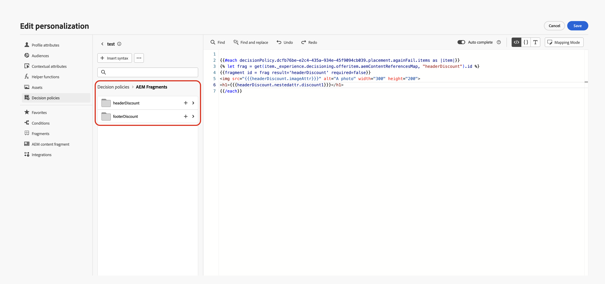
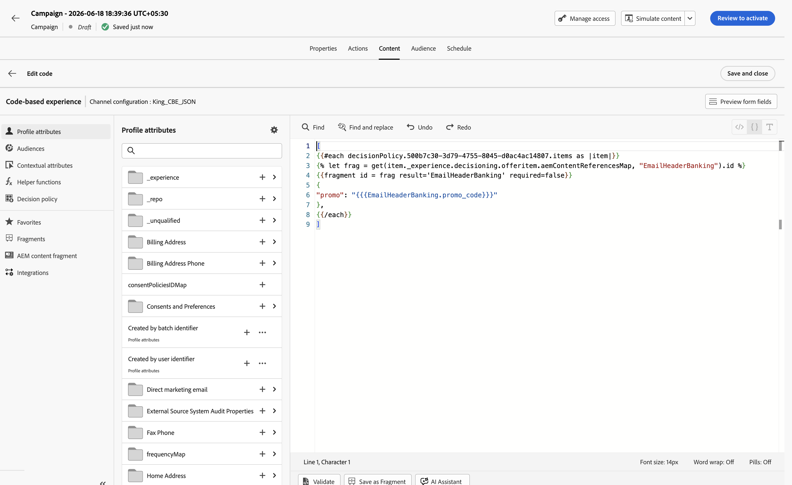
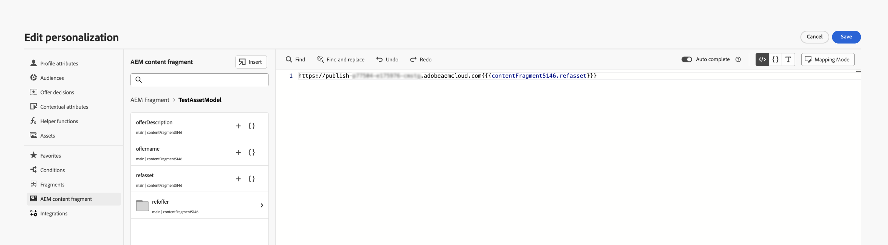

# 의사 결정 정책에 조각 활용 {#fragments}

>[!BEGINSHADEBOX]

**이 페이지에서:** 의사 결정 정책 내에서 Journey Optimizer 콘텐츠 조각 및 AEM 콘텐츠 조각을 활용하므로 여러 채널에서 콘텐츠 의사 결정 전달을 개인화하고 최적화할 수 있습니다.

>[!ENDSHADEBOX]

의사 결정 항목은 의사 결정 정책 내에서 메시지를 작성할 때 활용할 수 있는 두 가지 유형의 조각 콘텐츠를 지원합니다.

* **Journey Optimizer 콘텐츠 조각** — 재사용 가능한 표현식 조각이 Journey Optimizer에서 만들어져서 결정 항목의 **[!UICONTROL 조각]** 섹션에 추가되었습니다. [AJO 콘텐츠 조각에 대해 자세히 알아보기](../content-management/fragments.md)
* **AEM 콘텐츠 조각** — Adobe Experience Manager에서 작성되고, 결정 항목의 속성에 매핑되고, 개인화 편집기에서 키 이름으로 선택된 콘텐츠입니다. [AEM 콘텐츠 조각을 결정 항목에 연결하는 방법을 알아봅니다](items.md#aem-fragments)

## Journey Optimizer 콘텐츠 조각 {#ajo-fragments}

의사 결정 정책에 AJO 콘텐츠 조각을 포함한 의사 결정 항목이 포함되어 있는 경우 의사 결정을 사용할 수 있는 모든 채널(코드 기반 경험, 이메일, 푸시, SMS 및 여정)에서 의사 결정 정책 내에서 메시지를 작성할 때 이러한 조각을 활용할 수 있습니다.

예를 들어 여러 모바일 디바이스 모델에 대해 서로 다른 콘텐츠를 표시하려고 한다고 가정해 보겠습니다. 다른 전화 모델에 속하는 지정된 조각을 결정 정책에서 사용 중인 결정 항목에 추가합니다. [결정 항목에 조각을 추가하는 방법을 알아봅니다](items.md#attributes).

{width=70%}

완료되면 다음 방법 중 하나를 사용할 수 있습니다.

>[!BEGINTABS]

>[!TAB 직접 코드 삽입]

아래의 코드 블록을 의사 결정 정책 코드에 복사하여 붙여넣기만 하면 됩니다. `variable`을(를) 조각 ID로 바꾸고 `placement`을(를) 조각 참조 키로 바꿉니다.

```handlebars

{{fragment id = variable required=false}}
```

>[!TAB 자세한 단계 따르기]

1. **[!UICONTROL 도우미 함수]**(으)로 이동하고 조각에 대한 변수를 선언할 수 있는 코드 창에 **Let** 함수 ` {{variable}}`을(를) 추가합니다.

   

1. **맵** > **Get** 함수 ``을(를) 사용하여 식을 빌드합니다. 맵은 의사 결정 항목에서 참조되는 조각입니다. 문자열은 **[!UICONTROL 조각 참조 키]**(으)로 결정 항목에 입력한 장치 모델일 수 있습니다.

   

1. 이 디바이스 모델 ID가 포함된 상황별 속성을 사용할 수도 있습니다.

   

1. 조각에 대해 선택한 변수를 조각 ID로 추가합니다.

   

>[!ENDTABS]

결정 항목의 **[!UICONTROL 조각]** 섹션에서 조각 ID와 참조 키가 선택됩니다.

>[!WARNING]
>
>조각 키가 올바르지 않거나 조각 컨텐츠가 유효하지 않은 경우 렌더링이 실패하고 Edge 호출에 오류가 발생할 수 있습니다.
>
>조각을 일시적으로 사용할 수 없을 때 오류를 방지하기 위해 `required=false` 플래그가 사용되므로 대신 해당 조각을 건너뜁니다. [일시적으로 사용할 수 없는 조각에 대한 자세한 정보](#temporary-unavailable-fragments)

### 사용 및 보호 {#fragments-guardrails}

결정 항목에 사용된 **AJO 콘텐츠 조각**&#x200B;에는 특히 다음 보호가 적용됩니다.

+++이메일의 콘텐츠 및 표현식 조각 시뮬레이션

**이메일** 채널의 경우 **[!UICONTROL 증명 보내기]** 또는 캠페인이 활성화될 때 결정 항목과 연결된 표현식 조각이 올바르게 표시됩니다. 그러나 **[!UICONTROL 콘텐츠 시뮬레이션]**&#x200B;은(는) 결정 항목의 표현식 조각을 표시하지 않습니다.

+++

+++이메일의 시각적 조각 및 의사 결정 항목

**[!UICONTROL 시각적 조각]**&#x200B;을(를) 결정 항목에 할당할 수 없습니다. 이 컨텍스트에서는 **식 조각**&#x200B;만 지원됩니다.

+++

+++의사 결정 항목 및 컨텍스트 속성

[!DNL Journey Optimizer] 조각에서는 기본적으로 의사 결정 항목 특성 및 컨텍스트 특성이 지원되지 않습니다. 그러나 아래 설명된 것처럼 전역 변수를 대신 사용할 수 있습니다.

조각에서 *sport* 변수를 사용한다고 가정해 보겠습니다.

1. 조각에서 이 변수를 참조합니다. 예를 들면 다음과 같습니다.

   ```text
   Elevate your practice with new {{sport}} gear!
   ```

1. 결정 정책 블록 내에서 **Let** 함수를 사용하여 변수를 정의합니다. 아래 예에서 *sport*&#x200B;은(는) 결정 항목 특성으로 정의됩니다.

   ```handlebars
   {#each decisionPolicy.13e1d23d-b8a7-4f71-a32e-d833c51361e0.items as |item|}}
   
   {{fragment id = get(item._experience.decisioning.offeritem.contentReferencesMap, "placement1").id }}
   {{/each}}
   ```

+++

+++의사 결정 항목 조각 콘텐츠 유효성 검사

* 이러한 조각의 동적 특성으로 인해 캠페인에서 사용할 경우, 의사 결정 항목에서 참조되는 조각에 대해 캠페인 콘텐츠 생성 중 메시지 유효성 검사를 건너뜁니다.

* 조각 콘텐츠의 유효성 검사는 조각 생성 및 게시 중에만 수행됩니다.

* JSON 유형 표현식 조각의 경우 조각이 저장될 때 콘텐츠가 구문적으로 확인됩니다. 유효성 검사 오류는 경고로 표시됩니다.

런타임 시 캠페인 콘텐츠(의사 결정 항목의 조각 콘텐츠 포함)의 유효성이 검사됩니다. 유효성 검사 실패 시 캠페인이 렌더링되지 않습니다.

+++

+++일시적으로 사용할 수 없는 조각은 {#temporary-unavailable-fragments} 건너뜀

여정 또는 캠페인이 의사 결정 항목에 첨부된 조각을 참조하는 경우 업데이트된 조각을 Edge에서 사용하기 전에 잠시 동기화가 지연될 수 있습니다.

조각을 일시적으로 사용할 수 없을 때 오류를 방지하기 위해 이제 조각에 `required` 플래그가 기본적으로 `false`(으)로 설정되어 여정 또는 캠페인이 실패하는 대신 건너뜁니다.

즉, Edge에서 조각을 일시적으로 사용할 수 없는 경우 이를 무시합니다. 조각을 사용할 수 있는 경우 정상적으로 렌더링됩니다.

**예**

결정 정책이 두 개의 오퍼에 적합하고 각 오퍼에 조각(예: &quot;20% 할인&quot; 및 &quot;30% 할인&quot;)이 있고 두 번째 조각을 일시적으로 사용할 수 없는 경우 `required=false`을(를) 사용하면 시스템에서 여정 또는 캠페인에 실패하는 대신 사용 가능한 오퍼를 렌더링하고(20% 할인) 다른 조각을 건너뜁니다(30% 할인). 이렇게 하면 콘텐츠가 여전히 동기화 중일 때 안정성이 향상됩니다.

+++

>[!NOTE]
>
>`required` 플래그를 `true`(으)로 설정하여 조각을 필수 항목으로 표시할 수 있습니다. 그러나 조각이 일시적으로 누락된 경우 여정 또는 캠페인 렌더링이 실패할 수 있습니다.

## AEM 컨텐츠 조각 {#aem-fragments-decisioning}

>[!AVAILABILITY]
>
>이 기능은 Decisioning이 지원되는 아웃바운드 채널에 사용할 수 있습니다.

의사 결정 정책에서 AEM 콘텐츠 조각을 활용하기 전에 다음을 확인하십시오.

* Adobe Experience Manager에서 콘텐츠 조각을 만들고 `ajo-enabled:{OrgId}/{SandboxName}`(으)로 태그를 지정하여 Journey Optimizer에서 검색할 수 있도록 했습니다. [태그를 만들고 할당하는 방법을 알아보세요](../integrations/aem-fragments.md#create-tag)
* 고유한 참조 이름을 할당하여 조각을 오퍼 항목의 **[!UICONTROL AEM 조각]** 섹션에 연결했습니다. [AEM 콘텐츠 조각을 결정 항목에 연결하는 방법을 알아봅니다](items.md#attributes)

개인화 편집기에서는 정책에 의해 선택된 결정 항목과 연관된 모든 AEM 콘텐츠 조각을 사용할 수 있습니다. 조각 키 이름당 하나의 폴더가 표시됩니다.

➡️ [비디오에서 Journey Optimizer Decisioning과 함께 AEM 콘텐츠 조각을 사용하는 방법을 알아봅니다](#video)

이 예제에서 의사 결정 정책에는 참조 이름을 통해 연결된 AEM 조각이 있는 두 개의 의사 결정 항목이 포함되어 있습니다.



1. &#x200B;+ 단추를 클릭하여 원하는 조각을 표현식에 추가합니다.

   단일 참조 이름에는 여러 개의 조각이 서로 다른 오퍼 항목에 걸쳐 연결되어 있을 수 있으므로, Decisioning은 의사 결정 정책의 순위 기준에 따라 각 고객에게 제공할 최상의 이름을 결정합니다.

1. 조각을 선택한 후에는 이미지 URL, 텍스트 필드 또는 기타 콘텐츠와 같은 해당 속성을 활용하고, 의사 결정 을 사용하여 적시에 적절한 고객에게 적절한 콘텐츠를 제공할 수 있습니다.

   

1. 캠페인이나 여정을 활성화하기 전에 시뮬레이션 방법을 사용하여 AEM 콘텐츠 조각 필드 값이 렌더링되는 방법을 미리 봅니다. [콘텐츠 시뮬레이션에 대한 자세한 정보](../content-management/preview-test.md)

### 여러 채널에서 AEM 컨텐츠 조각 사용 {#aem-fragments-channels}

의사 결정 정책에서 AEM 콘텐츠 조각 속성을 삽입하는 방법은 작업 중인 채널에 따라 다릅니다.

>[!BEGINTABS]

>[!TAB 이메일]

의사 결정 정책을 사용하여 이메일에 AEM 콘텐츠 조각 속성을 삽입하려면 다음 작업을 수행하십시오.

1. 이메일 Designer에서 이메일 초안을 열고 오른쪽 레일에서 **[!UICONTROL 의사 결정]** 아이콘을 클릭하여 의사 결정 정책 패널을 엽니다.
1. 어셈블한 선택 전략을 선택하고 **배치**&#x200B;를 지정하여 오퍼가 채워질 이메일 영역을 정의합니다.
1. **+** 아이콘을 클릭하고 해당 영역에서 렌더링해야 하는 AEM 콘텐츠 조각에서 특정 필드(예: 영웅 이미지 URL 필드)를 선택합니다.

   

1. 게시하기 전에 **[!UICONTROL 콘텐츠 시뮬레이션]**&#x200B;을 클릭하여 결과를 미리 보고 우선 순위가 가장 높은 오퍼와 해당 콘텐츠 조각이 테스트 프로필에 대해 예상대로 렌더링되는지 확인하십시오.

>[!TAB JSON(코드 기반 경험)]

JSON 기반 코드 기반 경험을 작성할 때 다음 구조를 사용하여 의사 결정 정책의 AEM 콘텐츠 조각 속성을 렌더링합니다.

```handlebars
[
{{#each decisionPolicy.YOUR_POLICY_ID.items as |item|}}

{{fragment id = frag result='YOUR_REFERENCE_KEY' required=false}}
{
  "fieldName": "{{{YOUR_REFERENCE_KEY.fieldName}}}"
},
{{/each}}
]
```

>[!NOTE]
>
>AEM 콘텐츠 조각은 `aemContentReferencesMap`을(를) 사용하여 참조 키별로 조각을 조회합니다. Journey Optimizer 콘텐츠 조각에 사용되는 `contentReferencesMap`과(와) 다릅니다.

JSON 페이로드를 빌드할 때는 다음 사항을 염두에 두십시오.

* JSON 배열 대괄호 `[` 및 `]` **외부**&#x200B;를 `#each` 루프에 배치합니다.
* JSON 문자열 내의 필드 값에 **삼중 중괄호** `{{{ }}}`를 사용하여 HTML에서 특수 문자를 이스케이프 처리하지 않도록 하고 올바른 JSON 출력을 확인하십시오.
* `result='YOUR_REFERENCE_KEY'` 매개 변수는 `YOUR_REFERENCE_KEY.fieldName`을(를) 사용하여 해당 필드를 참조할 수 있도록 해당 이름 아래의 해결된 조각 콘텐츠를 캡처합니다.



>[!TAB 코드 기반 경험(HTML)]

HTML 기반 코드 기반 경험의 경우 필드 렌더링에 표준 이중 중괄호를 사용합니다.

```handlebars
{{#each decisionPolicy.YOUR_POLICY_ID.items as |item|}}

{{fragment id = frag result='YOUR_REFERENCE_KEY' required=false}}
<div>{{YOUR_REFERENCE_KEY.fieldName}}</div>
{{/each}}
```

>[!ENDTABS]

### AEM 컨텐츠 조각의 자산 사용 {#aem-cf-assets}

AEM 컨텐츠 조각에는 AEM에 저장된 자산을 참조하는 이미지 필드가 포함될 수 있습니다. Journey Optimizer은 해당 자산의 **상대 경로**&#x200B;만 수신하므로 전체 게시 URL 앞에 추가되지 않으면 이미지가 로드되지 않을 수 있습니다.

>[!NOTE]
>
>콘텐츠 조각 내의 AEM 에셋 참조에 대한 기본 해상도는 아직 지원되지 않습니다. 아래 접근 방식은 해당 지원이 추가될 때까지 사용할 수 있는 해결 방법입니다.

>[!BEGINTABS]

>[!TAB AEM 게시 도메인 선행]

1. AEM 인스턴스 URL에서 작성자 도메인(예: `author-p12345-e67890.adobeaemcloud.com`)을 식별합니다.

   

1. `author`을(를) `publish`(으)로 바꾸면 게시 도메인을 가져올 수 있습니다. `publish-p12345-e67890.adobeaemcloud.com`.

1. Journey Optimizer 개인화 편집기에서 컨텐츠 조각의 자산 참조 필드에 게시 도메인을 앞에 추가합니다.

   

이제 이미지가 게재 시 전체 게시 URL로 확인됩니다.

>[!TAB 텍스트 필드에 게시 URL을 저장]

1. AEM에서 컨텐츠 조각을 엽니다.
1. JSON 미리 보기로 이동하여 **참조** 섹션을 확인하여 게시된 자산 URL을 찾으십시오.

   

1. 게시 URL을 복사하여 콘텐츠 조각 내의 전용 텍스트 필드에 붙여넣습니다.

   

1. Journey Optimizer에서 개인화 표현식에서 해당 텍스트 필드를 이미지 소스로 직접 참조합니다.

   

이 접근 방식은 수동 URL 구성을 방지하고 콘텐츠 조각 자체 내에 게시 URL을 유지합니다.

>[!ENDTABS]

## 사용 방법 비디오 {#video}

Journey Optimizer Decisioning과 함께 Adobe Experience Manager 콘텐츠 조각을 사용하여 콘텐츠를 개인화하고 최적화하는 방법을 알아봅니다.

>[!VIDEO](https://video.tv.adobe.com/v/3492220/?captions=kor&learn=on&enablevpops)
