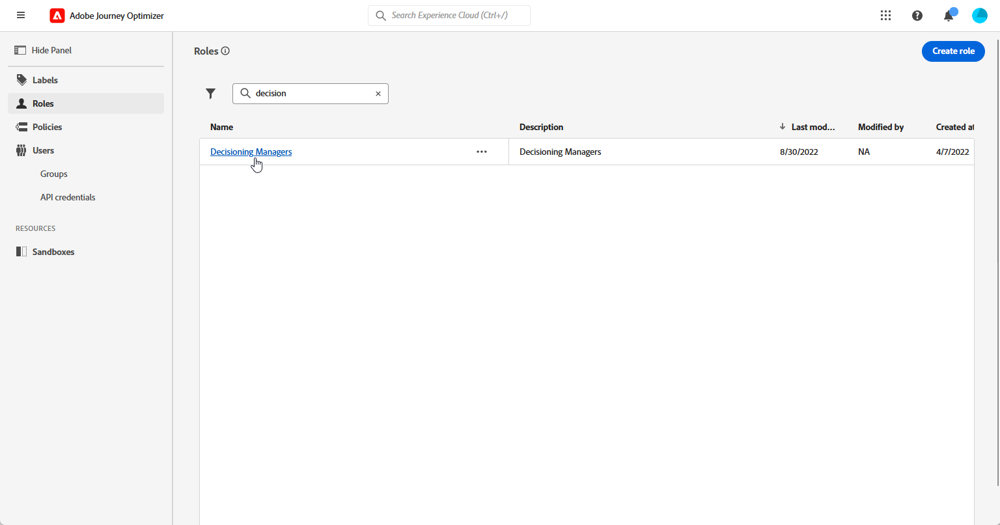

# 의사 결정 시작 {#get-started-experience-decisioning}

>[!CONTEXTUALHELP]
>id="ajo_email_enable_experience_decisioning"
>title="의사 결정은 무엇입니까?"
>abstract="의사 결정은 결정 엔진에서 가장 적합한 항목을 골라 각 개인에게 전달하는 의사 결정 관리 외의 새로운 도구입니다. 이를 사용하려면 추가적인 설정이 필요합니다."

## Decisioning 소개 {#about}

의사 결정 기능은 &#39;의사 결정 항목&#39;이라는 중앙 집중식 마케팅 카탈로그와 정교한 의사 결정 엔진을 제공하여 개인화를 간소화합니다. 이 엔진은 규칙과 순위 기준을 활용하여 각 개인에게 가장 관련성 높은 의사 결정 항목을 선택하고 제공합니다.

이러한 결정 항목은 [새 코드 기반 경험 채널](https://experienceleague.adobe.com/ko/docs/journey-optimizer/using/code-based-experience/get-started-code-based)을 통해 광범위한 인바운드 표면에 원활하게 통합되어 이제 Journey Optimizer 캠페인 내에서 액세스할 수 있습니다.

>[!IMPORTANT]
>
>의사 결정 정책은 코드 기반 경험 캠페인에서만 사용할 수 있습니다.

➡️의사 결정을 만들고 코드 기반 경험 채널을 사용한 콘텐츠 실험에 사용하는 방법을 보여 주는 전체적인 사용 사례가 [이 섹션](experience-decisioning-uc.md)에 나와 있습니다.

## 의사 결정 주요 단계 {#steps}

Decisioning을 사용하는 주요 단계는 다음과 같습니다.

1. **적절한 사용 권한을 할당**&#x200B;합니다. 의사 결정 관리자는 의사 결정 관리자와 같은 의사 결정 관련 **[!UICONTROL 역할]**&#x200B;에 액세스할 수 있는 사용자만 사용할 수 있습니다. Decisioning에 액세스할 수 없는 경우 권한을 확장해야 합니다.

   +++의사 결정 관리자 역할을 할당하는 방법 알아보기

   1. [!DNL Permissions] 제품의 사용자에게 역할을 할당하려면 **[!UICONTROL 역할]** 탭으로 이동하여 [의사 결정 관리자]를 선택하십시오.

      

   1. **[!UICONTROL 사용자]** 탭에서 **[!UICONTROL 사용자 추가]**&#x200B;를 클릭합니다.

      

   1. 사용자 이름 또는 이메일 주소를 입력하거나 목록에서 사용자를 선택하고 **[!UICONTROL 저장]**&#x200B;합니다.

      이전에 사용자를 생성하지 않은 경우 [사용자 설명서 추가](https://experienceleague.adobe.com/ko/docs/experience-platform/access-control/ui/users)를 참조하십시오.

      

   그러면 인스턴스로 리디렉션되는 이메일을 사용자가 받게 됩니다.

   +++

1. **사용자 지정 특성을 구성합니다**: 사용자 지정 특성을 카탈로그의 스키마로 설정하여 항목 카탈로그를 특정 요구 사항에 맞게 조정하십시오.

   ➡️[항목 카탈로그를 구성하는 방법에 대해 알아봅니다](catalogs.md)

1. 타깃팅된 대상자에게 표시할 **결정 항목을 만듭니다**.

   ➡️[의사 결정 항목을 만드는 방법을 알아봅니다](items.md)([API 설명서](api-reference/decisions-items/create.md))

1. **컬렉션으로 구성**: 컬렉션을 사용하여 특성 기반 규칙에 따라 결정 항목을 분류합니다. 컬렉션을 선택 전략에 통합하여 고려해야 하는 결정 항목의 컬렉션을 결정합니다.

   ➡️[항목 컬렉션을 관리하는 방법 알아보기](collections.md)([API 설명서](api-reference/items-collections/create.md))

1. **의사 결정 규칙 만들기**: 의사 결정 규칙은 의사 결정 항목 및/또는 선택 전략에서 의사 결정 항목을 표시할 대상을 결정하는 데 사용됩니다.

   ➡️[의사 결정 규칙을 만드는 방법을 알아봅니다](rules.md)

1. **순위 방법 구현**: 순위 방법을 만들고 의사 결정 전략 내에서 적용하여 의사 결정 항목을 선택하는 우선 순위를 결정합니다.

   ➡️[순위 메서드를 만드는 방법을 알아봅니다](ranking.md)

1. **선택 전략 만들기**: 컬렉션, 의사 결정 규칙 및 등급 방법을 활용하여 프로필에 표시하는 데 적합한 의사 결정 항목을 식별하는 선택 전략을 만듭니다.

   ➡️[선택 전략을 만드는 방법을 알아봅니다](selection-strategies.md)([API 설명서](api-reference/selection-strategies/create.md))

1. **의사 결정 정책을 만들어 코드 기반 캠페인에 임베드합니다**: 의사 결정 정책은 여러 선택 전략을 결합하여 의도한 대상자에게 표시할 적합한 의사 결정 항목을 결정합니다.

   ➡️[의사 결정 정책 사용 방법 알아보기](create-decision.md)
➡ ️ 기반 채널을 통해 오퍼를 성공적으로 게재하려면 [이 섹션](../code-based/code-based-implementation-samples.md)의 구현 단계를 따르십시오
