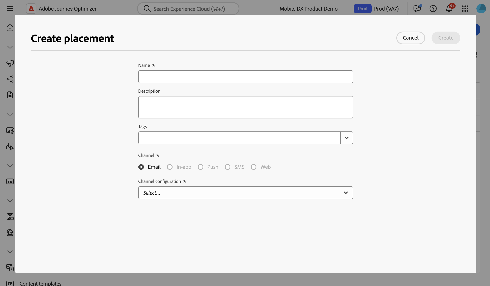

# 배치 작업 {#create-decision}

## 배치 기본 정보 {#about}

배치는 결정 항목을 표시하는 데 사용되는 컨테이너입니다. 이렇게 하면 메시지 내의 올바른 위치에 올바른 오퍼 컨텐츠가 표시됩니다.

이메일에 의사 결정 정책을 추가할 때 반환된 의사 결정 항목을 보여 주는 구성 요소에 배치를 연결해야 합니다. 예를 들어 보고의 다양한 배치 간에 의사 결정 항목 성과를 추적할 수 있습니다.

배치 목록은 **[!UICONTROL 전략 설정]** 메뉴에서 액세스할 수 있습니다. 필터를 사용하여 특정 채널 표면 또는 태그에 따라 배치를 검색할 수 있습니다.

>[!NOTE]
>
>현재 의 경우 배치는 이메일 채널에만 사용할 수 있습니다.

## 배치 만들기 {#create}

배치를 생성하려면 다음 단계를 수행합니다.

1. **[!UICONTROL 전략 설정]** 메뉴로 이동하여 **[!UICONTROL 전자 메일]**&#x200B;을 선택하고 **[!UICONTROL 배치 만들기]** 단추를 클릭합니다.

   의사 결정 정책을 추가할 때 이메일 디자이너에서 직접 배치를 만들 수도 있습니다. [배치를 전자 메일 구성 요소에 연결하는 방법을 알아봅니다](../experience-decisioning/create-decision.md#save)

1. 배치의 특성을 정의합니다.

   

   * **[!UICONTROL 이름]**: 배치 이름입니다. 의미 있는 이름을 정의하여 보다 쉽게 검색할 수 있도록 해야 합니다.
   * **[!UICONTROL 설명]**: 배치에 대한 설명입니다.
   * **[!UICONTROL 태그]**: Adobe Experience Platform 통합 태그를 배치에 할당합니다. 이를 통해 손쉽게 분류하고 검색을 개선할 수 있습니다. [태그 작업 방법 알아보기](../start/search-filter-categorize.md#tags)
   * **[!UICONTROL 채널]**: 배치를 사용할 채널입니다. 현재 의 경우 배치는 이메일에만 사용할 수 있습니다.
   * **[!UICONTROL 채널 구성]**: 채널 구성을 배치에 연결합니다. [채널 구성을 설정하는 방법을 알아봅니다](../configuration/channel-surfaces.md).

1. **[!UICONTROL 만들기]**&#x200B;를 클릭합니다.

배치가 만들어지면 이메일에 결정 정책을 추가할 때 배치 목록에 표시됩니다. 속성을 표시하고 편집할 수 있습니다. [의사 결정 정책을 만드는 방법을 알아봅니다](../experience-decisioning/create-decision.md)

