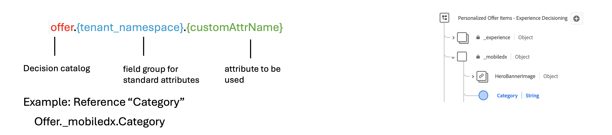

# 순위 지정 방법 {#rankings}

>[!CONTEXTUALHELP]
>id="ajo_exd_config_formulas"
>title="등급 수식 만들기"
>abstract="수식으로 먼저 제시할 항목을 결정하는 규칙을 정의할 수 있습니다. 이 경우 항목의 우선 순위 점수를 고려할 필요가 없습니다. 등급 지정 방법이 생성되면 먼저 선택해야 할 항목을 정의하는 선택 전략에 지정할 수 있습니다."

등급 지정 방법을 사용하면 특정 프로필에 표시할 항목의 등급을 지정할 수 있습니다. 등급 지정 방법이 생성되면 먼저 선택해야 할 항목을 정의하는 선택 전략에 지정할 수 있습니다.

두 가지 유형의 순위 방법을 사용할 수 있습니다.

* **공식** 항목의 우선 순위 점수를 고려하지 않고, 먼저 제시해야 할 항목을 결정하는 규칙을 정의할 수 있습니다.

* **AI 모델** 에서는 여러 데이터 포인트를 활용하는 훈련된 모델 시스템을 사용하여 먼저 제시해야 하는 항목을 결정할 수 있습니다.

## 등급 메서드 만들기 {#create}

등급 방법을 만들려면 다음 단계를 수행합니다.

1. 다음 위치로 이동 **[!UICONTROL 전략 설정]** 메뉴를 선택한 다음 **[!UICONTROL 공식]** 또는 **[!UICONTROL AI 모델]** 메뉴는 사용하려는 순위 유형에 따라 다릅니다.

1. 다음을 클릭합니다. **[!UICONTROL 공식 만들기]** 또는 **[!UICONTROL AI 모델 만들기]** 화면의 오른쪽 상단에 있는 단추입니다.

   

1. 필요에 맞게 공식 또는 AI 모델을 구성한 다음 저장합니다.

   등급 수식 및 AI 모델을 만드는 방법에 대한 자세한 내용은 의사 결정 관리 문서에서 확인할 수 있습니다.

   * [등급 공식](../offers/ranking/create-ranking-formulas.md)
   * [AI 모델](../offers/ranking/ai-models.md)

## 공식에서 의사 결정 항목 속성 활용 {#items}

등급 수식은 다음과 같이 표시됩니다. **PQL 구문** 및 은 프로필 속성과 같은 다양한 속성을 활용할 수 있습니다. [컨텍스트 데이터](context-data.md) 의사 결정 항목과 관련된 속성.

수식에서 결정 항목과 관련된 속성을 활용하려면 등급 수식 코드에서 아래 구문을 따라야 합니다. 자세한 내용을 보려면 각 섹션을 확장하십시오.

+++의사 결정 항목 표준 속성 활용

+++

+++의사 결정 항목 사용자 지정 속성 활용

+++
